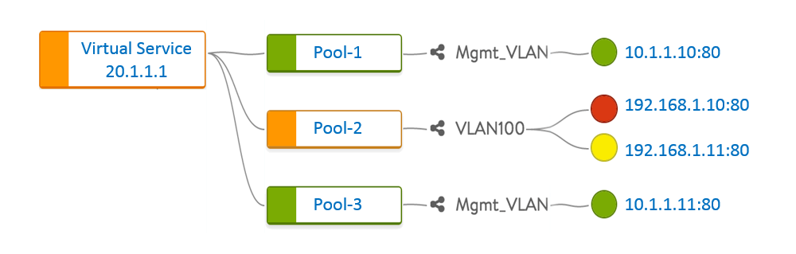

In order for a virtual service to be placed on a Service Engine, the Controller first looks for SEs with available capacity and network reachability to make a virtual service placement decision.  Reachability means the Service Engine has access to the networks required per the configuration of the virtual service and its pool members.

In the example above, a Service Engine is required to have access to the following networks:

* 20.1.1.x - VIP network
* 10.1.1.x - Pool-1 and Pool-3 network
* 192.168.1.x - Pool-2 network 

For the first network, 20.1.1.x, the Service Engine is required to have an interface in this layer 2 network.  It will need to be able to send gratuitous ARPs for the VIP.  The Service Engine will also need an IP address of its own within the network.

For the pool / server networks, the Service Engine is preferred to have an interface in this layer 2 network, however, if proper routes exist, the SE can access the servers via layer 3 routing.  The Controller will prefer SEs with local L2 adjacency to servers versus SEs with L3 routed access.

If no SEs exist that meet the available capacity and network reachability requirements, then:

* An existing SE must have its network properties update (for reachability)
* Virtual services scaled or migrated (to create capacity)
* Or a new Service Engine created 

If the Controller has Write Access mode enabled, it will determine the proper action to ensure the virtual service is deployed.  If the Avi Vantage is deployed in Read or No Access modes, an administrator may be required to make the necessary changes.

Issues such as network reachability are most commonly encountered when creating a new virtual service, but they may also pop up when adding a new pool to a VS or a new server to a pool.

See documentation on virtual service placement for more depth on the topic.
