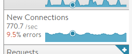

While the name of the metric used in virtual services, pools, and servers is *New Connections* per second, the metric is technically recording the number of *closed connections* per second. This is done so the metric can include an important sub-metric, *errors*. Errors can include incomplete connection establishment, unexpected RST, general high latency, or out of order packets.

The thresholds for errors and lossy connections are defined by the analytics profile attached to the virtual service. Since these errors can only be determined for a connection after the connection has concluded, either successfully or not, the New Connections metric records the closed connections during the time period. This most often manifests itself during initial testing of Avi Vantage, where only a handful of long-lived connections are sent to the Service Engine and do not appear within the New Connections metric when viewed in real time.

For UDP traffic, the definition of a connection is determined by the settings of the UDP network profile attached to the virtual service or pool. Each UDP packet can represent a connection. Alternatively, a stream of packets from a source IP:Port can be treated as a single connection.
