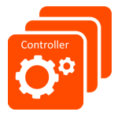

Avi Controllers can be deployed as a single node (one instance of the Avi Controller) or as a 3-node cluster. This article answers basic questions about Avi Controller clusters.

### How many nodes are supported in an Avi Controller cluster?

Avi Controller clusters may include either 1 (standalone mode) or 3 Controller nodes in a cluster.

### How many nodes are needed for the Avi Controller cluster to be operational?

A three-node cluster requires a quorum (majority) of the nodes to be present for the cluster to be operational. This means at least 2 nodes must be up.

### Can you explain how the 3 nodes in an Avi Controller cluster are used during normal operation?

Among the 3 nodes, a leader node is elected and orchestrates the process startup/shutdown across all the active members of the cluster. Configuration and metrics databases are configured to be active on the leader node and placed in standby mode on the follower nodes. Streaming replication is configured to synchronize the active database to the standby databases. Analytics functionality is shared among all the nodes of the cluster. A given virtual service streams the logs and metrics to one of the nodes of the cluster.

### What happens if a follower node goes down?

This node is removed from the active member list and the work that was performed on this node is re-distributed among the remaining nodes in the Avi Controller cluster.

### What happens if the leader node goes down?

One of the follower nodes is promoted as a leader. This triggers a warm restart of the processes among the remaining nodes in the cluster. The warm standby is required to promote the standby configuration and metrics databases from standby to active on the new leader.

Note: During warm restart, the Avi Controller REST API is unavailable for a period of 2-3 minutes.

### What happens if two nodes go down?

The entire cluster becomes non-operational until at least one of the nodes is brought up. A quorum (2 out of 3) of the nodes must be up for the cluster to be operational.

### Will there be a disruption to traffic during cluster convergence (single or multiple nodes go down and come back)?

During the time the cluster is non-operational, the Avi Service Engines (SEs) continue to forward traffic for the configured virtual services. (This is sometimes referred to as "headless mode.") During this time, the analytics (logs and metrics) are buffered on the SEs. When the Avi Controller cluster is once again operational, the cluster re-synchronizes with the SEs and initiates the collection of metrics and logs. Data plane traffic continues to flow normally throughout this time.

### Recover a non-operational cluster where two of the three nodes are permanently down and not recoverable

Please click <a href="/docs/16.2/recover-a-non-operational-controller-cluster">here</a>.

### Recover the system if all 3 Avi Controller nodes are permanently down and not recoverable

Please click <a href="/docs/16.2/backup-and-restore-of-avi-vantage-configuration">here</a>.

### Reconfigure the Avi Controller cluster membership

Please click <a href="/docs/16.2/changing-avi-controller-cluster-configuration">here</a>.

### Can the Avi Controller nodes in a cluster have different resource allocations (memory, CPU, and drive space)?

It is recommended to give all 3 nodes within the Avi Controller cluster the same allocations of these resources.

Over the course of time, there may be a need to re-size (change resource allocations of) the Avi Controllers in the cluster, to accommodate growth. During such a time, it is acceptable to change resource allocations on one Avi Controller node at a time. However, it is expected that eventually all Avi Controllers within the cluster will be re-sized to the same allocations.

### Can the Avi Controllers in a cluster be in different subnets?

Yes. This configuration is supported and may even be preferred for certain topologies for improved fault tolerance.

However, a limitation with placing the Avi Controllers in separate subnets is that the cluster IP address is not supported. The cluster IP address requires all Avi Controller nodes to be in the same subnet.

### Can the cluster leader be changed manually?

No. Currently, this is not a supported operation. The leader can be chosen during initial deployment of the cluster or when recovering a fully down cluster. However, the leader cannot be manually changed while the cluster is operational.

Avi Controllers participate in election of their leader, and automatically decide who the new leader should be in cases of failure.

### What timers are used during cluster failover? Are the cluster failover timers configurable?

* **Leader failure:** If the leader Avi Controller of the cluster fails, this triggers an internal warm restart of the Avi Controller processes. Typically, this takes around 2-3 minutes after it is detected that the leader has failed.
* **Graceful reboot of leader:** Failure detection is almost instantaneous in cases of a graceful reboot.
* **Ungraceful power-off of leader:** In the case of an ungraceful power-off of the leader, it may take up to 30 seconds to detect that the leader has failed. 

These timers have been tuned based on testing but are not configurable.

### Can configuration changes be made directly on follower Avi Controllers?

Yes. Nearly any configuration changes can be made on any of the Avi Controller nodes.

Exceptions:

* Configuration of the cluster itself (node IP addresses and cluster address)
* Upgrade, which can be performed only on the leader node 

### What is the recommended cluster deployment option for multiple data centers in different regions?

Avi recommends deploying the Avi Controller cluster only within a single region. However, the member nodes can be deployed across multiple availability zones within the region. If there are multiple regions, it is recommended to deploy one Avi Controller cluster per region. (For more information, <a href="/docs/16.2/clustering-controllers-from-different-networks">click here</a>.)
