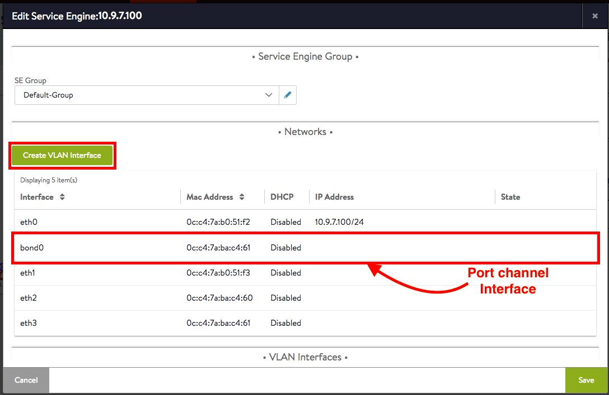
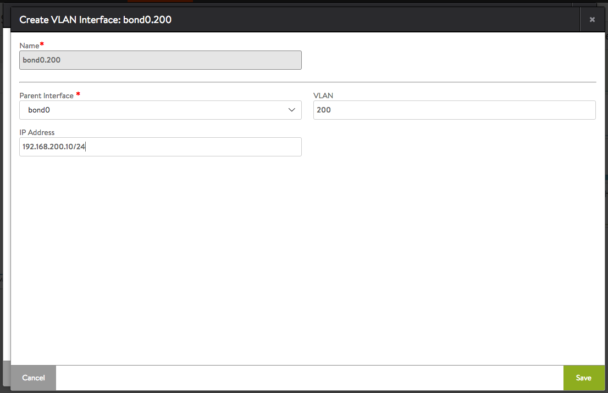
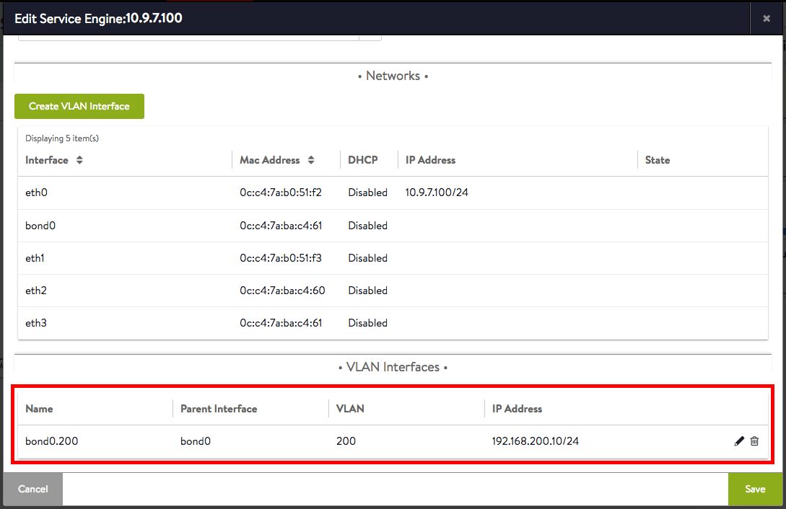

Avi Vantage support for Linux server (bare metal) clouds includes support for port channel (bond) interfaces on the Linux server hosts.

A port channel interface is a grouping of multiple physical interfaces into a single logical interface. Port channel interfaces provide fault tolerance, bandwidth aggregation, and load balancing for traffic between switches, routers and servers.

A port channel interface is treated as any other Ethernet interface, so it also can be configured with an IP address as well as VLAN trunking.

Up to 8 physical links can be grouped into a single port channel interface.

Note: Port channeling also is referred to by several other names, including port bonding, port trunking, and link aggregation.

### Load Balancing Among Link Interfaces

The transmitting link for outgoing traffic is selected based on a hash of the traffic flow’s source and destination IP addresses and layer 4 protocol ports to achieve load balancing.

### Link Failure Recovery

Traffic flowing on a failing link is automatically redirected to the other links within the port channel interface to achieve fault tolerance.

## Configuration Example

In the terminology of the Linux interface configuration files, a bond interface consists of a master interface and one or more "slave" (secondary) interfaces.

This section shows a set of sample configuration files for a port channel. Interface bond0 has two member interfaces, ens1f0 and ens1f1. Interface bond0.652 is a VLAN interface under bond0.

Note: Port channeling is supported only through configuration of the feature in the Linux server's interface configuration files. Port channeling cannot be configured through Avi Vantage.

The configurations for ens1f0 and ens1f1 each include the following options, identifying the intefecs as secondary members of a logical interface whose primary member is bond0:

* MASTER=bond0
* SLAVE=yes 

The configuration for interface bond0.652 does use the MASTER or SLAVE options, but does use the following option:

* VLAN=yes 

**Interface bond0's Configuration file: /etc/sysconfig/network-scripts/ifcfg-bond0**

<pre><code class="language-lua">DEVICE=bond0
IPADDR=10.124.251.101
NETMASK=255.255.255.0
ONBOOT=yes
BOOTPROTO=none
USERCTL=no
NM_CONTROLLED=no
BONDING_OPTS="mode=4 miimon=100 xmit_hash_policy=layer3+4 use_carrier=1"</code></pre>  

**Interface ens1f0's Configuration file: /etc/sysconfig/network-scripts/ifcfg-ens1f0**

<pre><code class="language-lua">DEVICE=ens1f0
BOOTPROTO=none
ONBOOT=yes
MASTER=bond0
SLAVE=yes
USERCTL=no
NM_CONTROLLED=no</code></pre>  

**Interface ens1f1's Configuration file: /etc/sysconfig/network-scripts/ifcfg-ens1f1**

<pre><code class="language-lua">DEVICE=ens1f1
BOOTPROTO=none
ONBOOT=yes
MASTER=bond0
SLAVE=yes
USERCTL=no
NM_CONTROLLED=no</code></pre>  

**Configuring VLAN on bond0 interface:**

<ol> 
 <li>Navigate to Infrastructure, and click on the Service Engine (SE) where the VLAN interface is to be created.</li> 
 <li>Click the Edit button, and the following pop-up window appears.</li> 
 <li>Click Create VLAN Interface.</li> 
 <li>Select the parent interface from the drop-down list, and fill in the VLAN and IP Address fields, then click Save. </li> 
 <li>The VLAN interface appears on the Service Engine Edit page.</li> 
 <li>Click Save again to commit the change.</li> 
</ol> 