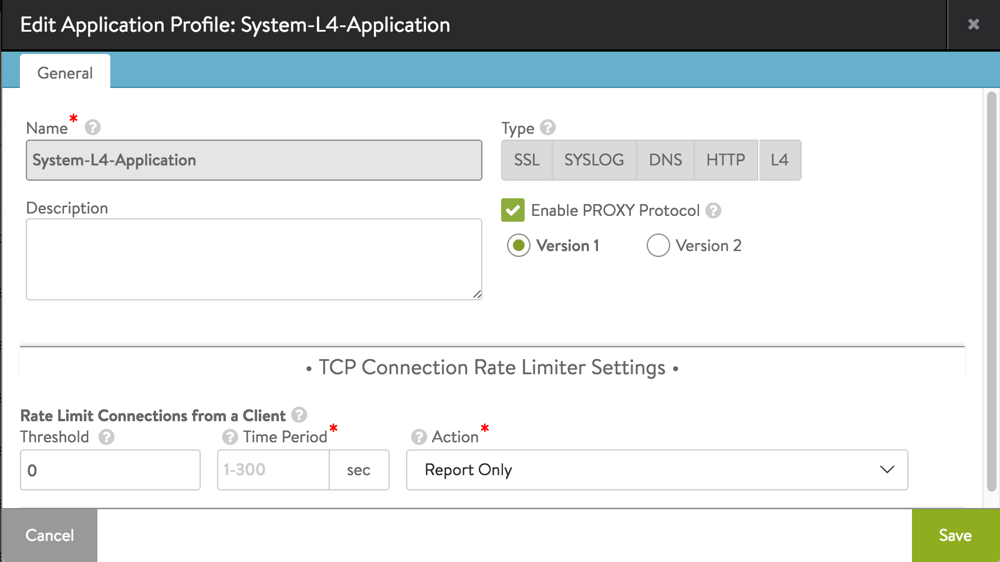

By default, Avi Service Engines (SEs) source-NAT (SNAT) traffic destined to servers. Due to SNAT, logs on the application servers will show the layer 3 IP address of the SE rather than the original client’s IP address. Protocol extensions such as  <a href="/docs/16.2/x-forwarded-for-header-insertion">“forwarded” extension of HTTP</a> require knowledge of the underlying protocol. For layer 4 applications, Avi Vantage supports versions 1 (human-readable format) and version 2 (binary format) of the PROXY protocol ( <a href="http://www.haproxy.org/download/1.5/doc/proxy-protocol.txt">PROXY protocol spec</a>), which conveys the original connection parameters to the back-end servers. For layer 4 SSL applications, version 1 is supported. The Avi SE requires no knowledge of the inner protocol. The impact on performance caused by processing of transported information is very minimal.      PROXY protocol spec format:     PROXY TCP4 ( *real source address*) ( *proxy address*) ( *TCP source port*) ( *TCP destination port*) ( *CRLF sequence*)     Example V1 PROXY protocol line: 

<pre pre="" class="command-line language-bash" data-user="aviuser" data-host="avihost" data-output="1-100"><code>PROXY TCP4 12.97.16.194 136.179.21.69 31646 80\r\n
</code></pre> 

### Configuring PROXY Protocol via UI

<ol> 
 <li>Navigate to Template &gt; Profiles.</li> 
 <li>Within the Application tab, select System-L4-Application.</li> 
 <li>For Type, select L4, as shown below.</li> 
 <li>Click Enable PROXY Protocol.</li> 
 <li>Select which version is desired.</li> 
 <li>When finished changing the profile, click Save.</li> 
</ol> 

The profile change affects any virtual services that use the same L4 application profile.

 

### Configuring PROXY Protocol via CLI

The following sequence of CLI commands enable PROXY protocol support and protocol version to be used.

<table class="table table-hover table table-bordered table-hover">  
<tbody>  
<tr>  
<td>: &gt; <b>configure applicationprofile System-L4-Application</b>

 
: applicationprofile&gt; <b>tcp_app_profile</b>
 
: applicationprofile:tcp_app_profile&gt; <b>proxy_protocol_enabled</b>
 
: applicationprofile:tcp_app_profile&gt; <b>proxy_protocol_version proxy_protocol_version_1</b>
 
: applicationprofile:tcp_app_profile&gt; <b>save</b>
 
: applicationprofile&gt; <b>save</b>
</td>
</tr>
</tbody>
</table>   By default, Avi Service Engines (SEs) source-NAT (SNAT) traffic destined to servers. Due to SNAT, logs on the application servers will show the layer 3 IP address of the SE rather than the original client’s IP address. Protocol extensions such as  <a href="/docs/16.2/x-forwarded-for-header-insertion">“forwarded” extension of HTTP</a> require knowledge of the underlying protocol. For layer 4 applications, Avi Vantage supports versions 1 (human-readable format) and version 2 (binary format) of the PROXY protocol ( <a href="http://www.haproxy.org/download/1.5/doc/proxy-protocol.txt">PROXY protocol spec</a>), which conveys the original connection parameters to the back-end servers. For layer 4 SSL applications, version 1 is supported. The Avi SE requires no knowledge of the inner protocol. The impact on performance caused by processing of transported information is very minimal.      PROXY protocol spec format:     PROXY TCP4 ( *real source address*) ( *proxy address*) ( *TCP source port*) ( *TCP destination port*) ( *CRLF sequence*)     Example V1 PROXY protocol line: 

<pre pre="" class="command-line language-bash" data-user="aviuser" data-host="avihost" data-output="1-100"><code>PROXY TCP4 12.97.16.194 136.179.21.69 31646 80\r\n
</code></pre> 

### Configuring PROXY Protocol via UI

<ol> 
 <li>Navigate to Template &gt; Profiles.</li> 
 <li>Within the Application tab, select System-L4-Application.</li> 
 <li>For Type, select L4, as shown below.</li> 
 <li>Click Enable PROXY Protocol.</li> 
 <li>Select which version is desired.</li> 
 <li>When finished changing the profile, click Save.</li> 
</ol> 

The profile change affects any virtual services that use the same L4 application profile.

 

### Configuring PROXY Protocol via CLI

The following sequence of CLI commands enable PROXY protocol support and protocol version to be used.

<table class="table table-hover table table-bordered table-hover">  
<tbody>  
<tr>  
<td>: &gt; <b>configure applicationprofile System-L4-Application</b>

 
: applicationprofile&gt; <b>tcp_app_profile</b>
 
: applicationprofile:tcp_app_profile&gt; <b>proxy_protocol_enabled</b>
 
: applicationprofile:tcp_app_profile&gt; <b>proxy_protocol_version proxy_protocol_version_1</b>
 
: applicationprofile:tcp_app_profile&gt; <b>save</b>
 
: applicationprofile&gt; <b>save</b>
</td>
</tr>
</tbody>
</table> 