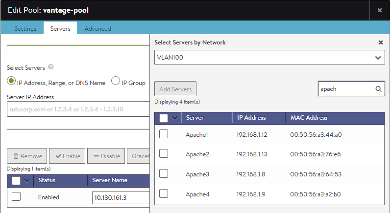

### About

Select Servers by Network is an alternative method of adding servers to a pool.  Rather than remembering the server IP addresses to add, servers may be added by name and presence within a selected network.

The option for adding servers to a virtual service / pool is only available if Avi Vantage has Read or Write access to VMware, AWS, or OpenStack.

 

### Adding Servers

When creating a virtual service using the Basic wizard, or editing / creating a new pool, click the Select Servers by Network button to open a list of reachable networks. Select a network to open a list of servers (virtual machines) available on that network. Provide an optional search filter, such as *apache*, then select servers matching the search criteria. Click the green Add Servers button to include the new servers in the pool.

The results returned are filtered by the network selected.  If a server has multiple IP addresses in the network, the server will show up in the list multiple times.  Similarly, if the server has a NIC in the network, but no valid IP address, it will not be shown in the returned list of servers.

 

### VMware Specific

Adding servers using this method allows Avi Vantage to provide significantly richer information regarding the server. Vantage is able to query vCenter for the server / virtual machine's CPU, memory, and disk utilization. This is useful for better load balancing and visibility, and is the best-practice method for adding servers. When adding servers by IP address, Vantage may not be able to associate the IP against a virtual machine in VMware, and therefore may not be able to gather this data. After a server has been added via the Select by Network method, the server's Network column in the server list table will be populated with the network or port group.
