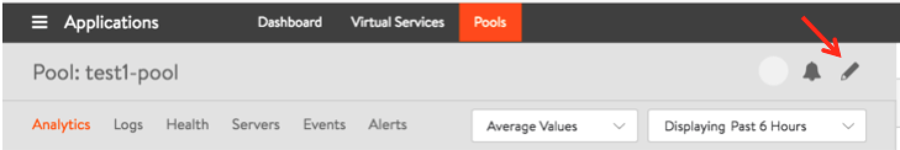
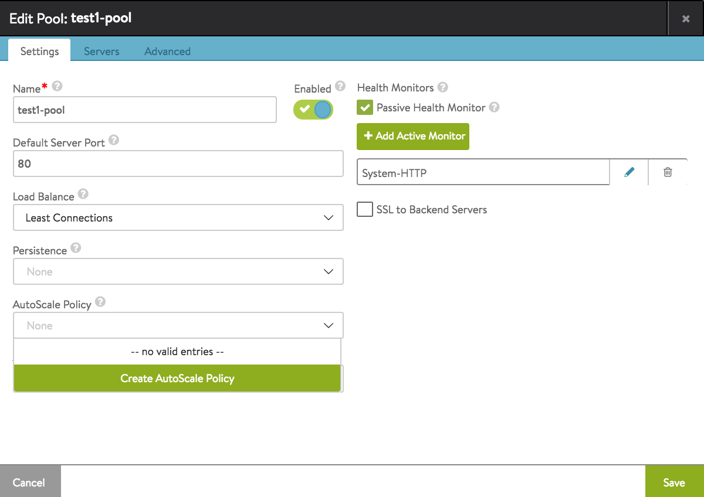
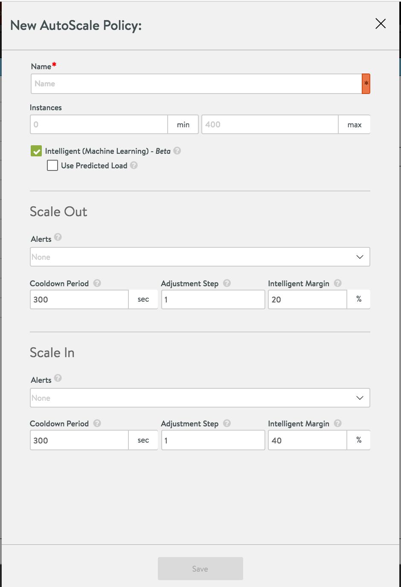

Server autoscale dynamically scales a server pool, by adding new pool members (scaling out) or removing them (scaling in). This article exposes steps by which to configure server autoscale from the UI.

### Navigate to the Pool Editor

<figure class="thumbnail wp-caption alignnone">   
<figcapture> 1. Click the pencil icon to open the Avi Vantage pool editor. 
</figcapture>
</figure> 

 

<figure class="thumbnail wp-caption alignnone">   
<figcapture> 2. Click the down-arrow to select from pre-existng autoscale policies or to create a new policy. 
</figcapture>
</figure> 

 

<figure class="thumbnail wp-caption aligncenter">   
<figcapture> 3. Furnish the required autoscale policy parameter values, as explained below. 
</figcapture>
</figure> 

### Policy Options

* **Name**: Name the autoscale policy (for potential re-use with other pools).
* **Instances**: Set the minimum and maximum number of servers (instances) allowed in the pool.
* **Intelligent (Machine Learning)**: Off by default, Avi Vantage's intelligent machine learning algorithm bases autoscaling decisions on a comparison of the load on the pool and the estimated capacity of member servers. If this option is checked on, the **Use Predicted Load** option will be made visible in UI; it uses predicted load instead of current load. 

The following options can be set separately for scale out and scale in:

* **Alerts**: Type of alert that will trigger a scale out or scale in.
* **Cooldown Period**: Minimum amount of time between two consecutive scale outs or scale ins.
* **Adjustment Step**: Number of server instances to add or remove with each scale out or scale in operation. Note: The adjustment step is not allowed to exceed the minimum or maximum number of allowed server instances.
* **Intelligent Margin**: Minimum extra capacity as percentage of load used by the intelligent machine learning algorithm. Scale out is triggered when available capacity falls below this margin. 