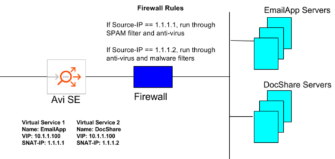
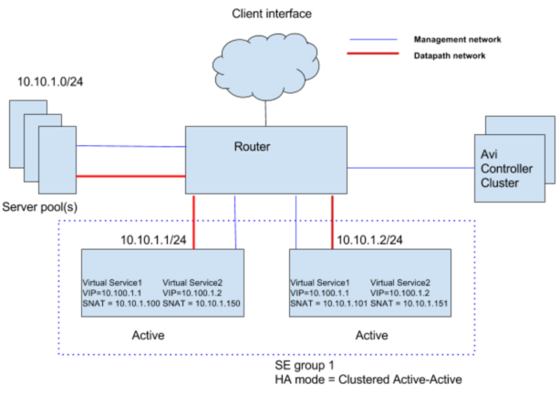
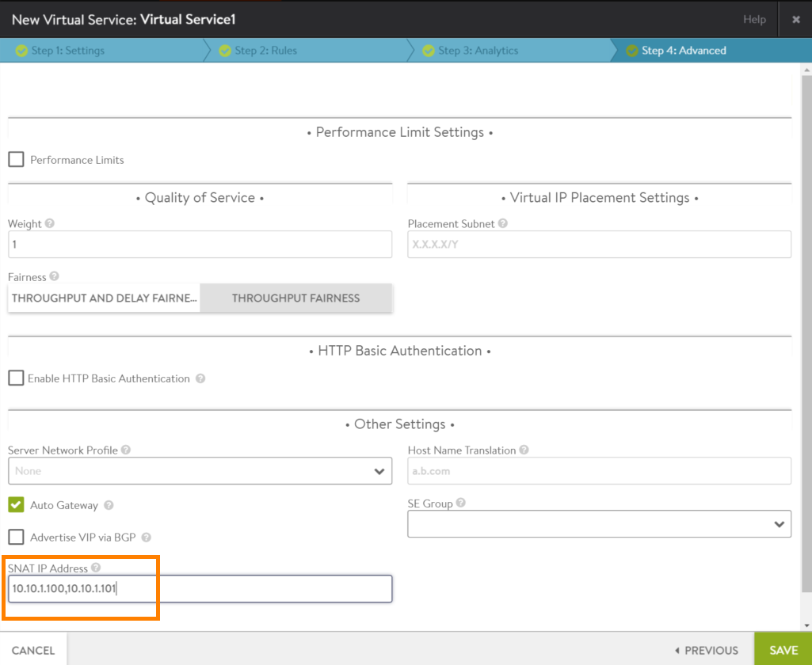
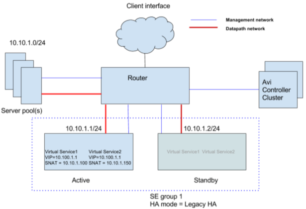
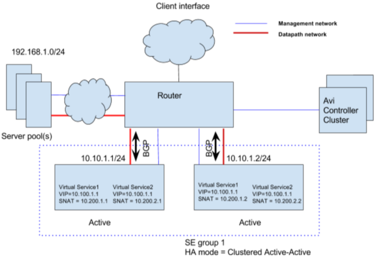
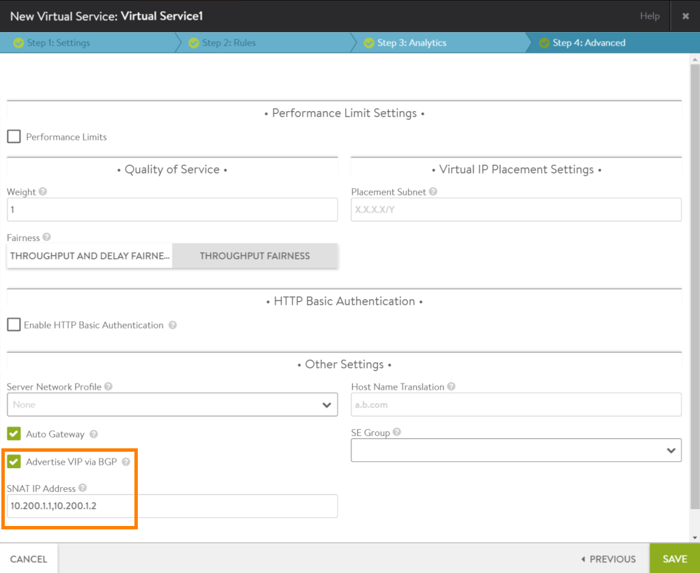

Beginning in Avi Vantage 16.2, the source IP address used by AVI SEs for server back-end connections can be overriden through an explicit user specified address--the source NAT (SNAT) IP address. The SNAT IP address can be specific as part of the virtual service configuration.

## Uses for SE SNAT

In some deployments, it may be required for back-end servers to identify traffic based on source IP address, to provide differential treatment based on the application. For example, in DMZ deployments there may be firewall, security, visibility, and other type of solutions that may need to validate all the clients that can communicate with an application. Such deployments use the source IP to identify the application that is being accessed.

In the following example, SNAT is used to identify the application type for a VIP's traffic. Traffic destined to email servers must pass through a SPAM filter and anti-virus checks, while traffic destined for DocShare servers needs to undergo anti-virus and malware filter checks.

(The topology representation is logical rather than physical. For example, email and DocShare servers could both be running on the same host and be in the same pool. Likewise, the set of email or DocShare servers does not need to be physically connected to the rest of the network through a single segment, and so on.)

### One SNAT Address per SE Required

If SNAT will be used for a virtual service, the virtual service's configuration must include a unique SNAT address for each SE that may be used by the virtual service. For example, if the SE group for the virtual service's pool can be scaled out to a maximum of 4 SEs, the SNAT list within the virtual service configuration must contain 4 unique SNAT addresses.

Note: Whereas some other load balancing products require an entire pool of SNAT IP addresses per virtual service, even for a single load balancing appliance, Vantage does not require a whole pool per virtual service. Vantage does not have the limitation of 64K port numbers for a single device. Vantage is designed to allow a single source IP to have more than 64 K connections across an application's back-end servers. Up to 48 K open connections can be established to each back-end server.

## Configuring SE SNAT

To enable source NAT for a virtual service:
<ol> 
 <li>Navigate to Applications &gt; Virtual Services. 
  <ul> 
   <li>If creating a new virtual service, click Create &gt; Advanced Setup.</li> 
   <li>If adding SNAT to an existing virtual service, click the edit icon in the row where the virtual service is listed.</li> 
  </ul> </li> 
 <li>On the Advanced tab, enter the SNAT IP in the SNAT IP Address field. If the SE group allows scaling out to more than one SE, add a unique SNAT IP for each SE. Use a comma between each IP as a delimiter.</li> 
 <li>Click Save.</li> 
</ol> 

## High Availability Support for Source NAT

Source NAT can be used with either of the high availability (HA) modes, cluster HA or <a href="/docs/16.2/legacy-ha-for-avi-service-engines/">legacy HA</a>. The configuration requirements differ depending on whether the SE and back-end servers are in the same subnet (connected at Layer 2) or in different subnets (connected at Layer 3).

<table class="table table table-bordered table-hover">  
<tbody>      
<tr>    
<th>SE-server Connection
</th>
<th>HA Type
</th>
<th>Requirements
</th>
</tr>
<tr>    
<td rowspan="2">Layer 2</td>
<td>Cluster HA  (Active/Active)</td>
<td>SNAT IPs: 1 per SE  Floating IP: Not Req'd</td>
</tr>
<tr>   
<td>Legacy HA  (Active/Standby)</td>
<td>SNAT IPs: 1 per virtual service  Floating IP: Not Req'd</td>
</tr>
<tr>    
<td rowspan="2">Layer 3</td>
<td>Dynamic HA using BGP  (Active/Active)</td>
<td>SNAT IPs: 1 per SE in SE group (to support scale out)  Floating IP: Not Req'd</td>
</tr>
<tr>   
<td>Legacy HA  (Active/Standby)</td>
<td>SNAT IPs: 1 per virtual service  Floating IP: Req'd</td>
</tr>
</tbody>
</table> 

Notes:

* In Layer 3 HA, the upstream router is used to provide equal-cost multipath (<a href="/docs/16.2/legacy-ha-for-avi-service-engines/">ECMP</a>) load balancing across the virtual service's SEs.
* For Layer 3 HA, configuration may be required on the router between the SEs and the back-end servers, to enable return traffic from the server to reach the SEs.
* In Layer 2 HA, scale out is not possible. 

### Layer 2: Cluster HA (A/A)

In Layer 2 cluster HA, one SNAT IP will need to be provided per SE, at the virtual service configuration level. Connections from the client will be load balanced across the SEs by ECMP in the upstream router. When an SE initiates the connection to the back-end server, the SNAT IP corresponding to that SE will be used for the connection. Here is an example of a typical Layer 2 cluster HA topology.

In this topology, two virtual services are configured. Each of the virtual services is provisioned with a distinct SNAT IP. Since cluster HA is selected, each virtual service will need to be provisioned with as many SNAT IPs as the number of SEs in the SE group. The Avi Controller will automatically distribute the SNAT IPs to the individual SEs on which the virtual services are enabled.

Here is the SNAT configuration in the web interface for Virtual Service 1 in the example topology.

### Layer 2: Legacy HA (A/S)

Legacy HA mode typically is used when migrating from appliance-based load balancing deployments, which typically support only 1:1 active-standby HA mode. In this case, only a single SNAT IP per virtual service is required, since the standby SE does not carry any traffic. Here is an example of a typical Layer 2 legacy HA topology.

In case of a failover, the newly active SE will take over the traffic as well as ownership of the SNAT IP from the failed SE. Health monitoring is performed only by the active SE.

Here is the SNAT configuration in the web interface for Virtual Service 1 in the example topology.

### Layer 3: Cluster HA (A/A)

In Layer 3 dynamic HA, the SNAT IP is advertised dynamically through BGP. BGP support is enabled in the virtual service configuration. Using BGP enables an active-active scale out topology when the SNAT IP is not part of the SE interface's subnet.

When SNAT is enabled, the Vantage user will need to provision as many SNAT IPs as the width of the scale out desired. For example, to support to a maximum of 4 SEs, 4 unique SNAT IPs are required in the virtual service configuration. If fewer SNAT IPs are configured than the maximum scale out size, scale out is limited to one SE per configured SNAT IP.

Here is an example topology with SNAT enabled in scale out HA mode with BGP enabled.

Here is the SNAT configuration in the web interface for Virtual Service 1 in the example topology.

For details on enabling BGP to advertise SNAT IP addresses, <a href="/docs/16.2/bgp-support-for-virtual-services">click here</a>.

### Layer 3: Legacy HA (A/S)

This mode requires only a single SNAT IP per virtual service, since scale out is not possible. The active SE carries all the traffic and owns the SNAT IP, while the standby SE remains idle. In the case of a failover, the standby SE takes over the traffic as well as ownership of the SNAT IP.

A floating interface IP needs to be provisioned in order to provide adjacency to the upstream router, for the SNAT IP. For information, <a href="/docs/16.2/legacy-ha-for-avi-service-engines/">click here</a>.

### Using the CLI

The following commands add SNAT IP address 10.200.1.1 to Virtual Service 1:

<pre>: &gt; configure virtualservice Virtual Service 1
...

: snat_ip 10.200.1.1
: save
</pre> 