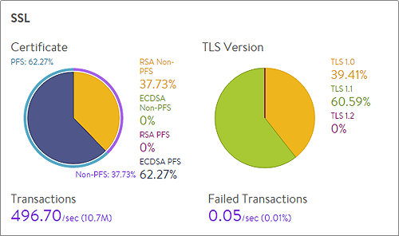

Avi Vantage provides a number of features to help understand the utilization of SSL traffic and troubleshoot SSL-related issues.

 

## Visibility

Every virtual service provides a number of useful data points and metrics.  Several features in particular are valuable for digging deeper into the SSL-termination process.

### Security Insights

Navigate to a Virtual Service &gt; Security page to view the SSL and DDoS insights for the VS.  SSL misconfigurations or issues, such as an expiring SSL certificate, will be highlighted on this page.  It will also be shown in the health score of the virtual service, incurring a security penalty.

Ideally, the security penalty should be zero, which means it is not detracting from the health or risk of a virtual service. A non-zero security penalty should be investigated and remediated.

Security Insights specific to SSL are shown on the left tiles:

* SSL Distribution
* SSL Score 

### SSL Distribution Insights

The SSL section on the top left of the Security page shows the most relevant SSL data about client connections terminated on Vantage within the selected period of time. If SSL termination is not being performed on the virtual service, this section will have no data.

* **Certificate**:  Breaks down the certificate types used by clients during the negotiation phase of SSL session setup. A virtual service can be configured to accept both RSA and EC certificates. Avi Vantage will negotiate whichever type the client supports, with EC as the preference for clients that support both. Depending on the cipher negotiated by the client, RSA and EC may be negotiated with or without perfect forward secrecy.
* **TLS Version**:  Displays the TLS versions negotiated by clients. Vantage supports TLS, but not the older and less secure SSLv2 or SSLv3.
* **Transactions**:  The average transactions per second (TPS) for new connections negotiated within the time period. This metric includes both new and reused transactions. This metric is further broken down via the Transactions metric tile from the SSL section of the sidebar tiles, which further breaks down this number.
* **Failed Transactions**:  Number of unsuccessful transactions. Typically, transactions may fail either due to clients terminating the negotiation midstream, or because the client and Vantage could not agree on a mutually supported cipher or TLS version. To view individual failed transactions, access the logs page of the virtual service. 

### SSL Score

The SSL Score section on the bottom left of the security page shows the major factors affecting the SSL Score penalty.  Any penalty here will be multiplied by 5 when viewed in the virtual service health score.  For instance, the site is not using a trusted certificate, which has a local penalty of 4. This incurs a Security Penalty of 20 against the virtual service health score.

* **PFS Support**:  Negatively impacts the virtual service’s security score by reducing it if PFS-capable ciphers are not enabled in the SSL profile for the virtual service.
* **SSL Protocol Strength**:  Reduces the score if an insecure SSL/TLS version is enabled.
* **Weakest Encryption Algorithm**:  Reduces the score if a weak encryption algorithm is enabled in the SSL profile.  See the SSL Profile’s security score for more on this.
* **Symmetric Encryption Cipher Strength**:  Reduces the score if the cipher suite uses an encryption algorithm Vantage considers insecure.
* **Certificate Expiration Time**:  Reduces the score if the certificate is about to expire or has already expired.
* **Signature Algorithm**:  Reduces the score if weak hashing algorithms (such as md5 or SHA1) are enabled in the virtual service’s SSL profile.
* **Disable Client Renegotiation**:  As a best practice, Vantage turns off client SSL renegotiation. This field is non-configurable and therefore does not impact the security score.
* **Trusted CA Certificate**:  Reduces the score if the virtual service is using a self-signed certificate. 

 

### Application Logs

Navigating to the Logs tab of an individual VS' Virtual Service page enables viewing of individual connections and requests.  Vantage captures a number of metrics, including several that are not shown in the UI, such as ciphers. Export the logs or filter for additional metrics if desired.

* Version
* Certificate type
* Cipher
* PFS
* SSL session ID / TLS ticket 

In the Log Analytics tile on the right, select the SSL tile to see a summary of the SSL data for the selected logs.

### SSL Ciphers

Within Templates &gt; Security &gt; SSL Profile, Vantage provides a basic rating system to indicate the performance, compatibility, and security of the ciphers and their order.  The rating is a quick and easy way to assess the results of the cipher settings.

 

### SSL Certificates

Within Templates &gt; Security &gt; SSL Certificates, Vantage displays all the certs that are available.  This view breaks down the type of cert and provides a simple color code to indicate the status.  For instance, a certificate will turn yellow if the cert is going to expire soon, and red when it has expired.  Certificate chain issues can also be viewed.

 

## Troubleshooting

The tools mentioned above can prove valuable for troubleshooting common SSL-related issues.  Below are common issues.

### Certificate Expiration

When a certificate expires, the virtual service will incur a Security Penalty.  This is visible in the VS &gt; Security page, as well as the SSL certificates page.  Consider enabling proactive <a href="/docs/16.2/notification-of-ssl-certificate-expiration">certificate expiration notifications</a>

### SSL Version Related Threats

Periodically new vulnerabilities to SSL and TLS are announced, such as Heartbleed and Drown attacks.  Many of these vulnerabilities target older versions of SSL, which are not enabled on Vantage.  To disable additional versions, such as TLS 1.0, navigate to the SSL profile to make the change.  Equally important though, is to understand the impact such as change will have on existing users.  Take a look at the Security Insights or the Logs page to quantify how many users are negotiating via TLS 1.0, what versions of browsers they are using, and if those browsers support newer versions of SSL/TLS.

### Incompatible Ciphers

A number of variations of issues could cause this error.  The virtual service will capture logs for any SSL incompatibilities.  A common cause is an SSL profile that only enables EC ciphers that is applied to a virtual service that has been configured with an RSA certificate.
