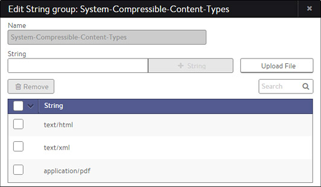

### Description

String Groups contain arbitrary lists of comma-separated text that may consist of HTTP URIs, names, or other content to be filtered against. The group may be used for many purposes such as black/white lists. An HTTP Security Policy may use a String Group to filter allowed HTTP URIs. An HTTP Application Profile may use a String Group to identify mobile users to ensure they receive more aggressively compressed HTML files. The table on the Templates > Groups > String Group page contains the following information for each String Group:

* **Name:** Name of the String Group.
* **Number of Strings:** Number of strings within a String Group. 

### Create a String Group

Options while creating or editing a String Group:

* **Name:** Enter a unique name for the String Group in the Name field.
* **Strings:** Add one or more text strings to the list. You may use any combination of the following methods:
    * **String:** Enter any text in the field, and then click the **+** String button to add.
    * **Upload File:** Click the Upload File button on the right to navigate to and upload a comma separated value (CSV) file that contains text. 