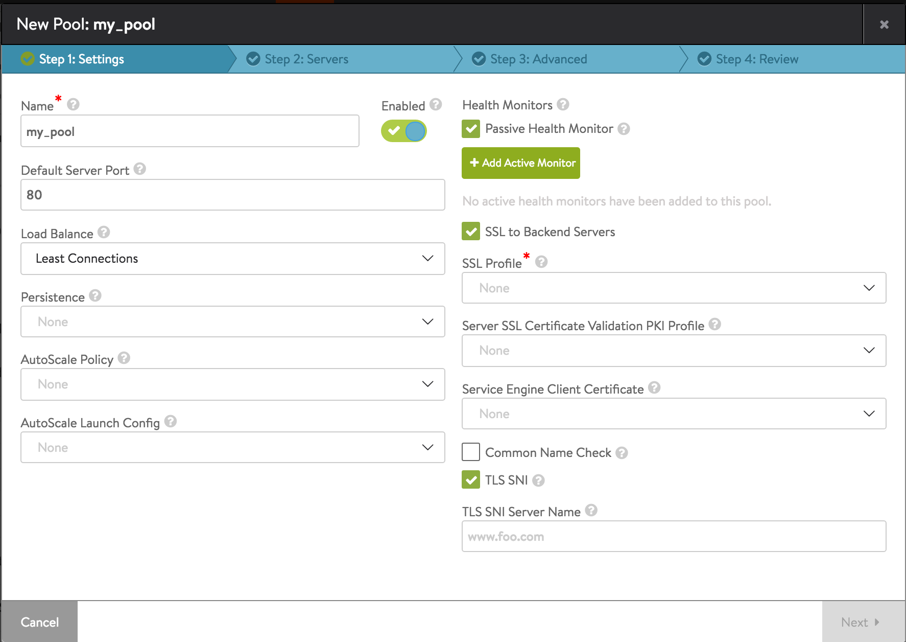

In Avi Vantage 16.2 and higher, TLS SNI is supported for connections to pool servers.

Referring to the figure, selection of the SSL to Backend Servers checkbox causes a set of fields to appear, among them the TLS SNI option, which is ON by default. Checking it enables TLS SNI for connections to servers. The SNI extension is sent as part of the handshake. Optionally, one may furnish a fully qualified DNS hostname to be used in the TLS SNI extension in server connections. If no value is specified (the default), Avi will use thepool name (value of the incoming request's Host Header)instead.

