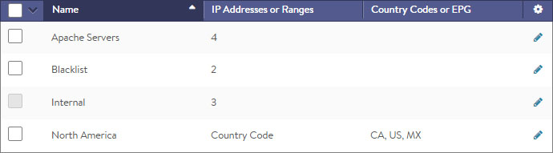
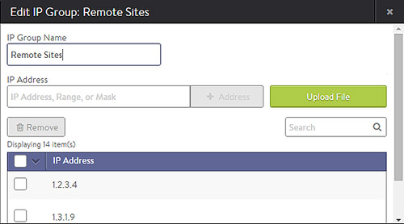

### Description

IP groups are comma-separated lists of IP addresses that may be referenced by profiles, policies, and logs. Each entry may be an IPv4 address, an IP range, an IP/mask, or a country code or Cisco ACI Endpoint Group (EPG). The following are examples of IP groups used elsewhere within the Avi Vantage configuration:

* A network security policy may be configured to drop any clients coming from a blacklist of IP addresses. Rather than maintain a long list within the policy, Vantage maintains the rule logic of that policy separately from the list of addresses, which are kept in the IP group. A user can be granted a role that allows them to update the list of IP addresses without being able to change the policy itself.
* Logs classify clients by their IP address and match them against an included geographic country location database. You may override this database by using an IP group to create specific mappings such as internal IP addresses. For instance, LA_Office may contain 10.1.0.0/16, while NY_Office contains 10.2.0.0/16. Logs will show these clients as originating from these locations. Logs searches may also be performed on the group name such as LA_Office. 

The table on the Templates > Groups > IP Group page contains the following information for each IP group:

* **Name:** Name of the IP group.
* **IP Address or Ranges:** Number of IP address, networks, or address ranges.
* **Country Code or EPG:** Any configured country codes or EPGs are listed. 

### Create an IP Group

To create or edit an IP Group:

* **Name:** Enter a unique name for the IP group.
* **Select by IP Address:** Add one or more addresses to the list. Any combination of the following methods may be used:  
    * **IP Address:** Comma separated list: 10.0.0.1, 10.0.0.5
    * **Range:** 10.0.0.10–10.0.0.20
    * **Mask:** 10.1.0.0/16
    * **Upload File:** Click the Upload File button on the right to navigate to and upload a comma-separated-value (CSV) file that contains any combination of IP addresses, range, and/or masks.
* **Select by Country Code or EPG:** Select one or more countries, or type the country name into the search field to filter. Countries may not be combined within an IP group with individual IP addresses. An IP group that contains countries may not be used as a list of servers for pool membership.
* 
    * For cloud environments set up to integrate with Cisco ACI, Endpoint Groups are shown as an option for the IP group. EPGs are IP addresses or groups configured within the Cisco APIC controller and automatically imported into Vantage. 