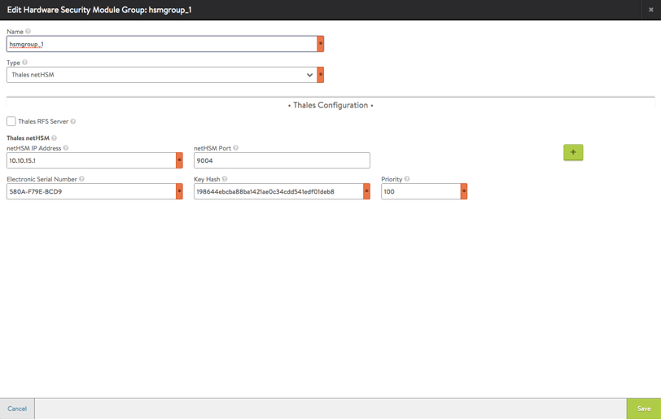
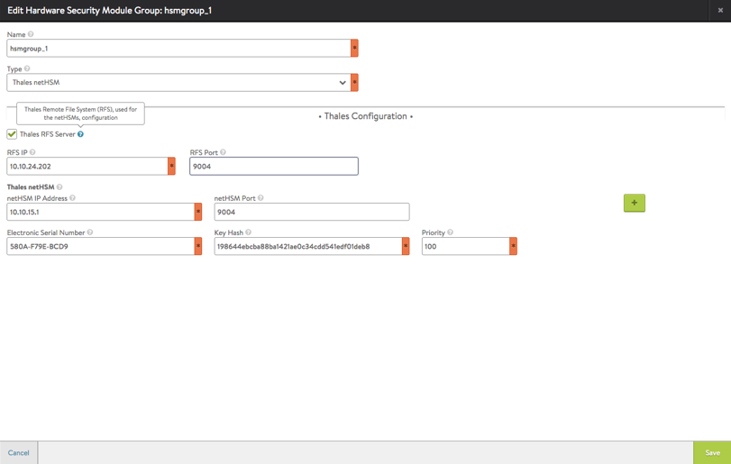
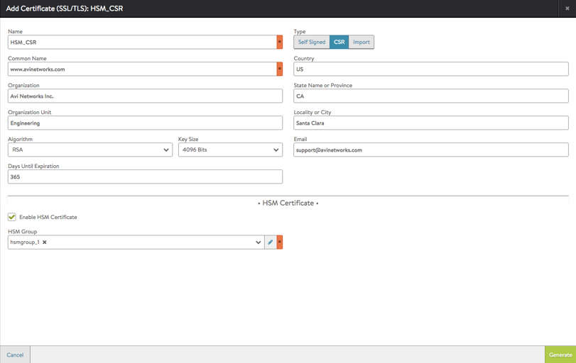
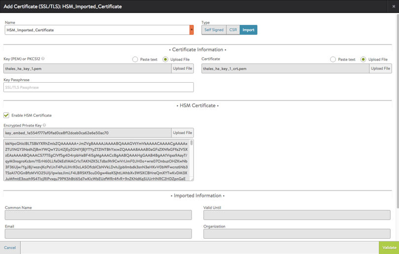
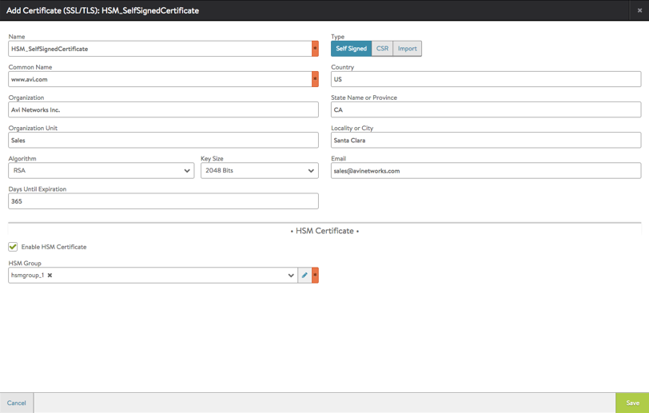

Avi Vantage includes support for networked Hardware Security Module (HSM) products. Specifically, Vantage supports Thales nShield Connect.

This article describes how to configure Vantage to use the encryption/decryption services of Thales nShield HSM devices for securing the SSL/TLS traffic of a virtual service.

## Integration Support

The Vantage implementation uses Thales Security World Software Release 11.72.01 for 64-bit Linux.

Vantage can be configured to support a cluster of HSM devices within the same Security World. Vantage support of HSM devices requires installation of the user's Thales nShield software bundle, which comes in the DVD distributed with the nShield product.

### Prerequisites

* Thales nShield software package
* HSM group object configuration.  
    * All the Thales nShields configured in this object must be part of the same Security World.
* Allowed clients on Thales nShields.  
    * Each Service Engine's (SE's) management IP address must be enrolled as a client of each of the nShields configured in the HSM group. These are the SEs in the SE group that refers to the HSM group.
    * If Vantage will be used for generating HSM key and certificate signing requests, then the management IP address of each Controller in the cluster must be enrolled as a client of each of the nShields configured in the HSM group. 

### Limitations

* In Vantage 16.1, a single HSM group object is supported. The HSM group object may contain an unlimited number of nShields.
* Self-signed certificate(s) generated using the HSMs in the HSM group have a fixed validity of 30 days. It is recommended that the generated Certificate Signing Request be used to generate certificates with desired validity. 

### HSM Group Updates

Create, delete, or update of an HSM group results in restart of the SEs. This is required because the Thales software artifact (“hardserver”) needs a re-start when its configuration file is updated. This results in a temporary disruption of traffic.

# Thales Software Import

Avi Vantage allows key and certificate generation using an HSM such as Thales nShield. Or, the key and certificate can be generated out-of-band and imported into Avi Vantage.

To enable support for Thales HSM, the Thales nShield software bundle that came in the DVD distributed with the nShield product must be uploaded to the Controller.

The bundle must be named “thales.tar” and can be prepared using the following steps:

**Step 1.** Copy the following tar files from the DVD into any given directory (e.g., "thales_pkg").

**Step 2.** Change directory (cd) to the given directory, and enter the following commands:

<pre pre="" class="command-line language-bash" data-output="1-100"><code>cd thales_pkg
cp /Dvd/linux/libc6_3/amd64/nfast/ctls/agg.tar agg.tar
cp /Dvd/linux/libc6_3/amd64/nfast/hwcrhk/user.tar user.tar
cp /Dvd/linux/libc6_3/amd64/nfast/hwsp/agg.tar agg2.tar
tar -cvf thales.tar agg.tar agg2.tar user.tar</code></pre> 

**Step 3.** In Vantage 16.1, HSM package upload is supported only through the CLI. You can use the following command in the Controller CLI shell to upload the HSM package:

<pre pre="" class="command-line language-bash" data-output="1-100"><code>: &gt; upload hsmpackage filename /tmp/thales_pkg/thales.tar</code></pre> 

This command uploads the packages and installs them on the Controllers. (If the Controller is deployed as a 3-node cluster, the command installs the packages on all 3 nodes.) Upon completion, the following message should appear: *The HSM Package uploaded successfully *

**Step 4.** SEs in an SE group that refers to a HSM group need a one-time reboot for auto-installation of the HSM packages. To reboot an SE, you can issue the following command in the CLI shell:

<pre pre="" class="command-line language-bash" data-output="1-100"><code>: &gt; reboot serviceengine Avi-se-ksueq</code></pre> 

In this example, the SE name is "Avi-se-ksueq".

**Step 5.** To allow the Avi Controllers to talk to Thales nShield network HSM, Thales nShield software bundle, which comes in the DVD distributed with the product, must be uploaded to Avi Vantage. (The software bundle preparation and upload is described above.)

In addition, the following Security World related files must be uploaded as well. Thales requires the creation of Security World on some machine that can talk to the nShield HSMs. Generally, this machine is the Remote File Server (RFS). When the Security World is created, the Security World related information, e.g. on the RFS, generally resides at one of the following locations:

* /opt/nfast/kmdata/local/
* NFAST_HOME/kmdata/local/ 

where NFAST_HOME is the home directory for the Thales software installation (if it is not /opt/nfast/).

The Security World files include the following:

* The "world" file in the Security World. This file can be found at /opt/nfast/kmdata/local/ or NFAST_HOME/kmdata/local/.
* All the module files corresponding to the nShield modules configured in the HSM group. 

For example, if a module in the HSM group has Electronic Serial Number (ESN) 580A-F79E-BCD9, then module file module_580A-F79E-BCD9 is available in /opt/nfast/kmdata/local/ or NFAST_HOME/kmdata/local/.

These files are used by Thales software when generating private keys, self-signed certificates, and certificate signing requests (CSRs). All these files must be packaged as “thales_security_world.tar”.

The Security World package can be created to include all the module and world files, in the following way:

<pre pre="" class="command-line language-bash" data-output="1-100"><code>tar -cvf thales_security_world.tar /opt/nfast/kmdata/local/module_* /opt/nfast/kmdata/local/world</code></pre> 

Note: This assumes there is a bash shell on a Unix/Linux system on the RFS.

Optionally, if the HSM group has been configured to use only specific nShields, the Security World package can be created in the following way:

<pre pre="" class="command-line language-bash" data-output="1-100"><code>tar -cvf thales_security_world.tar /opt/nfast/kmdata/local/module_580A-F79E-BCD9 /opt/nfast/kmdata/local/module_63E7-F6E1-A1AA /opt/nfast/kmdata/local/world</code></pre> 

Then:

<pre pre="" class="command-line language-bash" data-output="1-100"><code>upload hsmpackage filename /tmp/thales_pkg/thales_security_world.tar</code></pre> 

In this example, the HSM group has been configured to use only the nShield modules with ESN 63E7-F6E1-A1AA and ESN 580A-F79E-BCD9, from among the many available at the RFS.

## Enabling HSM Support in Vantage

After using the steps above to install your Thales software bundle onto the Controller, the Controller may be configured to secure virtual services with HSM certificates.

**Step 1.** Create the HSM group and add the HSM devices to it. This is the set of nShield devices within the Security World to be used to secure virtual services.

**Step 2.** Add the HSM group to the SE group that will be used by the virtual service.

**Step 3.** Add the application certificates and keys, using one of the following methods:

* CSR: Generate a CSR on the Controller, use it to obtain a signed certificate from a Certificate Authority (CA), then copy the signed certificate to the Controller.
* Import: Import a certificate and its key that were generated out of band.
* Self-signed: Generate a self-signed certificate on the Controller. >  Note: Self-signed certificate(s) generated by the Controller using the HSMs in the HSM group have a fixed validity of 30 days. It is recommended to use a CSR to request signed certificates instead. 
 

**Step 4.** Add the HSM-signed application certificates to virtual services.

Detailed steps are provided below.

### Configure the HSM Group

Use these steps to create the HSM group.

**Step 1.** Navigate to Templates > Security > HSM Groups, and click Create.

**Step 2.** Enter a name for the group.

**Step 3.** Set the type to Thales netHSM.

**Step 4.** Enter the values for the other HSM parameters.

**Step 5.** Click Save.

**Example with use of RFS disabled:**

**Example with use of RFS enabled:**

### Add the HSM Group to the SE Group

The HSM group must be added to the SE group that will be used by the virtual service.

**Step 1.** Navigate to Infrastructure > Clouds.

**Step 2.** Click on the cloud name (for example, Default-Cloud).

**Step 3.** Select Service Engine Group. The SE groups configured for the cloud are listed.

**Step 4.** Click the Edit icon on the row for the SE group to modify. (If creating a new one instead, click New.)

**Step 5.** Click Advanced.

**Step 6.** On the Advanced page, select an HSM group from the HSM Groups drop-down list.

**Step 7.** Click Save.

**Note:** If the infrastructure type selected during cloud creation was No Orchestrator, adding the HSM group to the SE group is not supported in the web interface. To work around this, the following command can be entered in the Controller CLI shell:

<pre pre="" class="command-line language-bash" data-output="1-100"><code>: &gt; configure serviceenginegroup Default-Group hardwaresecuritymodulegroup_ref thales-hsm-1</code></pre> 

Replace *thales-hsm-1* with the name you used when creating the HSM group.

### Add the Certificates and Keys

Use one of the following methods.

### Request a Signed Certificate Using a CSR

To use a CSR to request a signed certificate, use these steps.

**Step 1.** Navigate to Templates > Security > SSL/TLS Certificates, and click Create > Application Certificate.

**Step 2.** If the CSR is from an HSM, select Enable HSM Certificate.

**Step 3.** Click CSR.

**Step 4.** Enter a name for the CSR.

**Step 5.** Enter the common name. (This is the hostname of the VIP.) Entering the other values is optional.

**Step 6.** In the HSM Certificate section, check Enable HSM Certificate, and select the HSM group from the pull-down list. This option tells Vantage to use the HSM group to generate the CSR.

**Step 7.** Click Generate. Vantage generates the CSR, and displays it in the Certificate Information section of the configuration popup.

**Step 8.** Click Copy to clipboard.

**Step 9.** Send the CSR to the CA. (This is done out of band, typically by email or web.)

****Step 10.**** Click Close. A configuration object for the certificate appears in the certificate list. The status in the Valid Until column is "Awaiting Certificate".

When the signed certificate is received from the CA:

**Step 1.** Navigate to Templates > SSL/TLS Certificates > Security. Click on SSL/TLS Certificates, if not already selected.

**Step 2.** Click the edit icon next to the row for the certificate definition that is awaiting the certificate. (This is the one created when the CSR was generated.)

**Step 3.** Add the signed certificate to certificate definition.

**Step 4.** Click Save.

### Import a Certificate Created Out of Band

Use a browser to navigate to the Controller's management IP address. If Vantage is deployed as a 3-node Controller cluster, navigate to the management IP address of the cluster. Use this procedure to import the private keys created using the Thales **generatekey** utility, and the associated certificates.

**Step 1.** Navigate to Templates > Security > SSL/TLS Certificates, and click Create > Application Certificate.

**Step 3.** Enter a name for the certificate definition.

**Step 4.** Click Import.

**Step 5.** Prepare to import the private key for the server certificate.

Note: This is different from the Thales encrypted key, which is imported later in the procedure using other fields on this page.

* a. Above the Key field, in the Certificate Information section, select Paste text (to copy-and-paste the certificate text directly in the web interface) or Upload File.
* b. If the key file is secured by a passphrase, enter the passhrase in the Key Passphrase field.
* c. Paste the key file (if copy-and-pasting) or navigate to the location of the file (if uploading). 

**Step 6.** Prepare to import the server certificate:

* a. Above the Certificate field, select Paste text or Upload File.
* b. Paste the key file (if copy-and-pasting) or navigate to the location of the file (if uploading).
    
    **Step 7.** Prepare to import the Thales encrypted key:
    
* a. In the HSM Certificate section, check Enable HSM Certificate. This displays the upload field for the Thales encrypted key file. Click Upload and navigate to the location of the file.
* **Note: The encrypted key file name must be the same as was generated by Thales nShield.**
* b. View the information in the Imported Information section. 

**Step 8.** Click Validate. Vantage checks the key and certificate files to ensure they are valid.

### Generate a Self-signed Certificate

Self-signed certificate(s) generated using the HSMs in the HSM group have a fixed validity of 30 days. It is recommended that a CSR be used to obtain certificates with the desired validity.

**Step 1.** Navigate to Templates > Security > SSL/TLS Certificates, and click Create > Application Certificate.

**Step 2.** Click Self-signed.

**Step 3.** Enter a name for the certificate.

**Step 4.** Enter the common name. (This is the hostname of the VIP.) Entering the other values is optional.

**Step 5.** In the HSM Certificate section, check Enable HSM Certificate. This displays the HSM group pull-down list.

**Step 6.** Select the HSM group from the pull-down list.

**Step 7.** Click Save. Vantage generates the certificate and keys.

## Enabling HSM Support on a Virtual Service

**Step 1.** In the Controller web management interface, navigate to Applications > Virtual Services.

**Step 2.** Click New or Edit.

**Step 3.** If configuring a new virtual service, enter the and VIP.

**Step 4.** Select the HSM certificate from the SSL Certificate drop-down list.

**Step 5.** Enter the virtual service name and VIP address.

**Step 6.** In the Service Port section, enable SSL.

**Step 7.** Click Advanced. On the Advanced page, select the SE group. (This must be the SE group to which the HSM group was added.)

**Step 8.** Click Save.

The virtual service is now ready to handle SSL/TLS traffic using the encryption/decryption services of the Thales nShield HSM device.
