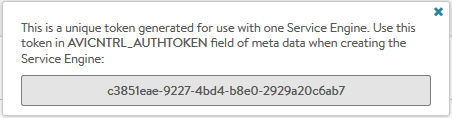
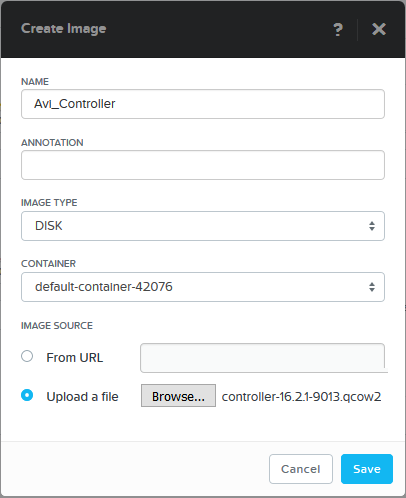
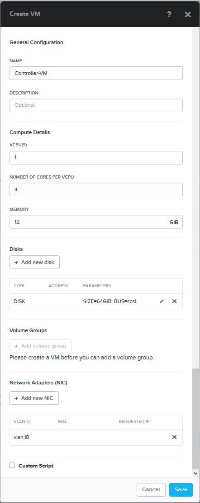
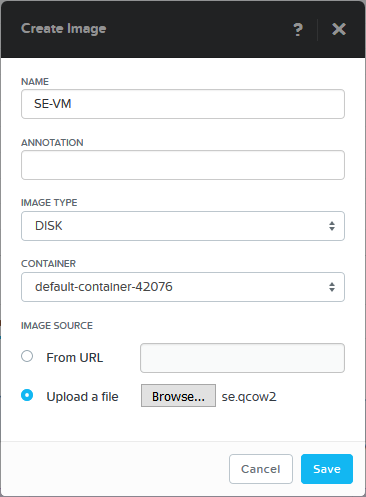
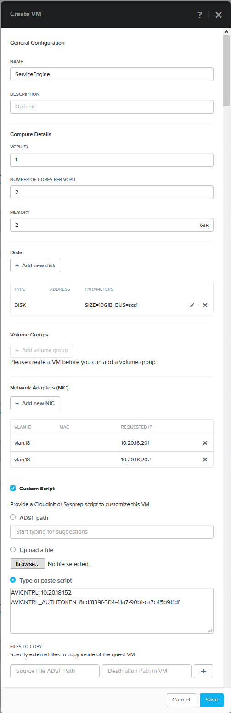

Avi Vantage supports running in the Nutanix Acropolis hypervisor orchestrated by Prism. This guide walks through the steps required to install Avi Vantage in this environment.

### VM Hardware Requirements

The resources suggested in this installation guide are minimum recommendations for a proof of concept. See also the <a href="/docs/16.2/system-requirements-hardware">hardware requirements KB</a> for more sizing help.

* **Avi Controller:** The Controller needs at least 4 vCPUs and 12 GB memory. Also needed is a NIC for the management network. This is the network used for accessing the web interface. The Controller also uses this network to communicate with the Avi Service Engines (SEs).
* **SEs:** Each SE needs at least 2 vCPUs and 2 GB memory. Also needed is a NIC for the management network as the first interface, and additional NICs for the data networks. 

### Software Requirements

* **Avi Vantage 16.1+:**  The Controller image file is obtained from the <a href="https://avinetworks.com/portal/software/">avinetworks.com/portal</a>. From the image repository, select the latest software version &gt; OpenStack section &gt; controller.qcow2 image. The SE image will be downloaded from the Controller.
* **Nutanix Acropolis 4.6+:**  Prism is required for creating the Avi VMs. 

### Deploy the Controller

<ol> 
 <li><strong>Upload the Controller</strong> image to the Prism Image Service. (Select the Settings button at the top right and go to Image Configuration to upload the files.)  <a href="#illustration1">See Illustration 1</a>

 
  <ul> 
   <li>Name</li> 
   <li>Image Type:  Disk.</li> 
  </ul> </li> 
 <li><strong>Create the Controller VM</strong> from Prism.  <a href="#illustration2">See Illustration 2</a>

 
  <ul> 
   <li>Name</li> 
   <li>vCPUs:  1</li> 
   <li>Number of Cores per vCPU:  4 (or more)</li> 
   <li>Memory:  12</li> 
   <li>Disks: 
    <ul> 
     <li>Remove CD-ROM</li> 
     <li>Add new Disk</li> 
     <li>Operation:  Clone from Image Service</li> 
     <li>Image:  [Select the name of the image created in the previous steps]</li> 
     <li>Size:  Default to 64 GB</li> 
    </ul> </li> 
   <li>NIC &gt; VLAN Name:  Select a network that will be used for management.  This network will be used for the access to the Controller by administrators and for Controller-to-Service Engine communication.  For production environments this should be a static address.</li> 
  </ul> </li> 
 <li><strong>Power on the Controller</strong> <strong>VM</strong>.  During the initial bootup, the Controller will initialize databases and run through internal setup tasks that may take several minutes.</li> 
 <li><strong>Connect to the GUI</strong> of the Controller via https://[IP Address]</li> 
 <li><strong>Set up the Controller</strong>.  From the GUI setup wizard, perform the initial configuration of the Controller. Provide a password, DNS, and set the Infrastructure Type to No-Orchestrator.</li> 
</ol> 

### Deploy the Service Engine

<ol> 
 <ol> 
  <li><strong>Download SE image</strong>. From the Controller web interface, navigate to Infrastructure &gt; Clouds. Click the download icon shown on the right. A small prompt asks which type of SE image you want.  Select qcow2.  The first time this operation is executed, the Controller will create the new SE image, which may take several minutes, depending on disk performance.  Once the image is created it will automatically download to your browser.</li> 
  <li><strong>Upload SE image</strong> to Prism &gt; Image Creation &gt; Upload Image  <a href="#illustration3">See Illustration 3</a>

 
   <ul> 
    <li>Name</li> 
    <li>Image Type:  Disk</li> 
    <li>Image Source:  se.qcow2</li> 
   </ul> </li> 
  <li><strong>Copy the auth token</strong>.  The new SE will be required to authenticate to the Controller by presenting a valid token which is generated by the Controller and placed on the SE.  This token may be used only once, and expires if not used within one hour.  From the Controller, navigate to Infrastructure &gt; Clouds.  Click the key icon to generate a new token.  Copy the token, which will be used at the end of the next step.</li> 
  <li><strong>Create the SE VM</strong> from Prism.<a href="#illustration4">See Illustration 4</a> 
   <ul> 
    <li>Name</li> 
    <li>vCPUs:  1</li> 
    <li>Cores per vCPU:  2</li> 
    <li>Memory:  2</li> 
    <li>Disks: 
     <ul> 
      <li>Remove CD-ROM</li> 
      <li>Add Disk: 
       <ul> 
        <li>Operation:  Clone from Image Service</li> 
        <li>Image:  Select the SE image name</li> 
        <li>Size:  10 GB</li> 
       </ul> </li> 
     </ul> </li> 
    <li>Network Adapters: 
     <ul> 
      <li>Create one NIC in the management network used by the Controller.  This NIC is reserved for management.</li> 
      <li>Create additional NICs as necessary for access to client and server networks for load balancing traffic.  Note that while the management network may be used for load-balanced traffic, it will require a second NIC configured for that network.</li> 
     </ul> </li> 
    <li>Custom Scripts:  Paste the following information into this section.  This info is used to tell the Service Engine about the Controller IP address and the auth token it should present.  The auth token should have already been generated in step 3.  See the graphic for an example.  
     <!-- Crayon Syntax Highlighter v2.7.1 --> <pre><code class="language-lua">AVICNTRL: [Controller IP address]
AVICNTRL_AUTHTOKEN: [Auth token]</code></pre> 
     <!-- [Format Time: 0.0009 seconds] --> </li> 
   </ul> </li> 
  <li><strong>Verify connectivity</strong> between the SE and Controller.  Power on the SE VM.  From the Controller, navigate to Infrastructure &gt; Dashboard.  The SE icon should be present and green.</li> 
  <li><strong>Repeat as necessary</strong> to create any additional Service Engines.</li> 
 </ol> 
</ol> 

 

**Illustration 1 - Create Controller Image**

 

**Illustration 2 - Create Controller VM**

 

**Illustration 3 - Create SE Image**

 

**Illustration 4 - Create SE VM**

