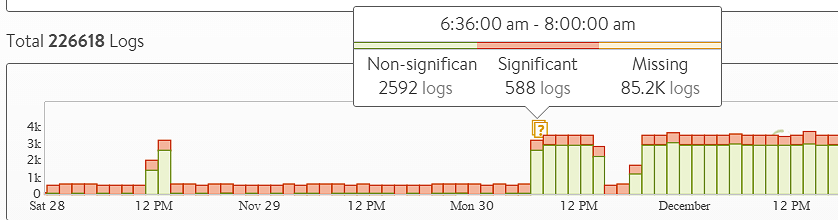

Logs pages such as the pool and virtual service > logs show logs that are categorized as Non-Significant (green) and Significant (red).  At times the log histogram ribbon may show a yellow question mark, indicating logs are missing near that time frame.  There are a number of scenarios which may cause logs to be in a missing state.

****

 

**Purged Logs**:  Significant logs (aka errors) are automatically forwarded by Avi Service Engines to the Avi Controller cluster for indexing.  Non-Significant logs (aka good traffic), if enabled, will not be sent from Service Engines to Controllers unless the data is requested by an administrator.  When an admin clicks the green Non-Significant button, the Controller fetches the logs from the Service Engines and begins indexing immediately.  Generally, Controllers are recommended to have larger storage capacity for greater log retention.  Service Engines, on the other hand, are generally configured with significantly smaller storage.  Therefore, the SE may need to rotate Non-Significant logs, purging the oldest first.  If a Controller requests purged logs, the Service Engine will report them as missing, along with a rough count of the number of purged logs for the time period.

**Rate Limited**:  To prioritize service delivery tasks such as load balancing, Service Engines may automatically rate limit the number of logs per second it records.  The number will vary depending on the performance and capacity of the underlying hardware.  It will also depend on the utilization of the hardware.  For instance, SSDs tend to have significantly faster write operations per second than hard disk drives, so they are capable of supporting greater logging per second.
