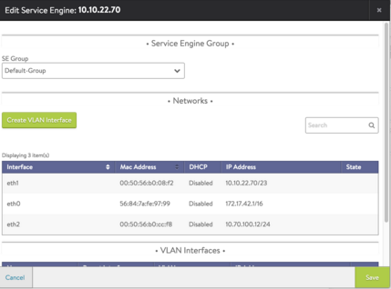
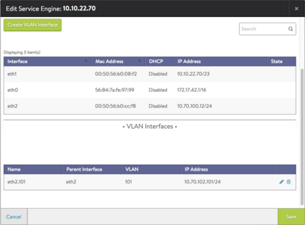

Avi Vantage supports VLAN trunking on bare metal servers. If the Avi Controller is deployed on a bare metal server, the individual physical links of the server can be configured to support 802.1q-tagged virtual LANs (VLANs). Each VLAN interface has its own IP address. Multiple VLAN interfaces per physical link are supported.
> Note: VLAN tagging applies only to bare metal deployments.
 

To configure a VLAN interface on a bare metal server running Vantage:

<ol> 
 <li>Navigate to Infrastructure, and click on the Service Engine (SE) where the VLAN interface is to be created.</li> 
 <li>Click the Edit button, and the following pop-up window appears. 

</li> 
 <li>Click Create VLAN Interface.</li> 
 <li>Select the parent interface from the drop-down list, and fill in the VLAN and IP Address fields, then click Save. The VLAN interface appears on the Service Engine Edit page. 

</li> 
 <li>Click Save again to commit the change.</li> 
</ol> 