The Avi DNS virtual service is a generic DNS infrastructure that implements the following functionality:

* <a href="#VirtualServiceDNS">Virtual service DNS hosting (domain name to IP/IPAM)</a>
* <a href="#Hosting_static_DNS">Hosting static/manual DNS entries</a>
* <a href="#Hosting_GSLB">Hosting GSLB service DNS entries</a> 

This article covers that functionality, three architectural variants, features, and typical deployment scenarios. A reference is provided that covers DNS configuration via the UI.

### Functionality

### 1. Hosting GSLB Service DNS Entries

The Avi DNS virtual service can host GSLB service DNS entries, and automatically update its responses based on factors such as application service health, service load and proximity of clients to sites implementing the application service. In so doing, it provides essential load-balancing functionality required by global applications. Details of Avi GSLB are available in these articles:

* <a href="/avi-gslb-overview/">Avi GSLB Overview</a>
* <a href="/gslb-architecture-and-object-model/">Avi GSLB Architecture and Object Model</a>
* <a href="/avi-gslb-site-configuration-and-operations/">Avi GSLB Site Configuration and Operations</a>
* <a href="/avi-gslb-service-and-health-monitors/">Avi GSLB Service Health Monitors</a> 

### 2. Virtual Service IP Address DNS Hosting

Avi DNS can host the names and IP addresses of the virtual services configured in Avi Vantage itself.

Details of configuring this can be found in <a href="/service-discovery-using-ipam-and-dns-16-3/">Service Discovery Using IPAM and DNS (16.3+)</a>.

Mesos port-based SRV records can also be hosted on the DNS service. For more information, please refer to <a href="/service-discovery-for-mesos/">DNS-based Service Discovery for Mesos</a>.

### 3. Hosting Manual or Static DNS Entries

Avi DNS can host manual static DNS entries (A, SRV or CNAME records). For a given FQDN, the user can configure an A, SRV or CNAME record to be returned.

### Architectural Variants

Over time, Avi Networks has supported three architectural variants for DNS service. All three define a DNS virtual service as a virtual service having an application profile type of DNS, with a network profile using per-packet load balancing. The differences between the variants lie in where the DNS code executes and where its data resides.

Two new variants for Avi Vantage 16.3: Avi Vantage supports hosting DNS either
<ol> 
 <li>on an SE, or</li> 
 <li>on a back-end pool of DNS servers.</li> 
</ol> 

Referring to the diagram below, a DNS service — shown in **green**— is hosted on the leftmost SE. Such SE-local service processing is exceptional for an Avi virtual service. Normally, SEs forward requests to back-end application servers for processing, for example, as depicted on the two back-end DNS servers (shown in **blue**).

Note: In release 16.3, once an SE-local DNS service is run/placed on an SE, no other virtual service placements on that SE — or its group — are permitted.

To boost the performance of and provide high availability for either variant /#1 or /#2, the DNS virtual service can be placed/hosted on more than one Service Engine; all <a href="/overview-of-vantage-high-availability/">data plane high availability modes</a> — elastic HA (active/active and M+N) and legacy HA — are supported [though not depicted in the diagram].

An additional, complementary HA approach is possible for DNS virtual services. DNS entries can be hosted on more than one DNS virtual service, thus providing network-level redundancy as well. This is a useful option for a multi-cloud scenario, and when there are sufficient IP addresses to front-end the DNS service [likewise not depicted in the diagram].

<a href="img/DNS_VS.png">  </a>An Avi DNS virtual service can act as an authoritative DNS server for one or more subdomains (zones). Like any other Avi VS, analytics and client logs are supported.

Prior to the 16.3 release, Avi supported a third architectural variant, namely, the addition of virtual service domain entries and service discovery entries on a DNS server hosted on the Avi Controller. For existing users, this variant continues to be supported in 16.3, but will be deprecated in some future release, at which time existing Controller-resident entries will be migrated to either of the previously described two variants.

### Features

### Visibility and Analytics

After navigating to the Applications-> Virtual Services, one can click on the name of a virtual service configured for DNS, DNS-Site-US-East in this example.

<a href="img/Screen-Shot-2016-12-31-at-8.30.19-PM.png">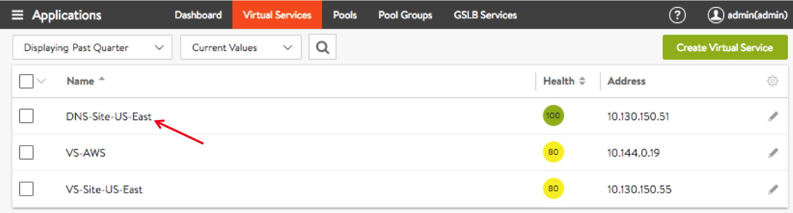</a>

Six tabs (Analytics, Logs, Health, Security, Events, Alerts, and DNS Records) are revealed, as shown in the below figure.

The Analytics tab of the DNS virtual service page offers metrics of particular interest to DNS (as seen in the red box of metrics tiles). 

<a href="img/Screen-Shot-2016-12-31-at-8.43.03-PM.png">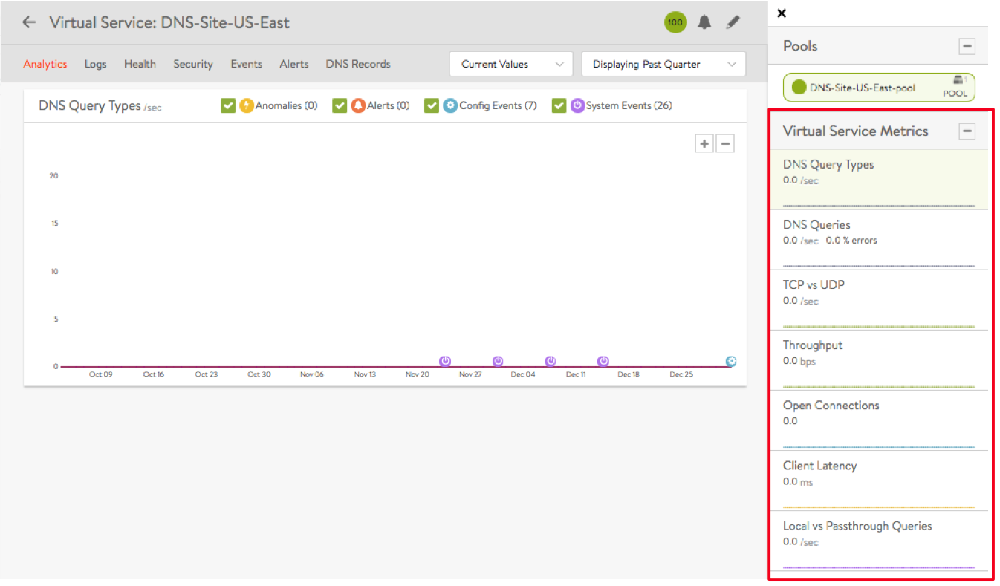</a>

 

The Logs tab (shown below) provides detailed information about DNS queries from clients, including FQDN, query-type, significant errors, responses (IP-addresses, CNAME, SRV, etc.). 

<a href="img/Screen-Shot-2016-12-31-at-8.49.05-PM.png">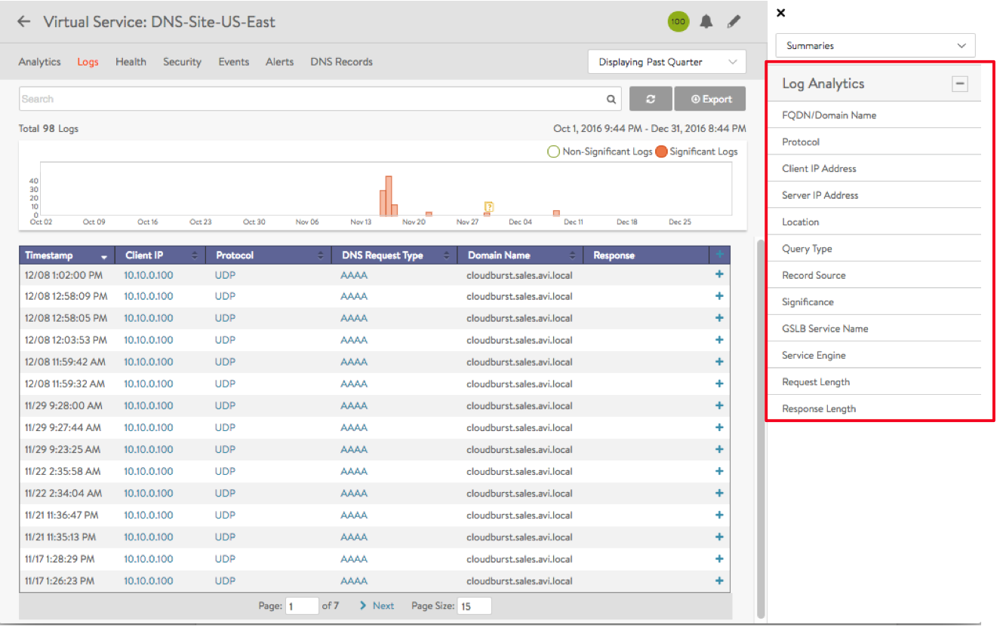</a>

### A Note on Log Settings

* Non-significant logs should be enabled with caution, since a large number of DNS queries typically hit a DNS service, and this would result in too many logs entries.
* Categorization of non-significant logs is also very important. If certain errors are typical in the deployment, these errors should be excluded from significant logs.
* Refer to the exclude DNS errors discussion found <a href="/docs/architectural-overview/templates/profiles/analytics-profile/#exclude-dns-errors">here</a>. 

A series of pop-ups appear by clicking one of 12 options in the Log Analytics selector (see red box above). Examples of each follow.

<a href="img/Screen-Shot-2016-12-31-at-9.13.37-PM.png">  </a><a href="img/Screen-Shot-2016-12-31-at-9.13.37-PM.png">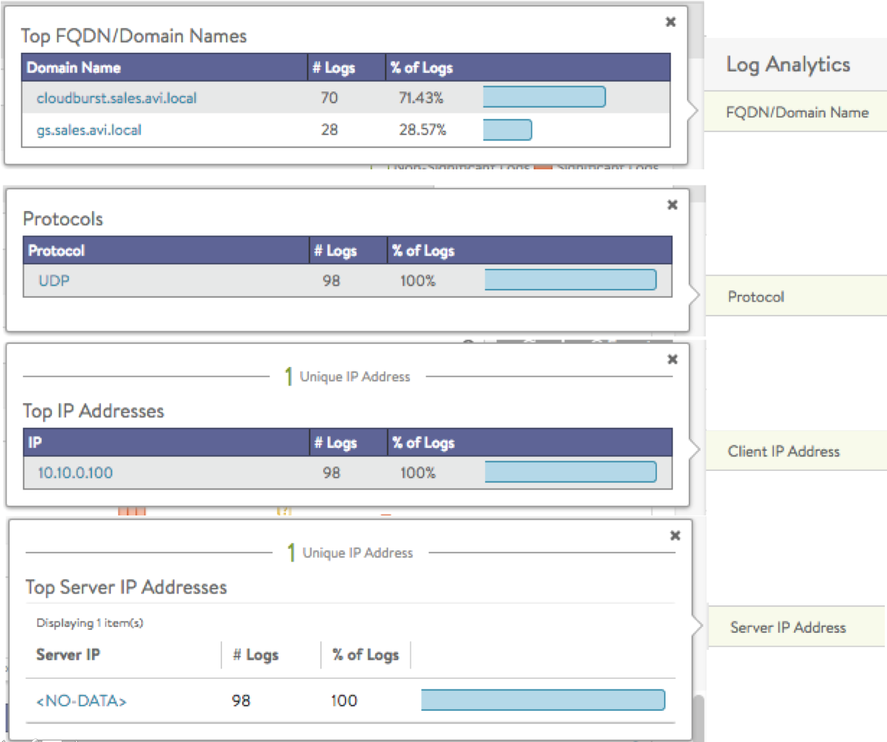</a><a href="img/Screen-Shot-2016-12-31-at-9.13.54-PM.png">  </a><a href="img/Screen-Shot-2016-12-31-at-9.13.54-PM.png">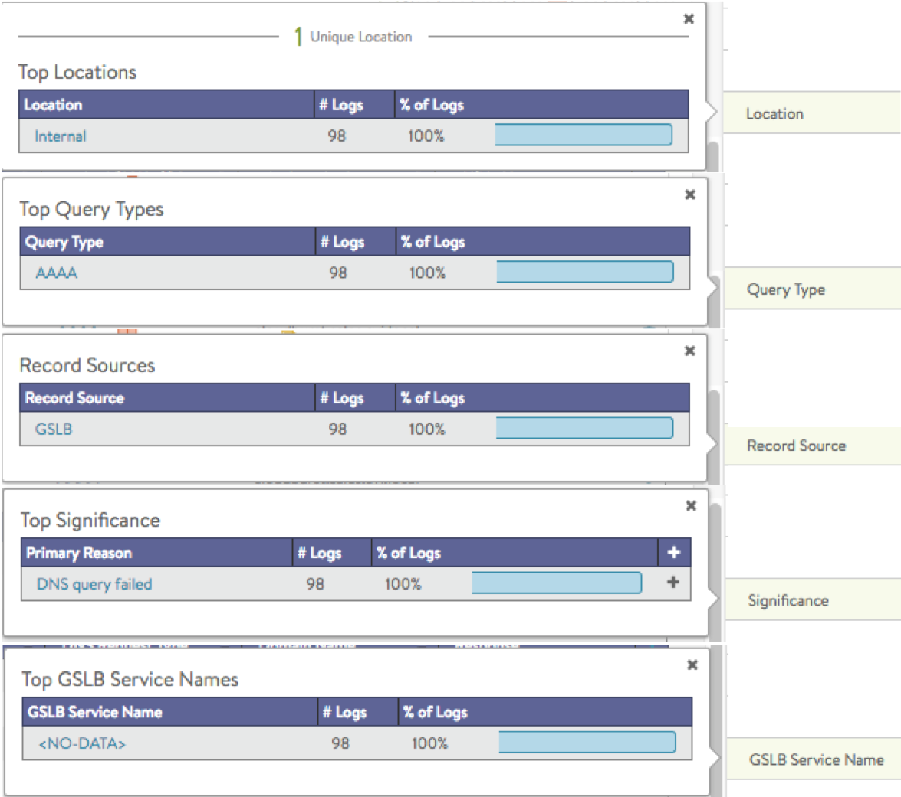</a><a href="img/Screen-Shot-2016-12-31-at-9.14.13-PM.png">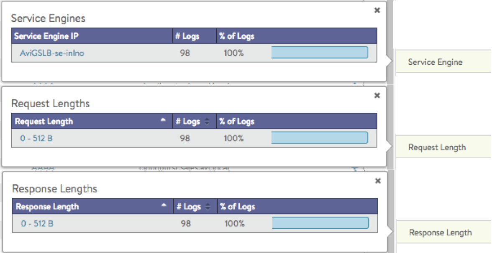</a>

 

The DNS Records tab is unique to this kind of virtual service.

<a href="img/Screen-Shot-2016-12-31-at-9.40.34-PM.png">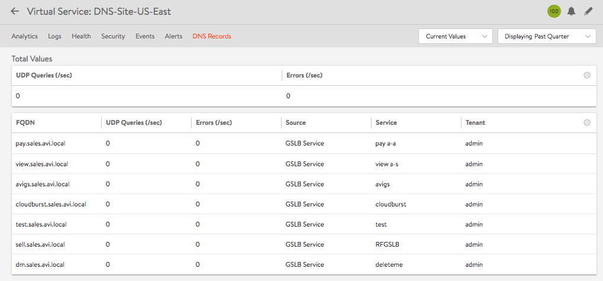</a>

### DNS Health Monitoring

DNS health monitors can be configured to monitor the health of DNS servers that are configured as DNS service pool members.

Refer to the <a href="/dns-health-monitor/">DNS Health Monitor</a> article for more details. 

### Additional Features

* Domain filtering drops requests for any domains that are not explicitly configured on the DNS service (the default setting is to allow all domains).
* The time-to-live (TTL) can be customized (default is 30 seconds).
* Network security policy can be based on client IP and port.
* With a full TCP proxy, client spoofing is prevented for TCP DNS queries. SYN flood attacks are mitigated.
* One can opt to respond to failed DNS requests by returning a DNS error code or droppingt the packets. 

### Typical Avi DNS Deployment Scenarios

### 1. Avi DNS Service as Authoritative Name Server for a Subdomain (Zone)

In this scenario, the corporate name server delegates one or more subdomains (avi.acme.com and gslb.acme.com in the below-pictured case) to the Avi DNS service, which in turn acts as an authoritative DNS server for them. Typically, the corporate name server will have an NS record pointing to the Avi DNS service (10.100.10.50). Client queries for these subdomains are sent directly to Avi Vantage, whereas all DNS requests outside of acme.com are instead sent to the external ".com" name server.

<a href="img/Screen-Shot-2016-11-09-at-4.15.08-PM.png">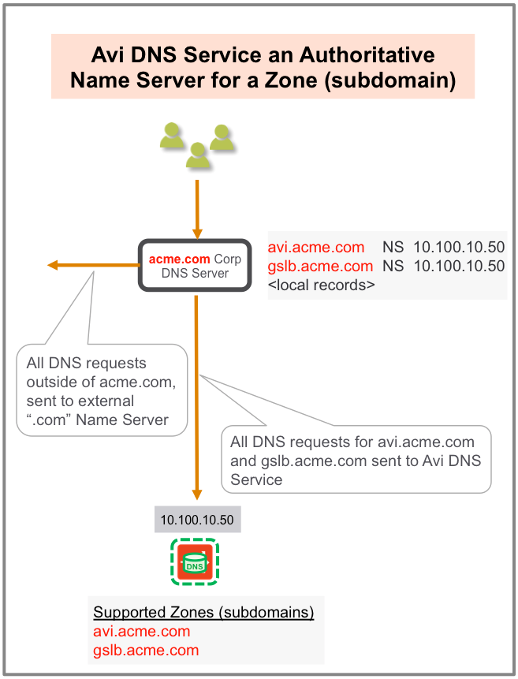</a>

 

### 2. Avi DNS Service as Primary Name Server for a Domain, with Pass-through to Corporate Name Server

In this scenario, Avi DNS is the first in line; it responds to any zones it's been configured to support. DNS queries that don't match Avi DNS records pass through (proxy) to corporate DNS servers via a virtual service pool created for that purpose. If members of that pool receive DNS requests outside the corporate domain (acme.com in this case), they send them to their external ".com" name server.

<a href="img/Screen-Shot-2016-11-09-at-4.17.20-PM.png">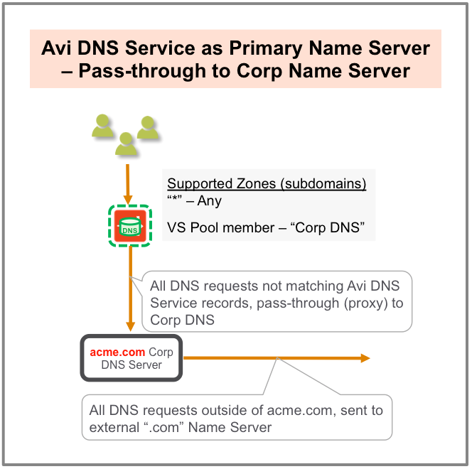</a>

### 3. Avi DNS Load Balancing

In this very basic, traditional scenario, the corporate DNS servers are pooled together and exposed by an Avi SE group as a single, scaled DNS service. Like any other VS, analytics and logs are available.

<a href="img/Screen-Shot-2016-11-09-at-4.22.20-PM.png">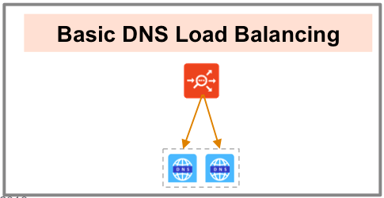</a>

 

### Configuration

DNS virtual service configuration is available in Administration -> Settings -> DNS Service.

<a href="img/Screen-Shot-2016-12-31-at-3.41.52-PM.png">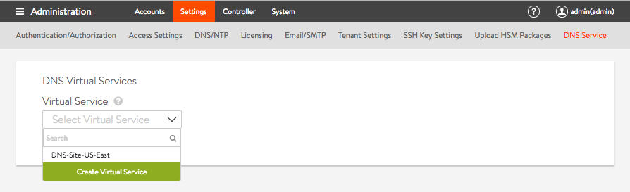</a>

For more information on configuration steps for DNS virtual services, please refer to<a href="/avi-gslb-site-configuration-and-operations#configure-local-dns-vs"> configure local DNS virtual service on all active sites that host DNS</a>.

 
