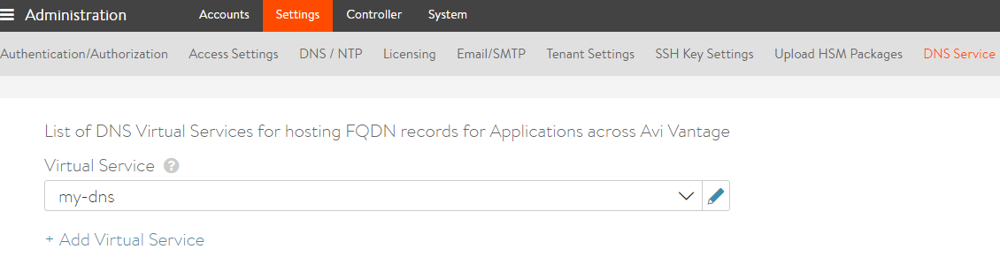
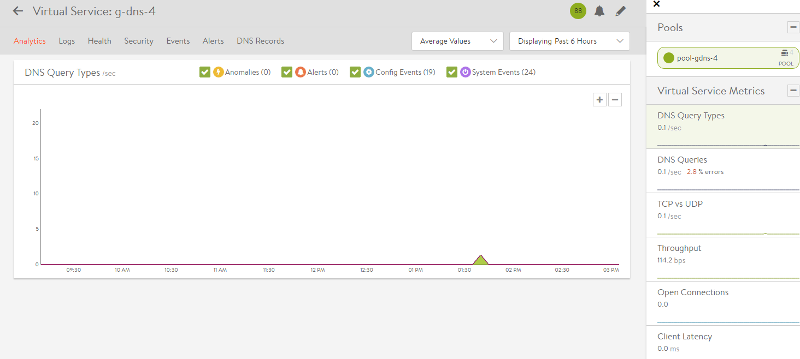
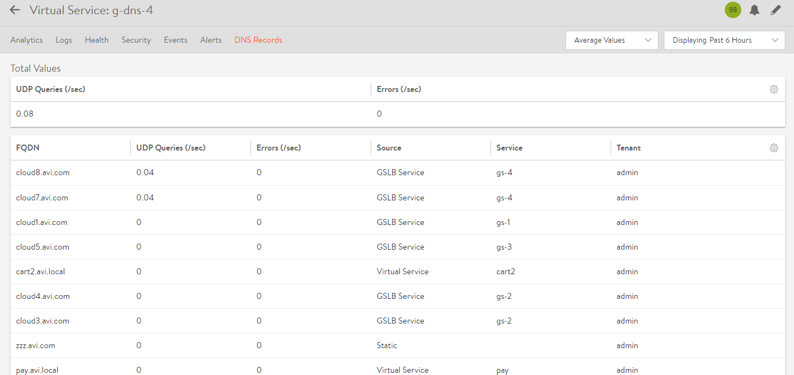

The Avi DNS virtual service is a generic DNS infrastructure that can be used to implement the following functionalities:

* <a href="#VisibilityAndAnalytics">Visibility and Analytics</a>
* <a href="#VirtualServiceDNS">Virtual service DNS hosting (domain name to IP/IPAM)</a>
* <a href="#Hosting_static_DNS">Hosting static/manual DNS entries</a>
* <a href="#Hosting_GSLB">Hosting GSLB service DNS entries</a> 

## Architecture

A DNS virtual service is a virtual service that has an application profile type of DNS, and a network profile using per-packet load balancing. Referring to the diagram below , DNS service — shown in **green**— is hosted on the leftmost SE. Such SE-local service processing is exceptional; normally, an SE simply forwards requests to back-end application servers for processing, for example, as depicted on the two back-end DNS servers (shown in **blue**). Avi's implementation supports hosting DNS both on the SE, on the back-end pool servers, or both simultaneously.

Note: In release 16.3, if DNS is run/placed on an SE, no other virtual service placements on that SE are permitted.

For performance and high availability, the DNS virtual service can be placed/hosted on more than one Service Engine; all <a href="/overview-of-vantage-high-availability/">data plane high availability modes</a> — elastic HS (active/active and M+N) and legacy HA — are supported. [Not shown in diagram]

In addition, another level of high availability is possible for DNS virtual services. DNS entries can be hosted on more than one DNS virtual service, thus providing network-level redundancy as well. This is a useful option for a multi-cloud scenario, and when there are sufficient IP addresses to front-end the DNS service. [Not shown in diagram]

<a href="img/DNS_VS.png">  </a>The DNS virtual service can act as an authoritative DNS server for one or more subdomains (zones).

### DNS Hosting on Avi Controller

Prior to the 16.3 release, Avi supported the addition of virtual service domain entries and service discovery entries on a DNS server hosted on the Avi Controller. For existing users, this feature continues to be supported in 16.3, but will be deprecated in some future release.

As mentioned, in 16.3, the virtual service domain entries and service discovery entries can be hosted on a DNS virtual service on an SE as well. This is the recommended mode of configuration. Once the DNS virtual service is chosen, existing entries on the Controller are migrated to the SE.

This configuration is available in the Administration section:

For more information on configuration steps for DNS virtual services, please refer to<a href="/avi-gslb-site-configuration-and-operations/"> configure local DNS virtual service on all active sites that host DNS</a>.

## Features

### Visibility and Analytics

The Analytics tab of the DNS virtual service page shows the metrics for DNS queries, and a breakdown by query-types, error-types, TCP vs UDP, pass-through, etc. 

The Analytics tab is accessible by navigating to the Applications section-> Virtual Services-> Select specific virtual service.

 

 

The Logs tab provides detailed information about DNS queries from clients, including FQDN, query-type, significant errors, responses (IP-addresses, CNAME, SRV, etc.). Log analysis based on these fields is also available.

 

 

### Note:

Prior to 16.3, Avi Vantage supported only this mode. A DNS virtual service can load-balance DNS queries (UDP or TCP) to a pool of back-end servers.

This feature continues to be supported without any configuration changes. Rich analytics are automatically added for the DNS virtual service.

Limitations for 16.3:

* Detailed analytics is not available for TCP DNS queries. TCP queries are displayed as ‘Other’ queries, and the client logs contain only connection-level information, and no DNS header information. 

### Virtual Service IP Address DNS Hosting

Avi DNS can host the names and IP addresses of the virtual services configured in Avi Vantage. 

Details of configuring this can be found in <a href="/vip-allocation-using-ipam-or-dns/">IPAM and DNS Support</a>.

Mesos port-based SRV records can also be hosted on the DNS service. For more information, please refer to <a href="/service-discovery-for-mesos/">DNS-based Service Discovery for Mesos</a>.

### Hosting Manual or Static DNS Entries

The DNS service can host manual static DNS entries (A, SRV or CNAME records). For a given FQDN, the user can configure an A, SRV or CNAME record to be returned. Please note that this feature is in beta, and the configuration model may change in upcoming releases.

### Hosting GSLB Service DNS Entries

The DNS virtual service can host GSLB service DNS entries, and automatically update the responses based on the health, load and proximity of the services. Details of the GSLB service are available in <a href="/avi-gslb-architecture/">Avi GSLB Architecture</a>.

### DNS Health Monitoring

DNS health monitors can be configured to monitor the health of DNS servers that are configured as DNS service pool members.

Please see <a href="/dns-health-monitor/">DNS Health Monitor KB</a>for more details. 

### Additional Features

Features of the Avi DNS service:

* Domain filtering drops requests for any domains that are not explicitly configured on the DNS service (the default setting is to allow all domains).
* The TTL can be customized (default is 30 seconds).
* Network security policy can be based on client IP and port.
* With a full TCP proxy, client spoofing is prevented for TCP DNS queries. SYN flood attacks are mitigated.
* One can opt to respond to failed DNS requests using a DNS error code, or to drop the packets. 

### A Note on Log Settings

* Non-significant logs should be enabled with caution, since a large number of DNS queries typically hit a DNS service, and this would result in too many logs entries.
* Categorization of non-significant logs is also very important. If certain errors are typical in the deployment, these errors should be excluded from significant logs.
* Refer to the exclude DNS errors discussion found <a href="/docs/architectural-overview/templates/profiles/analytics-profile/#exclude-dns-errors">here</a>. 

## Avi DNS Deployment Use Scenarios

### Avi DNS Service as Authoritative Name Server for a Subdomain (Zone)

The corporate name server delegates one or more subdomains to the Avi DNS service, which in turn acts as an authoritative DNS server for them. Typically, the corporate name server will have an NS record pointing to Avi DNS service. Client queries for this subdomain are sent directly to Avi Vantage.

 

### Avi DNS Service as Primary Name Server for a Domain, with Pass-through to Corporate Name Server

### Avi DNS Load Balancing

 
