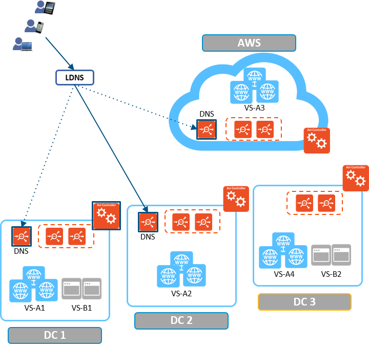
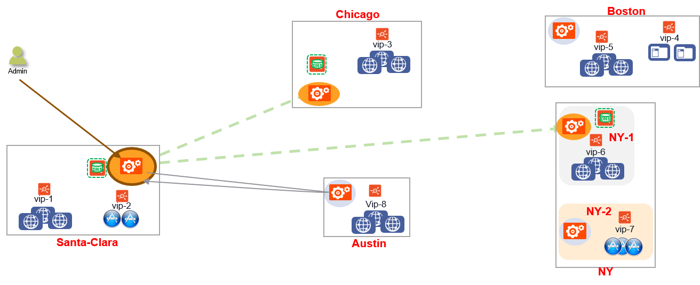

Avi GSLB provides simplified and centralized configuration and monitoring of global applications. In a typical environment, the corporate name server delegates one or more subdomains to Avi GSLB, which then owns these domains, and provides responses to DNS queries from clients. Avi GSLB provides an **a****ctive/backup** model for backup or disaster recovery applications, and an **a****ctive/active** model to respond with the most optimal site, based on load, proximity, etc. This article overviews the architecture, functionality, and terminology for Avi GSLB.

### Features supported in Avi Vantage 16.3

* DNS-based load balancing
* Active/DR GSLB
* Active/active GSLB with consistent hash
* Hybrid cloud support
* Centralized provisioning and visibility
* Control-plane and data-plane health monitoring
* Multitenancy support
* Support for 3rd party load balancers 

### Features planned for future release

* Active/active GSLB, based on load, geo-location and site cookie persistence
* Centralized application logs 

### Related articles:

* <a href="/avi-dns-architecture/">Avi DNS Architecture</a>
* <a href="/avi-gslb-service-and-health-monitors/">Avi GSLB Service and Health Monitors</a>
* <a href="/avi-gslb-site-configuration-and-operations/">Avi GSLB Site Configuration and Operations</a> 

## Architecture and Terminology

### Global Applications

**A global application** (represented as a **<a href="#gslbservice">GSLB service</a>** in Avi Vantage) is an application which cannot or should not be wholly contained by one Avi Vantage deployment, three of the most common reasons being

* There exists a geographically dispersed community of users (clients),
* Resilience to loss of a data center is required, and
* The occasional migration to or addition of another data center. 

**Global server loading balancing (GSLB)** is the act of balancing a global application's load across individual Avi Vantage (and possibly third-party ADC) deployments. In this document, we refer to these deployments as **<a href="#gslbsites">GSLB sites</a>**. 

### Functionality

A global application requires a solution capable of performing these functions:
<ol> 
 <li>Definition and ongoing synchronization/maintenance of the GSLB configuration,</li> 
 <li>Monitoring the health of configuration components,</li> 
 <li>DNS-based steering of inbound application requests to the best source for responses, and</li> 
 <li>The actual processing of those responses.</li> 
</ol> 

In Avi's design, an individual GSLB site need not perform all four functions. For example, a virtual service defined by Controller_cluster_A (site_A) might respond to requests steered to it by DNS functionality overseen by Controller_cluster_B (site_B).

To better understand the steps one takes and the objects one touches to implement the Avi GSLB solution, it is important to keep in mind these distinct GSLB functions.

### GSLB Site Types

GSLB sites fall into two broad categories:

* An **Avi site** runs an Avi Vantage Controller cluster and SEs.
* An** external site **runs third-party ADCs from vendors such as F5, Citrix, etc. 

With the four functions in mind, we can further categorize an Avi [GSLB] site as either an **active** or a **passive GSLB site**.

* **Active**** sites** perform some combination of the above-listed functions #1-#3, typically all three.
* **Passive**** sites** only perform task #4, i.e., the hosting of virtual services that respond to requests from the clients of global apps.
* A passive site is never asked to furnish steering information (function #3), so none is ever pushed to it.
* A passive site's health is determined by a health monitor running on an active site. It is unaware of and has no means to determine the health of other sites.
* An active site may host virtual services that back-end global apps. To that extent, it is additionally serving in a *passive* role; we do not say it is more "active." 

### Leader and follower *active* sites

* Exactly one active site is statically designated as the **GSLB** **leader**. It is the one on which the initial GSLB site configuration is performed.
* The other active sites are **GSLB followers.** What GSLB configuration data they need is propagated to them from the leader.
* The only way to switch leadership is through an override configuration from a follower site. This override can be invoked in the case of site failures or maintenance.
* Centralized analytics are rolled up by and available from the GSLB leader. Localized metrics and logs are available for the DNS virtual services hosting the GSLB records. 

### Avi sites versus external sites

* Avi sites can perform any combination of the four functions. Each Avi site is characterized/identified by an Avi Controller cluster.
* External sites can only perform function #4. The opacity of an external site prevents it from participating in a **GSLB site configuration**, which only contains information about* Avi Controller cluster*s, such as their address and credentials. 

Note: Not every virtual service homed to a particular Avi or external site need participate in the Avi GSLB solution. Put another way, not every application is a global application.

### Defining a GSLB Service

A**GSLB service** is the representation of a global application. The corresponding <a href="/docs/latest/api-guide/gslbservice.html">GslbService object</a> identifies

* the application service's **name**,
* the **FQDN** of the application, 
* one or more **GSLB pools** comprising virtual service **members** running the application in the GSLB sites,
* the **priority/weights** of the GSLB pools,
* the **weights** of the virtual service members *within* those pools, and
* the **monitoring methods** to be used to make sure members are alive. 

The above merits further explanation.

A**GSLB (pool) member** is typically a virtual service (as opposed to a service running on a solitary back-end server without an ADC front-ending it). Like other virtual services, a GSLB member is represented by an IP address:port or name. 

A******GSLB pool** is a collection of GSLB pool members sharing the same priority, but potentially different weights. 

Note: A GSLB pool is much different than an Avi server pool. The former aggregates *virtual services*, the latter aggregates *servers*. That said, there is a hierarchical relationship between the two types of pools.

The<a style="font-weight: bold;" href="/docs/latest/api-guide/gslbhealthmonitor.html"> GslbHealthMonitor</a> object is the GSLB counterpart of the [virtual service] HealthMonitor object. It provides configuration for monitoring the health of GSLB pool members.

An**active/backup configuration** is used for backup/disaster recovery. One GSLB pool could be configured as the active pool and another GSLB pool as standby. If/when all virtual services in the active pool go down, the GSLB DNS instead directs global-app traffic to the (former) standby pool. 

There exist a variety of **active/active configurations**. All are used to put more resources to work as well as increase application availability.

* A**load-unaware active/active configuration **incorporates** **multiple virtual services across sites to be equally responsible for handling the application. Two options are offered — (weighted) round robin and consistent hash. In the 16.3 release, consistent hash is the one option that can provide persistence. Load/proximity support will be added in subsequent releases.
* A** load-aware active/active configuration** steers clients to the most optimal site based on the observed load of the members. This option is slated for a future release.
* A** geo-location-aware active/active configuration**** steers** clients to the closest site. Member selection is based on the proximity of the client to the members. This option is slated for a future release. 

 

 

 

In the above example, Santa Clara, Chicago, Austin and NY are Active sites while Boston is a passive site. Among the active sites, Santa Clara performs the function of GSLB leader, redirecting DNS queries to the appropriate followers (Chicago, Austin and NY).

## GSLB Services

A GSLB service is the representation of a global application, that front-ends applications across multiple sites. This configuration object hosts the FQDN of the application, the backing virtual services in various sites, and the priority/ratios for the various members. This object also hosts the monitoring methods to make sure that the group members are alive.

For more information, please refer to <a href="/avi-gslb-service-and-health-monitors/">Avi GSLB Service and Health Monitors</a>.

## Health Checks

Three options for GSLB member Health Checks:

* Control-Plane Health - Check performed when a site is running headless, i.e., the Controller is DOWN but the virtual service is working
* Data-Plane Health -DNS virtual service performs GSLB Health Monitors to member virtual services 
* Both Control and Data Plane Health - In order for a GS member to be marked as UP, both Control and Data health should report UP. If Control Health check is failing (due to controller being down) and Data Health works, GS Member is  marked as UP. 

For more information, please refer to <a href="/avi-gslb-service-and-health-monitors/">Avi GSLB Service and Health Monitors</a>.

## Overall Flow

A GSLB service is the representation of a global application, that front-ends applications across multiple sites. This configuration object hosts the FQDN of the application, the backing virtual services in various sites, and the priority/ratios for the various members. This object also hosts the monitoring methods to make sure that the group members are alive.As a result, GSLB service provides DNS-based load-balancing and geo-location based routing.

## Site Failure Handling

In case of Site failure, one of the following case occurs:

* GSLB Leader site fails
* Follower site fails 

In both cases, DNS services marks all GS members of the failed site as DOWN. In the above example, NY site has crashed while Santa Clara (GSLB Leader) and Chicago sites are still functioning.

In case of GSLB follower site failure, the GSLB configuration is synchronized with currently UP site. In case only the Follower Controller fails, then the site’s DNS server will not receive GSLB configuration updates.

In case of GSLB leader site failure, no modification can be made to GSLB configuration.

### Site Failure recovery

All active sites detect successful connection to a follower through the control plane healthmonitor updates. In case of contol plane healthmonitors, Active sites query all the other sites to fetch health and load information of all virtual services which are behind GSLB services.

DNS services then updates the GS member status of the recovered sites as UP or DOWN based on the GS health monitors.

* Follower Site Recovery 

GSLB leader detects successful connectivity to follower and updates it with the updated GSLB configuration.

* Leader Site Recovery 

Only an admin can resume updates to the GSLB configuration.

To know more about changing the GSLB Leader and site recovery, please refer to <a href="/avi-gslb-site-configuration-and-operations/">Avi GSLB Site Configuration and Operations</a>.

## Tenancy and GSLB

 

The following configurations are done by the Avi ‘admin user:

* GSLB site configuration 

The following configurations can be done by the Avi ‘admin’ user or a tenant administrator:

* DNS Virtual Service 

Each tenant user can create the GSLB service and health monitors:

* DNS records would be registered on the System DNS virtual service configured in the previous step.
* Tenant admin can get visibility of only the GSLB services they own
* Tenant should have read access to the GSLB object. 

 

 
