## GSLB Service

A GSLB service is the representation of a global application; it front-ends instantiations of the application that are deployed at multiple sites. This (<a href="/docs/latest/api-guide/gslbservice.html">GslbService</a>) configuration object defines the FQDN of the application, the backing virtual services in various sites, and the priority/ratios for the various members. This object also defines the monitoring methods by which unhealthy components can be identified so that alternatives may be selected.

A more complete list of configuration options for a GSLB service follows:

* **FQDN** 

This is the FQDN by which users reference the GSLB application. A list of domain names can be provided for aliasing (e.g.,: www.foo.comand foo.com).

* **List of GSLB pools**  
    * Each <a href="/docs/latest/api-guide/gslbservice.html#GslbPool">GslbPool</a> object comprises a list of virtual services that implement the application functionality
    * Load balancing algorithm: (weighted) round robin and consistent hash are two options available in the first release of the Avi GSLB  
        * Consistent hash is based on the client IP address (typically the LDNS IP address). A mask can be applied on the client IP address, if there are multiple LDNSes in a given network, in one site.
    * Priority: A larger number of priority represents a member that should be selected in preference to a member with lower priority.
    * List of members  
        * Each pool can have multiple members, and a different ratio/weight can be provided for each member.
        * The members can be specified by Avi virtual service or an IP address. The latter option is used to specify standalone servers or third-party load balancer VIPs. 
        * The member may also be specified using a DNS name — this is used to specify a DNS-based load balancer such as AWS ELB. In this case, health checks are performed against one of the IP addresses for the ELB FQDN, and a CNAME for the ELB FQDN is provided in the DNS response if this member is selected.
        * Enable/Disable flag — this can be used to mark a server disabled for maintenance. 
* **TTL** 

If no TTL is specified in the GSLB service, it defaults to the TTL specified in the DNS application profile. The default value is 30 seconds. The range is from 1-86400 seconds.

Please use very low values of TTL with caution — some LDNSes/operating systems discard a very low value of TTL.

* **Number of IP addresses** provided in the response. The default is 1. A special value of 0 can be used to respond with all IP addresses for the chosen pool.
* **Down response:** action to be taken when a DNS query is received for a GSLB service that is currently down  
    * Default option is to drop the request. 
    * Respond with a fallback IP address, which is typically a server that’s serving a sorry page.
    * Respond with all IP addresses of the chosen pool
    * Empty DNS response (this may be used to make the client retry in certain cases)
* **List of datapath health monitors**
* **Flag** to indicate if the Controller health state should be used 

## GSLB Health Checks

GSLB health checks can be performed in two ways:

<a href="img/GSLB-Member-Healthchecks.png">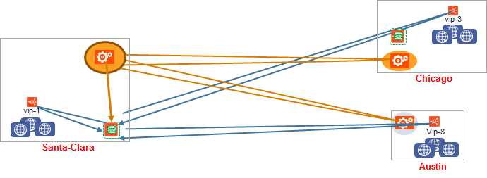</a>

### Based on Control-Plane Health Status Synchronization

Each Avi Controller performs its own health checks to retrieve its own health score and performance metrics. Active sites periodically query all the other sites (every active and passive GSLB Controller ) to fetch health and load information of all virtual services which are behind GSLB services. 

This health check updates the local DNS virtual service with the health status which is not shared with other Controllers.

Please note that the above does not apply to third-party load balancer VIPs or standalone servers (i.e., GSLB service members that are not implemented as Avi virtual services).

<a href="img/Control-plane-healthcheck.png">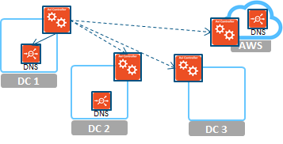</a>

### Based on Data-Plane Health Monitoring

Service Engines hosting DNS virtual services (GSLB-enabled) can perform periodic health checks against the GSLB service members. The object used for this is called the <a style="font-weight: bold;" href="/docs/latest/api-guide/gslbhealthmonitor.html">GslbHealthMonitor</a>. Ping, tcp, udp, http(s) HealthMonitors are supported. Please note that the monitor-port is mandatory for non-ping GslbHealthMonitors.

Please see <a href="/overview-of-health-monitors/">Health Monitoring KB</a> for more information.

<a href="img/Data-plane-healthcheck.png">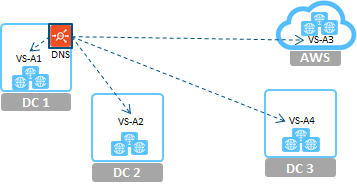</a>

 

### Three Options for GSLB Member Health Checks:

* **Control-plane health**: Query the Controller for the health of the member, rather than do active health monitors for each member. This option is available only for members that are Avi virtual services.
* **Data-plane health**: DNS virtual service performs GSLB Health Monitors to GSLB member virtual services.
* **Both control- and data-plane health:** For a GS member to be marked as UP, both control and data health should report UP. If the control health check is failing (due to the Controller being down) but data health works, GS member is  marked as UP. 

To know more about how the GS members are tagged depending upon the GS health monitors, please refer to<a href="/avi-gslb-site-configuration-and-operations/"> Avi GSLB Site Configuration and Operations</a>.

## Sample Topology

<a href="img/Sample-topology.png">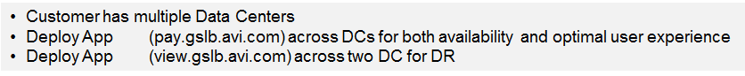</a>

 

<a href="img/Sample-topology-example.png">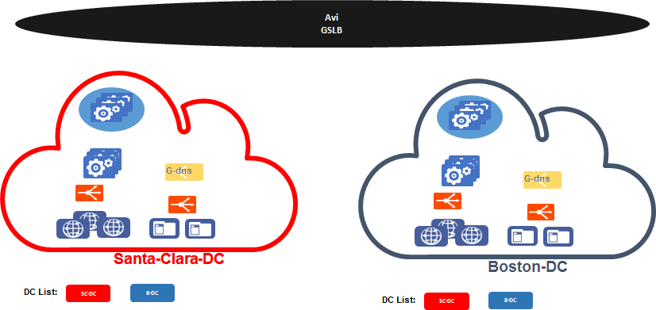</a>

 

**1. Configure health monitor for GSLB services**

Only on the leader (Santa Clara / 10.10.25.10):

<a href="img/Configure-health-monitor-for-GSLB-Services-1.png">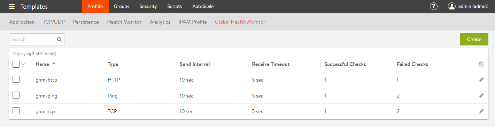</a>

 

<a href="img/Configure-health-monitor-for-GSLB-Services-2.png">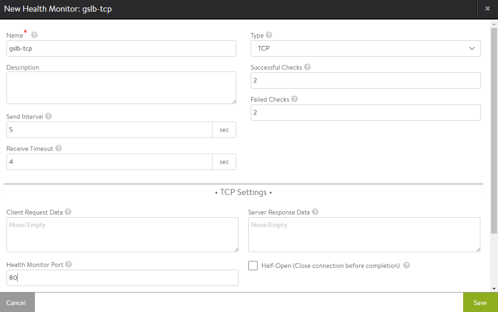</a>

 

****2. Configure GSLB services (only on the leader)****

* **Active/Standby** <ol> 
 <li>Go to Applications -&gt; GSLB Service<a href="img/Configure-GSLB-Services-only-on-Leader-ActiveStandby.png">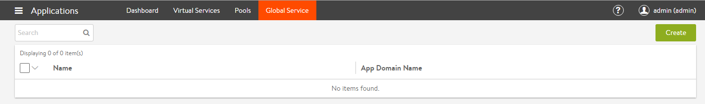</a></li> 
 <li>New GSLB Service<a href="img/New-Global-Service.png">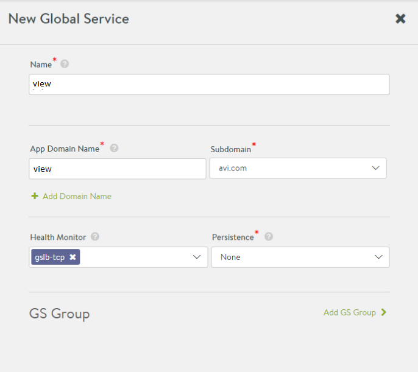</a></li> 
 <li>Add GS Groups: Active<a href="img/New-GS-groups.png">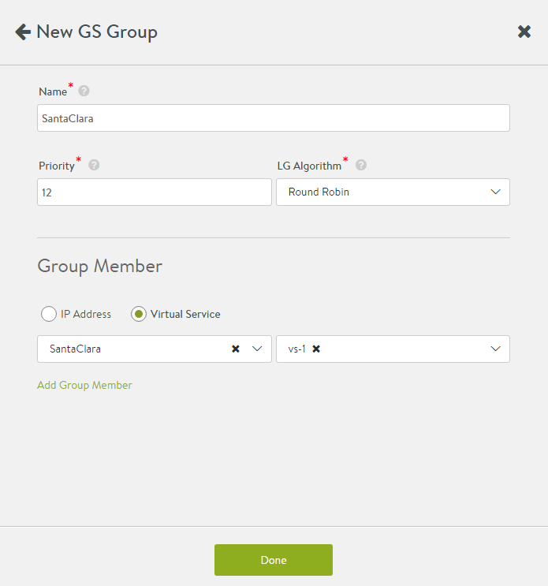</a>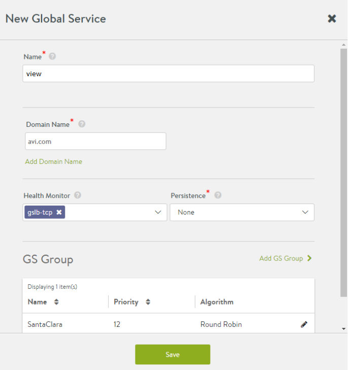</li> 
 <li>Add GS Groups: Standby<a href="img/GSLB-Leader-Standby-step-4.png">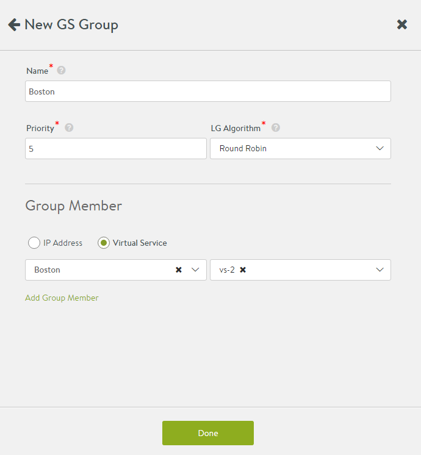</a></li> 
</ol>  

 

* **Active/Active** <ol> 
 <li>Go to Applications -&gt; GSLB Service</li> 
 <li>New GSLB Service<a href="img/GSLB-active_active-new-GSLB-service.png">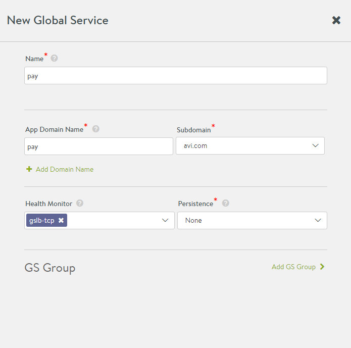</a></li> 
 <li> Add GS Group:: Active<a href="img/GSLB-active_active-new-GSLB-service-step-2.png">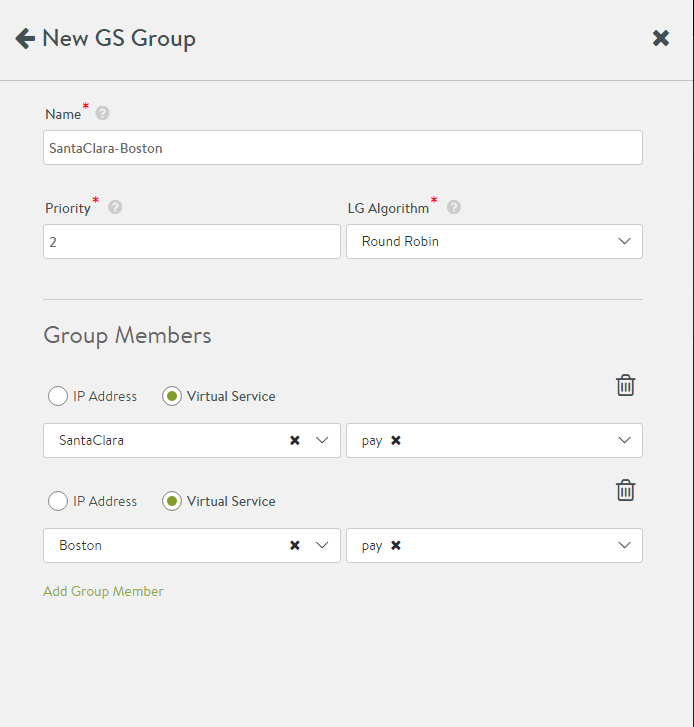</a></li> 
</ol>  

 

## CLI Configuration

 

**1. Configure health monitor for GSLB services**

Only on the owner (Santa Clara / 10.10.25.10):

<pre><code class="language-lua">: &gt; configure gslbhealthmonitor global-http-hm
: gslbhealthmonitor&gt; type health_monitor_http
: gslbhealthmonitor&gt; monitor_port 80
: gslbhealthmonitor&gt; save</code></pre>  

 

**2. Configure routes to make sure that DNS Service has reachability to local virtual services**

The DNS Service Engine monitors the health of the GSLB Service members. Add static routes (or default gateway) to make sure that the members are reachable. (See KB article for more details).

For example, on 10.10.25.10 (Santa Clara):

<pre><code class="language-lua">: &gt; configure vrfcontext global
Updating an existing object. Currently, the object is:
+----------------+-------------------------------------------------+
| Field          | Value                                           |
+----------------+-------------------------------------------------+
| uuid           | vrfcontext-fde3b826-b19c-449c-8dec-ddeb119f2498 |
| name           | global                                          |
| system_default | True                                            |
| tenant_ref     | admin                                           |
| cloud_ref      | Default-Cloud                                   |
+----------------+-------------------------------------------------+
: vrfcontext&gt; static_routes

: vrfcontext:static_routes&gt; prefix 10.0.0.0/8 next_hop 10.90.12.1
: vrfcontext:static_routes&gt; save
: vrfcontext&gt; save

+------------------+-------------------------------------------------+
| Field            | Value                                           |
+------------------+-------------------------------------------------+
| uuid             | vrfcontext-fde3b826-b19c-449c-8dec-ddeb119f2498 |
| name             | global                                          |
| static_routes[1] |                                                 |
|   prefix         | 10.0.0.0/8                                      |
|   next_hop       | 10.90.12.1                                      |
|   route_id       | 1                                               |
| system_default   | True                                            |
| tenant_ref       | admin                                           |
| cloud_ref        | Default-Cloud                                   |
+------------------+-------------------------------------------------+
: &gt;</code></pre>  

 

On 10.160.0.20 (Boston):

 

**3. Configure GSLB Services**

<pre><code class="language-lua">: &gt; configure gslbservice view
: gslbservice&gt; domain_names view.avi.com
: gslbservice&gt; health_monitor_refs global-http-hm
: gslbservice&gt; num_dns_ip 1
: gslbservice&gt; groups
New object being created

: gslbservice:groups&gt; algorithm gslb_algorithm_round_robin
: gslbservice:groups&gt; name active-sc
: gslbservice:groups&gt; priority 10
: gslbservice:groups&gt; members
New object being created
: gslbservice:groups:members&gt; ip 10.90.12.100
: gslbservice:groups:members&gt; save
: gslbservice:groups&gt; save
: gslbservice&gt; groups

: gslbservice:groups:members&gt; ip 10.160.110.200
: gslbservice:groups:members&gt; save
: gslbservice:groups&gt; save
: gslbservice&gt; save

+----------------------------------+----------------------------------------------------+
| Field                            | Value                                              |
+----------------------------------+----------------------------------------------------+
| uuid                             | gslbservice-3f359566-f534-47d9-a735-10105fa53bfb |
| name                             | view                                               |
| domain_names[1]                  | view.avi.com                                       |
| groups[1]                        |                                                    |
|   name                           | active-sc                                          |
|   priority                       | 10                                                 |
|   algorithm                      | GSLB_ALGORITHM_ROUND_ROBIN                         |
|   members[1]                     |                                                    |
|     ip                           | 10.90.12.100                                       |
|     ratio                        | 1                                                  |
|     enabled                      | True                                               |
| groups[2]                        |                                                    |
|   name                           | standby-boston                                     |
|   priority                       | 7                                                  |
|   algorithm                      | GSLB_ALGORITHM_ROUND_ROBIN                         |
|   members[1]                     |                                                    |
|     ip                           | 10.160.110.200                                     |
|     ratio                        | 1                                                  |
|     enabled                      | True                                               |
| num_dns_ip                       | 1 count                                            |
| health_monitor_refs[1]           | global-http-hm                                     |
| site_persistence_type            | SITE_PERSISTENCE_NONE                              |
| site_persistence_profile_timeout | 5 mins                                             |
| tenant_ref                       | admin                                              |
+----------------------------------+----------------------------------------------------+</code></pre>  

 

**4. Configure pass-through server**

In case there’s an FQDN miss on a DNS virtual service, Avi can pass this request through (load-balancer) to one or more backup DNS servers. To enable this, configure a pool containing these servers, and attach this to the DNS virtual service.

If a domain filter is configured in the application filter of the VS, then the pass-through is performed only for FQDNs that fall within this subdomain. All other queries are dropped.

Unsupported queries are also forwarded to the pass-through server.

**5. Configure corporate/external DNS server to delegate sub-domain to the Avi DNS Service.**

Delegate avi.com to the Avi GSLB

To try this out in the lab, dnsmasq was installed on the clients, and the following entries added:

On client 1:

server=/avi.com/10.10.25.10

server=/avi.com/10.160.110.100

dig pay.avi.com ..

On client 2:

server=/avi.com/10.160.110.100

server=/avi.com/10.10.25.10

 

**6. Troubleshooting**

<pre><code class="language-lua">: &gt; show virtualservice colo-dns dnstable
Sub Domains Serviced:
avi.com
+----------------+-----+---------+-------------------------------------------------------------+---------+--------+
| FQDN           | TTL | Num-IPS | IP Addresses                                                | Service | Tenant |
+----------------+-----+---------+-------------------------------------------------------------+---------+--------+
| cloud7.avi.com | 60  | 1       | de:10.40.10.10, de:10.40.10.1, be:10.40.10.3, uk:10.40.10.2 | gs-4    | admin  |
| cloud8.avi.com | 60  | 1       | de:10.40.10.10, de:10.40.10.1, be:10.40.10.3, uk:10.40.10.2 | gs-4    | admin  |
...

: &gt; show virtualservice colo-dns gslbserviceruntime filter gs_uuid gslbservice-c3a4785b-a722-476b-906a-6869ed7e2cae

: &gt; show virtualservice colo-dns gslbserviceinternal filter gs_uuid gslbservice-c3a4785b-a722-476b-906a-6869ed7e2cae

: &gt; show virtualservice colo-dns gslbservicehmonstat filter gs_uuid gslbservice-c3a4785b-a722-476b-906a-6869ed7e2cae</code></pre>  

 

Connection logs provide information about the FQDN and the response IP addresses provided in the DNS query response.
