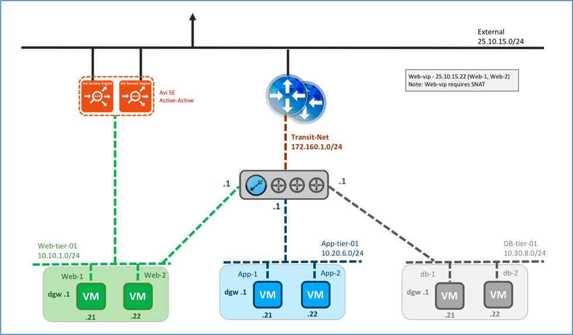
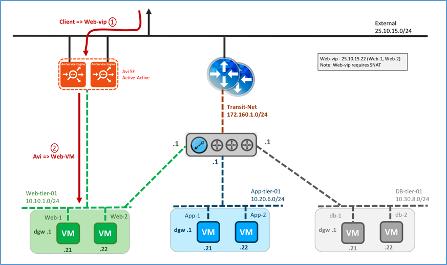
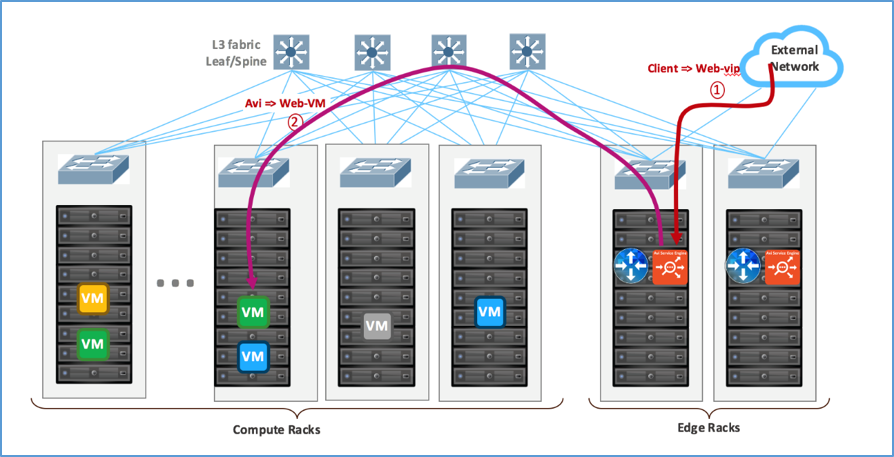
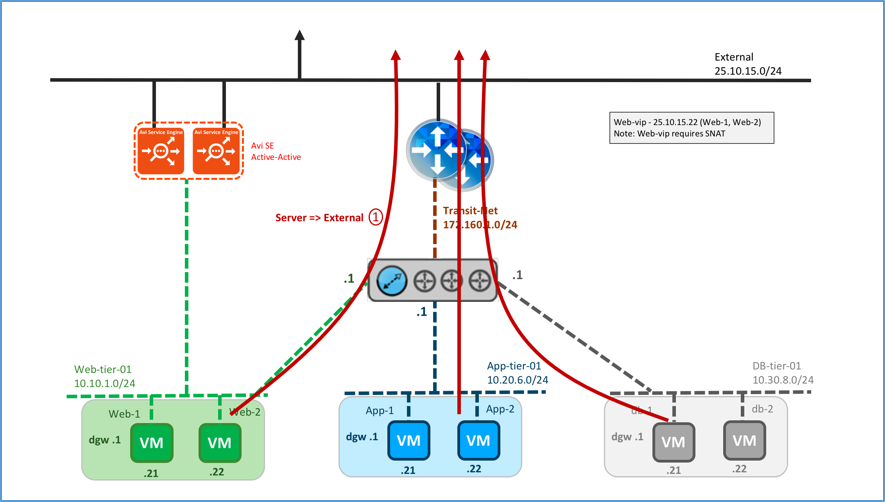

In this topology the Avi Service Engine (SE) is installed parallel to the NSX Edge. Physically, the Avi SE is deployed on any of the ESXi hosts on the edge rack. This topology is popular on layer 3 physical fabrics, such as spine-leaf, but also works on layer 2 physical fabrics.

### Logical and Physical View

Logically, the Avi SE is installed parallel to the NSX Edge. Multiple SEs in the SE group may be deployed in elastic HA (active/active or N+M buffer) or legacy HA (active/standby) mode. The SE(s) connect(s) to the external network (non-encapsulated) for front-end and Web-tier-01 VXLAN (encapsulated) for the back-end. Traffic is SNATed by the SE. The default gateway for different servers (web, application and database) is the distributed logical router (DLR).

<figure class="thumbnail wp-caption alignnone">   
<figcapture> Logical View, Parallel to NSX Edge Using Avi Vantage for North-South LB 
</figcapture>
</figure> 

 

Following the recommended design (refer to <a href="https://communities.vmware.com/docs/DOC-27683">VMware® NSX for vSphere Network Virtualization Design Guide ver 3.0</a>), the recommendation is to configure the SE group properties to physically deploy the SEs in the edge racks where the external network is available.

<figure class="thumbnail wp-caption alignnone">   
<figcapture> Physical View, Parallel to NSX Edge Using Avi Vantage for North-South LB 
</figcapture>
</figure> 

 

### Traffic Flows

### North-South Traffic Flow

Logical traffic flows are:

* Client → web VIP on Avi SE
* Avi SE → web server 

 

<figure class="thumbnail wp-caption alignnone">   
<figcapture> Logical View, North-South Traffic Flow 
</figcapture>
</figure> 

 

Physical traffic flows are:

* Client on External network → ESXi hosting the SE → SE VM
* SE VM → VXLAN on ESXi kernel hosting the SE → ESXi kernel hosting the web server VM
* ESXi kernel hosting the web server VM → web server VM 

 

<figure class="thumbnail wp-caption alignnone">   
<figcapture> Physical View, North-South Traffic Flow 
</figcapture>
</figure> 

 

### South-North Traffic Flow

Logical traffic flows originating from the web servers are:

* Web server VM → DLR → Edge → External network 

 

<figure class="thumbnail wp-caption alignnone">   
<figcapture> Logical View, South-North Traffic Flow 
</figcapture>
</figure> 

 

Physical traffic flows originating from the servers are:

* ESXi hosting web/application/DB server → ESXi hosting the Edge → External 
*Note: DLR is not a step since it is distributed and done in the ESXi hosting the web/app/DB kernel.* 

 

<figure class="thumbnail wp-caption alignnone">   
<figcapture> Physical View, South-North Traffic Flow 
</figcapture>
</figure> 

### VIP requirements

* Web-VIP requires SNAT 