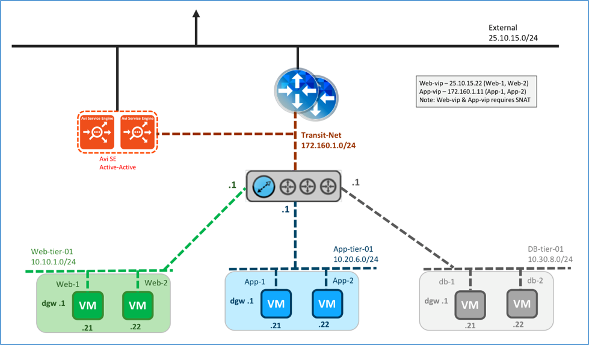
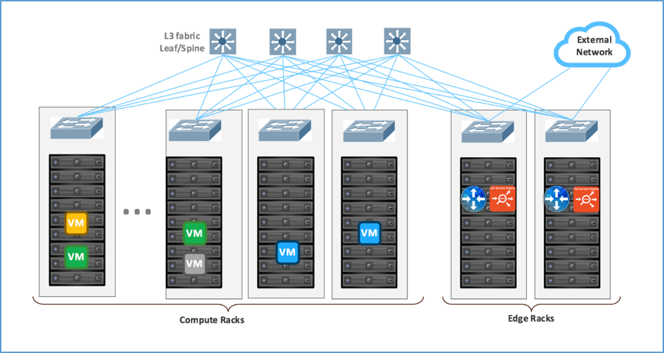
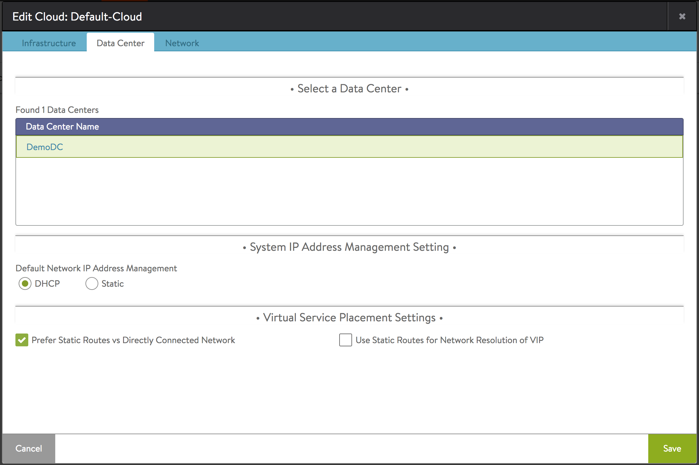
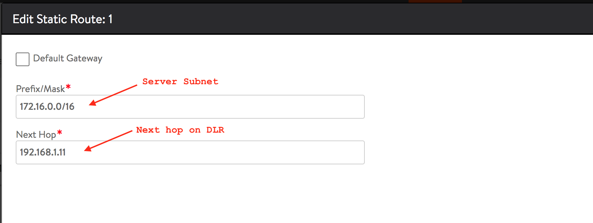
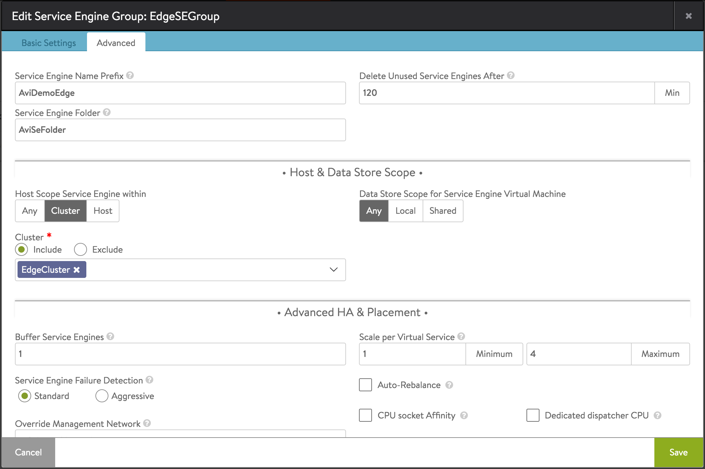
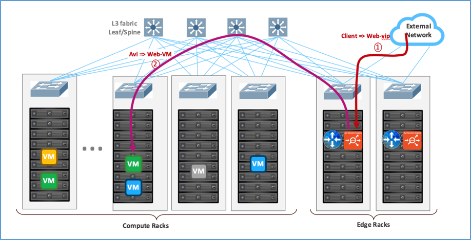
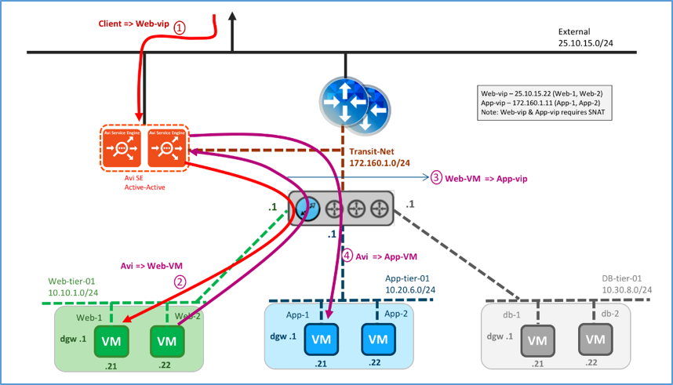
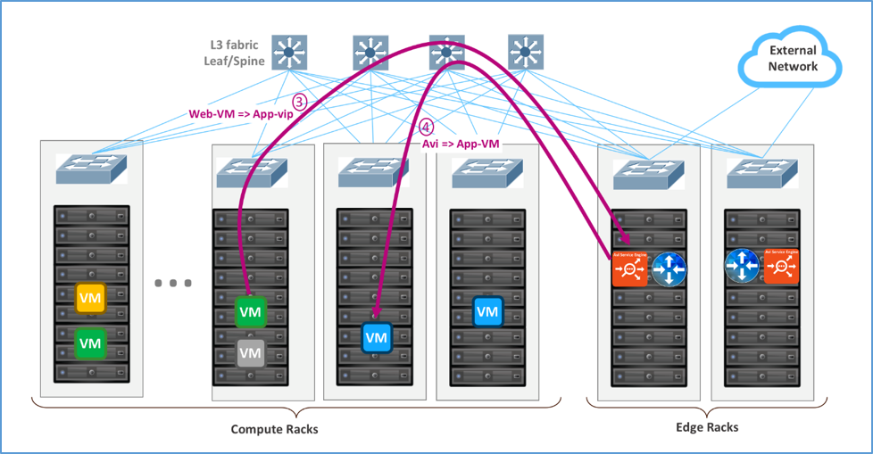
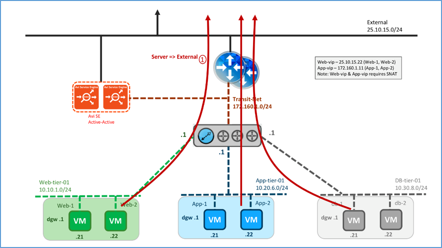
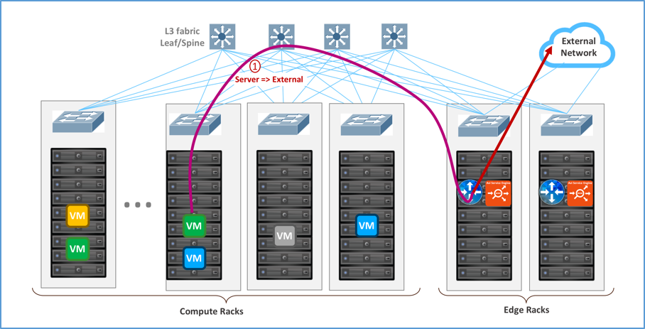

In this topology, the Avi SE is installed parallel to the NSX Edge. Physically, the Avi SE gets deployed on the ESXi on the edge rack. The exact ESXi hosts or cluster on which the SE needs to be placed can be configured in SE group properties on Avi Vantage. This topology can work with both VLAN (Layer2) and VXLAN (Layer3 routed overlay) networks.

### Logical and Physical View

Logically, the Avi SE(s) is(are) installed parallel to the NSX Edge. The SEs may be deployed in elastic HA (active/active or N+M buffer) or legacy HA (active/standby) mode. The SE connects to the External network (non-encapsulated) and Transit-Net VXLAN (encapsulated). The Web-VIP is on the External network, while the App-VIP is on the transit network. Traffic is SNATed by the SE. Default gateway for web, application and DBMS servers is DLR.

<figure class="thumbnail wp-caption alignnone">   
<figcapture> Logical View, Parallel to NSX Edge Using VXLAN Overlays with Avi Vantage for both N-S and E-W using Transit-Net 

</figcapture>
</figure> 

 

Following the recommended design (refer to <a href="https://communities.vmware.com/docs/DOC-27683">VMware® NSX for vSphere Network Virtualization Design Guide ver 3.0</a>), the recommendation is to configure the SE group properties to physically deploy the SEs in the edge racks where the external network is available.

<figure class="thumbnail wp-caption alignnone">   
<figcapture> Physical View, Parallel to NSX Edge Using VXLAN Overlays with Avi for both N/S and E/W Load Balancing using Transit-Net 
</figcapture>
</figure> 

 

### Avi Configuration

To deploy SEs for this topology, configure Avi as follows:

### Cloud Configuration:

* Configure the Cloud for vCenter orchestrator with write access.
* On the Datacenter tab of the configuration, select the “Prefer Static Routes vs Directly Connected Network” checkbox. 

### Static route configuration:

* Navigate to Infrastructure → Routing → Static Route
* Add a new static route to reach the server networks (Web, App and DB) through the DLR. 

### SE Group configuration:

* Navigate to Infrastructure → Service Engine Group and edit the Default-Group.
* On Advanced tab, set “Host Scope Service Engine within” to Cluster.
* Under Cluster select “Include” and select the edge cluster to deploy the SEs. 

### Traffic Flows

### North-South Traffic Flow

Logical traffic flows are (red arrows):

* Client→ Web VIP on Avi SE
* Avi SE→ Web server via DLR 

 

<figure class="thumbnail wp-caption alignnone">   
<figcapture> Logical View, North-South Traffic Flow (red arrows) 
</figcapture>
</figure> 

Physical traffic flows are:

* Client on External network→ ESXi hosting the SE→ SE VM
* SE VM→ VXLAN on ESXi kernel hosting the SE→ ESXi kernel hosting the Web VM 
*Note: DLR is not a step since it is distributed and done in the ESXi hosting the SE.*
* ESXi kernel hosting the web VM→ web VM 
<figure class="thumbnail wp-caption alignnone">   
<figcapture> Physical View, North-South Traffic Flow 
</figcapture>
</figure> 

 

### East-West Traffic Flow

Logical traffic flows are (purple arrows):

* Web VM→ app VIP on Avi SE via DLR
* Avi SE→ app server via DLR 
<figure class="thumbnail wp-caption alignnone">   
<figcapture> Logical View, East-West Traffic Flow (purple arrows) 
</figcapture>
</figure> 

 

Physical traffic flows are:

* Web VM→ ESXi kernel hosting the Web VM→ ESXi kernel hosting the SE 
*Note: DLR is not a step since it is distributed and done in the ESXi kernel hosting the Web VM.*
* ESXi kernel hosting the SE→ SE VM→ ESXi kernel hosting the app VM. 
*Note: DLR is not a step since it is distributed and done in the ESXi kernel hosting the SE.*
* ESXi hosting the app VM→ the app VM 

 

<figure class="thumbnail wp-caption alignnone">   
<figcapture> Physical View, East-West Traffic Flow 
</figcapture>
</figure> 

 

 

### South-North Traffic Flow

Logical traffic flows originating from the servers are:

* Server VM→ DLR→ Edge→ External network 
<figure class="thumbnail wp-caption alignnone">   
<figcapture> Logical View, South-North Traffic Flow 
</figcapture>
</figure> 

 

Physical traffic flows originating from the servers are:

* ESXi hosting the web/app/DBMS server→ ESXi hosting the Edge→ External 
*Note: DLR is not a step since it is distributed and done here in ESXi hosting the web/app/DBMS kernel.* 

 

<figure class="thumbnail wp-caption alignnone">   
<figcapture> Physical View, South-North Traffic Flow 
</figcapture>
</figure> 

### VIP requirements

* Web-VIP requires SNAT
* App-VIP requires SNAT 