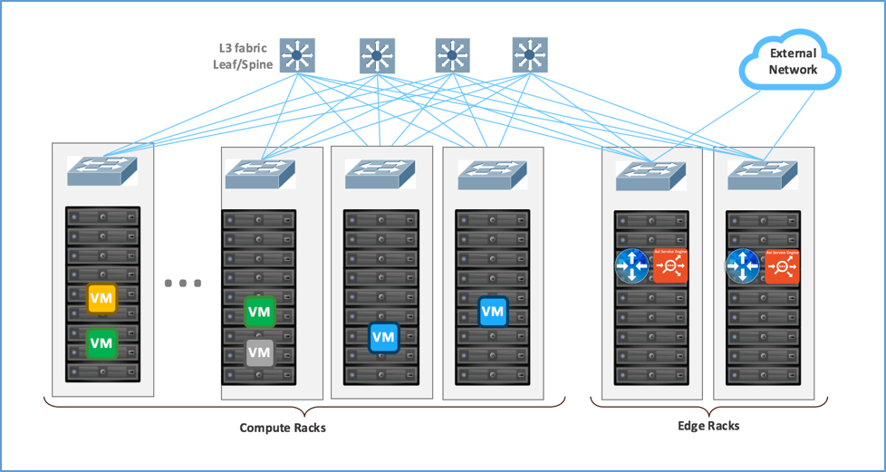
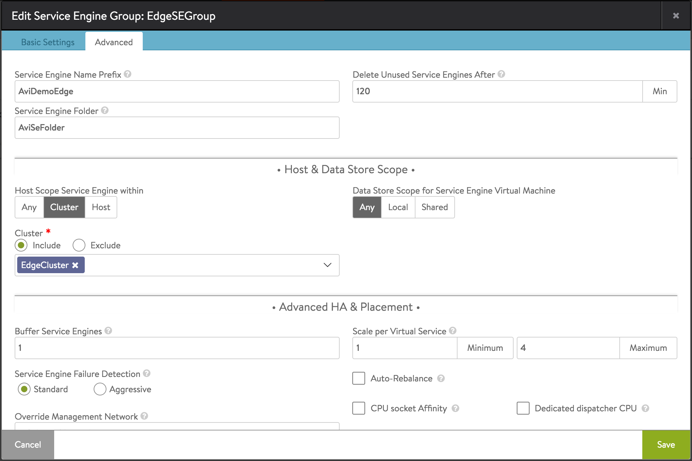
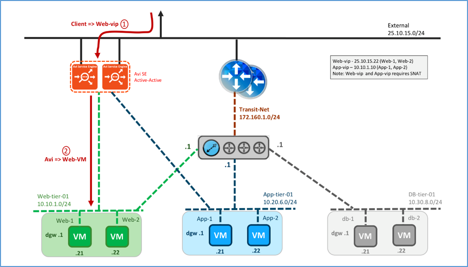
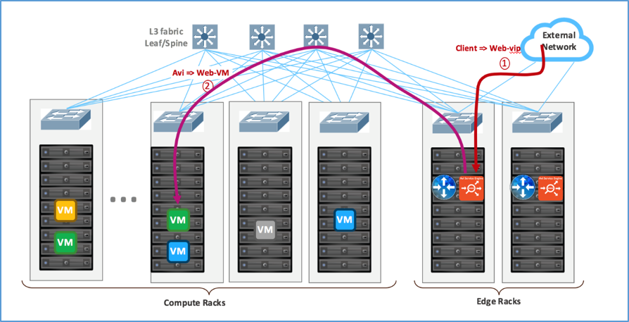
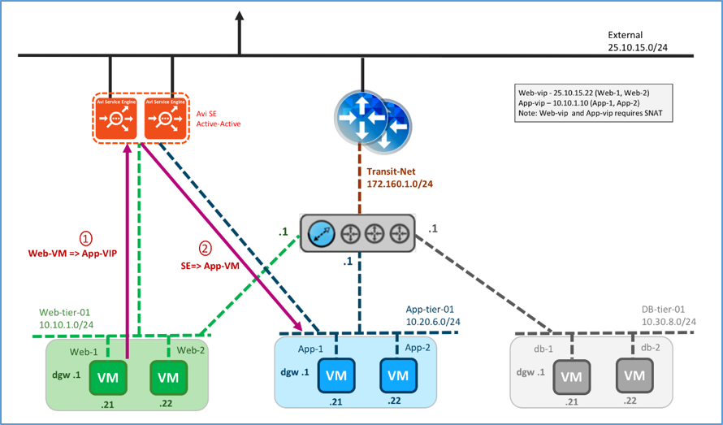
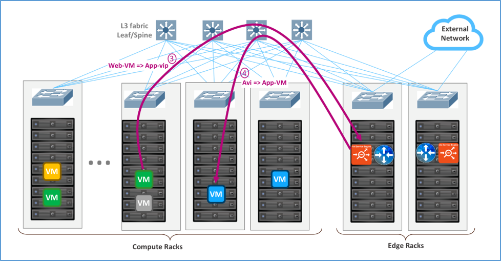
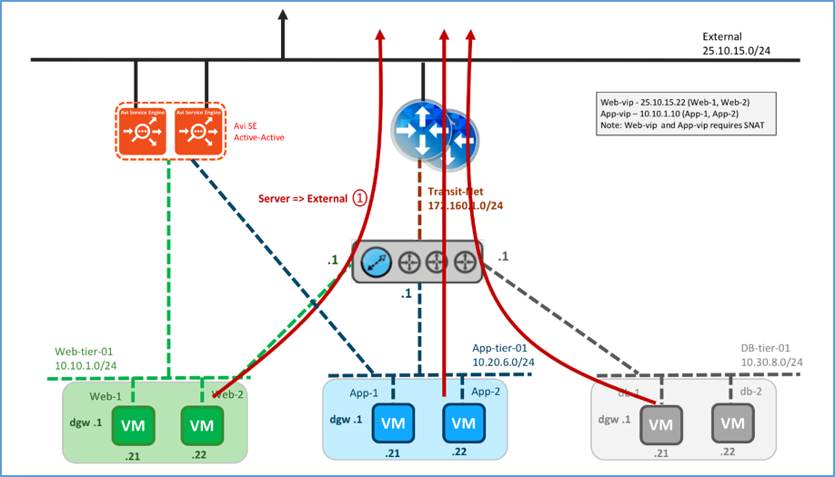
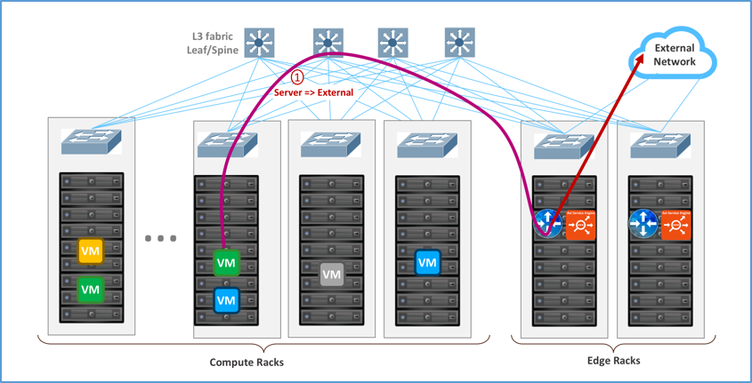

In this topology the Avi SE is installed parallel to NSX Edge. Physically, the Avi SE gets deployed on any of the ESXi hosts on the edge rack. Though it is similar to topology 1, this topology is popular on layer 3 physical fabrics, such as spine-leaf. It also works on Layer 2 physical fabrics.

### Logical and Physical View

Logically, the Avi SE(s) is(are) installed parallel to NSX Edge. The SEs may be deployed in elastic HA (active/active or N+M buffer) or legacy HA (active/standby) mode. The SE connects to the External network (non-encapsulated), Web-tier-01 VXLAN (encapsulated), and App-tier-01 VXLAN (encapsulated). The Web VIP is on the External network and the app VIP is on the web-tier-01. Traffic is SNATed by the SE. The default gateway for the web, app and DBMS servers  is DLR.

<figure class="thumbnail wp-caption alignnone">   
<figcapture> Logical View, Parallel to NSX Edge Using Avi for North-South Load Balancing 
</figcapture>
</figure> 

 

Following the recommended design (refer to <a href="https://communities.vmware.com/docs/DOC-27683">VMware® NSX for vSphere Network Virtualization Design Guide ver 3.0</a>), the recommendation is to configure the SE group properties to physically deploy the SEs in the Edge racks where external network is available.

 

<figure class="thumbnail wp-caption alignnone">   
<figcapture> Physical View, Parallel to NSX Edge Using Avi for North-South and East-West LB 
</figcapture>
</figure> 

### Avi Configuration

To deploy SEs for this topology, configure Avi as follows:

### SE Group configuration:

* Navigate to Infrastructure → Service Engine Group and edit the Default Group.
* On Advanced tab, set “Host Scope Service Engine within” to Cluster.
* Under Cluster select “Include” and select the edge cluster to deploy the SEs. 

### Traffic Flows

### North-South Traffic Flow

Logical traffic flows are:

* Client → Web VIP on Avi SE
* Avi SE → Web server 

 

<figure class="thumbnail wp-caption alignnone">   
<figcapture> Logical View, North-South Traffic Flow 
</figcapture>
</figure> 

Physical traffic flows are:

* Client on External network → the ESXi hosting the SE → SE VM
* SE VM → VXLAN on ESXi kernel hosting the SE → ESXi kernel hosting the web VM
* ESXi kernel hosting the Web VM → Web VM 
<figure class="thumbnail wp-caption alignnone">   
<figcapture> Physical View, North-South Traffic Flow 
</figcapture>
</figure> 

### East-West Traffic Flow

Logical traffic flows are as follows:

* Web VM → app VIP on the Avi SE
* Avi SE → app server 
<figure class="thumbnail wp-caption alignnone">   
<figcapture> Logical View, East-West Traffic Flow 
</figcapture>
</figure> 

 

Physical traffic flows are:

* Web VM → VXLAN on the ESXi kernel hosting the Web VM
* ESXi kernel hosting the Web VM → ESXi hosting the SE → SE VM
* SE → VXLAN on ESXi kernel hosting the SE → ESXi kernel hosting the app VM 

 

<figure class="thumbnail wp-caption alignnone">   
<figcapture> Physical View, East-West Traffic Flow 
</figcapture>
</figure> 

### South-North Traffic Flow

Logical traffic flows originating from the servers:

* Server VM → DLR → Edge → External network 

 

<figure class="thumbnail wp-caption alignnone">   
<figcapture> Logical View, South-North Traffic Flow 
</figcapture>
</figure> 

 

Physical traffic flows originating from the servers are:

* From ESXi hosting the web/app/DBMS server → ESXi hosting the Edge → External 
*Note: DLR is not a step since it is distributed and done here in the ESXi hosting the web/app/DBMS kernel.* 

 

<figure class="thumbnail wp-caption alignnone">   
<figcapture> Physical View, South-North Traffic Flow 
</figcapture>
</figure> 

### VIP requirements

* Web-VIP requires SNAT
* App-VIP requires SNAT 