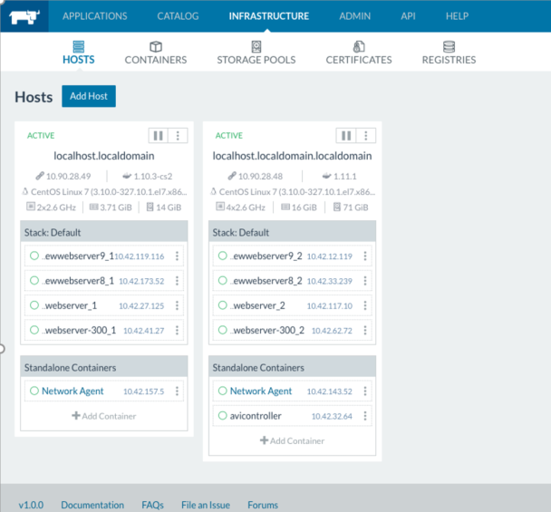
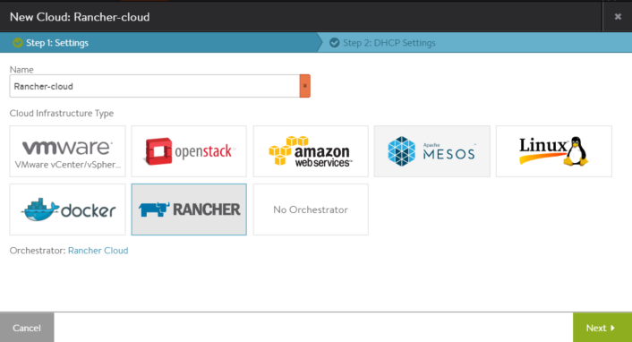
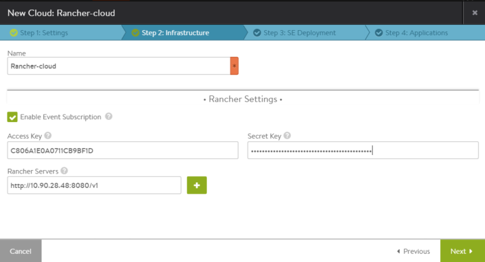

Avi Vantage supports integration with Rancher OS. This article describes how to create a cloud configuration for Rancher OS, and how to create application stacks and services (in Vantage terminology, "virtual services").

## Requirements

Integration of Avi Vantage with Rancher OS has the following prerequisites:

* The Rancher cluster must already be set up, with CentOS/CoreOS Virtual Machines (VMs) or Linux server (bare metal) hosts.
* Rancher (Server/Agent): v1.0.0
* Cattle: v0.159.2
* All Rancher hosts within the cloud must have a sudo-enabled SSH user account. As part of integration, an SSH account with the same name will need to be created on the Avi Controller. Note: Vantage works only with OSs that have systemctl support. Currently, this applies to CoreOS and to CentOS 7.0 and higher.

* The Avi Controller must already be installed and running as a container (see example below) on one of the Rancher nodes, or it can run as a container on separate VM/host.
    
     
    
* The Avi Controller must be configured with a link-local subnet, to use for allocating IP addresses for east-west applications. In this article, we will use subnet of 169.254.0.0/24. To create a link-local subnet using the Vantage CLI, log onto the Avi Controller through SSH or the CLI shell, and use the following commands:  
    <pre class="command-line language-bash" data-prompt="1|: >;2,5|seproperties>;3-4|seproperties:se_runtime_properties>"><code>configure serviceengineproperties
se_runtime_properties
service_ip_subnets 169.254.0.0/24
save
save</code></pre> 

## Creating the Rancher OS Cloud

To create the cloud configuration for Rancher OS, log onto the Avi Controller web interface and use the following steps:
<ol> 
 <li>Navigate to Infrastructure &gt; Clouds.</li> 
 <li>Click Create, enter a name for the cloud, select Rancher as the infrastructure type, and click Next.  </li> 
 <li>Enter Rancher access settings: 
  <ul> 
   <li>Access credentials (access key, secret key)</li> 
   <li>Rancher endpoints (server IP addresses or URLs)</li> 
  </ul> 

</li> 
 <li>Click Next, and select or create the SSH user account the Avi Controller will use to log onto hosts within the cloud. A sudo-enabled SSH account with the same name must exist on each of the hosts within the RancherOS cloud. 
  <ol> 
   <li>Click SSH User.</li> 
   <li>Enter the username (sudo-enabled user for all Rancher nodes).</li> 
   <li>Select the Import Private Key radio button, and either Copy-Paste the private key or Click Load Private Key From File and Upload the key.</li> 
   <li>Click Save. The SSH user appears in the list.</li> 
  </ol> </li> 
 <li>Click Next. If IPAM configuration is desired, it can be configured at this point. (More information to appear in an updated version of this article.) Click Complete.</li> 
</ol> 

The Avi Controller now will connect to every Rancher node in the cluster using the SSH key configuration and bring up Avi SEs on all of them.

## Creating Virtual Services

A sample rancher-compose.yml below configures 1 north-south application (6 containers) and 1 east-west application (2 containers). In this example, the east-west application is given IP address 169.254.0.10.

<pre><code class="language-lua">east-west-app:
  image: avinetworks/node-app-nsew
  labels:
    com.avinetworks.avi_proxy: '{"virtualservice": {"east_west_placement": true, "ip_address": {"type": "V4", "addr": "169.254.0.10"}, "analytics_policy": {"client_insights": "NO_INSIGHTS", "metrics_realtime_update": {"duration": 0, "enabled": true}, "full_client_logs": {"duration": 0, "enabled": true}}}, "pool": {"lb_algorithm": "LB_ALGORITHM_ROUND_ROBIN"}}'
  ports:
  - '8080'
  scale: 2
north-south-app:
  image: avinetworks/node-app-nsew
  labels:
    com.avinetworks.avi_proxy: '{"virtualservice": {"ip_address": {"type": "V4", "addr": "10.144.131.197"}, "analytics_policy": {"client_insights": "NO_INSIGHTS", "metrics_realtime_update": {"duration": 0, "enabled": true}, "full_client_logs": {"duration": 0, "enabled": true}}}, "pool": {"lb_algorithm": "LB_ALGORITHM_ROUND_ROBIN"}}'
  ports:
  - '8080'
  scale: 6</code></pre>  

On the Avi Controller, the applications show up as virtual services. (In the web interface, navigate to the Applications > Dashboard.)

