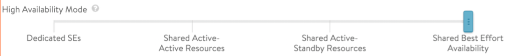
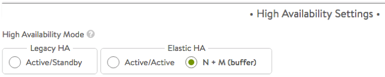
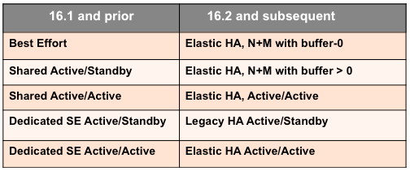
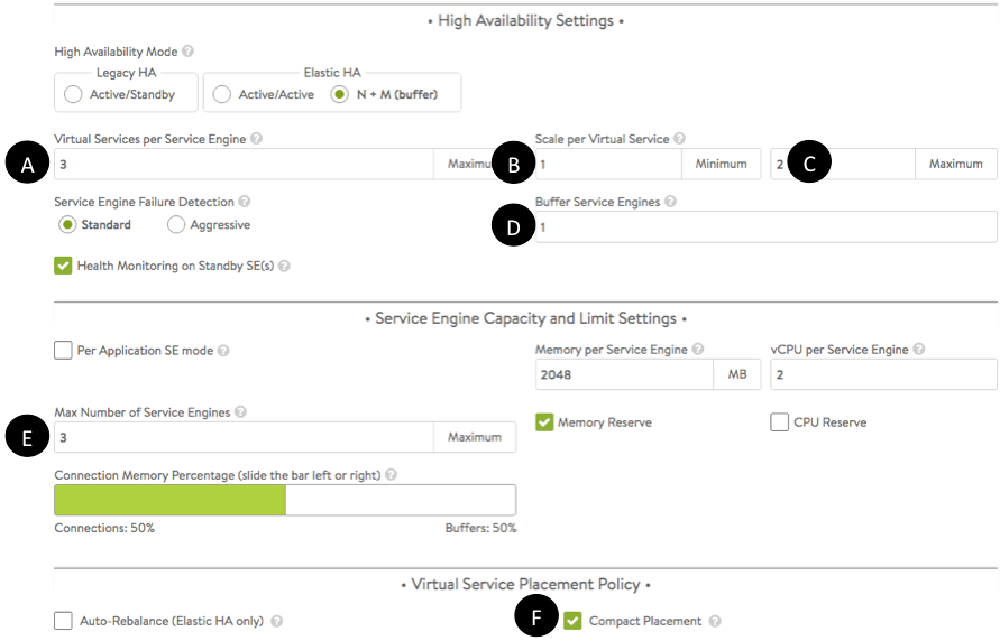
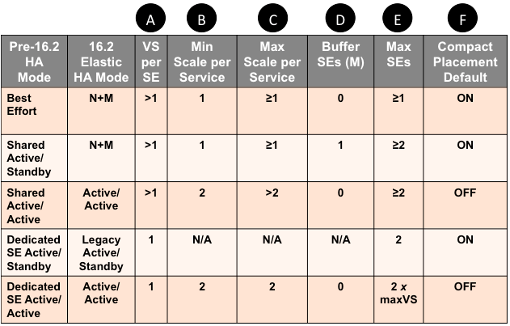

This article maps Avi Vantage's pre-16.2 SE-group high availability modes to those supported thereafter.

Prior to 16.2, HA modes ranged from dedicated SEs to shared best effort, as depicted in figure 1.

<figure class="thumbnail wp-caption alignleft">   
<figcapture> Figure 1. SE group HA modes prior to Vantage release 16.2 
</figcapture>
</figure> 

Starting in Vantage 16.2, the High Availability Settings section of the SE Group editor offers three HA modes, as depicted in figure 2.

<figure class="thumbnail wp-caption alignnone">   
<figcapture> Figure 2. HA modes, as defined in Vantage 16.2 and thereafter 
</figcapture>
</figure> 

The below table shows the correspondence between the previous and 16.2 HA modes.

<figure class="thumbnail wp-caption alignnone">   
<figcapture> Table 1. HA mode correspondence 
</figcapture>
</figure> 

### Details

Pre-16.2 modes can be mimicked by choosing one of three modes and setting as many as seven options. [Note: Prior to 16.2, there was no equivalent to <a href="/legacy-ha-for-avi-service-engines/">legacy active/standby HA</a>.] Refer to table 2 for suggested settings of the fields labeled A-F in figure 3.

 

<figure class="thumbnail wp-caption alignnone">   
<figcapture> Figure 3. Basic SE group options 
</figcapture>
</figure> 

 

<figure class="thumbnail wp-caption alignnone">   
<figcapture> Table 2. Settings found within the SE group editor 
</figcapture>
</figure> 

 

A variety of factors will affect the maximum number of SEs deployed in any one of the four modes, including:

* Native SE balancing versus BGP-based.
* Available resources. 

To mimic a "dedicated SE active/active" environment, the maximum SE count of the active/active group should be double maxVS, the maximum number of virtual services intended for the SE group.

