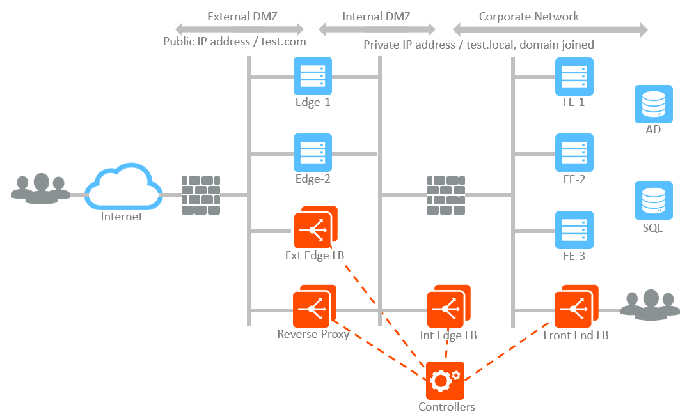

### Deploy Avi Vantage with Lync 2013

Microsoft Lync 2013 is a unified communications platform for the enterprise. Lync provides instant messaging, presence service, desktop sharing, enterprise voice, and A/V conferencing service. In this document, we focus on the on-premises Lync deployment and Lync core features using Avi Vantage for load balancing, high availability, and analytics.

### Avi's Lync Solution Benefits

Avi solution provides the following benefits for Lync 2013 deployment:

* **Single Point of Management and Control
**The Avi Controller provides a single point of management and control while providing traffic and resource isolation as required by Lync for heightened security. Typical Lync deployment requires 4 separate load balancing units. This number is doubled to 8 units when high availability is required. Unlike other ADC solutions, IT organization can deploy a single Avi controller or a single cluster of Controllers instead of 4 or 8 ADC units. 
* **Built-in TCP Security** The Avi system inspects TCP connections and drops malicious connection attempts, such as TCP SYN flooding or TCP segment with an invalid sequence number.

* **Lync Reverse Proxy Service
**Avi supports HTTPS proxy with easy to use security and HTTP policies. In addition, full visibility and end-to-ending timing information are provided for HTTPS transactions to enable IT to detect and analyze problems quickly. 
* **Cloud Optimized Deployment and High Availability
**The Avi Controller automatically discovers available resources, such as networks and servers in the virtual infrastructure. This allows IT admins to be less vulnerable to human errors. In addition, the Avi Controller detects a problem when its Service Engine or a hypervisor has a problem; it automatically looks for a best available hypervisor and launches a Service Engine to recover. Unlike other ADC solutions, this approach does not require a redundant device. 

### Deployment Architecture

At the heart of Lync deployment, there are three Lync roles of servers, Front-end server, Edge server, and Reverse proxy.

* **Front-end server**: Provides all core features of Lync services such as authentication, instant messaging, web conferencing, A/V conferencing, address book services, etc. Note that Front-end role servers are recommended to host Director pool in Lync 2013 and can optionally accommodate other services such as persistent chat, monitoring, and media mediation. In this document, the Director pool is assumed to exist on the Front-end pool. 
* **Edge server**: Enables on-premises users to communicate and collaborate with off-premises users. Note that the Edge pool does not provide any web-based services or Lync discovery mechanism. For those two functions, the reverse proxy is required. Edge pool servers are not joined to the active directory domain of an organization. 
* **Reverse proxy**: Publishes to the Internet web services provided by the Front end pool. In other words, the Reverse proxy relays HTTP requests coming from the Internet to the Front end pool VS IP address. The Reverse proxy should not be joined to the active directory domain of an organization. 

Note that the Lync Standard edition pool supports single active Lync server and thereby no load balancing is required. It is the Lync enterprise pool that supports multiple active Lync servers and requires an external load balancer. Microsoft recommends at least three Front end servers because quorum should be formed based on votes for high availability.

Figure 1 shows Lync architecture we are going to use through the rest of this document.

### Load Balancing Policies

Lync requires four separate load balancers for security reason, one as Reverse proxy and one each for load balancing the external side of Edge pool, internal side of Edge pool, and Front End pool. The figure 2 table shows all the required Lync ports and services to load balance. In this Lync deployment example, the front end server assumes the Director and Mediation services. Set up your active directory and DNS servers based on the figure.

<table class="table table-hover table table-bordered table-hover">  
<tbody>        
<tr>      
<td><b>Lync Role</b></td>
<td><b>FQDN of VS</b></td>
<td><b>Ports on VS</b></td>
<td><b>FQDN of Servers</b></td>
<td><b>Ports on Servers</b></td>
</tr>
<tr>      
<td><b>Front End</b></td>
<td>fe-pool.test.local</td>
<td>80, 135, 443, 444, 448, 4443, 5061, 5070, 5071, 5072, 5073, 5075, 5076, 5080, 8080</td>
<td>fe-1.test.local  fe-2.test.local  f3-3.test.local</td>
<td>Same as VS</td>
</tr>
<tr>      
<td><b>External Access Edge</b></td>
<td>access.test.com</td>
<td>443, 5061</td>
<td>access-1.test.com  access-2.test.com  access-3.test.com</td>
<td>Same as VS</td>
</tr>
<tr>      
<td><b>External Web Conf Edge</b></td>
<td>webconf.test.com</td>
<td>443</td>
<td>webconf-1.test.com  webconf-2.test.com</td>
<td>Same as VS</td>
</tr>
<tr>      
<td><b>External A/V Edge</b></td>
<td>av.test.com</td>
<td>443, 34789/UDP</td>
<td>av-1.test.com  av-2.test.com</td>
<td>Same as VS</td>
</tr>
<tr>      
<td><b>Internal Edge</b></td>
<td>edge-pool.test.local</td>
<td>443, 5061, 5062, 3478/UDP</td>
<td>edge-1.test.local  edge-2.test.local</td>
<td>Same as VS</td>
</tr>
<tr>      
<td><b>Reverse Proxy</b></td>
<td>lyncdiscover.test.com</td>
<td>80  4443</td>
<td>fe-pool.test.local</td>
<td>8080  4443</td>
</tr>
</tbody>
</table> 

### Common Policies

Lync 2013 recommends the following common configuration for all load balancing virtual servers.

* Source IP-based persistence
* TCP idle time-out value of 1800 seconds.  This is configured in the *Templates > TCP/UDP profile > Custom > Idle Duration*. 

### Front End Pool

One VS IP is shared across all ports. The Front End VS IP must be configured as the Lync Front End pool IP in the Lync topology setup.

* Configure layer 4 load balancing with TCP proxy for all ports except for port 80 and 8080. Use HTTP load balancing for port 80 and 8080.
* If client authentication requires NTLM, disable Connection Multiplex in the *Templates > Profiles > HTTP App* profile.  See <a href="/issues-with-ntlm-authentication/">NLTM </a>for more on this.
* Use TCP health monitor for all ports. Note that the Lync Front End server has an option to allow an external load balancer to perform SIP health check on unencrypted SIP port, 5060. 

### External and Internal Edge Pool

Three public VS IP addresses are required for the external side and one VS IP address is required for the internal side of the Edge pool. The three public IP addresses must be registered as access, web conferencing, and A/V edge service point in the Lync topology builder. The internal VS IP address must be configured as the Lync edge pool IP address in the Lync topology builder.

* Configure layer 4 load balancing with TCP proxy for all ports except for 3478/UDP.
* Use the System-UDP-Fast-Path profile for the UDP load balancing. Note that while Microsoft recommends Half-NAT to preserve client IP addresses for this UDP load balancing to allow peer-to-peer communication, it is not required. Deploying with the Half-NAT option requires using the Service Engines as the server's default gateway, which may require additional configuration on Avi Vantage and on the servers.
* Use UDP health monitor for port 3478 and TCP health monitor for other ports. The UDP health monitor verifies the application is listening on a given UDP port. If an ICMP port unreachable message is received the application is marked down.  Otherwise the UDP server is marked up. 

### Reverse Proxy

The Reverse Proxy requires one VS IP address. This VS IP is recommended to be on public network, which is shown as the External DMZ in figure 1. This VS is configured with HTTPS load balancing. The connections from clients to the VS and from the VS to servers must be all secure and encrypted. In addition, unlike other Lync virtual servers, the Reverse Proxy must translate incoming port numbers between client and server as shown in Figure 2.

In a typical deployment scenario, the Reverse Proxy does not have direct Layer 2 connectivity to the Front End pool. This requires additional configuration because the Avi Controller assumes that a server is directly accessible by default.

* Configure an SSL profile both on a virtual service and a pool and choose an HTTP profile. With this configuration, HTTPS traffic is decrypted when received from clients and re-encrypted before being sent to a server. This allows the ability to configure HTTP security policies as your IT organization requires. Note that the SSL certificate associated with the VS must be the same as the one used by the Front End server. It means that the Reverse Proxy FQDN must be listed on the subject alternate name of the certificate.
* Configure the Lync Front End pool VS IP as a member of the pool.
* Use X-Forwarded in the Application profile to preserve an original URL from the client.
* Use HTTP health monitor and expect HTTP status code 403 in response for successful health check.  Exclude 403 from the list of errors in the *Templates > Analytics profile > Exclude HTTP Status codes from Error Classification*. 

### Virtual Service Placement

Figure 1 shows a logical separation of Avi Service Engines across four zones.  These SEs may be as few as a single consolidated pair, though for security best practices this will likely be one pair of SEs on the External Edge and Reverse Proxy load balancing, and another pair of SEs for the Internal Edge and Front End load balancing.

Before creating any VS, create the desired number of Service Engine groups, based on the level of segregation determined in the previous paragraph. When creating a VS, use the Advanced create option instead of the Basic option so that an SE group can be specified at the end of creation within the Advanced tab. This will ensure an SE does not host virtual servers of different Lync roles or cross security zones.
