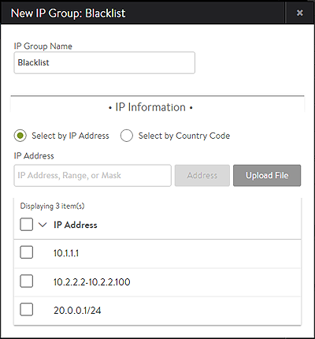

### Description

Discard a client connection or request based on the client's source IP address.

This use case may be configured via a DataScript or a Network Security or HTTP Security policy.  If a larger list of client IPs is to be used, or if the source IP addresses are based on a <a href="/geo-location-database/">geographic location</a>, then the DataScript or policies should be pointed at an IP group.

### DataScript

A DataScript may be used to close the client's connection.  This may be done via a TCP RST or a graceful TCP FIN.  This is determined by a flag in the <a href="/datascript-avi-http-close_conn/">avi.http.close_conn</a> command.

<table class="table table-hover table table-bordered table-hover">  
<tbody>   
<tr>   
<td><strong>Example 1</strong></td>
<td>This rule discards a statically defined IP address.  
<!-- Crayon Syntax Highlighter v_2.7.2_beta --> <pre><code class="language-lua">if avi.vs.client_ip() == "10.1.1.1" then
   avi.http.close_conn()
end</code></pre> 
<!-- [Format Time: 0.0005 seconds] --></td>
</tr>
<tr>   
<td><strong>Example 2</strong></td>
<td>This rule discards a list or group of IP addresses.  This could be a list, range, or a geographic location such as a group of countries.  The IP list is defined within the IP Group and enforced by the DataScript.  
<!-- Crayon Syntax Highlighter v_2.7.2_beta --> <pre><code class="language-lua">if avi.ipgroup.contains("Blacklist-IP-Group", avi.vs.client_ip()) then
 avi.http.close_conn()
end</code></pre> 
<!-- [Format Time: 0.0005 seconds] --></td>
</tr>
</tbody>
</table> 

### Policy

The <a href="/docs/architectural-overview/applications/vs-policies/">Network Security</a> and the <a href="/http-security-policy/">HTTP Security</a> policies may be used to discard a client based on their IP address.  The following illustrations show creating a configured policy rule which is referencing an IP group called Blacklist.  When this policy is triggered, a significant log will be generated indicating the policy dropped this user.  With enough frequency, this may also incur a penalty on the health score's security row.

 

### IP Group

The IP group is configured and maintained separately from the DataScript or policy referencing it.  The group may contain lists of addresses or country codes.  See the <a href="/templates-groups-ip-group/">IP Group KB</a> for more detail on this feature.

 
