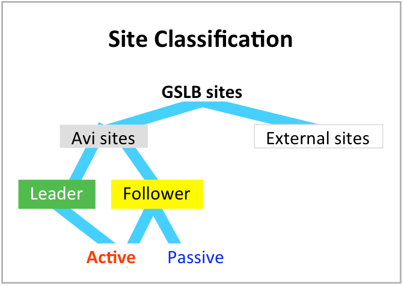
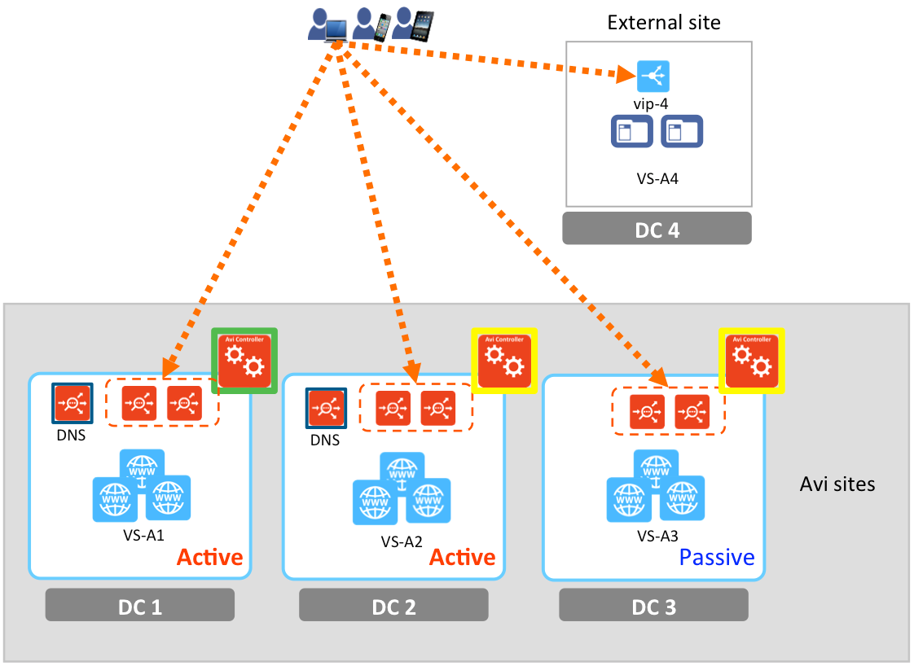
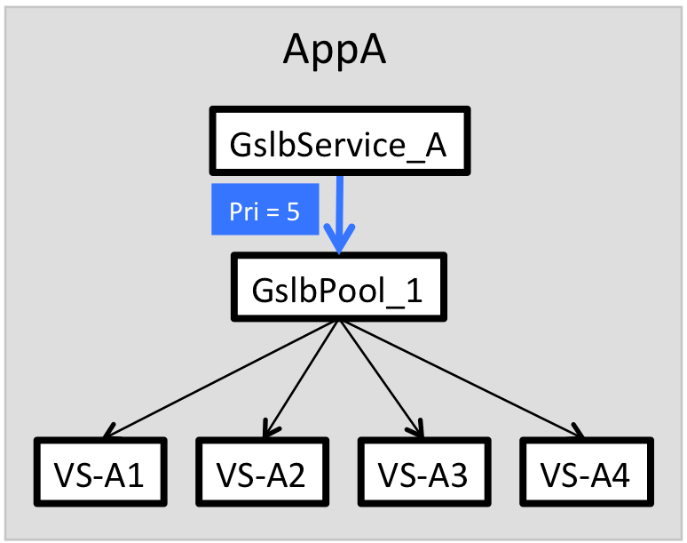
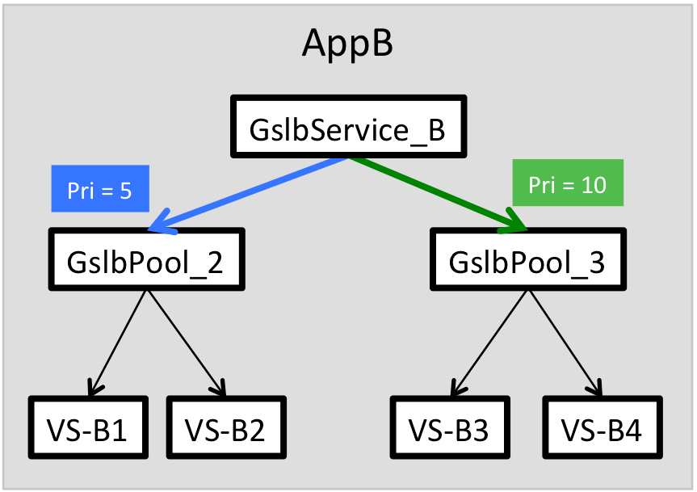
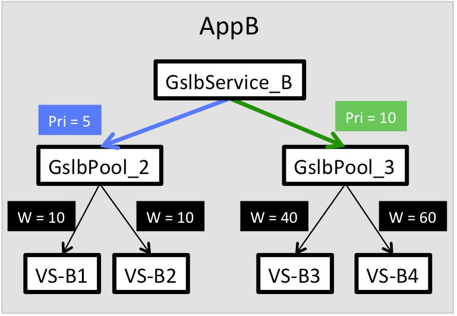
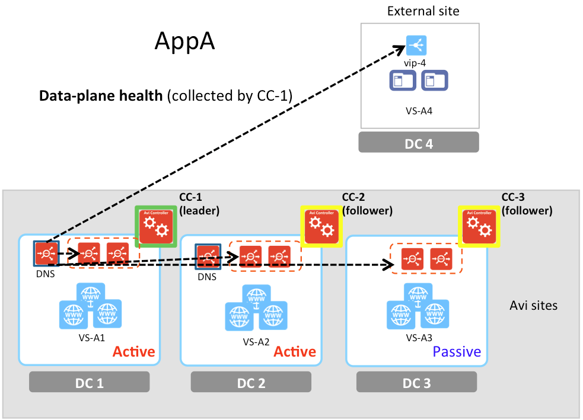

This article introduces the architecture, object model, and key data attributes of an Avi GSLB deployment. If you have not done so already, please read <a href="/avi-gslb-overview/">Avi GSLB Overview.</a>

### Defining a Global Service

A**GSLB service** is the representation of a global application; it front-ends instantiations of the application that are deployed at multiple sites. The corresponding <a href="/docs/latest/api-guide/gslbservice.html">GslbService object</a> identifies the following data, which are key to understanding operation of the Avi GSLB:

* GSLB service's **name**, by which administrators reference the GSLB configuration.
* **FQDN** by which end-user clients reference the GSLB application. A list of domain names can be provided for aliasing (e.g., www.foo.com and foo.com).
* A **time-to-live (TTL)** ranging from 1-86400 seconds that determines the frequency with which clients need to obtain fresh steering information for client requests. If none is specified for a particular GSLB service, the TTL value defaults to the one specified in the DNS application profile (default there is 30 seconds).Note: Avi suggests caution when using very low values of TTL, since some DNSs/operating systems will discard a very low TTL.
* Backing **virtual services** in various **GSLB** **sites**, organized into **virtual service** **pools**.
* **Priorities **for the various pools and**ratios** for their **members**,
* **Load-balancing scheme**, and
* **Health monitoring** methods by which unhealthy components can be identified so that alternatives may be selected. 

### Object Model

### GSLB Configuration

A GSLB configuration is represented by the <a href="/docs/latest/api-guide/gslb.html">Gslb</a> object. Multiple instantiations of the object are not permitted, that is to say, an installation of Avi Vantage is a member of at most one GSLB configuration. In turn, a GSLB configuration is comprised of one or more sites, and requires at least one Avi DNS to steer client requests to global applications hosted by those sites.

### GSLB Sites

Avi Vantage's classification of sites is tied to the four functions required in a global application:
<ol> 
 <li>Central definition and ongoing synchronization/maintenance of the GSLB configuration</li> 
 <li>Monitoring the health of configuration components</li> 
 <li>DNS-based steering of inbound application requests to the best source for responses</li> 
 <li>Responding to received requests</li> 
</ol> 

All GSLB sites are capable of function /#4. An **external site** does not run Avi Vantage; its sole duty is to contribute one or more VIP:port pairs to the solution, i.e., to perform function /#4. Examples of such sites include 

* a single server running an application without benefit of an ADC
* a third-party ADC which defines virtual services of its own 

An Avi site runs Avi Vantage. The Avi site on which the administrator first defines a GSLB configuration is automatically designated as the GSLB **leader**; other Avi sites subsequently added are **followers**. The only way to switch leadership (from the first and only leader) is through an override configuration from a follower site. This override can be invoked in case of site failures or maintenance.

The leader is responsible for functions /#1, /#2, /#3 and very likely /#4.  Followers are further classified as **active** or **passive**, based on their behavior vis-a-vis the first three functions.

An active follower ...

* Receives the GSLB configuration from the leader, and thus can take over leadership in the event of the leader's failure.
* Must actively monitor the health of *other* GSLB sites.
* *May* host an authoritative DNS for the Avi global applications defined by Avi GSLB. Such redundancy makes DNS service for the GSLB configuration more reliable and boosts the performance of address resolution. 

A passive follower ...

* Does *not* receive the GSLB configuration, and thus can't take over for a failed leader.
* Does *not* monitor other sites. Its health is determined by a health monitor running on an active site.
* Does *not* a have DNS participating in the GSLB configuration. That said, it may run DNS for applications unrelated to the GSLB deployment. 

Note: An Avi site may participate in exactly one Avi GSLB configuration. If site_A is a participant in GSLB_config_1, an attempt to incorporate site_A into GSLB_config_2 will result in an error.

### GSLB Pools

A global application, AppA, spanning four sites, DC1 through DC4, is depicted below left. A <a href="/docs/latest/api-guide/gslbservice.html#GslbPool">GslbPool</a>** **object "GslbPool_1" combines virtual services VS-A1 through VS-A4 into a single entity and balances load across them; see below right. In contrast to an Avi server pool, which aggregates *servers*, a GSLB pool aggregates *virtual services.*

 

 

 

 

 

 

 

 

 

 

 

Akin to a simple virtual service, which may be configured to content-switch load across multiple *server* pools, a global service can switch load across multiple GSLB pools. A client's request is steered to a particular GSLB pool based on **GslbPool.priority**. Refer to the below diagram. AppB, which corresponds to the GslbService_B object, is comprised of two pools, with priorities 5 and 10. As long as the pool of highest priority (GslbPool_3) is up and not at its connection limit, all traffic will be directed to it. GslbPool_2 will remain idle. However, when/if a pool is inaccessible, down, or at maximum capacity, a lower priority pool will be chosen instead.

 

### GSLB Pool Members

The virtual services that comprise a GSLB pool (e.g., VS-B3 and VS-B4) are called GSLB pool** members.** Members can be specified by 

* their Avi virtual service name,
* an IP address, to specify standalone servers or VIPs defined by third-party load balancers, and/or
* a DNS name, for example, to specify a DNS-based load balancer such as AWS ELB. 

Pool members may be temporarily disabled by setting the**GslbPoolMember.enabled** flag to False (the default is True), which tells the GSLB DNS it may no longer furnish the member's IP address in a DNS response. For example, set it to False to temporarily remove a member from participating in the global application during a maintenance period.

### Weights

All members of a********GSLB pool share the same priority, but each member of the pool may potentially have different **weights**. When a pool is selected (by priority) and its load is distributed across the members via the round-robin algorithm, these weights dictate the fraction directed to each member. In the example depicted below, as long as VS-B3 and VS-B4 are healthy and able to accept load, GslbPool_3's higher priority will direct all load to it, but weights will cause Avi Vantage will direct 40% of that load to VS-B3 and 60% to VS-B4.

 

### Load Balancing Algorithms for GSLB Pool Members

Once a particular pool has been selected, a **GslbPool.algorithm** balances load across the pool's virtual services. In 16.3, **two load-unaware** algorithms are available.
<ol> 
 <li>The <strong>weighted-round robin</strong> algorithm balances even-handedly across all members. As discussed, load can be skewed by the <strong>GslbPoolMember.ratio</strong> [default = 1, range is 1-20] values that optionally may be set for members. For example, if virtual services A, B, and C have ratios of 1, 2 and 3 respectively, virtual service A will receive one-sixth, B will get one-third, and C will get one-half the load.</li> 
 <li><strong>Consistent hash</strong> is based on the client IP address (typically the local DNS IP address). A mask can be applied on the client IP address, if there are multiple local DNSes in a given network, in one site. IT is the only option that can provide persistence.</li> 
</ol> 

As of this writing, the complete list of supported and planned load balancing options are:

* A**load-unaware configuration**, as discussed above.
* A** load-aware configuration** steers clients to the most optimal site based on the observed load of the members. This option will be added in a future release.
* A** geolocation-aware configuration**** steers** clients to the closest site. Member selection is based on the proximity of the client to the members. This option will be added in a future release. 

### GslbHealthMonitor

To make its steering decision, the GSLB DNS service must know the health of GS members. Accordingly, a <a href="/docs/latest/api-guide/gslbhealthmonitor.html">GslbHealthMonitor</a> object is configured. It is the GSLB counterpart of the [virtual service] HealthMonitor object. Two kinds of health checking (control-plane and data-plane health) and their combination are supported.

### Control-Plane Health

Control-plane health checking of GSLB pool members is so called because it relies on each site's Avi Controller to assess the well-being of the virtual services local to it. To keep the GSLB DNS apprised of the health of members at all the Avi sites, each *active* Avi Controller periodically collects performance metrics and health information from every other GSLB Controller, be those others active or passive. The figure at right shows CC-1 combining its own health observations (of VS-A1, via that VS' SEs) to those gathered from CC-2 and CC-3 (dashed lines). It passes this consolidated impression of health on to its local DNS (dark green arrow). At the same time, CC-2 would be doing likewise, collecting health info from CC-1 and CC-3. CC-3 is a passive site, has no local DNS to keep apprised, and is thus only responsible to reply to health queries from the two active sites.

Control-plane health checks can't be collected from DC4, the external site, because it is running a third-party ADC; any health data that ADC collects locally is opaque to Avi Vantage.

### Data-Plane Health

Data-plane health checking of GS members is so called because it involves queries from the GSLB DNSs directly to the GS members that respond to client requests for application data. Standard and/or custom health monitors can be used.

In the figure at right, DC1's DNS is checking a member local to it (VS-A1, via that VS' SEs), as well as every other GS member VS. Note that VS-A4's health can only be had via data-plane health checks (by directing checks to vip-4).

Simultaneously, active Controller CC-2 would be doing similar checks.

If there are firewalls between sites, they must be optioned to permit communication from the GSLB DNSs to all VIPs.

### Control- and Data-Plane Health Combined

Both methods can be in play simultaneously. If so, a GS virtual service will be marked as UP if one of the are true:

* Both control-plane and data-plane health report UP.
* Data-plane health is reporting UP but control-plane health is failing due to a Controller being down. 

For more information, please refer to <a href="/avi-gslb-service-and-health-monitors/">Avi GSLB Service and Health Monitors</a>.

### Tenancy

The expected isolation and administrative restrictions of a multi-tenant architecture extend to Avi GSLB. GSLB is configured by the Avi "admin," who can place the DNS service VS in the "admin" tenant or some other. Each Avi tenant can then use that shared DNS service VS for their global applications.

Each tenant user can define their own global applications (GSLB services) in their own tenant. The requisite DNS records are registered on the shared DNS service. The tenant admin is able to get analytics of only GSLB services in that tenant. The tenant user needs only "read" access to the <a href="/docs/latest/api-guide/gslbservice.html">GslbService object</a>.

### Recommended Reading

* <a href="/avi-gslb-site-configuration-and-operations/">Avi GSLB Site Configuration and Operations</a>
* <a href="/avi-gslb-service-and-health-monitors/">Avi GSLB Service and Health Monitoring</a>
* <a href="/avi-dns-architecture/">Avi DNS Architecture and Features</a> 