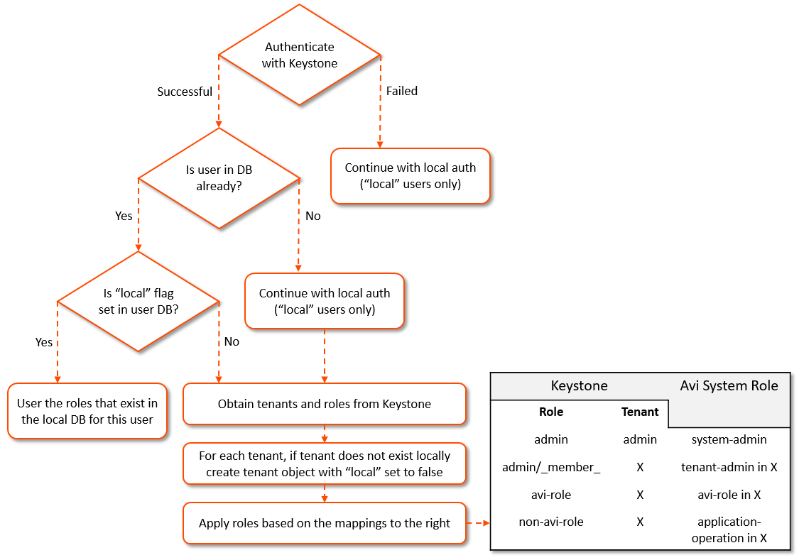

Avi Vantage may use OpenStack's Keystone service for user authentication to the Avi Controller.  Keystone v2 has been supported from v15.1 onward.  Keystone v3 is supported in v16.3 onward.

When Keystone is used for authentication, Avi Vantage may only be used with one instance of Keystone. No other remote authentication mechanism may be used. Therefore a single Vantage system may only be configured with one OpenStack cloud.  When using Keystone, Vantage sets an OpenStack flag use_keystone_auth to true.  The Vantage internal <a href="/default-system-accounts/">system accounts</a>, such as *admin*, will maintain an internal local flag, denoting they are locally authenticated as illustrated below.

 

### Role Importing Pre v15.3

We have made one major change in the way roles imported from OpenStack Keystone are mapped to the roles in Avi Controller. In Pre-15.3 versions, the flexibility for controlling the mapping for roles was limited and cumbersome. For each Keystone role foo, admins had to create a role in Avi, exactly named as foo and specify the privileges; otherwise, Avi Controller would automatically map that Keystone role to the Application-Operator role in Avi Controller.

### Role Importing Post v15.3

From v15.3 onward, we allow admins to configure an explicit mapping via the Avi Cloud resource APIs. A new parameter role_mapping in openstack_configuration defines how a user’s roles from OpenStack Keystone are mapped to roles in Avi Controller. Following is an example configuration for the role_mapping parameter:

<pre><code class="language-lua">"openstack_configuration": {
   ....
   "role_mapping": [
      {"os_role": "admin", "avi_role": "Tenant-Admin"},
      {"os_role": "_member_", "avi_role": "Tenant-Admin"},
      {"os_role": "*", "avi_role": "Application-Operator"}
   ],
}</code></pre>  

Note that the role_mapping parameter is an ordered list, where each item specifies how a Keystone role (os_role) maps to a role in Avi Controller (avi_role). One can define a default mapping for any Keystone role by specifying the “/*” wildcard for the os_role field. In the above example, roles admin and _member_ from Keystone are mapped to the role *Tenant-Admin* in Avi Controller. Further, any other role from Keystone is mapped to Avi role *Application-Operator*.

Following is another example that allows only users with role *lbaas_project_admin* to access the Avi Controller:

<pre><code class="language-lua">"openstack_configuration": {
   ....
   "role_mapping": [
      {"os_role": "lbaas_project_admin", "avi_role": "Tenant-Admin"},
   ],
   ....
}</code></pre>  