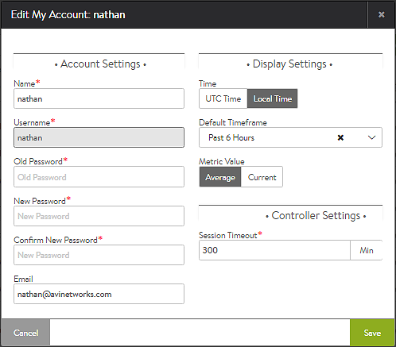
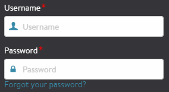

### Reset a Known Password

To reset a password that is known for a local user or admin account, first log into the account. Select the username in the top-right corner of the GUI and navigate to My Account. Enter the old password followed by the new password.
> Note:  An administrator may change other users' passwords via the User account page, but may only change their own password via the page.
 

### Local User Password Recovery

**User-Initiated:**  If SMTP email has been configured for Vantage, locally authenticated users can make a reset-password request via the GUI. From the login screen, a blue *Forgot Your Password* link floats below the password field. An email is sent to user’s email-id configured in the Administration > Account > User page. The email contains a link to reset the password. If SMTP has not been configured, the *Forgot Your Password* link does not appear.
> Note:  The user account must have a valid email configured for the account, and Vantage must have access to an SMTP server.
 

See the <a href="/email-smtp/">Email / SMTP</a> article for help configuring email from Avi Vantage.

**Admin-Initiated:**  Any administrator or user who has *write* privileges to User objects can change the password for a local user. From the admin account, navigate to Administration > Account > User and edit the account to be reset. Either input a new password or select the Generate button to create a random password for the user. Note that while the password has been reset upon saving, the administrator must still copy and manually send this new password to the user.

### Remote User Password Recovery

Password recovery for users who are remotely authenticated through <a href="/ldap-authentication/">LDAP </a>or <a href="/tacacs-authentication/">TACACS </a>must be performed with the remote auth server.  With remote authentication, Vantage does not maintain user passwords and does not participate in the password recovery process.

### Admin User Password Recovery

**Email Reset:**  If SMTP has been configured for Vantage, an admin account may be reset the same as any other user account. Clicking the password reset link on the login screen will send a password reset email to the configured email address for the admin account. If SMTP has not been configured, the password reset link does not appear.

See the <a href="/email-smtp/">Email / SMTP</a> article for help configuring email from Avi Vantage.
> Note:  If the above option is not available, there is no recovery of the admin account.  Avi Networks strongly recommends validating resilient password recovery by testing the above option.
 