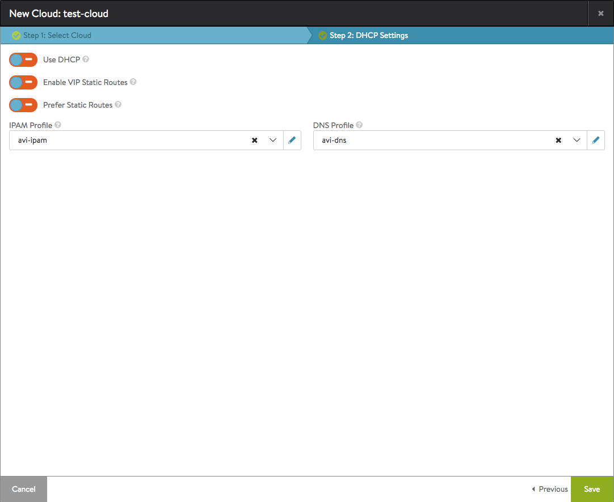
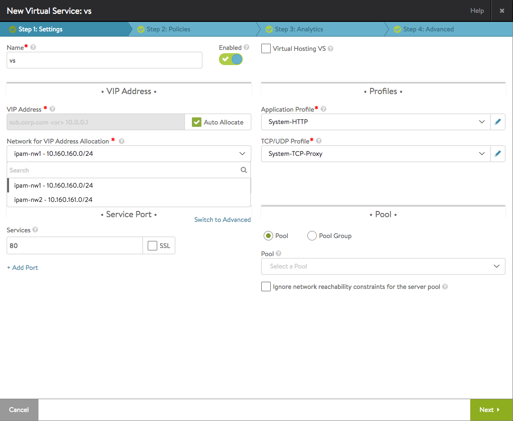
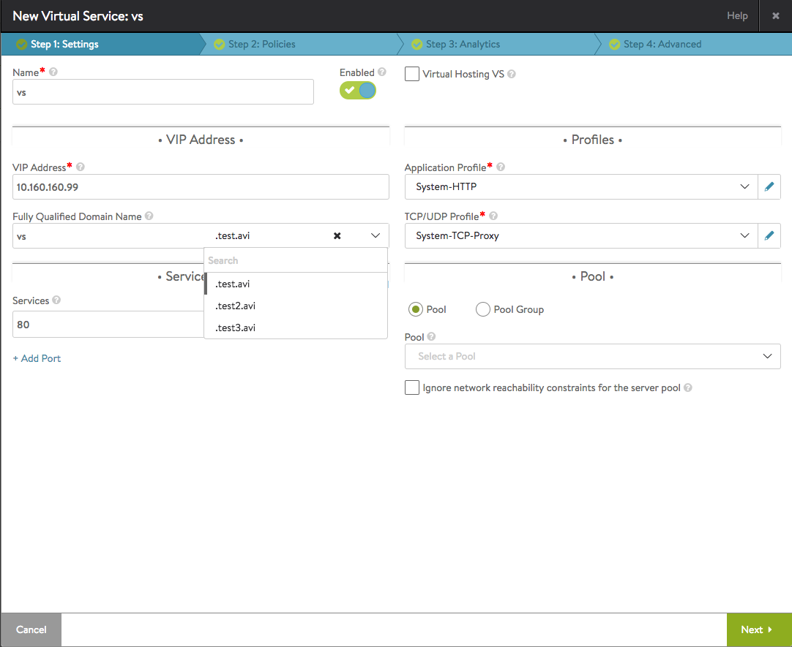
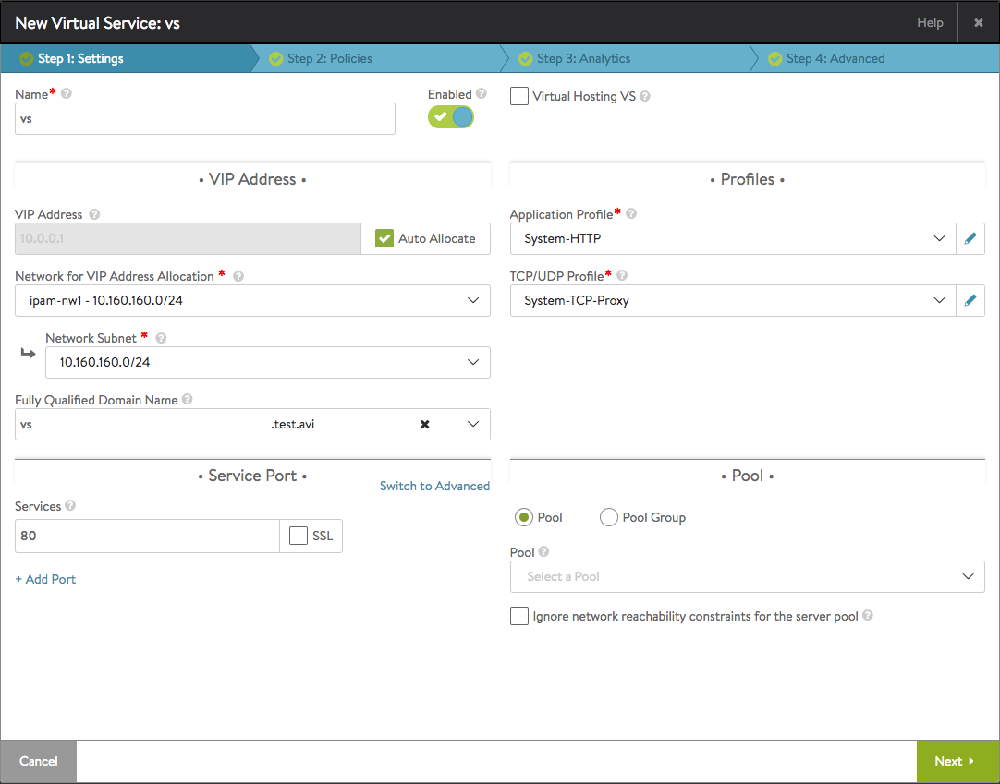

Avi Vantage can be configured to provide automatic IP address allocation for virtual services and to provide authoritative DNS resolution for their virtual IP addresses. Use this article to learn:

* <a href="#IPAM_and_DNS_Provider_Support_Matrix">What IPAM and DNS providers are supported</a>
* <a href="#IPAM_DNS_Support_for_Cloud_Infrastructure">What IPAM and/or DNS provider choices exist, on a per-cloud-type basis</a>
* <a href="#General_Cloud_Configuration_Workflow">General configuration workflow</a>
* <a href="#Configuring_the_IPAM_DNS_Profiles_by_Provider_Type">Provider-specific IPAM/DNS profile configuration</a>
* <a href="#Using_the_IPAM_DNS_Profiles_in_a_VS_Configuration">How to use these profiles in a virtual service configuration</a> 

## IPAM and DNS Provider Support Matrix

This table lists all supported providers and what kind of services are accepted from them:

<table class="table table table-bordered table-hover">  
<tbody>       
<tr>     
<th>Provider
</th>
<th>DNS
</th>
<th>IPAM
</th>
<th>IPAM+DNS simultaneously

</th>
</tr>
<tr>     
<td>Avi Vantage</td>
<td>Yes</td>
<td>Yes</td>
<td>Yes</td>
</tr>
<tr>     
<td>Amazon Web Services (AWS)</td>
<td>No</td>
<td>Yes</td>
<td>No</td>
</tr>
<tr>     
<td>Google Cloud Platform (GCP)</td>
<td>No</td>
<td>Yes</td>
<td>No</td>
</tr>
<tr>     
<td>Infoblox</td>
<td>No</td>
<td>No</td>
<td>Yes</td>
</tr>
<tr>     
<td>OpenStack</td>
<td>No</td>
<td>Yes</td>
<td>No</td>
</tr>
</tbody>
</table> 

Specifically,

* If Avi Vantage is the chosen provider, the Avi Vantage user has the option to use IPAM, DNS, or both simultaneously
* If Infoblox is the chosen provider, both IPAM and DNS profiles must use Infoblox
* In AWS, GCP, and OpenStack environments, you can use the respective cloud-native IPAM services 

## IPAM/DNS Support for Cloud Infrastructure

This table lists the IPAM and DNS provider support available for each type of cloud (infrastructure) configured in Avi Vantage:

<table class="table table table-bordered table-hover">  
<tbody>          
<tr>     
<th>Provider =>
</th>
<th>**Infoblox**
</th>
<th colspan="2">**Avi Vantage
Internal**
</th>
<th colspan="2">****Cloud-native****
</th>
</tr>
<tr>       
<th>Cloud Infrastructure
</th>
<th>**IPAM+DNS**
</th>
<th>**IPAM**
</th>
<th>**DNS**
</th>
<th>**IPAM**
</th>
<th>**DNS**
</th>
</tr>
<tr>       
<td>VMware vCenter</td>
<td>Yes</td>
<td>Yes</td>
<td>Yes</td>
<td>N/A</td>
<td>N/A</td>
</tr>
<tr>       
<td>OpenStack</td>
<td>No</td>
<td>No</td>
<td>Yes</td>
<td>Yes (default)</td>
<td>N/A (not used)</td>
</tr>
<tr>       
<td>Amazon Web Services</td>
<td>No</td>
<td>No</td>
<td>Yes</td>
<td>Yes (default)</td>
<td>Yes (default)</td>
</tr>
<tr>       
<td>Google Cloud Platform</td>
<td>No</td>
<td>No</td>
<td>Yes</td>
<td>Yes</td>
<td>No</td>
</tr>
<tr>       
<td>Containers (Mesos/Kubernetes/Rancher/Docker UCP)</td>
<td>Yes</td>
<td>Yes</td>
<td>Yes</td>
<td>Yes</td>
<td>No</td>
</tr>
<tr>       
<td>Linux Server (bare metal)</td>
<td>Yes</td>
<td>Yes</td>
<td>Yes</td>
<td>Yes</td>
<td>No</td>
</tr>
<tr>       
<td>No access</td>
<td>Yes</td>
<td>Yes</td>
<td>Yes</td>
<td>Yes</td>
<td>No</td>
</tr>
</tbody>
</table> 

For example,

* When creating virtual services in OpenStack or AWS cloud, a separate configuration for IPAM is not needed/allowed, since the cloud configuration has support for IPAM natively in Avi Vantage.  
    * "Default" means Avi accepts the cloud's IPAM/DNS support without additional action on the part of the Avi Vantage admin
    * Avi Vantage supports Route 53 when AWS is the cloud provider configuration in Avi.
    * "Not used" means, although the cloud supports DNS, Avi Vantage does not use it
* When creating a virtual service in "Linux Server" cloud in AWS/GCP environment, you can use the cloud-native IPAM solution of AWS/GCP
* Avi Vantage DNS service can be used with all these clouds. 

## General Configuration Workflow

Initial configuration is common to both IPAM and DNS. This section lists the steps for configuring IPAM and DNS support. The configuration fields differ among the infrastructure types and the provider (Avi Vantage, Infoblox, AWS, GCP, and OpenStack). See the sections following this one for detailed steps.
<ol> 
 <li>Navigate to Templates &gt; Profiles.</li> 
 <li>Click IPAM/DNS Profile.</li> 
 <li>Click Create and select the provider: 
  <ul> 
   <li>Internal</li> 
   <li>Infoblox</li> 
   <li>AWS (IPAM only)</li> 
   <li>GCP (IPAM only)</li> 
   <li>OpenStack (IPAM only)</li> 
  </ul> </li> 
 <li>Fill in the displayed fields. (Detailed steps are provided in the sections below.)</li> 
 <li>Click Save. The profile appears in the list.</li> 
 <li>Navigate to Infrastructure &gt; Clouds, and edit the cloud setting.</li> 
 <li>Select the IPAM and DNS providers from the pull-down list. Either one or both need to be selected, based on the provider selected.  For example: if Infoblox is the IPAM provider, it must be the DNS provider as well.</li> 
 <li>(Optional) For east-west virtual services in this cloud, you need to additionally select east-west IPAM and DNS providers from the pull-down list. Either one or both can be selected.</li> 
 <li>Click Save.</li> 
</ol> 
<figure class="thumbnail wp-caption aligncenter">   
<figcapture> Sample cloud configuration with IPAM & DNS from steps 1 through 9 
</figcapture>
</figure> 

## Configuring the IPAM/DNS Profiles by Provider Type

IPAM and/or DNS profiles can be configured to use the following providers:

* <a href="/avi-vantage-ipam/">Avi Vantage IPAM</a>
* <a href="/dns-provider-avi-vantage-16-3">Avi Vantage DNS</a>
* <a href="/ipam-provider-aws-16-3/">AWS IPAM </a>
* <a href="/ipam-services-for-applications-running-on-instances-in-google-cloud-platform/">GCP IPAM</a>
* <a href="/ipam-and-dns-provider-infoblox-16-3/">Infoblox IPAM and DNS</a>
* <a href="/ipam-provider-openstack-16-3/">OpenStack IPAM</a> 

## Using IPAM/DNS in a VS Configuration

The following examples are cloud-independent.

**IPAM only.** With IPAM in play, selecting the Auto Allocate checkbox causes the **Network for VIP Address Allocation** selection box to appear. From a list of displayed networks and subnets a choice can be made; in this case, either <code>ipam-nw1</code> or <code>ipam-nw2</code> can be selected. From the selected network (<code>ipam-nw1</code>) an address for the VIP will be auto-allocated.

<figure class="thumbnail wp-caption aligncenter">   
<figcapture> IPAM is the only option for this virtual service. 
</figcapture>
</figure> 

 

**DNS only**. With DNS in play, no list of networks is offered. Instead, one of several domains is offered. By selecting <code>.test.avi</code> from the list and accepting the default prefix (<code>vs)</code> in the **Fully Qualified Domain Name** field, the user is specifying <code>vs.test.avi</code> as the final FQDN.

<figure class="thumbnail wp-caption aligncenter">   
<figcapture> DNS is the only option for this virtual service. 
</figcapture>
</figure> 

 

**IPAM and DNS**. With both IPAM and DNS available, the user can both specify a network from which to auto-allocate a VIP address and the FQDN (<code>vs.test.avi</code>) to which it will be associated.

<figure class="thumbnail wp-caption aligncenter">   
<figcapture> Both IPAM and DNS are options for this virtual service. 
</figcapture>
</figure> 

 

Note:
<ol> 
 <li>If a DNS profile is configured under a cloud where the virtual service is being created, then the virtual service's IP cannot be determined from a fully qualified domain name; the user is expected to enter an IP address or select the Auto Allocate checkbox.</li> 
 <li>In the case of Infoblox, if there is a list of usable_subnets/usable_domains configured (refer to section for Infoblox above in this article), then the dropdown will consist only of those entries. If no such configuration is found, Avi Vantage will display the entire list of available subnets/domains from Infoblox.</li> 
</ol> 