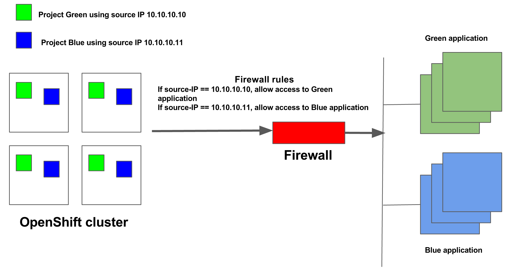

Beginning with release 16.3.4, Avi Vantage can securely identify OpenShift projects using source IP addresses for traffic initiated from within the OpenShift cluster to outside applications.

### Use Case For Authorized Source IP

In some deployments, it may be required to identify traffic based on source IP address, to provide differential treatment based on the application. For example, in DMZ deployments there may be firewall, security, visibility, and other type of solutions that may need to validate clients prior passing their traffic on to an application. Such deployments use the source IP to validate the client.

Traffic initiated from within OpenShift clusters to outside applications is masqueraded. The actual source of this traffic is lost to the remote application.

In the following example, source IP 10.10.10.10 securely identifies Project Green and source IP 10.10.10.11 securely identifies Project Blue.

Avi Vantage network security policies prevent pods belonging to projects other than Green from using source IP 10.10.10.10; so, the remote application/firewall can securely identify Project Green using the source IP 10.10.10.10.

### Configuring an Authorized Source IP Instance

### Prerequisites

Avi Vantage should be providing east-west services for the cluster. Refer to <a href="/avi-vantage-openshift-installation-guide/#CONFIGURE_NETWORKS">this section </a>in the installation KB on how this should be configured.

Configuring an authorized source IP instance is a two-step process,
<ol> 
 <li>Deploy a secure Avi egress pod</li> 
 <li>Create a secure service for the pod</li> 
</ol> 

These are detailed below.

### 1. Deploy a Secure Avi Egress Pod

### Pod definition for a Avi egress pod (avi-egress-pod.yaml)

<pre><code class="language-lua">apiVersion: v1
kind: Pod
metadata:
  name: avi-egress-1
  labels:
    name: avi-egress-1
spec:
  containers:
  - name: avi-egress-router
    image: avinetworks/avi-egress-router
    securityContext:
      privileged: true
    imagePullPolicy: IfNotPresent
    env:
    - name: EGRESS_SOURCE
      value: 10.70.119.252
    - name: EGRESS_DESTINATION
      value: 10.10.24.85
    - name: BRIDGE_IP_ADDR
      value: 172.18.0.1
    - name: BRIDGE_NETMASK
      value: "16"
    - name: TCP_HM_PORT
      value: "4"
    volumeMounts:
      - mountPath: /hostroot/var/run
        name: run
      - mountPath: /hostroot/proc/1/ns/net
        name: ns1
    ports:
      - name: foo
        containerPort: 8080
        protocol: TCP
      - name: bar
        containerPort: 8443
        protocol: TCP
    livenessProbe:
      tcpSocket:
        port: 4
      initialDelaySeconds: 10
      periodSeconds: 3
      failureThreshold: 3
  volumes:
  - name: run
    hostPath:
      path: /var/run
  - name: ns1
    hostPath:
      path: /proc/1/ns/net</code></pre>  <code>EGRESS_SOURCE</code> uniquely identifies the project. It should be a free IP address from the subnet to which OpenShift nodes are connected. 

<code>EGRESS_DESTINATION</code> is the destination IP address of the application outside the cluster.

<code>BRIDGE_IP_ADDR IP</code> is the IP address of the Avi bridge, the default for which is 172.18.0.1. This address is configurable via field ‘avi_bridge_subnet’ in an OpenShift cloud object.

<code>BRIDGE_NETMASK</code> is the netmask bits for the Avi bridge, the default for which is 16.

<code>TCP_HM_PORT</code> is the port used for TCP Health Monitoring. Defaults to port 4 if not set. If set to a different value, change the "port" field in the "livenessProbe" section above to match this port value.

Avi egress pod has a TCP listener at port TCP_HM_PORT for Health Monitoring purposes. The Pod is configured with a livenessProbe for Health Monitoring.

### Create the Pod Using OpenShift Client

<code>  &gt;oc create -f avi-egress-pod.yaml  </code>

### 2. Create a Secure Service for the Pod

### Service definition for a secure east-west service (<code>secure-egress-service.json</code>)

<pre><code class="language-lua">{
  "kind": "Service",
  "apiVersion": "v1",
  "metadata": {
    "name": "secure-egress-service",
    "labels": {
        "svc": "secure-egress-service"
    },
    "annotations": {
        "avi_proxy": "{\"networksecuritypolicy\": {\"rules\": [{\"index\": 1000, \"enable\": true, \"name\": \"allowtenant\", \"action\": \"NETWORK_SECURITY_POLICY_ACTION_TYPE_ALLOW\", \"match\": {\"microservice\": {\"match_criteria\": \"IS_IN\", \"group_ref\": \"/api/microservicegroup/?name=default-avi-microservicegroup\"}}}, {\"index\": 2000, \"enable\": true, \"name\": \"defaultdeny\", \"action\": \"NETWORK_SECURITY_POLICY_ACTION_TYPE_DENY\", \"match\": {\"client_ip\": {\"match_criteria\": \"IS_IN\", \"prefixes\": [{\"ip_addr\": {\"type\": \"V4\", \"addr\": \"0.0.0.0\"}, \"mask\": 0}]}}}]}}"
    }
  },
  "spec": {
    "ports": [
    {
      "name": "foo",
      "port": 80
    }
    ],
    "selector": {
      "name": "avi-egress-1"
    },
    "type": "LoadBalancer"
  }
}</code></pre>  Avi Vantage automatically creates and maintains a microservicegroup per project that reflects all the current pods in that project. In the above policy, the first rule allows the microservicegroup “ default-avi-microservicegroup, ” which allows all pods in the “default” project. The second rule denies all other pods from accessing the service. This has the effect of just allowing pods in the “default” project to access this service. 

### Create the service using OpenShift client

<code>  &gt;oc create -f secure-egress-service.json  </code>

### Service Usage

Pods in the “default” project can access the external application using the name secure-egress-service.default.sub-domain. 

* Avi DNS will resolve secure-egress-service.default.sub-domainto the service virtual IP on port 80 or any other port specified in the service definition
* Access to the virtual IP will be proxied to the secure egress Avi pod by the local Avi Service Engine
* Secure egress Avi pod will source NAT the traffic (using <code>EGRESS_SOURCE</code> IP addr)  to the remote application and use a destination IP address of <code>EGRESS_DESTINATION</code>. 

 

The remote application will see traffic with a source IP address of <code>EGRESS_SOURCE</code> and destination IP address of <code>EGRESS_DESTINATION</code> on port 80.

### Access Patterns

 

<table class="table table-hover table table-bordered table-hover">  
<tbody>      
<tr>    
<td>Source</td>
<td>Destination</td>
<td>Comments</td>
</tr>
<tr>    
<td>Pod in “default” project</td>
<td>Service virtual IP</td>
<td>Allowed</td>
</tr>
<tr>    
<td>Pod in “default” project</td>
<td>Secure egress Avi pod</td>
<td>Allowed</td>
</tr>
<tr>    
<td>Pod in a different project</td>
<td>Service virtual IP</td>
<td>Denied by Avi</td>
</tr>
<tr>    
<td>Pod in a different project</td>
<td>Secure egress Avi pod</td>
<td>Denied by OpenShift SDN</td>
</tr>
</tbody>
</table> 

 

### High Availability

When a secure Avi egress pod re-starts or the host is down, OpenShift starts another instance of the pod and the service virtual IP always proxies to the right pod IP address.
