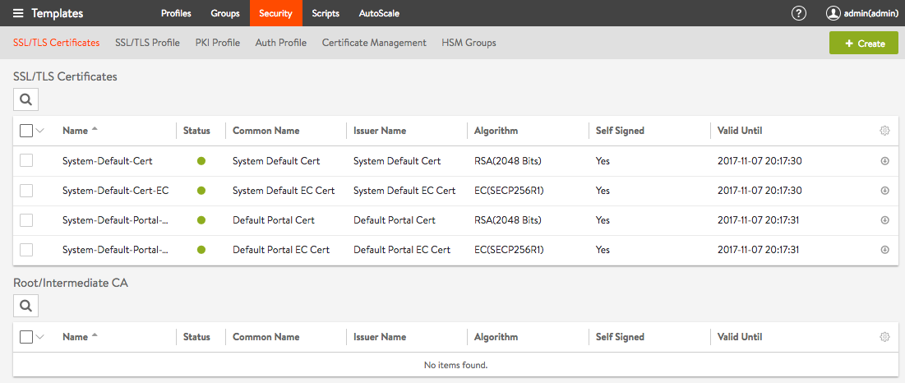
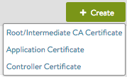

Avi Vantage supports terminating client SSL and TLS connections at the virtual service. This requires Vantage to send a certificate to clients that authenticates the site and establishes secure communications. A virtual service that handles secure connections will require both of the following:

* **SSL/TLS profile**:  Determines the supported ciphers and versions.  See <a href="/ssl-tls-profile/">SSL Profile</a>.
* **SSL certificate**:  A certificate is presented to clients connecting to the site. SSL certificates may also be used to present to administrators connecting to the Vantage web interface or API, and also for Avi Service Engines to present to servers when SE-to-server encryption is required with client (the SE) authentication. 

The SSL Certifications tab on the Templates > Security page shown below supports import, export, and generation of SSL certificates or certificate requests.

From this page different kinds of certificates may be created:

Newly-created certificates may be either self-signed by Avi Vantage or created as a certificate signing request (CSR) that must be sent to a trusted certificate authority (CA), which then generates a trusted certificate.

* Creating a self-signed certificate generates both the certificate and a corresponding private key.
* Imported existing certificates are not valid until a matching key has been supplied.
* Avi Vantage supports PEM and PKCS #12 formatted certificates. 

### SSL/TLS Certificates Page

Select Templates > SSL/TLS Certificates to open the SSL/TLS Certificates page. This page includes the usual functions, search, create, edit, and delete.  It also has an icon for Export, which opens a page with the private key and public cert.  Viewing or exporting the private key generates a system event, tracking the administrator's export action.  Avi Networks recommends using role-based access to control which users are allowed to use a certificate versus export the key.

The table on the certificates page contains the following information for each certificate:

* **Name**:  User-friendly name of the certificate. Mousing over the name of the cert will display any intermediate cert that has been automatically associated with the cert.
* **Status**:  The known status of the certificate.  This is green for good, or yellow, orange, or red if the cert is expiring soon or has already expired, and gray if the cert is incomplete.
* **Common Name**:  Fully-qualified name of the site to which the certificate applies. For the site to be considered trusted, this entry must match the hostname the client enters in their browser .
* **Issuer Name**:  Name of the certificate authority.
* **Algorithm**:  This will be either EC (elliptic curve cryptography) or RSA.
* **Self-Signed**:  Whether the certificate is self-signed by Vantage or signed by a Certificate Authority.
* **Valid Until**:  Date and time when the certificate expires. 

### Create Certificate

When creating a new certificate, the first decision is which type of cert:

* **Root/Intermediate CA Certificate**:  This cert type is used to automatically create the certificate chain for application certificates.  There are no configuration options other than import the cert via a file or paste the text.  The root/intermediate cert will show up in a separate table at the bottom of the SSL certificates page.  It is recommended to import the root/intermediate certificate prior to importing an application cert that relies on the intermediate for the chain.
* **Application Certificate**:  This cert is used for normal SSL termination and decryption on Vantage.  This option is also used to import or create a client certificate for Vantage to present to a backend server when Vantage needs to authenticate itself.
* **Controller Certificate**:  This certificate is used for the GUI and API for the Controller cluster.  Once uploaded, select the cert via Administration > Settings > Access Settings. 

To create a new application or controller certificate, populate the following fields:

* **Name**:  Enter a unique, user-friendly name for the certificate.
* **Type**:  Select the type of certificate to create:
* 
    * **Self Signed**:  Quickly create a test certificate that is signed by Vantage. Client browsers will display an error that the certificate is not trusted.
    * **CSR**:  Create a valid certificate by first creating the certificate request. This request must be sent to a certificate authority, which will send back a valid certificate that must be imported back into Vantage.
    * **Import**:  Import a completed certificate that was either received from a certificate authority or exported from another server. 

### Self-Signed Certificates

Avi Vantage can generated self-signed certificates. Client browsers do not trust these certificates and will warn the user that the virtual service's certificate is not part of a trust chain. Self-signed certificates are good for testing or environments where administrators control the clients and can safely bypass the browser's security alerts. Public websites should never use self-signed certificates. The virtual service health score may reflect a security penalty. If the HTTP application profile has HTTP Strict Transport Security (HSTS) enabled, clients may not be able to access a site with a self-signed certificate.

To create a self-signed cert:

* **Common Name**:  Enter the fully-qualified name of the site, such as www.avinetworks.com. For the site to be considered trusted, this entry must match the hostname the client entered in the browser.
* **Organization**:  Company or entity registering the certificate, such as Avi Networks, Inc. (optional).
* **Organization Unit**:  Group within the organization that is responsible for the certificate, such as Development (optional).
* **Country**:  Country in which the organization is located (optional).
* **State**:  State in which the organization is located (optional).
* **Locality**:  City of the organization (optional).
* **Email**:  The email contact for the certificate (optional).
* **Subject Alternate Name (SAN)**: The Subject Alternate Name (SAN) lets you specify additional host names to be protected by a single SSL certificate, such as example.com and example.org. The are essentially the alternative identities of the subject that is specified in the Certificate.
* **Algorithm**:  Select either EC (elliptic curve cryptography) or RSA. RSA is older and considered less secure than ECC, but is more compatible with a broader array of older browsers. ECC is newer, less computationally expensive, and generally more secure; however, it is not yet accepted by all clients. Vantage allows a virtual service to be configured with two certificates at a time, one each of RSA and ECC. This enables Vantage to negotiate the optimal algorithm or cipher with the client. If the client supports ECC, Vantage will prefer this algorithm, which gives the added benefit of supporting perfect forward secrecy, which brings better security at minimum additional computational cost.
* **Key Size**:  Select the level of encryption to be used for handshakes:  
    * 2048-bit is recommended for RSA certificates. Higher values may provide stronger encryption, but dramatically increase the CPU resources required by both Avi Vantage and the client. For stronger encryption, use ECC certs instead.
    * secp256r1 is used for ECC certificates.
* **Enable HSM Certificate**:  Rather than store the private key locally on the Avi Controller or Avi Service Engine, it is maintained in an external hardware security module.  This option enables referencing an HSM profile containing information about communicating with the HSM. 

### CSR Certificates

The certificate signing request (CSR) is the first of three steps involved in creating a valid SSL/TLS certificate. The request contains the same parameters as a self-signed certificate; however, Avi Vantage does not sign the completed certificate. Rather, it must be signed by a certificate authority that is trusted by client browsers.

The configuration options for a certificate signing request are the same as for self-signed certificates.  See the descriptions above for definition of each field.

Once completed, forward the completed CSR to any trusted certificate authority (CA), such as Thawte or Verisign. Do so by selecting the Certificate Signing Request at the bottom left of the Add Certificate popup. Then either copy-paste it directly to the CA's website or save it to a file for later use.

Once the CA issues the completed certificate, either paste or upload it into the Certificate field at the bottom right of the Add Certificate popup. The certificate is not usable on Vantage until this step is complete.

Note:  It can take several days for the CA to return the finished certificate. Meanwhile, you can close the Add Certificate popup to return to the SSL/TLS Certificates page. The new certificate will appear in the table with a gray status, indicating it is still waiting for the completed cert. When you receive the completed certificate, click the edit icon for the certificate to open the Edit Certificate, paste the certificate, and click Save to finish.

### Import Certificates

You may directly import an existing PEM or PKCS /#12 SSL/TLS certificate into Avi Vantage (such as from another server or load balancer). A certificate will have a corresponding private key, which must also be imported. Vantage automatically generates the key for self-signed or CSR certificates, hence such certs do not require separate steps for the key.

To import the certificate:

* **Key**:  Add the private key via one of the two methods below. Switch between the two methods via the green radio buttons.
* **Upload File**:  Click the Upload File button, select the PEM or PKCS #12 file, then click the green Validate button to parse the file. If the upload is successful, the Key field will be populated.
* **Paste**:  Copy and paste a PEM key into the Key field. Take care not introduce extra characters in the text, which can occur when using some email clients or rich text editors. If you copy and paste the key and certificate together as one file, click the Validate button to parse the text and populate the Certificate field. PKCS #12 is a binary format, which cannot be copied-pasted or use this method.  PKCS #12 files contain both the certificate and key, which may or may not be true for PEM files. Both the Certificate and Key fields will populate if the same PEM file contains both components.

* Certificate:  Add the cert in the Certificate field if this is not already populated from the previous step. You may do this by copying-pasting or file upload, as described above.
* **Key Passphrase**:  If desired, you may add and validate a key passphrase to encrypt the private key.
* **Import**:  Select Import to finish adding the new certificate and key. The key will be embedded with the certificate and treated as one object within the Avi Vantage UI. 

### Certificate Authority

Certificates require a trusted chain of authority to be considered valid. If the certificate used is directly generated by a certificate authority that is known to all client browsers, no cert chain is required. However, if there are multiple levels required, an intermediate certificate may be necessary. Clients will often traverse the path indicated by the certificate to validate on their own if no chain cert is presented by a site, but this adds additional DNS lookups and time for the initial site load. The ideal scenario is to present the chain certs along with the site cert.

If a chain certificate, or rather a certificate for a certificate authority, is uploaded via the root/intermediate certificate create option, it will be added to the Certificate Authority section. Vantage will automatically build the cert chain if it detects a next link in the chain should exist.

To validate a certificate has been attached to a chain cert, mouse over the certificate’s name in the SSL Certificates table at the top of the page.

Vantage supports multiple chain paths. For instance, an RSA cert and an ECC cert are both named www.avinetworks.com. Each may share the same CA issuer, or they may be chained to different issuers.

 
