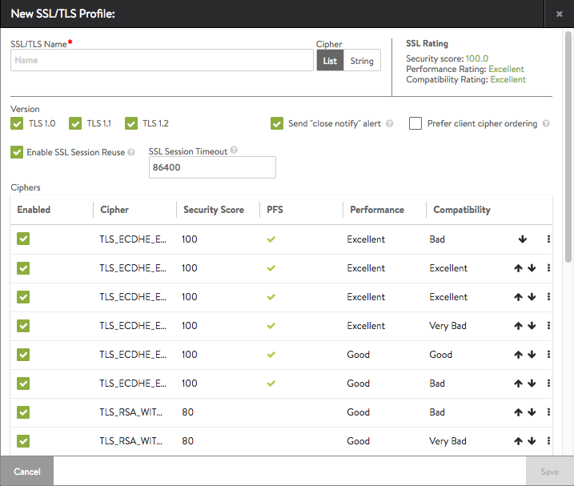

Avi Vantage supports the ability to terminate SSL connections between the client and the virtual service, and to enable encryption between Vantage and the back-end servers. The Templates > Security SSL/TLS Profile contains the list of accepted SSL versions and the prioritized list of SSL ciphers. To terminate client SSL connections, both an SSL profile and an SSL certificate must be assigned to the virtual service. To also encrypt traffic between Avi Vantage and the servers, an SSL profile must be assigned to the pool. When creating a new virtual service via the basic mode, the default system SSL profile is automatically used.

Each SSL profile contains default groupings of supported SSL ciphers and versions that may be used with RSA or an elliptic curve certificates, or both. Ensure that any new profile created includes ciphers that are appropriate for the certificate type that will be used. The default SSL profile included with Avi Vantage is optimized for security, rather than just prioritizing the fastest ciphers.

Creating a new SSL/TLS profile or using an existing profile entails various trade-offs between security, compatibility, and computational expense. For example, increasing the list of accepted ciphers and SSL versions increases the compatibility with clients, while also potentially lowering security.

### SSL Profile Settings

Select Templates > Security > to open the SSL/TLS Profile page.

The table on this tab provides the following information for each SSL/TLS profile:

* **Name**:  Name of the profile.
* **Accepted Ciphers**:  List of ciphers accepted by the profile, including the prioritized order.
* **Accepted Versions**:  SSL and TLS versions accepted by the profile. 

### Create an SSL Profile

To create or edit an SSL profile, click Create to see a window such as depicted in the screenshot.

* **SSL/TLS Name**:  Enter a unique name for the SSL/TLS profile.
* **Cipher View**:  Ciphers may be chosen from the default List view or a String.  The String view is for compatibility with OpenSSL-formatted cipher strings.  When using String view, Avi Vantage does not provide an SSL rating, nor a score for the selected ciphers.
* **SSL Rating**:  This is a simple rollup of the security, compatibility, and performance of the ciphers chosen from the list.  Often ciphers may have great performance but very low security.  The SSL rating attempts to provide some insight into the outcome of the selected ciphers.  Avi Networks may change the score of certain ciphers from time to time as new vulnerabilities are discovered.  This does not impact or change an existing Avi Vantage deployment, but it does mean the score for the profile, and potentially the security penalty of a virtual service, may change to reflect the new information.
* **Version**:  Avi Vantage only supports version TLS 1.0 and newer.  Older SSL v2 and v3 are no longer secure or supported.
* **Send Close Notify Alert**:  Gracefully inform the client of the closure of an SSL session.  This is similar to TCP doing a FIN/ACK rather than an RST.
* **Prefer client cipher ordering**: Off by default, set this to on if you prefer the client's ordering.
* **Enable SSL Session Reuse**: On by default, this option persists a client's SSL session across TCP connections after the first occurs.
* **SSL Session Timeout:** Set the length of time in seconds before an SSL session expires.
* **Ciphers**:  When negotiating ciphers with the client, Avi Vantage will give preference to ciphers in the order listed. The default cipher list prioritizes elliptic curve with PFS, followed by less secure, non-PFS and slow RSA-based ciphers.  Enable, disable, and reorder the ciphers via the List view.  In the String view, manually enter the cipher strings via the <a href="https://www.openssl.org/docs/manmaster/apps/ciphers.html">OpenSSL format</a>. You may use an SSL/TLS profile with both an RSA and an elliptic curve certificate. These two types of certificates can use different types of ciphers, so it is important to incorporate ciphers for both types in the profile if both types of certs may be used. As with all security, Avi Networks recommends diligence to understand the dynamic nature of security and to ensure that Avi Vantage is always up to date.
