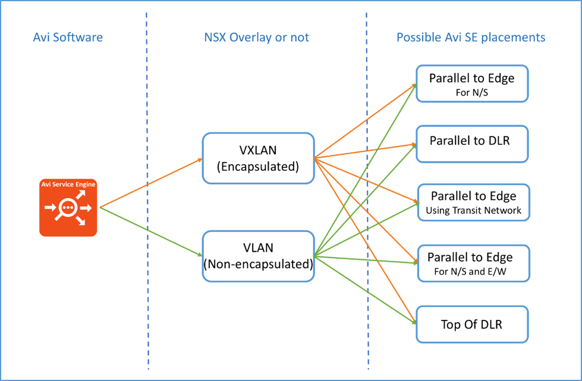

## Overview

Software-defined data center (SDDC) architectures, incorporating server, storage, and network virtualization, have already proven valuable in reducing the cost and complexity of computing infrastructure. VMware NSX network virtualization provides the third critical pillar of the SDDC, extending the same benefits to the DC network by accelerating network service provisioning, simplifying network operations, and improving network economics.

VMware NSX-V is the leading network virtualization solution in the market today and is being deployed across all vertical markets and market segments. NSX reproduces L2-L7 networking and security, including L2 switching, L3 routing, firewalling, load balancing, and IPSEC/VPN secure access. Its services are implemented completely in software, enabling them to be programmatic provisioned and managed. More information about these functions is available in the <a href="https://communities.vmware.com/docs/DOC-27683">VMware® NSX for vSphere Network Virtualization Design Guide</a>.

The Avi Vantage Platform delivers automated application services including load balancing, application analytics, predictive autoscaling, and security for on-premises or public-cloud applications. The platform is built on software-defined principles, runs on commodity x86 servers, VMs, or containers, and matches the automation and self-service goals of modern enterprises. Avi Vantage mirrors the needs of software-defined data centers and public clouds using a distributed architecture which separates the control (central controller) and data (distributed load balancers) planes.

This design guide provides recommended practices and topologies to optimize interoperability between the NSX platform and Avi Vantage. This interoperability design guide is intended for those customers who would like to adopt SDDC architecture while ensuring compatibility and minimal disruption to their existing load balancer deployment. The recommended practice guide will provide step-by-step guidance to implement the topologies outlined in this document.

## Intended Audience

The intended audience for this document includes virtualization and network architects seeking to deploy VMware® NSXTM for vSphere® (NSX-V) in combination with Avi Vantage® software.

Note: A solid understanding based on hands-on experience with both NSX-V and Avi Vantage is a prerequisite to successfully understand this design guide.

## NSX – Avi Vantage Topology Options

Avi Vantage is available in software form factor. It is agnostic to packet encapsulation. Hence, one can deploy Avi SEs in distributed manner and connect to both VXLANs and VLANs. For all of the topologies in this design guide the internal networks are presented as VXLANs. However, each topology can be realized using either or both VXANs and VLANs. The design guide also highlights the pros and cons of each topology.

<figure class="thumbnail wp-caption aligncenter">   
<figcapture> Avi Vantage Software – Networking Technology – LB Placement Relationship 
</figcapture>
</figure> 

 

Follow the links for detailed description of each topology:

* <a href="/avi-nsx-topo1/">Topology #1: Parallel to NSX Edge Using Avi Vantage for North-South Load Balancing</a>
* <a href="/avi-nsx-topo2/">Topology #2: Parallel to DLR using VXLAN or VLANs with Avi Vantage for East-West Load Balancing</a>
* <a href="/avi-nsx-topo3/">Topology #3: Parallel to NSX Edge Using VXLAN Overlays with Avi Vantage for both North-South and East-West Load Balancing Using Transit-Net</a>
* <a href="/avi-nsx-topo4/">Topology #4: Parallel to NSX Edge Using Avi Vantage for North-South and East-West Load Balancing</a>
* <a href="/avi-nsx-topo5">Topology #5: Top of DLR with Avi Vantage for no SNAT for Web Tier</a> (Will be supported in future releases) 

 

## Pros and Cons of the Topologies

<table class="table table table-bordered table-hover">  
<tbody>       
<tr>    
<th>**Topology**
</th>
<th>**Pros**
</th>
<th>**Cons**
</th>
</tr>
<tr>    
<td><strong>Topology-1:</strong> Parallel to NSX Edge using Avi for N-S LB</td>
<td>Easy to implement.  Works on L2 and L3 fabric.</td>
<td>SNAT required.  Works only for N-S traffic.</td>
</tr>
<tr>    
<td><strong>Topology-2:</strong> Parallel to DLR using VXLAN or VLANs with Avi for E-W</td>
<td>Easy to implement.  SE is logically connected to same L2 segment with web/app VMs.  Works on L2 and L3 fabric.</td>
<td>SNAT required.  Works only for E-W traffic.</td>
</tr>
<tr>    
<td><strong>Topology-3:</strong> Parallel to NSX Edge using VXLAN overlays with Avi for both N-S and E-W using transit-net</td>
<td>Only one interface required to connect SE to internal networks.  Works for both N/S &amp; E/W traffic.  Works on L2 and L3 fabric.</td>
<td>SNAT required.</td>
</tr>
<tr>    
<td><strong>Topology-4:</strong> Parallel to NSX Edge using Avi for N-S and E-W load balancing</td>
<td>Easy to implement.

 
Both N-S and E-W is handled.
 
SE is logically connected to same L2 segment with web/app VMs.
 
Works for both N-S &amp; E-W traffic.
 
Works on L2 and L3 fabric.
</td>
<td>SNAT required.</td>
</tr>
<tr>    
<td><strong>Topology-5:</strong> Top of DLR with Avi for no SNAT for the web tier</td>
<td>SNAT is not required.

 
Client IP is preserved.
 
 
</td>
<td>Not all Edge features can be used, since is default gateway for DLR.</td>
</tr>
</tbody>
</table> 

 

## Conclusion

This document overviewed several possible NSX and Avi Vantage interoperability scenarios and included links to the network topologies to accomplish them. Avi Networks is completely integrated with VMware vCenter and fully qualified to work with NSX overlay and distributed routing technology. Avi Networks and VMware are working on a jointly developed API integration between NSX and Avi Vantage. This will enable IT organizations to fully leverage the combined strengths of NSX virtualization and automation with richer application delivery services enabled by Avi Vantage. This integration will enable users to configure Avi Vantage (virtual services, pools, etc.) dynamically, using the NSX Security Groups and auto-configure distributed firewall rules.

For more information these solutions, please <a href="https://avinetworks.com/contact-us">contact</a> your Avi Networks representative.
