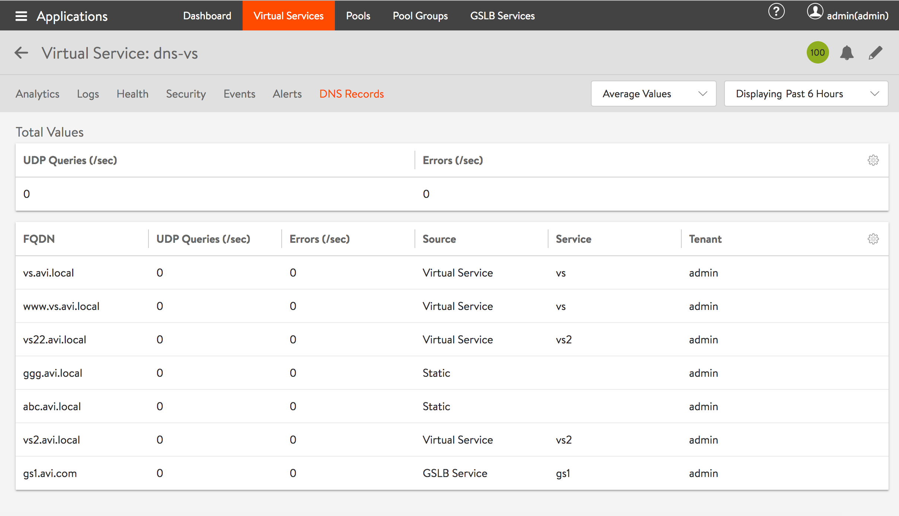

Avi DNS can host manual static DNS entries. For a given FQDN, the user can configure an A, SRV, or CNAME record to be returned. This is accomplished via the Avi CLI as documented in this article.

The configure <code>virtualservice dns-vs</code> command shows there is already an existing static custom A record for FQDN <code>ggg.avi.local</code>.

<pre><code class="language-lua">: &lt; configure virtualservice dns-vs
Updating an existing object. Currently, the object is:
+----------------------------------+-----------------------------------------------------+
| Field                            | Value                                               |
+----------------------------------+-----------------------------------------------------+
| uuid                             | virtualservice-bc7c7fc6-583e-4335-8d33-ec4670771a85 |
| name                             | dns-vs                                              |
| ip_address                       | 10.90.12.200                                        |
| enabled                          | True                                                |
| services[1]                      |                                                     |
| port                             | 53                                                  |
| enable_ssl                       | False                                               |
| port_range_end                   | 53                                                  |
| application_profile_ref          | System-DNS                                          |
| network_profile_ref              | System-UDP-Per-Pkt                                  |
| se_group_ref                     | Default-Group                                       |
| east_west_placement              | False                                               |
| scaleout_ecmp                    | False                                               |
| active_standby_se_tag            | ACTIVE_STANDBY_SE_1                                 |
| flow_label_type                  | NO_LABEL                                            |
| static_dns_records[1]            |                                                     |
| fqdn[1]                          | ggg.avi.local                                       |
| type                             | DNS_RECORD_A                                        |
| ip_address[1]                    |                                                     |
| ip_address                       | 1.1.1.1                                             |
+----------------------------------+-----------------------------------------------------+</code></pre>  

Another similar custom A record can be added:

<pre><code class="language-lua">: virtualservice&lt; static_dns_records
New object being created
: virtualservice:static_dns_records&lt; fqdn abc.avi.local
: virtualservice:static_dns_records&lt; ip_address
New object being created
: virtualservice:static_dns_records:ip_address&lt; ip_address 11.11.11.11
: virtualservice:static_dns_records:ip_address&lt; save
: virtualservice:static_dns_records&lt; type dns_record_a
: virtualservice:static_dns_records&lt; save
: virtualservice&lt; save
&lt;+----------------------------------+-----------------------------------------------------+
| Field                            | Value                                               |
+----------------------------------+-----------------------------------------------------+
| uuid                             | virtualservice-bc7c7fc6-583e-4335-8d33-ec4670771a85 |
| name                             | dns-vs                                              |
| ip_address                       | 10.90.12.200                                        |
| enabled                          | True                                                |
| services[1]                      |                                                     |
|   port                           | 53                                                  |
|   enable_ssl                     | False                                               |
|   port_range_end                 | 53                                                  |
| application_profile_ref          | System-DNS                                          |
| network_profile_ref              | System-UDP-Per-Pkt                                  |
| se_group_ref                     | Default-Group                                       |
| east_west_placement              | False                                               |
| scaleout_ecmp                    | False                                               |
| active_standby_se_tag            | ACTIVE_STANDBY_SE_1                                 |
| flow_label_type                  | NO_LABEL                                            |
| static_dns_records[1]            |                                                     |
|   fqdn[1]                        | ggg.avi.local                                       |
|   type                           | DNS_RECORD_A                                        |
|   ip_address[1]                  |                                                     |
|     ip_address                   | 1.1.1.1                                             |
| static_dns_records[2]            |                                                     |
|   fqdn[1]                        | abc.avi.local                                       |
|   type                           | DNS_RECORD_A                                        |
|   ip_address[1]                  |                                                     |
|     ip_address                   | 11.11.11.11                                         |
+----------------------------------+-----------------------------------------------------+</code></pre>  

The above command sequence will create a static entry for the FQDN <code>abc.avi.local</code> on virtual service <code>dns-vs</code>. This can also be confirmed from the GUI under Applications -< Virtual Services -< DNS Records, as illustrated below. 

