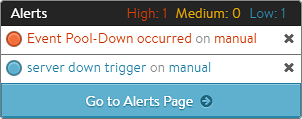

In its most generic form, alerts are a construct intended to inform administrators of significant events within Avi Vantage. In addition to triggering based on system events, alerts may also be triggered based one or more of the 200+ metrics Vantage is tracking. Once an alert is triggered, it may be used to notify an administrator through one or more of the notification actions. Or to take things a step further, alerts may trigger ControlScripts, which provide limitless scripting possibilities.

### Alert Scope

Alerts may be viewed in multiple places within the UI, including within virtual services, pools, Service Engines, and the Operations &gt; Alerts &gt; All Alerts page. Alerts viewed within VS, pools or SEs are limited to the alerts pertinent to those objects. The All Alerts page shows all alerts on the system, or all alerts within the tenant if applicable.

Alerts are transient, and will only exist or be true for a defined period of time. After the configured alert expiry time lapses, the alert is removed. The underlying event or metric that triggered the alert still exists as a permanent log of what has transpired.

### Alert Workflow

Configuring custom alerts requires walking through the workflow to build the alert config (the alert's trigger) based on one or more of 500+ events and metrics. When the alert configuration's conditions are met, Vantage processes an alert by referring to the associated alert action, which lists the notifications to be generated and potentially calls for further action, such as application autoscaling or execution of a ControlScript. The sections below provide a brief description of each component that plays a role in alerts.

* <a href="/docs/16.3/example-custom-alert-notification">Example Custom Alert Notification</a> 

 

### Events

Events are predefined objects within Vantage that may be triggered in various ways. For instance, an event is generated when a user account is created, when a user logs in, or when a user fails the login password check. Similar events are generated for server down, health score change, etc. See also:

* <a href="/docs/16.3/events-list">Events List</a>
* <a href="/docs/16.3/events-overview">Events Overview</a> 

### Metrics

Metrics are raw data points, which may be similarly used as the basis of generating an alert. A metric may be something simple, such as the point in time a client sends a SYN to connect to a virtual service. An alert may be triggered though if the client sends more than 500 SYNs within a 5 minute window. With this example, an alert is triggered if the metric occurs more than X times in Y timeframe. See the metrics list for a complete view of the available metrics that may be used to generate an alert:

* <a href="/docs/16.3/metrics-list">Metrics List</a> 

### Alert Config

The Operations &gt; Alerts &gt; Alert Config page is used to define the triggers that will generate an alert. Vantage comes with a number of canned alert configs, which are used to generate alerts in a default Avi Vantage deployment. These alerts configs may be modified, but not deleted.

To create a new alert config, provide the basics, such as the config name and the trigger condition, which will be an event or a metric. Then choose an alert action to be executed when the alert config conditions are met.

* <a href="/docs/16.3/alert-config">Alert Config</a> 

### Alert Action

The Operations &gt; Alerts &gt; Alert Actions are called by an alert config when an alert has been triggered. This reusable object defines what should happen for the triggering alert. Alerts actions may be used to define the alert level, and to notify administrators via the Vantage UI (default), email, syslog or SNMP traps. The alert action may trigger a ControlScript or trigger an autoscale policy to scale the application in or out, and at what level (SEs in the SE group, members of a server pool).

* <a href="/docs/16.3/alert-actions">Alert Action</a> 

### Notifications

Alerts can be sent to four notification destinations. The first is the local UI. These notifications show up as colored bell icons indicating in the Vantage UI that an alert has occurred. The other three notifications, email, syslog, and SNMP v2c traps can all be configured via the Operations &gt; Notifications page. See also:

* <a href="/docs/16.3/notifications-overview">Notifications Overview</a> 

### ControlScript

ControlScripts are Python-based scripts, executed from the Vantage Controller. They may be used to alter the Vantage configuration or communicate to remote systems (such as email, syslog, and/or SNMP servers). For instance, if an IP address is detected to be sending a SYN flood attack, the alert action could notify administrators by email and also invoke a ControlScript to add the offending client to a blacklist IP group attached to a network security policy that is rate shaping or blocking attackers.
