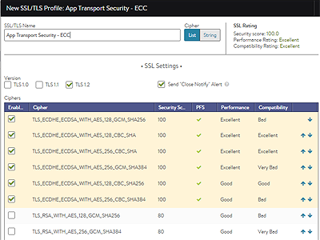

With iOS 9 and later, Apple has mandated minimum security settings in order to be compliance with their <a href="https://developer.apple.com/library/ios/documentation/General/Reference/InfoPlistKeyReference/Articles/CocoaKeys.html#//apple_ref/doc/uid/TP40009251-SW35">App Transport Security</a> (ATS) standard.  To enable this level of SSL security for applications proxied by Vantage use the following settings for SSL/TLS Certificates and SSL/TLS Profiles.

 

### Certificates

The certificate must be issued by a Certificate Authority that is either publicly trusted (included with the operating system) or the CA's root cert has been installed in the client device.

* RSA 2k or higher
* ECC 256 or higher 

The cert must be created by the issuer with SHA-256 or greater.

 

### SSL / TLS Version

Only TLS 1.2 is supported.  Disable earlier versions of SSL / TLS.

 

### Cipher Support

All enabled ciphers must support PFS.  Disable all but the following ciphers from the Cipher list view.  If only an EC or RSA cert are in use, it doesn't hurt to only enable the compatible ciphers.  If both an EC and RSA certificate are going to be used (best practice), then leave all of the following ciphers enabled.

**   ECC Ciphers**

* <code>TLS_ECDHE_ECDSA_WITH_AES_256_GCM_SHA384</code>
* <code>TLS_ECDHE_ECDSA_WITH_AES_128_GCM_SHA256</code>
* <code>TLS_ECDHE_ECDSA_WITH_AES_256_CBC_SHA384</code>
* <code>TLS_ECDHE_ECDSA_WITH_AES_256_CBC_SHA</code>
* <code>TLS_ECDHE_ECDSA_WITH_AES_128_CBC_SHA256</code>
* <code>TLS_ECDHE_ECDSA_WITH_AES_128_CBC_SHA</code> 

**   RSA Ciphers**

* <code>TLS_ECDHE_RSA_WITH_AES_256_GCM_SHA384</code>
* <code>TLS_ECDHE_RSA_WITH_AES_128_GCM_SHA256</code>
* <code>TLS_ECDHE_RSA_WITH_AES_256_CBC_SHA384</code>
* <code>TLS_ECDHE_RSA_WITH_AES_128_CBC_SHA256</code>
* <code>TLS_ECDHE_RSA_WITH_AES_128_CBC_SHA</code> 

 

