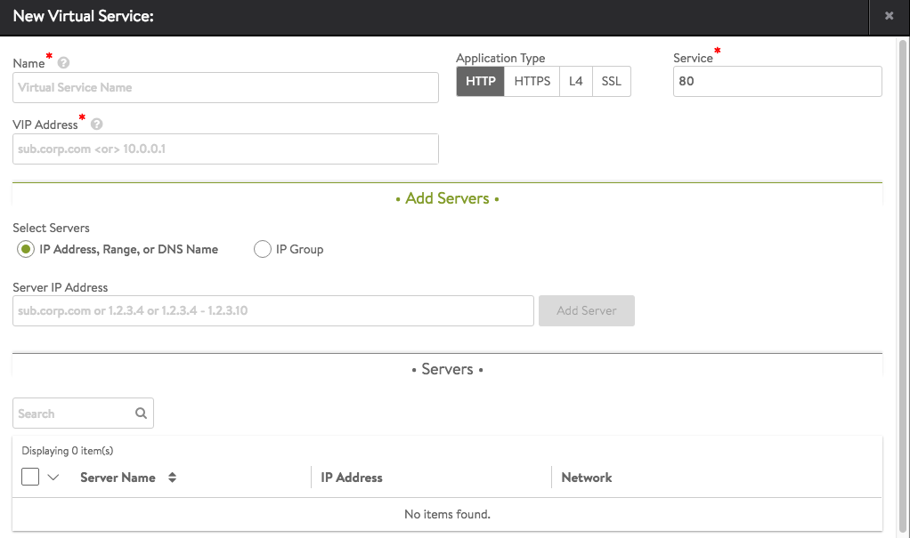
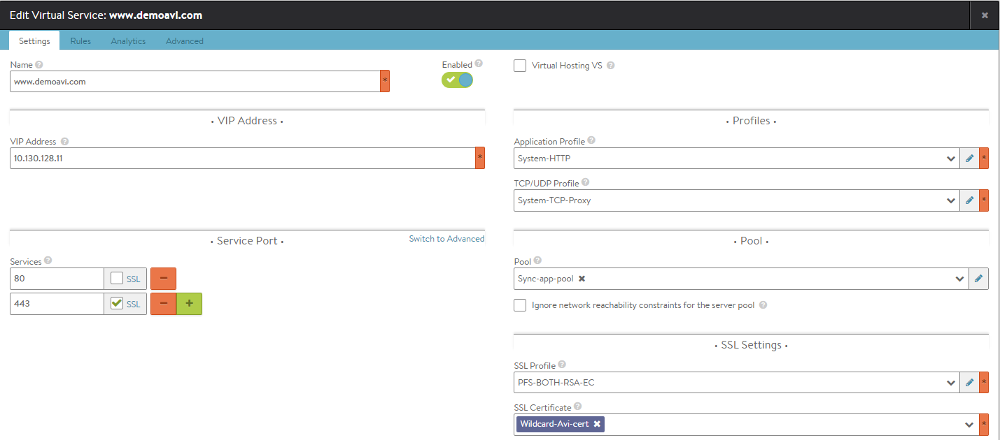
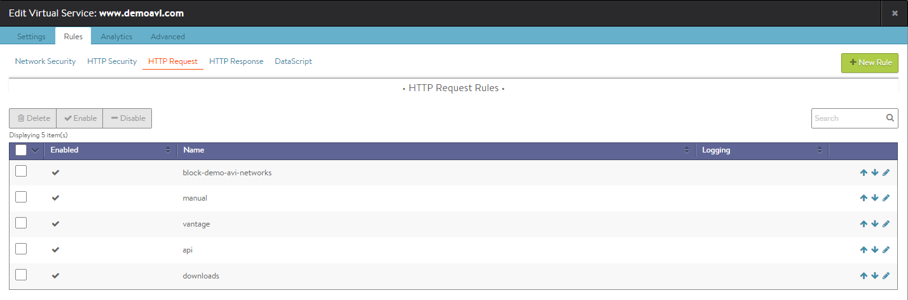
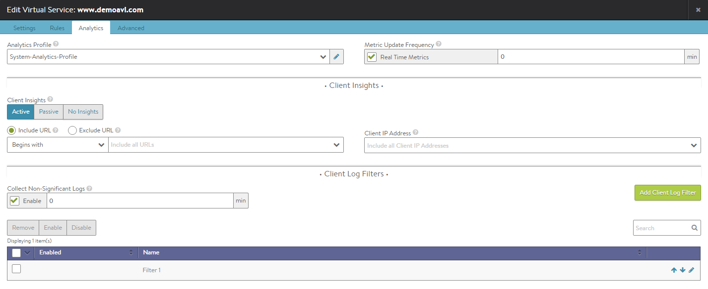
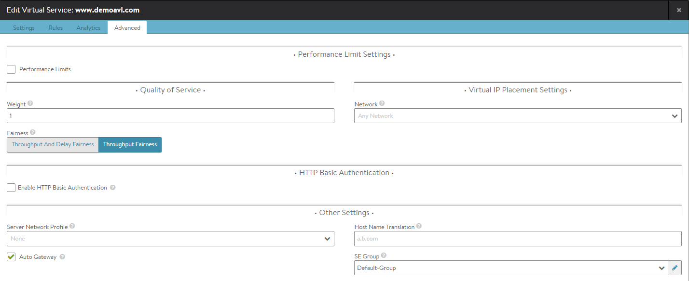

A new virtual service may be created via either the basic or advanced mode. In basic mode, many features are not exposed during the initial setup. After the virtual service has been created via basic mode, the options shown while editing are the same as advanced mode, regardless which mode was initially used. While basic mode may have been used to create the virtual service, it does not preclude access to any advanced features.

* **Basic Mode**: This mode is strongly recommended for the vast majority of normal use cases. It requires minimal user input and relies on pre-defined configurations for the virtual service that should be applicable for most applications. Creating a new virtual service in basic mode can be accomplished within a single popup window.
* **Advanced Mode**: This mode requires additional user input and is recommended when requiring access to less common features, such as policy rules or customized analytics settings. This mode may also be used to configure a virtual service for multiple ports or network protocols. 

## Virtual Service Creation: Basic Mode

Creating a virtual service in basic mode enables quick creation of all required objects, in particular the pool containing servers. The automatically created pool will be given the name *virtual-service-name*-pool, where *virtual-service-name* is the name of the virtual service being created.

To assign an existing pool to a virtual service, do one of the following:

* Create the virtual service in basic mode with the server field left blank, then edit the virtual service to assign the desired pool.
* Create the virtual service in advanced mode. 

There are some limitations to note when creating a virtual service in basic mode:

* The virtual service will be assigned the default application profile, either HTTP, HTTPS, or Layer 4.
* The virtual service will be assigned the default TCP/UDP profile, TCP Proxy.
* After creating the virtual service, Real Time Metrics are enabled for the first 60 minutes and Full Client Logs are enabled for the first 30 minutes. After this time period lapses, the metrics will revert to five minute update intervals and logs will capture errors only. After the virtual service creation process is complete, editing the virtual service exposes all advanced functions, allowing any configuration setting to be altered. 

Create a new virtual service by navigating to Applications > Virtual Service. Click on the Create Virtual Service button and select  Basic Setup.

* **Select Cloud:** If Vantage is configured for multiple cloud environments, such as VMware and Amazon Web Services (AWS), the cloud for the virtual service deployment must be selected. If Vantage exists in a single environment, this question is skipped.
* **Name:** Provide a unique name for the new virtual service. (For clouds configured with Cisco ACI as the networking fabric, the name becomes a pull-down menu populated with the list of existing Service Graphs that are not currently assigned to a virtual service.)
* **VIP Address:** Enter either the DNS resolvable name or an IP address for the virtual service. When using a DNS name, Vantage will attempt to resolve the name and populate the IP Address field if successful. If the name resolves to more than one IP address, select the address to use from the list shown. If the name cannot be resolved, it will appear in red.  See <a href="/docs/16.3/virtual-server-using-dns-for-vip-address/">Virtual Service Using DNS for VIP Address</a>.
* **Application Type:** Select from the common app types. To use a different application profile or type, consider creating the virtual service via advanced mode.  
    * **HTTP:** The virtual service will listen for non-secure Layer 7 HTTP. Selecting this option auto-populates the Service port field to 80. Override the default with any valid port number; however, clients will need to include the port number when accessing this virtual service. Browsers default to automatically append the standard port 80 to HTTP requests. Selecting HTTP enables an HTTP application profile for the virtual service. This allows Vantage to proxy HTTP requests and responses for better visibility, security, acceleration, and availability.
    * **HTTPS:** The virtual service will listen for secure HTTPS. Selecting this option auto-populates port 443 in the Service port field. Override this default with any valid service port number; however, clients will need to include the port number when accessing this virtual service as browsers automatically append the standard port 443 to HTTPS requests. When selecting HTTPS, use the Certificate pull-down menu to reference an existing certificate or create a new self-signed certificate. A self-signed certificate will be created with the same name as the virtual service and will be an RSA 2048 bit cert and key. The certificate can be swapped out later if a valid certificate is not yet available at time of virtual service creation.
    * **L4:** The virtual service will listen for Layer 4 requests on the port you specify in the Service port field. Select this option to use the virtual service for non-HTTP applications, such as DNS, mail, or a database.
    * **SSL:** The virtual service will listen for secure layer 4 requests. Selecting this option auto-populates port 443 in the Service port field. Override this default with any valid service port number. 
* **Service:** Accept the displayed default for the application type or key in a service port to listen for connections. Basic mode supports configuring only one port. For multiple service ports or ranges, edit the virtual service after creation.
* **Add Servers:** Add one or more servers to the new virtual service using any combination of the following methods:  
    * **Add by Server IP Address**: Enter the IP address for the server to be included in the Address field, and then click the Add Server button. A range of IP addresses may be entered using a dash character, such as 10.0.0.1–10.0.0.10.
    * **Add by DNS Resolvable Server Name**: Enter the name of the server to be included in the Address field. If the server name successfully resolves, the IP address will be shown and the Add Server button will change to green. Click the Add Server button.  See <a href="/docs/16.3/add-servers-to-pool-by-dns/">Add Servers by DNS</a>.
* **Select Servers by Network**: This option is only available if Vantage has read or write access to the cloud environment. Click the Select Servers by Network button to open a list of reachable networks. Selecting a network opens a list of the servers (virtual machines) available on that network. Click the green Add Servers button to add the selected servers to the virtual service. See <a href="/docs/16.3/select-servers-by-network/">Select Servers by Network</a>.
* **Save**: Click Save to finish. The new virtual service is now displayed in the Applications Dashboard and Virtual Services Page. 

The virtual service will be assigned automatically to a Service Engine. If an available SE already exists, the virtual service will be deploy and be ready to accept traffic. If a new SE must be created, it may take a few minutes before it is ready.

The color of the virtual service name icon indicates the status of the new virtual service. Hovering the mouse over the virtual service health score will convey more information regarding the status of the new virtual service.

In some environments, Avi Vantage may require additional networking information such as IP addresses or clarification of desired networks, subnets, or Port Groups to use prior to a new Service Engine creation. The UI will prompt for additional information if this is required.

## Virtual Service Creation: Advanced Mode

The Create Virtual Service popup and Edit Virtual Service popup share the same advanced mode interface, which has the following tabs:

* Settings Tab
* Rules Tab
* Analytics Tab
* Advanced Tab 

When creating a new virtual service in Advanced mode, you will be guided through the tabs in order, starting with the Settings tab and concluding with the Advanced tab. If you are editing an existing virtual service, you will be able to jump to any tab non-linearly.

### Advanced Virtual Service Creation: Settings Tab

The Settings tab of the Create/Edit Virtual Service popup covers the basic network settings for the virtual service.

To add or edit virtual server settings:

* **Select Cloud:** If Vantage is configured for multiple cloud environments, such as VMware and Amazon Web Services (AWS), then the desired cloud for the virtual service must be selected during virtual service creation. If Vantage exists in a single environment, this question is skipped.
* **Name:** Provide a unique name for the new virtual service. For clouds configured for Cisco ACI for the networking fabric, the name becomes a pulldown menu populated with the list of existing Service Graphs that are not assigned to a virtual service.
* **Enabled:** The toggle icon enables (green) and disables (red) the virtual service.  
    * When enabled (green icon), the virtual service will accept and process traffic normally.
    * When disabled (red icon), the virtual service will not accept any new connections. Existing concurrent connections will be terminated, and the virtual service will be unassociated from all Service Engines. No health monitoring is performed for disabled virtual services. See <a href="/docs/16.3/disable-a-virtual-service/">Disable a Virtual Service</a>.
    * **VIP Address:** Enter either the DNS resolvable name or an IP address for the virtual service. When using a domain name, Vantage will attempt to resolve that name to populate the IP Address field. If the name resolves to more than one IP address, select the address to use from the list shown. If the name cannot be resolved, it will appear in red. See <a href="/docs/16.3/virtual-server-using-dns-for-vip-address/">Virtual Service Using DNS for VIP Address</a>.
    * **AWS**  
        * **Elastic IP Address For External Client Access**: Will allocate a public IP address that AWS will use to NAT to the VIP address. This may be automatically allocated by AWS, or a static address may be specified.
        * **Network for VIP Address Allocation**: Specify the network for client reachability. An elastic IP address will be automatically chosen within the selected network.
    * **OpenStack**  
        * **Floating IP Address For External Client Access**: Optionally specify an external IP address that will be exposed to clients outside of OpenStack. This may be automatically allocated by OpenStack, or a static address may be specified.
        * **VIP Address**: When set to auto-allocate, OpenStack will provide the VIP address once a VIP network has been defined.
* **Services:** Define the listening Service port of the virtual service. This may be configured via the default basic mode, or via switching to advanced mode.  
    * **Services Basic:** Enter a single service port number, such as 80 for HTTP. Multiple service ports may be added by clicking the green plus icon.  
> <strong>Note:</strong> When adding both HTTP and HTTPS on the same virtual service, you may also configure the virtual service to perform HTTP to HTTPS redirection. This can be done in a number of ways, such as using a secure-HTTP application profile, which enables the SSL Everywhere feature's automatic redirects. Alternatively, redirects may be configured via an HTTP request policy.

    * **Service Advanced:** In advanced mode, services may be added individually, or as a range, such as 5000 to 10000. This can be useful for older apps such as CORBA. The virtual service default TCP/UDP profile may be overridden on a per-service port basis. This can be beneficial for protocols such as DNS, RADIUS, or Syslog that may use both TCP and UDP at the same time. To change the protocol, select Override TCP/UDP and select a profile for this service port.
* **SSL:** If the virtual service will be decrypting client SSL traffic on this port, check the SSL checkbox. This brings up two additional fields:  
    * **SSL Profile:** Collection of settings that determine the preferred ciphers and versions of SSL that Vantage will use when negotiating with clients.
    * **SSL Certificate:** Either select an existing SSL certificate or create a new certificate. Vantage supports both RSA and Elliptic Curve (EC) certificates, and both may be configured for the same virtual service. To use both RSA and EC, simply add a certificate for each type in this field. Vantage will prefer the EC certificate because EC is newer, more secure, and faster. Most any browser from the past decade will support EC.
* **Virtual Hosting VS:** When selected, this virtual service participates in virtual hosting via SSL’s Server Name Indication (SNI). This allows a single SSL decrypting virtual service IP:Port to forward traffic to different internal virtual services based on the name of the site requested by the client. The virtual hosting VS must be either a parent or a child.   
    
    
    
    * **Parent:** The parent virtual service is external facing, and owns the listener IP address, service port, network profile, and SSL profile. Specifying a pool for the parent is optional, and will only be used if no child virtual service matches a client request. The SSL certificate may be a wildcard certificate or a specific domain name. The parent’s SSL certificate will only be used if the client’s request does not match a child virtual service domain. The parent virtual service will receive all new client TCP connections, which will be reflected in the statistics. The connection is internally handed off to a child virtual service, so subsequent metrics such as concurrent connections, throughput, requests, logs and other stats will only be shown on the child virtual service.  
        * **Child:** The child virtual service does not have an IP address or service port. Instead, it points to a parent virtual service, which must be created first. The domain name is a fully qualified name requested by the SNI-enabled client within the SSL handshake. The parent matches the client request with the child's domain name. It does not match against the configured SSL certificate. If no child matches the client request, the parent's SSL certificate and pool are used.
* **Application Profile:** Use the application profile pull-down menu to select how the virtual service will listen for client requests. Selecting an HTTP profile will allow the virtual service to proxy HTTP and provide functionality specific to that protocol. An HTTP-based application profile will also require the TCP/UDP profile (described further below) to be set to TCP Proxy. For non-HTTP applications, select an L4 application profile.
* **TCP/UDP Profile:** Use the TCP/UDP profile to set the virtual service to listen for UDP Fast Path, TCP Fast Path or TCP Proxy. If the application profile is set to an HTTP profile, the TCP/UDP profile must be set to proxy the TCP connections.
* **Pool:** Select the pool to use for this virtual service using the Pool pull-down menu. A pool may only be referenced by one virtual service. Pools that are already in use will not appear on this list. Click the green Create button to create a new pool. If the virtual service requires sending traffic to multiple pools, configure content switching with an HTTP request policy.  
    * **Ignore Reachability:** If the pool contains servers in networks unknown or inaccessible to Vantage, the Controller is unable to place the new virtual service on a SE, as it doesn't know which SE has the best reachability. This requires manually choosing the virtual service placement by the Vantage user. Selecting *Ignore Pool servers network reachability constraints for Virtual Service placement* will allow the Controller to place the virtual service, even though some or all servers in the pool may be inaccessible. For example, a Vantage user may select this option while creating the virtual service, and later configure a static route to access the servers. 

### Advanced Virtual Service Creation: Rules Tab

The rules tab allows you to define policies or DataScripts for the virtual service.

DataScripts and policies consists of one or more rules that control the flow of connections or requests through the virtual service to control security, client request attributes, or server response attributes.

Each rule is a match/action pair that uses if/then logic: If something is true, then it matches the rule and corresponding actions will be performed.

Policies are simple GUI-based, wizard driven logic, whereas DataScript allows more powerful manipulation using Vantage’s Lua-based scripting language.

For an in-depth explanation of policy configuration, see the Virtual Service Policies section. For help writing DataScripts, see the <a href="/docs/16.3/virtual-server-using-dns-for-vip-address/">Avi DataScript Guide</a>.

Policies are specific to the virtual service they are configured within. They consist of a simple “if match is true, then perform action” logic. Each line of match/action logic is a rule.

A policy can contain multiple rules, in which case the rules are processed in the order they are listed in the policy's configuration in the web interface.

* A rule may have just an action without a match, which means that every connection or request will be an automatic match.
* A rule may contain many matches and/or many actions. 

### Policy Types

Vantage supports the following types of policies.

* Network security policy: explicitly allows or blocks traffic based on network (TCP/UDP) information.
* HTTP security policy: performs defined actions such as allow/deny, redirect to HTTPS, or respond with a static page.
* HTTP request policy: manipulates requests or performs content switching by allowing customized actions based on client HTTP requests.
* HTTP response policy: evaluates responses from the server and can be used to modify the server’s response headers. This type of policy is most often used in conjunction with HTTP request policies to provide web site name modification similar to Apache's Mod_Proxypass. 

### Policy Processing Order

Policies and their rules will be processed in the order listed above.

### Adding a Policy

To add a new policy:
<ol> 
 <li><strong>Policy Type:</strong> Select the policy type to add by selecting a category.</li> 
 <li><strong>Create</strong> a new rule by clicking the green Add Rule button and entering the following information for the new rule: 
  <ul> 
   <li><strong>Enable/Disable:</strong> By default, the new rule will be enabled (on). Clicking the on/off switch toggles this rule On (green icon) or Off (gray icon). Disabled rules have no effect on traffic.</li> 
   <li><strong>Name:</strong> Either enter a unique name for the rule in the Rule Name field or leave the default system generated name in place.</li> 
   <li><strong>Logging:</strong> Check the Logging checkbox to enable logging for this rule. When enabled, Vantage will generate a log for any connection or request that matches the rule’s match criteria. If a virtual service is already set to log all connections or requests, Avi Vantage will not create a duplicate log. The logs will be flagged with a new field for the policy type and rule name that matched. When viewing the policy logs within the Logs tab of the Virtual Service Details page the logs will be included as part of the Non-Significant (Full Client Logs) option unless the specific connection or request is an error and qualifies as Significant.</li> 
   <li><strong>Match:</strong> Add one or more match criteria using the matching rules pull-down menu. The match options will vary depending on the context defined by the policy type being creating. If a rule is not given a match, then all connections or requests will be considered matched. For complete descriptions of the match options available for each policy type, see the help for that type.</li> 
   <li><strong>Action:</strong> Add one or more Actions to be taken when the rule is triggered using the Action pull-down menu. The available options will vary depending on the type of rule you are creating.</li> 
   <li><strong>Save:</strong> Click the Save Rule button at the bottom of the popup to save the new rule.</li> 
  </ul> </li> 
 <li><strong>Order:</strong> Rules within a policy are enforced in the order in which they appear in the list. For example, if you add a rule to close a connection based on a client's IP address followed by a rule that redirects HTTP to HTTPS, Vantage will close the connection without redirecting the request. To alter, the order in which rules are applied, click the up and down arrow icons until the rules are in the preferred order.</li> 
 <li><strong>Next/Save:</strong> 
  <ul> 
   <li>If you are creating a new virtual service, then click Next to proceed to the Analytics tab.</li> 
   <li>If you are editing an existing virtual service, either select the next tab to continue edits or click Save to save your changes and exit back to the Virtual Services page.</li> 
  </ul> </li> 
</ol> 

### DataScript

DataScripts are global objects that may be applied to multiple virtual services. More than one DataScript may be applied to a single virtual service. The order of the DataScripts is important. For instance, if the first script enforces a blacklist that may drop clients, and the second script redirects clients to another site, a client that is dropped by the first rule will never be evaluated against the second. Use the up and down arrows next to the DataScript to reorder. See also <a href="/docs/16.3/datascript-execution-priority/">Execution Priority</a>.

To add a DataScript to the virtual service: from the DataScript tab, select new DataScript to add a rule to the virtual service. Select a rule from the Script to Execute menu. Choose an existing script or create a new one. Select Save Script to add this DataScript to the virtual service.

The scripts are maintained in the Templates > Scripts > DataScripts section of the web interface. To create a DataScript, start with the overview of <a href="/docs/16.3/overview-of-datascript/">DataScripts</a>, which walks through the high level objects and has links to numerous sample scripts.

### Advanced Virtual Service Creation: Analytics Tab

The Analytics tab of the advanced virtual service configuration wizard defines how analytics data is captured. These settings control:

* Thresholds for defining client experience and the resulting impact on the end-to-end timing and health score
* Level of metrics collection
* Logging behavior 

### Analytics

* **Analytics Profile:** Select an analytics profile from the pull-down menu. This profile determines the thresholds for determining client experience. It also defines errors that can be tailored to ignore certain behavior that may not be an error for a site, such as an HTTP 401 (authentication required) response code. Avi Vantage uses errors and client experience thresholds to determine the health score of the virtual service and may generate Significant Log entries for any issues that arise.
* **Real Time Metrics:** The Analytics tab of the Virtual Service Details page presents a number of metrics, such as Throughput and Requests. Avi Vantage updates these metrics periodically, either the default of 5 minutes, or via the Real Time Metrics option, every 15 seconds. Due to the increased resources to maintain more detailed metrics, Real Time Metrics may be configured to gather metrics more aggressively for a limited period of time. A time of 0 enables the aggressive metrics collection indefinitely. Setting this to a shorter time value, such as 30 minutes, means Real Time Metrics collection will revert back to the slower polling once the specified time has elapsed, for instance, after you have completed any troubleshooting session. > <strong>Note:</strong> Capturing real time metrics may negatively impact system performance for busy Controllers with very large numbers of virtual services or configured with minimal hardware resources. This option is disabled by default for advanced virtual service creation, though it is enabled for the first 60 minutes when using the Basic mode for virtual service creation.
 

### Client Insights

Data about connecting clients may be captured. Specific clients may be included or excluded via the Include URL, client IP address, and exclude URL options. This data is used in pages such as the Virtual Service > Clients page.

Select the level client insights to collect:

* **No Insights:** No client insights are recorded for this virtual service.
* **Passive:** Record data passively flowing through the virtual service. This option enables recording of the End-to-End Timing and client’s location. For HTTP virtual services, device, browser, operating system, and top URLs metrics are also included. No agents or changes are made to client or server traffic.
* **Active:** For HTTP, active mode goes further by inserting an industry standard JavaScript query into a small number of server responses to provide HTTP navigation and resource timing. Client browsers transparently return additional information about their experience loading the web page. Avi Vantage uses this information to populate the Navigation Timing and Top URL Timing metrics on the Virtual Service > Clients page. A maximum of one HTTP web page per second will be selected for generating the sampled data. > <strong>Note:</strong> Some browsers, such as Apple Safari, may not supply information for Navigation and Resource Timing.
 

### Non-significant Logs

By default, Vantage captures and logs any errors, such as reset connections or HTTP 500 errors, which are classified as Significant logs. To capture full connection logs or HTTP client request logs, enable the Full Client Logs option. View logs in the Logs tab of the Virtual Service Details page. From the logs page, you may choose to view logs filtered by Significant logs (such as errors) or Non-Significant Logs, which includes logs generated via the Full Client Logs option as well as any logs generated via a policy or DataScript.

* **Enable:** Because Non-Significant Logs consume additional resources on busy Vantage systems, by default Non-Significant Logs is disabled. To enable indefinitely, select the Enable checkbox and set the time to 0. Setting the time to a number greater than 0, such as 30, will provide the additional logs for 30 minutes before reverting back to Significant Logs collection only.
* **Client Log Filter:** Rather than log every request or connection, log collection can be filtered to relevant IP addresses and HTTP URLs for a specified duration of time.
* **All Headers:** This option, nested within a client log filter, will log all client request and server response headers, rather than just the common headers which are logged normally. This will increase the size of each log, which reduces the total number Vantage can collect, index, and store.
* **Matching Filter:** If both an IP Address and URL are provided, they must both match for the filter to create the log. IP addresses can be specific addresses such as 10.1.1.1, networks such as 10.0.0.0/8, or IP groups. Setting the order of multiple filters has no effect on the logging as all must match. 

### Advanced Virtual Service Creation: Advanced Tab

The Advanced tab specifies advanced and optional settings for the virtual service.

To specify performance limits for a virtual service, expand the list of options via the Enable option. The limits applied are for this virtual service only, and are based on an aggregate of all clients. Limit options on a per client basis may be set via the application profile's DDoS tab, which would be inherited by any virtual service using the profile. Additional per client limits may be configured via policies or DataScripts.

### Performance Limits

See <a href="/docs/16.3/rate-shaping-and-throttling-options/">Rate Shaping and Throttling</a> for additional options.

* **Rate Limit Number of New TCP Connections:**  
    * **Threshold:** Set the maximum threshold of new connections from all clients that may be created for this virtual service over the configured time period.
    * **Time Period:** The time, in seconds, within which the threshold must not be exceeded.  Set to 0 for infinite.
    * **Action:**  
        * Report only: generate logs for excessive connections, but otherwise allow them to proceed as normal.
        * Drop SYN Packets: silently discard the client SYN.
        * Send TCP RST: send a connection reset back to the client.
* **Rate Limit Number of New HTTP Requests:**  
    * **Threshold:** Set the maximum threshold of HTTP requests from all clients for this virtual service over the configured time period.
    * **Time Period:** The time, in seconds, within which the threshold must not be exceeded. Set to 0 for infinite.
    * **Action:**  
        * Report only: generate logs for excessive connections, but otherwise allow them to proceed as normal.
        * Close TCP Connection: send a connection RST to the client.
        * Send Local Response: allow Vantage to respond with a simple web page and appropriate status code.
        * Send HTTP Redirect: forward (redirect) excessive requests to another URI or destination.
* **Max Throughput:** Specify the maximum amount of bandwidth in Mbps Vantage will allow through the virtual service. Traffic that exceeds this limit will be discarded and may require retransmission by either the client or server. When this limit is set, the Analytics tab of the Virtual Service Details page will show a dashed horizontal line on the throughput metric chart that shows the current throughput versus the maximum allowed throughput.
* **Max Concurrent Connections:** Specify the maximum number of concurrent open connections. Connection attempts that exceed this number will be reset (TCP) or dropped (UDP) until the total number of concurrent connections falls below the threshold. When this limit is set, the Analytics tab for the virtual service will show a dashed horizontal line on the open connections metric that shows the current open connections versus the maximum number of allowed connections. 

### Quality of Service

* **Weight**: When multiple virtual services are sharing the same Service Engine, and one or more virtual services are consuming most or all available bandwidth, the remaining virtual services may become starved for bandwidth. Bandwidth is loosely defined as packets per second through the SE's hypervisor, saturation of the physical interface of the host server, or similar network constrictions. Avi Vantage provides throughput fairness to ensure that all virtual services are guaranteed some amount of bandwidth. The first option is the weight, which may be set to 1, 2, 4, or 8. This settings determines the relative ratio of traffic that each virtual service should be able to send relative to its peers. This setting is only applicable if there is network congestion, and only for packets sent from the Service Engine. See also throughput fairness field below.
* **Fairness**: Fairness determines the algorithm used to ensure each virtual service is able to send traffic when the Service Engine is experiencing network congestion. The throughput fairness algorithm takes the virtual service weight (see above) into account to achieve this. Throughput and delay fairness is a more thorough algorithm to accomplish the same task. It consumes greater CPU on the Service Engine when there are larger numbers of virtual services. This option is only recommended for latency sensitive protocols. 

### Placement Settings

* **Network**: Avi Vantage will automatically place the virtual service into a VMware port group for a virtualized environment based on its IP address; however, some environments may have a subnet which spans multiple port groups. The network setting allows the virtual service IP address to be manually set to a specific port group, rather than one automatically picked by Avi Vantage. > Note: This setting is only applicable for VMware environments.
 

### HTTP Basic Authentication

* **Basic Realm**: When a request to authenticate is presented to a client, the basic realm indicates to the client which realm they are accessing.
* **Include URL**: If the client request is matches the URI path specified here, then force the user to authenticate if they have not done so yet.
* **Auth Profile**: Authentication settings such LDAP servers are maintained in the reusable *Templates > Auth Profile*. 

### Other Settings

* **Server Network Profile**: By default, a new virtual service will use the same TCP/UDP profile specified in the Settings tab for both the client and the server side of a TCP proxied connection. You may override this setting for the connection between the Service Engine and the server by specifying a different TCP proxy profile. While the same TCP stack should negotiate correctly and independently with both clients and servers, it may be desirable to have a TCP stack tuned to servers, such as disabling Nagle’s algorithm on the server side but enabling it on the client side. This option only applies to virtual services set for TCP proxy.
* **Auto Gateway**: Return packets are sent to the source MAC address that is associated with the connection instead of returning client data via the default gateway of Avi Vantage. If Vantage has the wrong default gateway, no configured gateway, or multiple gateways, client-initiated return traffic will still flow correctly. The Vantage default gateway will still be used for management and outbound-initiated traffic.
* **Host Name Translation**: If the host header name in a client HTTP request is not the same as this field, or if it is an IP address, Vantage will translate the host header to this name prior to sending the request to a server. If a server issues a redirect with the translated name, or with its own IP address, the redirect's location header will be replaced with the client's original requested host name. Host name translation does not rewrite cookie domains or absolute links that might be embedded within the HTML page. This option is applicable to HTTP virtual services only. This capability may be manually created using HTTP request and response policies. 
<table class="table table-hover table table-bordered table-hover">  
<tbody>     
<tr>  
<td colspan="6">In this example, the Host Name Translation field is set to "b.com"</td>
</tr>
<tr>       
<td></td>
<td><b><i>Client</i></b></td>
<td></td>
<td>
 
   
 <i>Avi</i> 

</td>
<td></td>
<td><b><i>Server</i></b></td>
</tr>
<tr>       
<td>==&gt;</td>
<td><i>Request sent</i></td>
<td>a.com</td>
<td>==&gt;</td>
<td>b.com</td>
<td><i>Request received</i></td>
</tr>
<tr>       
<td>&lt;==</td>
<td><i>Response received</i></td>
<td>a.com/foo</td>
<td>&lt;==</td>
<td>b.com/foo</td>
<td><i>Redirect response</i></td>
</tr>
</tbody>
</table> 
* **SE Group**: The Service Engine group is a container of service engines that includes settings such as high availability properties. Placing a virtual service in a specific Service Engine group may be used to guarantee resource reservation and data plane isolation, such as separating production from test environments. This field may be hidden based on configured Roles or Tenant options. To change an existing virtual service's Service Engine group, first disable the virtual service, save, switch it to another group, save, then enable and save. Switching a virtual service to another SE group is disruptive to existing client connections.  