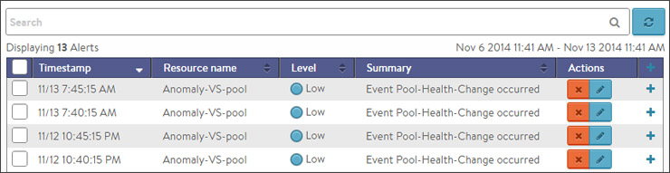

Alerts act as filters that provide notification for prioritized events or combinations of events. The virtual service alerts tab highlights user-specified events for the virtual service for the selected time period.

## Alert Actions

Alert actions may be configured to provide proactive notifications via Syslog, SNMP traps, email, or ControlScripts. This is done via the the Alerts tab of the Operations section of the Vantage web interface, specifically in the Alert Action sub page.

 

The top of this tab shows the following items:

* **Search:** The Search field allows you to filter the alerts using whole words contained within the individual alerts. 
* **Refresh:** Clicking Refresh updates the alerts displayed for the currently-selected time. 
* **Number:** The total number of alerts being displayed. The date/time range of those alerts appear beneath the Search field on the left. 
* **Dismiss:** Select one or more alerts from the table below then click Dismiss to remove the alert from the list. Alerts are transitory, meaning they will eventually and automatically expire. Their intent is to notify an administrator of an issue, rather than being the definitive record for issues. Alerts are based on events, and the parent event will still be in the events record.  

### Alert Table

The table at the bottom of the Alerts tab displays the following alert details:

* **Timestamp:** Date and time when the alert was triggered. Changing the time interval using the Displaying pull-down menu may potentially show more alerts. 
* **Resource Name:** Name of the object that is the subject of the alert, such as a server or virtual service. 
* **Level:** Severity level of the alert, which can be High, Medium, or Low. Specific notifications can be set up for the different levels of alerts via the Administration page's Alerts Overlay. 
* **Summary:** Summarized description of the alert. 
* **Action:** Click the appropriate button to act on the alert:  
    * **Dismiss:** Clicking the red X dismisses the alert and removes it from the list of displayed alerts. 
    * **Edit:** Clicking the blue pencil icon opens the Edit Alert Config popup for the alert configuration that triggered this alert. This can include a verbose and customized description of the alert or allow an administrator to alter settings such as the severity of the alert. 
    * **Expand/Contract:** Clicking the plus (+) or minus sign (-) for an event log either expands or contracts that event log to display more information. Clicking the + and – icon in the table header expands and collapses all entries in this tab   