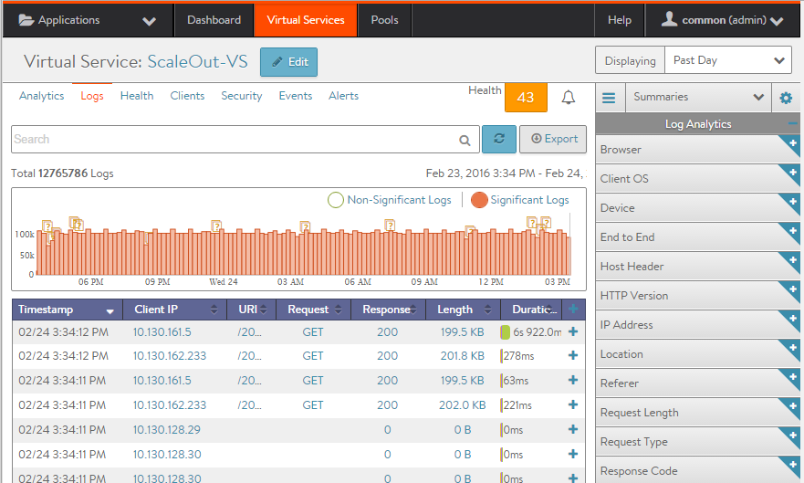
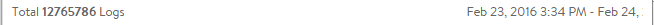
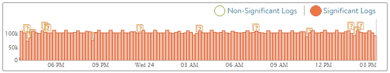
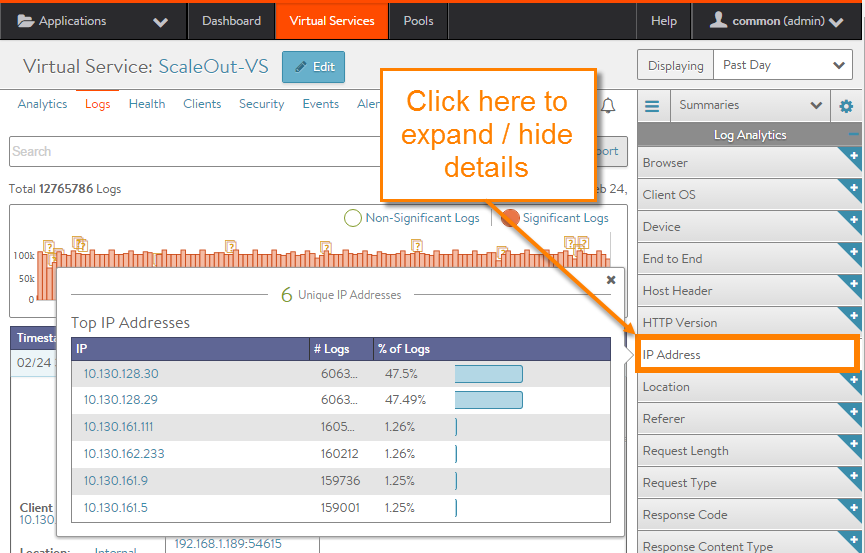
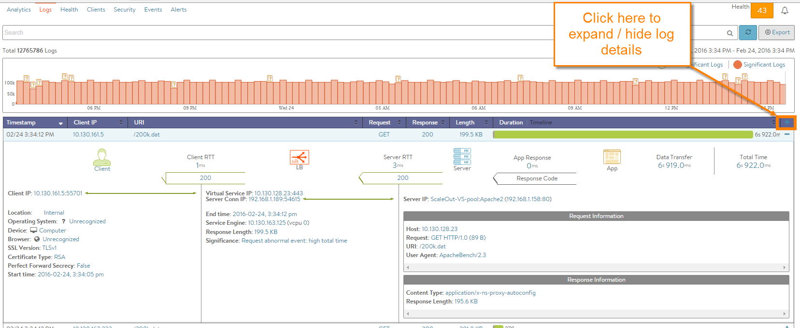

Virtual services and pools are able to log client-to-application interactions for TCP connections and HTTP requests/responses. These logs can be indexed, viewed, and filtered locally within the Avi Controller. Logs can be useful for troubleshooting and surfacing insights about the end-user experience and success of the application.

## Enabling Logs

See the <a href="/docs/16.3/architectural-overview/applications/virtual-services/vs-analytics/">Analytics tab</a> of the Create Virtual Service popup for configuring, enabling, filtering, and/or disabling client logs.

## Significant Logs

Avi Vantage automatically logs common network and application errors under the umbrella of *significant logs*. These significant logs may also include entries for lesser issues, such as transactions that completed successfully but took an abnormally long time.

Errors may include any of the following:

* HTTP errors, such as server or Vantage-originated 4xx and 5xx errors 
* Network errors, such as aborted connections, abnormal latency, or out of order packets. 
* See <a href="#logevents">Log Events</a> for a list of error events that may trigger a significant Log.  

Errors can be omitted from the significant logs list by editing the analytics profile used by the virtual service.

## Full Client Logs

In addition to significant logs, a virtual service may be configured to log all client connections or HTTP requests. The Full Client Logs option includes any significant logs, custom full log filters, and any logs generated by custom policies or DataScripts. By default, a new virtual service is configured to provide full client Logs for the first 30 minutes, then drop down to a reduced logging level by capturing significant logs only. From the Analytics tab, full client logs may be enabled for the virtual service, either temporarily or permanently.

Full client log filters may also be specified for IP addresses or URIs, which is recommended when capturing important information from busy production systems. An additional level of logging is provided by enabling the All Headers option in a client log filter. This option will capture all headers from the client and server within the logs. Keep in mind this may have significant impact on the size of the logs, as some applications send as much as 30 k within a single header. Even so, the All Headers option is very useful for quick troubleshooting to see what each side of the connection is sending and receiving.

When logging, Avi Vantage prioritizes significant logs by proactively sending them to the Controller for indexing. Non-significant logs, such as normal HTTP request logs, will be pulled from the SEs and indexed by the Controller ***only*** when an administrator attempts to view full client logs for the virtual service or pool. This may take anywhere from a few seconds to hours to process. Logs will be viewable while the indexing process is performed in the background. This time may depend on network latency from the SEs to the Controllers, the volume of logs, and the hardware used by the Controller for performing the resource-intensive task of indexing the data.

### Rotation Out of Unrequested Logs

Capturing all logs can consume significant resources. For this reason, logs that are unrequested are rotated out of the SE's storage after a period of time. The allocation for raw log storage on an SE is variable, but a minimally configured SE with 2 vCPUs, 2 GB memory, and 10 GB storage can store about 8 million logs. Adding more resources (CPU, memory, and especially disk space) to the Controllers and SEs will extend both the volume of logs per second and the length of time that Vantage can store the logs.

### Logging During Heavy Load

In a very busy system with high volumes of requests per second, Vantage may temporarily degrade to capturing only a sampling of requests. If the system is set up with redundant Controllers, the task of indexing logs for multiple virtual services is automatically shared across the Controllers to better utilize resources.

 

## Log Navigation

To access the client logs for a virtual service:
<ol> 
 <li> 
Navigate to Applications &gt; Virtual Services.
 </li> 
 <li> 
Click on the virtual service name.
 </li> 
 <li> 
Click on Logs.
 </li> 
</ol> 

The top of the Client Logs tab displays the following items:

* **Search:**  The Search field allows you to filter the log entries using free-form text, keywords and/or a formal search syntax. 
* **Refresh:**  Clicking Refresh updates the logs for the currently-selected time period. 
* **Number and Range:**  Total number of log items being displayed. The date/time range of those logs appear beneath the Search field on the left. The number will reflect how many logs passed the filter, which may be lower than the total number of logs. 
* **Clear Selected:**  If one or more filters have been added to the Search field, click the gray X icon on the right side of the search bar to remove those filters. To clear individual filters, click the white on blue X for that filter. 
* **Histogram:**  The histogram shows the number of client log entries over the selected time period. The X-axis is time, while the Y-axis is the number of logs during that bar’s period of time.     
    * Green bars show All Logs, or successful transactions. 
    * Red bars show errors, or Significant. 
    * Orange question marks above the bars may appear, indicated potentially missing logs. This may happen for a number of reasons, most probably due to the SE dropping into a log sampling mode due to high volumes of logs for its allocated hardware resources. 
    
    Hovering the cursor over a Histogram bar displays the number of entries represented by that bar.
    
    Click and drag inside the histogram to refine the date/time period which further filters the logs shown. Clicking the blue magnifying glass icon in the drawn box will zoom the Histogram to that view. This expands the drilled in time to zoom in to the width of the Histogram, and also changes the Displaying Time pull-down menu to Custom. To return to the previously selected time period, use the Displaying pull-down menu.
    
    The Non-Significant and Significant options display *all* logs or only significant logs, respectively.
    
* **Export:** The logs may be downloaded directly from Vantage via the Export button to the right of the search bar. The logs are in comma-separated value (CSV) format. The downloaded file will include only the logs that match any custom filters, the Non-Significant Logs versus Significant Logs option, and the selected time period. This may include only the logs from the displayed page or all logs that match the filter, up to a maximum of 10,000 logs.  

The primary table on the Logs tab displays the list of individual log entries. The following information appears for each log entry:

* **Timestamp:** Date and time the event occurred. 
* **Client IP:** The source IP address of the client to which the log entry applies. 
* **URI:** For HTTP enabled virtual services, the URI path of the request, such as */index.html*. 
* **Request:** Type of HTTP method for the request, such as GET, POST, or HEAD. 
* **Response:** For HTTP, the response code will be of type 1xx, 2xx, 3xx, 4xx, or 5xx. This is usually a reflection of the response sent by the server, but it may instead be a response created by Avi Vantage. Expand the log to determine whether the server or Avi Vantage generated the response. 
* **Length:** Size of the response, in Kilobytes. 
* **Duration:** Bar showing the total transaction time, which can be used to compare this request to others based on the length of the bar. Hovering the mouse pointer over the bar shows a breakdown of time that makes up the duration of the request. This is a miniature version of the End to End Timing chart that appears when the log is expanded. 
* **Timeline:** This view creates a waterfall display of the transactions relative to each other. This is most useful when following a single client interacting with the site, because the timeline makes it easy to see requests that are blocking or congesting the client from loading the page. 
* **More Info icon:** Clicking the + icon in the table header expands or collapses a view into logs. This can be done for all logs on the page, or individual logs.  

 

## Log Analytics

The Log Analytics area displays a series of prebuilt filters that summarize the client logs in a popup according to the selected summary filter. For example, clicking the IP Address summary tile will display the most active client IP addresses that have requested the virtual service within the log display period.

The Log Summaries reflect the currently applied filters, including the displayed log period and the Non-Significant/Significant setting.

Client information is learned from IP addresses or the client's HTTP User-Agent string.

Adding a <a href="#searchlogs">search filter</a> such as client_location="US" will filter the summaries to reflect only the results for clients coming from an IP address within the United States.

### Log Analytics Tiles

* **Browser:** Client browser, such as Firefox, IE, or Safari. 
* **Client OS:** Client operating system, such as iOS, Windows 7, or Mac OS X. 
* **Device:** Type of client device, such as Computer, iPhone, Tablet, or Other. 
* **End to End:** View of the client-to-server transaction, similar to the End to End Timing pane in the Analytics tab of the virtual service Details page. 
* **Host Header:** The most common HTTP Hosts (domain names) requested. This is most applicable in a forward proxy or virtual hosting. 
* **HTTP Version:** The version of HTTP negotiated with the client. This may be 1.0, 1.1, or SPDY 3.1. 
* **IP Address:** Number of unique client IP addresses, and the list of the top addresses in the logs. 
* **Location:** Geographic location of clients. This may be a two letter country code or a custom location based on a match with an IP group. 
* **Referer:** Top websites that have referred traffic, based on the HTTP Referer header. 
* **Request Length:** Size of the HTTP requests, in bytes. HEAD requests are typically very small, GETs tend to be a bit larger, and POSTs can be extremely large. 
* **Request Type:** A breakdown of the various HTTP request methods, such as GET, POST, HEAD, CONNECT, PUT, and so on. 
* **Response Code:** The HTTP responses sent from Avi Vantage or the servers. This could be 200, 301, 304, 404, 503, and so on. Adding the IP address of a suspect server to the filter can give you a better view of the typical responses that the selected server is sending out. 
* **Response Content Type:** Types of content requested by clients. 
* **Response Length:** Size distribution of HTTP responses sent to clients. This gives a good indication of the average HTTP response size. 
* **Server IP Address:** The list of the top servers. Add a filter such as resp_code>=500 to see which servers are responding with 'server busy' errors. 
* **Significance:** A log is classified as Significant if it has an entry in the Significant log field. This is generally due to an error, such as client or server reset, out of order packets, HTTP 4xx or 5xx. 
* **SSL:** Insights about SSL traffic that is terminated at the virtual service.  
    * The SSL Version negotiated, which could be TLS 1.0, TLS 1.1, or TLS 1.2. 
    * Perfect Forward Secrecy means that clients were able to negotiate a cipher that cannot be decrypted after the session ends using hijacked SSL keys. 
    * The Authentication Protocol is either RSA or Elliptic Curve (EC). 
    * The Encryption Protocol is the cipher negotiated for handling bulk encryption of data, such as AES256 or AES128. 
* **URL Path:** The most commonly requested HTTP paths, such as /index.html. Try adding a filter for 404 to see the most common broken links on your website or a filter for response time greater than 500 to see which objects are taking the longest to generate by the servers. 
* **User ID:** Most common user IDs.  

### Expanded Logs

Clicking the **+** plus icon on the right of the logs table expands an individual log. This provides an in-depth view of the specific connection log or the HTTP request and response log.

* **End to End Timing:** The bar is similar to the Analytics tab of the virtual service Details page, though it also contains arrows indicating the HTTP response code. This data is specific to this single connection or HTTP request, whereas the Analytics tab for the virtual service shows an aggregate of all connections or requests. If the arrow under Server RTT is a 0, then no response was received from the server. This may be due to an error such as a timed out server response, or because the request was served by Avi Vantage, such as via caching or a policy. 
* **IP Addresses:** Under End to End Timing, IP addresses and service ports indicate the client source address and port being used to initiate a transaction to the virtual service IP address and destination service port. The second address under the Avi icon is the Avi Vantage source NAT (SNAT) address and source port that is used for communicating with the destination server’s pool, name, IP address and port. 
* **Client data:** The first column on the bottom left displays information regarding the client.  
    * **Client IP:** The source IP address and service port of the client. 
    * **Location:** The country of origin for the IP address or Internal for private IP addresses. This field may also show custom IP group names. 
    * **Operating System:** The OS of the connecting device. HTTP only. 
    * **Device:** The type of connecting device, such as computer, table, or phone. HTTP only. 
    * **Browser:** The web browser of the connecting device. HTTP only. 
    * **SSL Version:** The negotiated version, such as SSL 3.0, TLS 1.0, TLS 1.1, or TLS 1.2. SSL terminated HTTP traffic only. 
    * **Certificate Type:** RSA or Elliptic Curve (EC) certificate used for the connection. SSL terminated HTTP traffic only. 
    * **Perfect Forward Secrecy:** Did the client negotiate a cipher which protects the connection from later decryption via hijacked keys. SSL terminated HTTP traffic only. 
    * **Start Time:** The time the connection was established or the request was received. 
* **Avi data:** The following information appears under the Avi icon in the middle column:  
    * **Virtual Service IP:** The listening virtual service’s IP and port. 
    * **Server Conn IP:** The source IP address and port used as the source NAT address on the server side of the connection. 
    * **End time:** When the log was generated; this normally occurs when the request or connection was completed; however, logs may be generated for currently active, long-lived connections. Logs generated during an open connection will be updated periodically or when the connection closes. 
    * **Service Engine:** The SE and corresponding vCPU that was used to process the request or connection. 
    * **Response Length:** The size of the response, such as HTTP payload plus headers returned by Avi Vantage to the client. This size may be different from the server Response Length in the server column due to SSL padding, Javascript insertion (when Client Insights is set to Active), compression, TCP maximum segment size differences, or a number of other features. 
    * The following fields appear only if applicable:  
        * **Cache Hit:** This is true if the HTTP request was served by the Avi Vantage cache. This field will not be shown if caching is disabled. 
        * **Compression:** If Avi Vantage compressed the response content, this will show the percent by which the content was able to be compressed. 
        * **Policy Rule:** If a policy has been applied to the virtual service, any rules that were executed will be displayed. If the rule was created with the log checkbox enabled, the log will be generated even if the virtual service does not have full client logs enabled on the Analytics tab for the virtual service. These logs will still require Non-Significant Logs to be selected in order to be displayed (unless they qualify as Significant Logs, of course). 
        * **Significance:** If the connection or request is determined to be an error, it will be marked as Significant. This field provides a description of the issue (such as client terminated the connection or server returned 500 error). 
* **Server and App data:** The third column on the bottom of an expanded log provides information about the connection or request and response.  
    * **Server IP:** Pool name, server name, and the server IP address and port. 
    * **Host:** The HTTP Host header, such as www.avinetworks.com or 10.1.1.10. 
    * **Request:** The HTTP method (such as GET), version (such as HTTP/1.1), and size of the request (such as 2 Kb). 
    * **URI:** The HTTP path and query of the client request. 
    * **User Agent:** The raw client HTTP User-Agent header (such as Mozilla/5.0, AppleWebKit/533, and so on). 
    * **Content Type:** The HTML, images, Javascript, and so on returned to the client. 
    * **Response Length:** The size of the HTTP header plus content returned from the server to Vantage. (This may be different from the size of the response length from Vantage to the client due to compression, inserting JavaScript, or other acceleration that may alter the content size before it is sent to the client.) 
* **View All Headers:** A View All Headers option may exist within the expanded logs. This button will further expand the log display to show additional information for the transaction. View All Headers may exist due to one or both of the following:  
    * **All Headers:** On the Analytics tab for the virtual service, create a new filter with the All Headers option selected. This will cause Vantage to record all client request and server response headers. Custom headers, cache control, and other useful troubleshooting may be done by viewing full headers. Headers may be quite large, which could come at the cost of a significant resource hit to the SEs creating the logs and the Controller storing the larger logs. Recommendation is to turn this feature on selectively, such as for specific clients or for a shorter time duration. 
    * **DataScript Errors:** Many DataScript errors are caught when attempting to save a new script. However, there are many scenarios when the script may fail when executing. When this happens, an error will be created in the logs, visible under View All Headers. The error and stack trace may be included to help determine the cause of the error.  

 

## Searching Logs

The Search field above the list of client log entries filters the logs according to your specified search terms. You may use either arbitrary search strings or a specific search syntax. For example, entering "mobile" will filter the logs to all entries that include this string anywhere within the log. **Search strings are *not* case sensitive.**

To use the formal search syntax, the search filter may be typed manually, or clicking any blue text within a log entry will generate the filter. For example, clicking Client IP creates "filterclient_ip=A.B.C.D" where A.B.C.D is the client’s IP address. In this example, the logs will be filtered to show only clients with that specific IP address.

When typing a search directly into the Search field, contextual help will show the available options. For instance, typing "client_ip" will show the appropriate operands (described below) such as " = ".

Example: The filter client_ip= will show the most commonly seen IP addresses, including the number of logs generated by these addresses and the percentage of logs from this address, in this format: 10.30.4.31 - 15924 - (34.7%)

When using the search syntax:

* Be aware of whether the log display filter is set to Significant Logs or Non-Significant Logs. 
* Multiple filters may be selected or created to further refine a search. All filters must be true for the log to match. 
* Search criteria for strings must be enclosed in quotation marks, such as client_country="US" or"Connection setup failed". 
* The filter can include any combination of informal strings and formal search syntax, such as: iphone client_ip^="10.30." 
* Searches may be saved and reused later. 
* The following operators allow more granular searches for strings, numbers, or IP addresses:  
    * **Greater than:** >
    * **Greater than or equal:** >=
    * **Less than:** <
    * **Less than or equal:** <=
    * **Not equal:** !=
    * **Equals:** =
    * **Contains:** ~=
    * **Does not contain:** !~=
    * **Starts with:** ^=
    * **Ends with:** $= 

 

## Significant Log Events

Avi Vantage records the following types of significant log events for clients (grouped alphabetically by high-level description).
> Note: To appear on the Log tab for a virtual service, the display filter on the tab must be set to Significant Logs.
 
* **Avi rule failed to execute:** The Avi Vantage policy or DataScript failed to execute. For DataScript failures, the expanded log may have a "View All Headers" button, which brings up a modal containing the DataScript error and stacktrace. 
* **Connection abnormal event:** The TCP connection established successfully, but there are a high number of retransmitted packets due to timeouts from Avi Vantage to the client. This could be due to lossy network or a slow client. 
* **Connection abnormal event:** The TCP connection established successfully, but there were a high number of retransmitted packets due to timeouts from Avi Vantage to the server. This could be due to lossy network or a slow server. 
* **Connection abnormal event:** The TCP connection completed gracefully, but there were instances when the TCP window advertised by the client depleted to zero. This means that Avi Vantage could not send any more packets until the client opened the TCP window. This is typically due to a slow client. 
* **Connection abnormal event:** The TCP connection completed gracefully, but there were instances when the TCP window advertised by the server depleted to zero. This means that Avi Vantage could not send any more packets until the server opened the TCP window. This is typically due to a slow server. 
* **Connection abnormal event:** The TCP round trip time between Avi Vantage and the client is greater than 1 second. 
* **Connection abnormal event:** The TCP round trip time between Avi Vantage and the server is greater than 500ms. 
* **Connection abnormal event:** The TCP connection completed gracefully, but there were a high number of retransmitted packets from Avi Vantage to the client. This may be due to a lossy or
congested network. 
* **Connection abnormal event:** The TCP connection completed gracefully, but there were a high number of retransmitted packets from Avi Vantage to the server. This may be due to a lossy or congested network. 
* **Connection abnormal event:** The TCP connection completed gracefully, but Avi Vantage received a high number of out of order packets from the client. This is generally due to lossy or congested network or drops by Avi Vantage. 
* **Connection abnormal event:** The TCP connection completed gracefully, but Avi Vantage received a high number of out of order packets from the client. This is generally due to lossy or congested network or drops by Avi Vantage. 
* **Connection closed abnormally:** Client abnormally terminated the connection by sending a TCP RST. 
* **Connection closed abnormally:** Server abnormally terminated the connection by sending a TCP RST. 
* **Connection closed abnormally:** The established TCP connection with the client was closed due to timeout. Despite multiple retry attempts, the client stopped responding to Avi Vantage's packets. 
* **Connection closed abnormally:** The established TCP connection with the server was closed due to timeout. Despite multiple retry attempts, the server stopped responding to Avi Vantage's packets. 
* **Connection closed abnormally:** The connection timed out waiting for the client to send HTTP request. 
* **Connection closed abnormally:** The connection was prematurely closed by the client. 
* **Connection closed abnormally:** The connection dropped due to SSL handshake failure. 
* **Connection closed abnormally:** The connection was closed due to internal error. 
* **Connection closed abnormally:** Validation of the server's x509 certificate failed. 
* **Connection closed abnormally:** The connection was dropped due to server side SSL handshake failure. 
* **Connection closed abnormally:** The connection was deleted due to an Avi Vantage configuration update. 
* **Connection closed abnormally:** The established TCP connection was closed due to the TCP profile's idle timeout triggered. 
* **Connection setup failed:** The connection setup was aborted by the client, which sent a RST during the TCP three way handshake. 
* **Connection setup failed:** The connection setup was refused by the server, which sent a RST during the TCP three way handshake. 
* **Connection setup failed:** TCP three way handshake with the client timed out despite multiple retries. 
* **Connection setup failed:** TCP three way handshake with the server timed out despite multiple retries. 
* **Connection setup failed:** Avi Vantage was unable to complete the TCP three way handshake with the client due to an internal Avi Vantage error. This may be due to lack of memory or other resources. 
* **Connection setup failed:** Avi Vantage was unable to complete the TCP three way handshake with the server due to an internal Avi Vantage error. This may be due to lack of memory or other resources. 
* **Connection setup failed:** The connection was dropped due to bad packets received from client during TCP three way handshake. 
* **Request abnormal event:** The response time was greater than the configured threshold. 
* **Request abnormal event:** Server response time greater the configured threshold. 
* **Request abnormal event:** The server this connection was persisted to is no longer a valid destination. 
* **Request abnormal event:** Client sent request with HTTP Protocol version 0.9. 
* **Request ended abnormally:** A 4xx 'client error' HTTP response code was sent to the client. 
* **Request ended abnormally:** A 5xx 'server error' HTTP response code was sent to the client. 
* **Request ended abnormally:** The connection attempt was reset due to no servers available. This may be because the server connection limits setting was reached, or all servers are in a down state.   