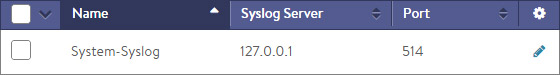
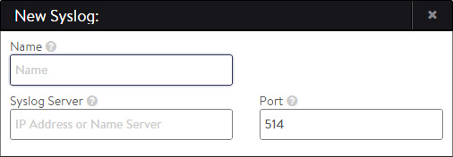
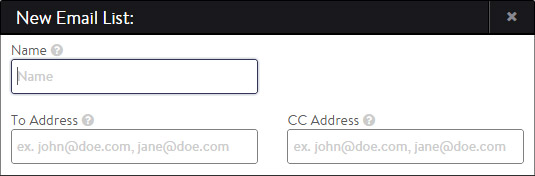

Alert actions may be configured to proactively send notifications to an administrator using the methods available on the Notifications page (email, syslog, SNMP).

Before creating an alert action, the notification destinations must be configured. These can be syslog servers, email servers and addresses, and SNMP trap servers. Starting with Avi Vantage 16.2.2, one can <a href="/docs/16.3/verifying-notification-settings/">verify notification settings in advance</a> of triggering them. In addition to notifications, an alert action also can include running a ControlScript. Notifications need to be configured only if they are going to be used for an alert action.

### Syslog Notifications

Alert actions may be configured to send alerts to one or more remote Syslog servers via TCP to the configured IP address and service ports. The alert action determines which log levels (high, medium, low) should be sent. Avi Vantage uses this process internally for receiving logs. This appears on the Syslog tab as System-Syslog.

Configuring Syslog notifications pushes alerts to Syslog servers. It does not export virtual service logs. These may be pulled from an external logging system via the API, or may be scripted to push from the Avi Controller.

### Syslog Notifications Settings

Select Administration > Notifications > Syslog to open the Syslog Notifications tab. This tab includes the following functions:

* **Search:** Search through the configure list of Syslog entries.
* **Create:** Opens the Create Syslog Notification popup.
* **Edit:** Opens the Edit Syslog Notification popup.
* **Delete:** Remove the selected Syslog notifications. The default System-Syslog notification may be modified, but not deleted. 

The table on this tab contains the following information for each Syslog notification:

* **Name:** Name of the Syslog notification.
* **Syslog Server:** IP address or hostname of the destination Syslog server for the log entries. The server must be listening for TCP.
* **Port:** The service port number of the destination Syslog server. 

### Create Syslog Notification

The New Syslog and Edit Syslog Notification popups share the same interface.

To create or edit a system log notification:

* **Name:** Enter a unique name for the Syslog destination.
* **Syslog Server:** Enter either the IP address or hostname of the remote syslog server.
* **Port:** Enter the service port of the destination Syslog server. Avi Vantage uses TCP as the protocol for sending logs. 

### Email

Alert Actions may be configured to send alerts to administrators via email. These emails could be sent directly to administrators or to reporting systems that accept email. Either option requires the Vantage Controller to have a valid DNS and default gateway configured so it can resolve the destination and properly forward the messages.

Information regarding the SMTP server and the sender must be configured in the Administration > Settings > Email/SMTP page.

Select Operations > Services > Email to open the Email tab. This tab includes the following functions:

* **Search:** Search through this list of email notification names.
* **Create:** Opens the Create/Edit Email Notification popup.
* **Edit:** Opens the Create/Edit Email Notification popup.
* **Delete:** Remove the selected email notifications. 

The table on this tab contains the following information for each email notification:

* **Name:** Name of the email notification.
* **To Address:** The email address used as the primary destination for the Alert Action. Use comma separation for multiple email addresses.
* **CC Address:** The email address used as the secondary, or CC'd email destination for the Alert Action. Use comma separation for multiple email addresses. 

### SNMP Trap

Alerts may be sent via SNMP Traps using SNMP v2c.

### SNMP Trap Settings

Select Operations > Services > SNMP Trap to open the SNMP tab. This tab includes the following functions:

* **Search:** Search through this list of SNMP Trap server names.
* **Create:** Opens the Create/Edit SNMP Trap popup.
* **Edit:** Opens the Create/Edit SNMP Trap popup.
* **Delete:** Remove the selected SNMP Trap server. 

Creating an SNMP trap server presents the following options:

* **Name:** Name of the SNMP server.
* **Trap Server:** The IP address or hostname of the server.
* **SNMP Community:** Trap servers may require a community string, which provides a basic form of security for access to the server.  