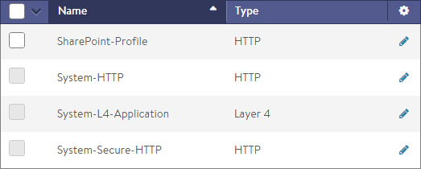
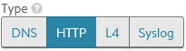
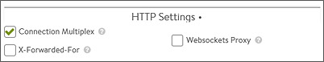
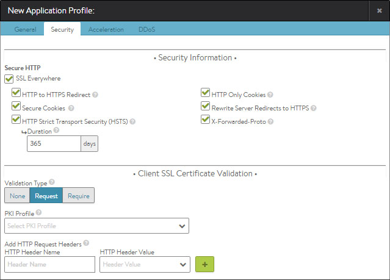
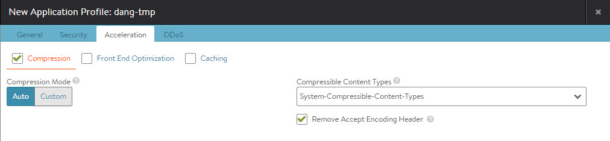
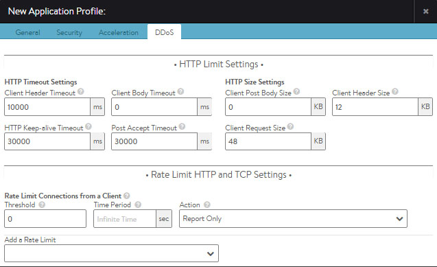

Application profiles determine the behavior of virtual services, based on application type.

The application profile types and their options are described in the following sections:

* <a href="#http-profile">HTTP Profile</a>
* <a href="#dns-profile">DNS Profile</a>
* <a href="#l4-profile">Layer 4 Profile</a>
* <a href="#syslog-profile">Syslog Profile</a> 

## Dependency on TCP/UDP Profile

The application profile associated with a virtual service may have a dependency on an underlying TCP/UDP profile. For example, an HTTP application profile may be used only if the TCP/UDP profile type used by the virtual service is set to type TCP Proxy. The application profile associated with a virtual service instructs the Service Engine (SE) to proxy the service's application protocol, such as HTTP, and to perform functionality appropriate for that protocol.

## Application Profile Tab

Select Templates > Profiles > Applications to open the Application Profiles tab, which includes the following functions:

* **Search:** Search against the name of the profile.
* **Create:** Opens the Create Application Profile popup.
* **Edit:** Opens the Edit Application Profile popup.
* **Delete:** Removes an application profile if it is not currently assigned to a virtual service.**Note: If the profile is still associated with any virtual services, the profile cannot be removed. In this case, an error message lists the virtual service that still is referencing the application profile.** 

The table on this tab provides the following information for each application profile:

* **Name:** Name of the Profile.
* **Type:** Type of application profile, which will be either:  
    * **DNS:** Default for processing DNS traffic.
    * **HTTP:** Default for processing Layer 7 HTTP traffic.
    * **L4:** Catch-all for any virtual service that is not using an application-specific profile.
    * **Syslog:** Default for processing Syslog traffic. 

### Create/Edit an Application Profile

 The Create Application Profile and Edit Application Profile screens share the same interface regardless of the application profile chosen.

The initial settings for a new profile are similar regardless of the type of profile chosen:

* **Name:** Enter a unique name for the profile.
* **Description:** Enter an optional description for the profile.
* **Type:** Click the appropriate type button to select the application for this profile. Select L4 for none. 

### HTTP Profile

The HTTP application profile allows Vantage to be a proxy for any HTTP traffic. HTTP-specific functionality such as redirects, content switching, or rewriting server responses to client requests may be applied to a virtual service. The settings apply to all HTTP services that are associated with the HTTP profile. HTTP-specific policies or DataScripts also may be attached directly to a virtual service.

The HTTP profile contains these tabs:

* **General**
* **Security**
* **Acceleration**
* **DDoS** 

### HTTP General Tab

The general tab contains HTTP basic settings:

* **Connection Multiplex:** This option controls the behavior of HTTP 1.0 and 1.1 request switching and server TCP connection reuse. This allows Avi Vantage to reduce the number of open connections maintained by servers and better distribute requests across idle servers, thus reducing server overloading and improving performance for end-users. The exact reduction of connections to servers will depend on how long lived the client connections are, the HTTP version, and how frequently request/responses are utilizing the connection. It is important to understand that "connection" refers to a TCP connection, whereas "request" refers to an HTTP request and subsequent response. HTTP 1.0 and 1.1 allow only a single request/response to go over an open TCP connection at a time. Many browsers attempt to mitigate this bottleneck by opening around six concurrent TCP connections to the destination web site. See Multiplex plus Persistence, below.
* **X-Forwarded-For:** With this option, Vantage will insert an X-Forwarded-For (XFF) header into the HTTP request headers when the request is passed to the server. The XFF header value contains the original client source IP address. Web servers can use this header for logging client interaction instead of using the layer 3 IP address, which will incorrectly reflect the Service Engine's source NAT address. When enabling this option, the XFF Alternate Name field appears, which allows the XFF header insertion to use a custom HTTP header name. If the XFF header or the custom name supplied already exists in the client request, all instances of that header will first be removed. To add the header without removing pre-existing instances of it, use an HTTP request policy.
* **WebSockets Proxy:** Enabling WebSockets allows the virtual service to accept a client's Upgrade header request. If the server is listening for WebSockets, the connection between the client and server will be upgraded. WebSocket is a full-duplex TCP protocol. The connection will initially start over HTTP, but once successfully upgraded, all HTTP parsing by Vantage will cease and the connection will be treated as a normal TCP connection.
* **Save:** Select another tab from the top menu to continue editing or Save to return to the Application Profiles tab. 

### Multiplex plus Persistence

Multiplexing behavior changes with server persistence enabled:

* **Multiplex enabled, Persistence disabled:** Client connections and their requests are decoupled from the server side of the Service Engine. Requests are load-balanced across the servers in the pool using either new or pre-existing connections to those servers. The connections to the servers may be shared by requests from any clients.
* **Multiplex enabled, Persistence enabled:** Client connections and their requests are sent to a single server. These requests may share connections with other clients who are persisted to the same server. Load balancing of HTTP requests is not performed.
* **Multiplex disabled, Persistence enabled:** Vantage opens a new TCP connection to the server for each connection received from the client. Connections are not shared with other clients. All requests received through all connections from the same client are sent to one server. HTTP client browsers may open many concurrent connections, and the number of client connections will be the same as the number of server connections.
* **Multiplex disabled, Persistence disabled:** Connections between the client and server are one-to-one. Requests remain on the same connection they began on. Multiple connections from the same client may be distributed among the available servers. 

### HTTP Security

The Security tab of the HTTP application profile controls the security settings for HTTP applications that are associated with the profile:

### Security Information

The HTTP security settings affect how a virtual service should handle HTTPS. If a virtual service is configured only for HTTP, any HTTPS settings in this section will not apply. Only if the virtual service is configured for HTTPS, or HTTP and HTTPS, will the settings take effect.

More granular settings also may be configured using <a href="/docs/16.3/configuration-guide/applications/vs-policies/">policies</a> or <a href="/docs/16.3/datascript-guide/">DataScripts</a>.

* **SSL Everywhere:** This option enables all of the following options, which together provide the recommended security for HTTPS traffic.
* **HTTP to HTTPS Redirect:** For a single virtual service configured with both an HTTP service port (SSL disabled) and an HTTPS service port (SSL enabled), this feature will automatically redirect clients from the insecure to the secure port. For instance, clients who type www.avinetworks.com into their browser will automatically be redirected to https://www.avinetworks.com. If the virtual service does not have both an HTTP and HTTPS service port configured, this feature will not activate. For two virtual services (one with HTTP and another on the same IP address listening to HTTPS), an HTTP request policy must be created to manually redirect the protocol and port.
* **Secure Cookies:** When Vantage is serving as an SSL proxy for the backend servers in the virtual service's pool, Vantage communicates with the client over SSL. However, if Vantage communicates with the backend servers over HTTP (not over SSL), the servers will incorrectly return responses as HTTP. As a result, cookies that should be marked as secure will not be so marked. Enabling secure cookies will mark any server cookies with the Secure flag, which tells clients to send only this cookie to the virtual service over HTTPS. This feature will only activate when applied to a virtual service with SSL/TLS termination enabled.
* **HTTP Strict Transport Security (HSTS):** Strict Transport Security uses a header to inform client browsers that this site should be accessed only over SSL/TLS. This feature is intended to mitigate man-in-the-middle attacks that can force a client’s secure SSL/TLS session to connect through insecure HTTP. HSTS has a duration setting that tells clients the SSL/TLS preference should remain in effect for the specified length of time. This setting will activate only on a virtual service that is configured to terminate SSL/TLS.  
> <strong>Note:</strong> If a virtual service is set temporarily to support SSL/TLS and HSTS has been set, it cannot gracefully be downgraded back to HTTP. Client browsers will refuse to accept the site over HTTP. When HSTS is in effect, clients will not accept a self-signed certificate.

* **HTTP-only Cookies:** This marks server cookies as HTTPonly, which means the cookies cannot be viewed or used by third parties, including Javascript or other web sites. This feature will activate for any HTTP or terminated HTTPS virtual service.
* **Rewrite Server Redirects to HTTPS:** When a virtual service terminates client SSL/TLS and then passes requests to the server as HTTP, many servers assume that the connection to the client is HTTP. Absolute redirects generated by the server may therefore include the protocol, such as HTTP://www.avinetworks.com. If the server returns a redirect with HTTP in the location header, this feature will rewrite it to HTTPS. Also, if the server returns a redirect for its own IP address, this will be rewritten to the hostname requested by the client. If the server returns redirects for hostnames other than what the client requested, they will not be altered.Note: Consider creating an HTTP response policy if greater granularity is required when rewriting redirects. This feature will activate only if the virtual service has both HTTP and HTTPS service ports configured.
* **X-Forwarded-Proto:** Enabling this option makes Vantage insert the X-Forwarded-Proto header into HTTP requests sent to the server, which informs that server whether the client connected to Vantage over HTTP or HTTPS. This feature activates for any HTTP or HTTPS virtual service. 

### Client SSL Certificate Validation

Vantage can validate the certificates presented by clients, by checking them against a Client Revocation List (CRL). Further options allow passing certificate information to the server through HTTP headers.

* **Validation Type:** Enables client validation based on their SSL certificates.  
    * **None:** Disables validation of client certificates.
    * **Request:** This setting expects clients to present a client certificate. If a client does not present a certificate, or if the certificate fails the CRL check, the client connection and requests are still forwarded to the destination server. This allows Vantage to forward the client's certificate to the server in an HTTP header, so that the server may make the final determination to allow or deny the client.
    * **Require:** Vantage requires a certificate to be presented by the client, and the certificate must pass the CRL check. The client certificate, or relevant fields, may still be passed to the server through an HTTP header.
* **PKI Profile:** The Public Key Infrastructure (PKI) profile contains configured certificate authority (CA) and the CRL. A PKI profile is not necessary if validation is set to Request, but is required if validation is set to Require.
* **HTTP Header Name:** Optionally, Vantage may insert the client's certificate, or parts of it, into a new HTTP header to be sent to the server. To insert a header, this field is used to determine the name of the header.
* **HTTP Header Value:** Used with the HTTP Header Name field, the Value field is used to determine the portion of the client certificate to insert into the HTTP header sent to the server. Using the plus icon, additional headers may be inserted. This action may be in addition to any performed by HTTP policies or DataScripts, which could also be used to insert headers in requests sent to the destination servers. 

### HTTP Acceleration

The Acceleration tab governs the acceleration settings for the HTTP application profile. To edit HTTP acceleration settings:

* Check the Compression checkbox to enable HTTP Gzip compression,, then enter the appropriate compression settings.
* Check the Front End Optimization checkbox to enable SPDY 3.1 protocol support.
* Check the Caching checkbox to enable caching, then enter the appropriate caching settings. 

### HTTP Compression

The compression option enables HTTP Gzip compression for responses from Vantage to the client. Compression is an HTTP 1.1 standard for reducing the size of text-based data using the Gzip algorithm. The typical compression ratio for HTML, Javascript, CSS, and similar text content types is about 75%, meaning that a 20-KB file may be compressed to 5 KB before being sent across the Internet, thus reducing the transmission time by a similar percentage.

The compression percentage achieved can be viewed using the Client Logs tab of the virtual service. This may require enabling full client logs on the virtual service's Analytics tab to log some or all client requests. The logs will include a field showing the compression percentage with each HTTP response.

**Note: It is highly recommended to enable compression in conjunction with caching, which together can dramatically reduce the CPU costs of compressing content. When both compression and caching are enabled, an object such as the index.html file will need to be compressed only one time. After an object is compressed, the compressed object is served out of the cache for subsequent requests. Vantage does not needlessly re-compress the object for every client request. For clients that do not support compression, Vantage also will cache an uncompressed version of the object.**

To specify compression settings:
<ol> 
 <li>Check the Compression checkbox to enable compression. You may only change compression settings after enabling this feature.</li> 
 <li>Select either Auto or Custom, which enables different levels of compression for different clients. For instance, filters can be created to provide aggressive compression levels for slow mobile clients while disabling compression for fast clients from the local intranet. Auto is recommended, to dynamically tune the settings based on clients and available Service Engine CPU resources. 
  <ul> 
   <li><strong>Auto</strong> mode enables Vantage to determine the optimal settings.</li> 
   <li><strong>Custom</strong> mode allows creation of custom filters that provide more granular control over who should receive what level of compression.</li> 
  </ul> </li> 
 <li><strong>Compressible Content Types</strong> determine which HTTP Content-Types are eligible to be compressed. This field points to a String Group which contains the compressible type list.</li> 
 <li><strong>Remove Accept Encoding Header</strong> removes the Accept Encoding header, which is sent by HTTP 1.1 clients to indicate they are able to accept compressed content. Removing the header from the request prior to sending the request to the server allows Vantage to ensure the server will not compress the responses. Only Vantage will perform compression.</li> 
</ol> 

### Custom Compression

To create a custom compression filter:
<ol> 
 <li>Click <strong>Add New Filter</strong> to create a custom filter.</li> 
 <li>Enter the following: 
  <ul> 
   <li><strong>Filter Name:</strong> Provide a unique name for the filter (optional).</li> 
   <li><strong>Matching Rules</strong> determine if the client (via Client IP or User Agent string) is eligible to be compressed via the associated Action. If both Client IP and User Agent rules are populated, then both must be true for the compression action to fire. 
    <ul> 
     <li><strong>Client IP Address</strong> allows you to use an IP Group to specify eligible client IP addresses. For example, an IP Group called Intranet that contains a list of all internal IP address ranges. Clearing the Is In button reverses this logic, meaning that any client that is not coming from an internal IP network will match the filter.</li> 
     <li><strong>User Agent</strong> matches the client's User Agent string against an eligible list contained within a String Group. The User Agent is a header presented by clients indicating the type of browser or device they may be using. The System-Devices-Mobile Group contains a list of HTTP User Agent strings for common mobile browsers.</li> 
    </ul> </li> 
  </ul> </li> 
 <li>The Action section determines what will happen to clients or requests that meet the Match criteria, specifically the level of HTTP compression that will be used. 
  <ul> 
   <li><strong>Aggressive</strong> compression uses Gzip level 6, which will compress text content by about 80% while requiring more CPU resources from both Avi Vantage and the client.</li> 
   <li><strong>Normal</strong> compression uses Gzip level 1, which will compress text content by about 75%, which provides a good mix between compression ratio and the CPU resources consumed by both Avi Vantage and the client.</li> 
   <li><strong>No Compression</strong> disables compression. For clients coming from very fast, high bandwidth and low latency connections, such as within the same data center, compression may actually slow down the transmission time and consume unnecessary CPU resources.</li> 
  </ul> </li> 
</ol> 

### HTTP Front-end Optimization

Client interaction with an HTTP website can be accelerated by enabling the SPDY protocol. Vantage supports SPDY 3.1. While SPDY is officially deprecated and replaced by HTTP/2, it may take many years for all browsers to fully support the newer protocol. SPDY 3.1 is the latest version of the protocol and also is the last version.

SPDY requires clients to connect using HTTP 1.1. If a client presents a header indicating support for SPDY 3.1, Vantage will upgrade the connection to SPDY. HTTP 1.0 clients or 1.1 clients that do not request SPDY will remain connected using normal HTTP 1.0 or 1.1.

Vantage is a full proxy, so clients may negotiate SPDY, even though the servers on the back end are still using HTTP 1.1. No changes to the server environment are required to enable this optimization.

SPDY increases the end-user experience through a number of enhancements. Primarily, it changes the data transfer model from a parallel to a serial model. Rather than allow only a single HTTP request-response exchange at a time per connection, SPDY allows multiple requests and responses simultaneously. This means SPDY opens only a single TCP connection, unlike HTTP 1.1 which may open as many as six TCP connections per client.
> <strong>Note:</strong> Vantage has disabled SPDY's header compression. This is due to vulnerability from SSL/TLS timing attacks such as CRIME.
 

### HTTP Caching

Avi Vantage can cache HTTP content, thereby enabling faster page load times for clients and reduced workloads for both servers and Vantage. When a server sends a response, such as logo.jpg, Vantage can add the object to its cache and serve it to subsequent clients that request the same object. This can reduce the number of connections and requests sent to the server.

Enabling caching and compression allows Vantage to compress text-based objects and store both the compressed and original uncompressed versions in the cache. Subsequent requests from clients that support compression will be served from the cache, meaning that Vantage will need not compress every object every time, which greatly reduces the compression workload.

**Note: Regardless of the configured caching policy, an object can be cached only if it is <a href="/docs/16.3/overview-of-http-cache/">eligible for caching</a>. Some objects may not be eligible for caching.**

To enable caching, check the Caching checkbox.

The following parameters all are optional:

* **X-Cache:** Vantage will add an HTTP header labeled X-Cache for any response sent to the client that was served from the cache. This header is informational only, and will indicate the object was served from an intermediary cache.
* **Age Header:** Vantage will add a header to the content served from cache that indicates to the client the number of seconds that the object has been in an intermediate cache. For example, if the originating server declared that the object should expire after 10 minutes and it has been in the Vantage cache for 5 minutes, then the client will know that it should only cache the object locally for 5 more minutes.
* **Date Header:** If a date header was not added by the server, then Vantage will add a date header to the object served from its HTTP cache. This header indicates to the client when the object was originally sent by the server to the HTTP cache in Vantage.
* **Cacheable Object Size:** The minimum and maximum size of an object (image, script, and so on) that can be stored in the Vantage HTTP cache, in bytes. Most objects smaller than 100 bytes are web beacons and should not be cached despite being image objects.
* **Cache Expire Time:** An intermediate cache must be able to guarantee that it is not serving stale content. If the server sends headers indicating how long the content can be cached (such as cache control), then Vantage will use those values. If the server does not send expiration timeouts and Vantage is unable to make a strong determination of freshness, then Vantage will store the object for no longer than the duration of time specified by the Cache Expire Time.
* **Heuristic Expire:** If a response object from the server does not include the Cache-Control header but does include an If-Modified-Since header, then Vantage will use this time to calculate the cache-control expiration, which will supersede the Cache Expire Time setting for this object.
* **Cache URL with Query Arguments:** This option allows caching of objects whose URI includes a query argument. Disabling this option prevents caching these objects. When enabled, the request must match the URI query to be considered a hit. Below are two examples of URIs that include queries. The first example may be a legitimate use case for caching a generic search, while the second may be a unique request posing a security liability to the cache.  
    * www.search.com/search.asp?search=caching
    * www.foo.com/index.html?loginID=User
* **Cacheable Mime Types:** Statically defines a list of cacheable objects. This may be a String Group, such as System-Cacheable-Resource-Types, or a custom comma-separated list of Mime types that Vantage should cache. If no Mime Types are listed in this field, then Vantage will by default assume that any object is eligible for caching.
* **Non-Cacheable Mime Types:** Statically define a list of objects that are not cacheable. This creates a blacklist that is the opposite of the cacheable list. 

### HTTP DDoS

The Distributed Denial of Service (DDoS) section allows configuration of mitigation controls for HTTP and the underlying TCP protocols. By default, Vantage is configured to protect itself from a number of types of attacks. For instance, if a virtual service is targeted by a SYN flood attack, Vantage will activate SYN cookies to validate clients before opening connections. Many of the options listed below are not quite as straightforward, as bursts of data may be normal for the application. Vantage provides a number of knobs to modify the default behavior to ensure optimal protection.

In addition to the DDoS settings described below, Vantage also can implement connection limits to a virtual service and a pool, configured through the Advanced properties page. Virtual services also may be configured with connection rate limits and burst limits in the Network Security Policies section. Because these settings apply on to an individual virtual service and pool, they are not configured within the profile.

### HTTP Limits

The first step in mitigating HTTP-based denial of service attacks is to set parameters for the transfer of headers and requests from clients. Many of these settings protect against variations of HTTP SlowLoris and SlowPOST attacks, in which a client opens a valid connection then very slowly streams the request headers or POSTs a file. This type of attack is intended to overwhelm the server (in this case the Service Engine) by tying up buffers and connections.

Clients that exceed the limits defined below will have that TCP connection reset and a log generated. This does not prevent the client from initiating a new connection and does not interrupt other connections the same client may have open.

* **Client Header Timeout:** Set the maximum length of time the client is allowed for successfully transmitting the complete headers of a request. The default is 10 seconds.
* **HTTP Keep-alive Timeout:** Set the maximum length of time an HTTP 1.0 or 1.1 connection may be idle. This affects only client-to-Vantage interaction. The Vantage-to-server keep-alive is governed through the Connection Multiplex feature.
* **Client Body Timeout:** Set the maximum length of time for the client to send a message body. This usually affects only clients that are POSTing (uploading) objects. The default value of 0 disables this timeout.
* **Post Accept Timeout:** Once a TCP three-way handshake has successfully completed, the client has this much time to send the first byte of the request header. Once the first byte has been received, this timer is satisfied and the client header timeout (described above) kicks in.
* **Client Post Body Size:** Set the maximum size of the body of a client request. This generally limits the size of a client POST. Setting this value to 0 disables this size limit.
* **Client Request Size:** Set the maximum combined size of all the headers in a client request.
* **Client Header Size:** Set the maximum size of a single header in a client request. 

### Rate Limits

This section controls the rate at which clients may interact with the site. Each enabled rate limit has three settings:

* **Threshold:** The client has violated the rate limit when the defined threshold of connections, packets, or HTTP requests have occurred within the specified time Period.
* **Time Period:** The client has violated the rate limit when the defined threshold of connections, packets, or HTTP requests have occurred within the specified time Period.
* **Action:** Select the action to perform when a client has exceeded the rate limit. The options will depend on whether the limit is a TCP limit or an HTTP limit.  
    * **Report Only:** A log is generated on the virtual server log page. By default, no action is taken. However, this option may be used with an alert to generate an alert action to send a notice to a remote destination or to take action through a ControlScript.
    * **Drop SYN Packets:** For TCP-based limits, silently discard TCP SYNs from the client. Vantage also will generate a log. However, during high volumes of DoS traffic, repetitive logs may be skipped.
    * **Send TCP RST:** Reset client TCP connection attempts. While more graceful than the Drop SYN Packet option, sending a TCP reset does generate extra packets for the reset, versus the Drop SYN Packet option which does not send a client response. Vantage also will generate a log. However, during high volumes of DoS traffic, repetitive logs may be skipped.
    * **Close TCP Connection:** Resets a client TCP connection for an HTTP rate limit violation.
    * **Send HTTP Local Response:** The Service Engine will send an HTTP response directly to the client without forwarding the request on to the server. Select the HTTP status code of the response, and optionally a response page.
    * **Send HTTP Redirect:** Redirect the client to another location. 

The following rate limits may be configured.

* **Rate Limit Connections from a Client:** Rate limit all connections made from any single client IP address to the virtual service.
* **Rate Limit Requests from a Client to all URLs:** Rate limit all HTTP requests from any single client IP address to all URLs of the virtual service.
* **Rate Limit Requests from all Clients to a URL:** Rate limit all HTTP requests from all client IP addresses to any single URL.
* **Rate Limit Requests from a Client to a URL:** Rate limit all HTTP requests from any single client IP address to any single URL.
* **Rate Limit Failed Requests from a Client to all URLs:** Rate limit all requests from a client for a specified period of time once the count of failed requests from that client crosses a threshold for that period. Clients are tracked based on their IP address. Requests are deemed failed based on client or server side error status codes, consistent with how Vantage logs and how metrics subsystems mark failed requests.
* **Rate Limit Failed Requests from all Clients to a URL:** Rate limit all requests to a URI for a specified period of time once the count of failed requests to that URI crosses a threshold for that period. Requests are deemed failed based on client- or server-side error status codes, consistent with how Vantage logs and metrics subsystems mark failed requests.
* **Rate Limit Failed Requests from a Client to a URL:** Rate limit all requests from a client to a URI for a specified period of time once the count of failed requests from that client to the URI crosses a threshold for that period. Requests are deemed failed based on client- or server-side error status codes, consistent with how Vantage logs and metrics subsystems mark failed requests.
* **Rate Limit Scans from a Client to all URLs:** Automatically track clients and classify them into three groups: Good, Bad, and Unknown. Clients are tracked based on their IP address. Clients are added to the Good group when the Vantage scan detection system builds history of requests from the clients that complete successfully. Clients are added to the Unknown group when there is insufficient history about them. Clients with a history of failed requests are added to the Bad group and their requests are rate limited with stricter thresholds than the Unknown clients group. The Vantage scan detection system automatically tunes itself so that the Good, Bad, and Unknown client-IP group members change dynamically with changes in traffic patterns through Vantage. In other words, if a change to the website causes mass failures (such as 404 errors) for most customers, Vantage adapts and does not mark all clients as attempting to scan the site.
* **Rate Limit Scans from all Clients to all URLs:** Similar to the previous limit, but restricts the scanning from all clients as a single entity rather than individually. Once a limit is collectively reached by all clients, any client that sends the next failed request will be reset. 

### DNS Profile

The DNS application profile allows Vantage to decode the DNS protocol. This profile will set the virtual service to port 53, and the network profile to UDP with per-packet parsing.

### L4 Profile

The L4 Profile is used for any virtual service that does not require application-layer proxying.

Note: Using an L4 profile is equivalent to setting the virtual service's application profile to 'none'.

Rate limits may be placed on the number of TCP connections or UDP packets that may be made to the virtual service from a single client IP address.

* **Threshold:** The client has violated the rate limit when the defined threshold of connections (TCP) or packets (UDP) is reached within the specified time period.
* **Time Period:** The client has violated the rate limit when the defined threshold of connections (TCP) or packets (UDP) is reached within the specified time period.
* **Action:** Select the action to perform when a client has exceeded the rate limit.  
    * **Report Only:** A log is generated in the virtual service logs page. By default, no action is taken. However, this option may be used with an alert to generate an alert action to send a notice to a remote destination or to take action using a ControlScript.
    * **Drop SYN Packets:** For TCP-based limits, silently discard TCP SYNs from the client. Vantage also will generate a log. However, during high volumes of DoS traffic, repetitive logs may be skipped.
    * **Send TCP RST:** Reset client TCP connection attempts. While more graceful than the Drop SYN Packet option, sending a TCP reset does generate extra packets for the reset, versus the Drop SYN Packet option which does not send a client response. Vantage also will generate a log. However, during high volumes of DoS traffic, repetitive logs may be skipped. 

### Syslog Profile

The Syslog application profile allows Vantage to decode the Syslog protocol. This profile will set the virtual service to understanding Syslog, and the network profile to UDP with per-stream parsing.
 