Remote Auth requires assignment of roles and tenants for every user login via the authorization mapping rules. Authorization is assessed on every login and the user record is updated. Upon successful user login via an external authentication server, all mapping rules are evaluated; tenant and role pairs are added to user access list.

## Any Group/Any Attribute Rule

A rule with any group or any attribute applies to all users and can be used as a default option. The rule below will assign every user to a least privileged role and tenant (Note: the role and tenant need to configured to only allow least privileges). If the user is not assigned any more role/tenant pairs, the least privileged access will take effect after login.

## Super User Rule

A rule can be configured to assign "super user" privileges to a user. This user will have access to all tenants with the most privileged role. Once a user is super user, no other tenant/role mapping assignments will make a difference to the user's access.

<a href="img/Screen-Shot-2016-08-06-at-12.02.39-AM.png">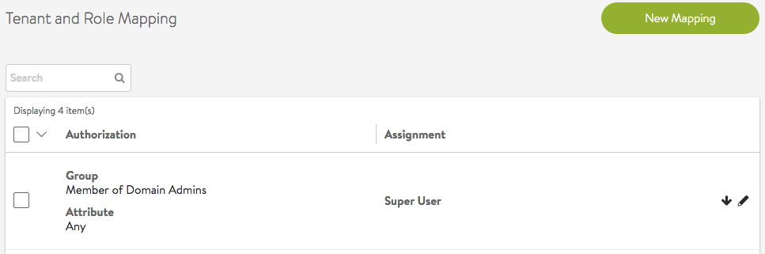</a>

## Attribute and Group Match

A mapping rule can be required to match both an attribute and group requirement. This will ensure a more specific assignment of role(s) and tenant(s).

<a href="img/Screen-Shot-2016-08-06-at-12.20.44-AM.png">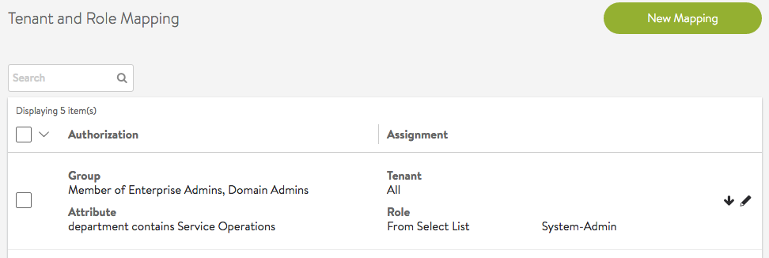</a>

## Assign Matching Attribute Values

LDAP/TACACS+ attribute "vantageRole" for a user can have one or more values. For each value, if there is a configured role with the same name, the role is assigned to the user with access to all tenants. A user session can end up with multiple roles and the most privileged role will take effect.

<a href="img/Screen-Shot-2016-08-06-at-12.27.17-AM.png">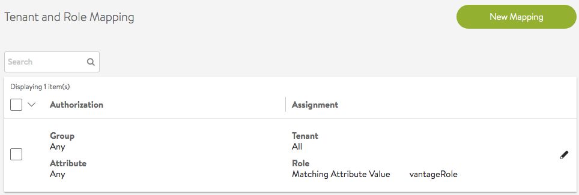</a>

## Assign Matching Group Names

A user can be a member of multiple LDAP/AD groups. For each group, if there is a configured tenant, the user will be given access to the tenant along with any other tenants the user may already have obtained access via matching rules.

<a href="img/Screen-Shot-2016-08-06-at-12.45.39-AM.png">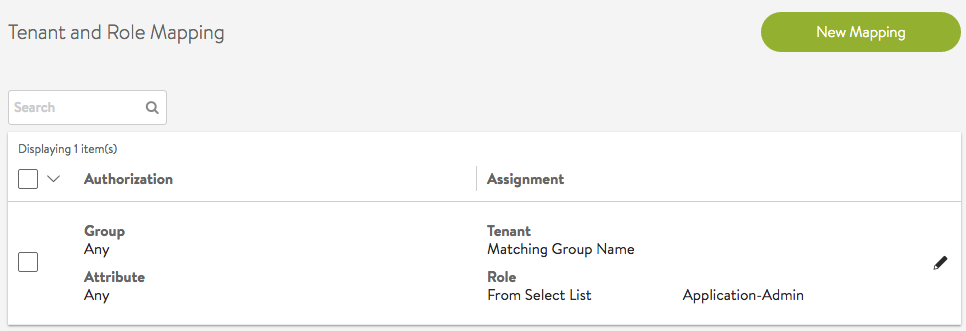</a>

## Examples

### Multiple Groups Mapping to Different Roles

This example illustrates the case of an IT team with three user groups - super-admins, app-admins, operations - where the following applies:

* Super Admins:  
    * may access all tenants, all settings, hence, super user
* Application Admins:  
    * may only create, read, update and delete Virtual Service and other Profiles
    * may not create clouds
* Application Operators:  
    * have read-only access 

Separate mapping rules are required to map users from each group to different role/tenant assignments.

<a href="img/Screen-Shot-2016-08-07-at-12.09.09-AM.png">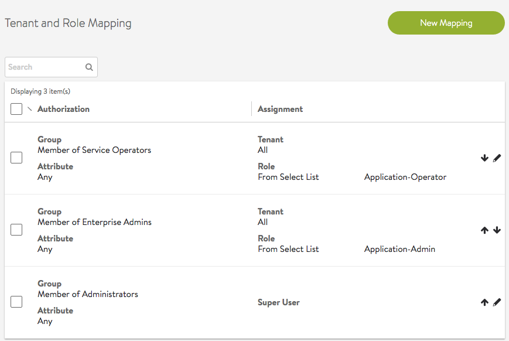</a>

### Multiple Groups Mapping to Different Tenants

This example illustrates settings for an IT team that expects tenant isolation except for a few super users.

Super Admins

* can access all tenants, all settings, hence, super user 

Tenant Application Admins

* have access to a few tenants - app owner for few tenants 

Tenant Application Operators

* have access to a few tenants - cannot modify anything 

Tenant Application Admins/Operators

* have access to a few tenants as app owners and other tenants as app operator folks. 

In this example, members of group "Service Admins E" have read/write access (Application-Admin role) in tenants Tenant AE and Tenant SE while they have read only access (Application-Operator role) in few other tenants. While "Service Operators" have only read-only access in their respective tenants.

<a href="img/Screen-Shot-2016-08-07-at-1.31.09-AM.png">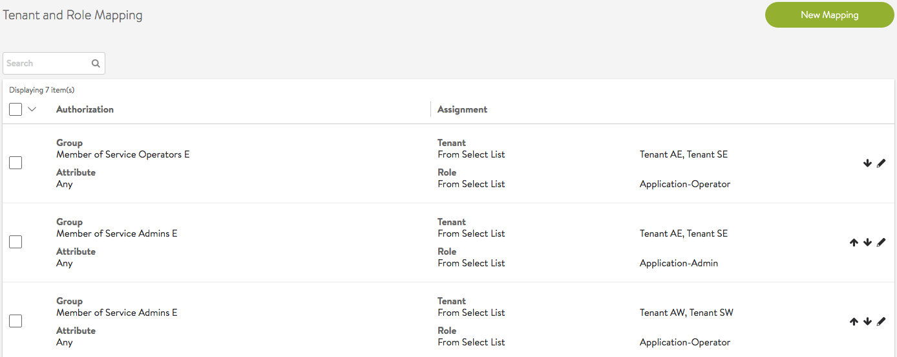</a>

<a href="img/Screen-Shot-2016-08-07-at-1.31.29-AM.png">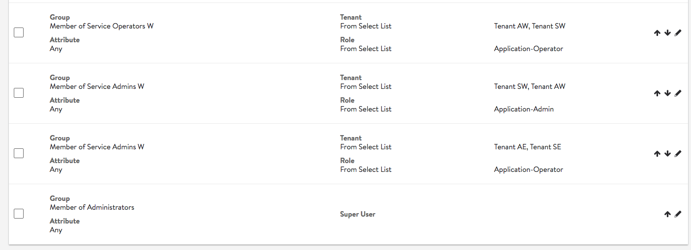</a>

### Multiple Authorizations for a Single User

In this example, login of user John Doe results in the user gaining access via multiple authorization mapping rules.

Multiple mapping rules are configured based on various group and attribute criteria.

<a href="img/Screen-Shot-2016-08-06-at-1.26.55-AM.png">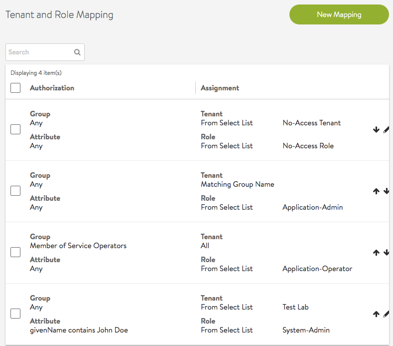</a>

The LDAP server is configured with user John Doe

<a href="img/Screen-Shot-2016-08-06-at-1.30.23-AM.png">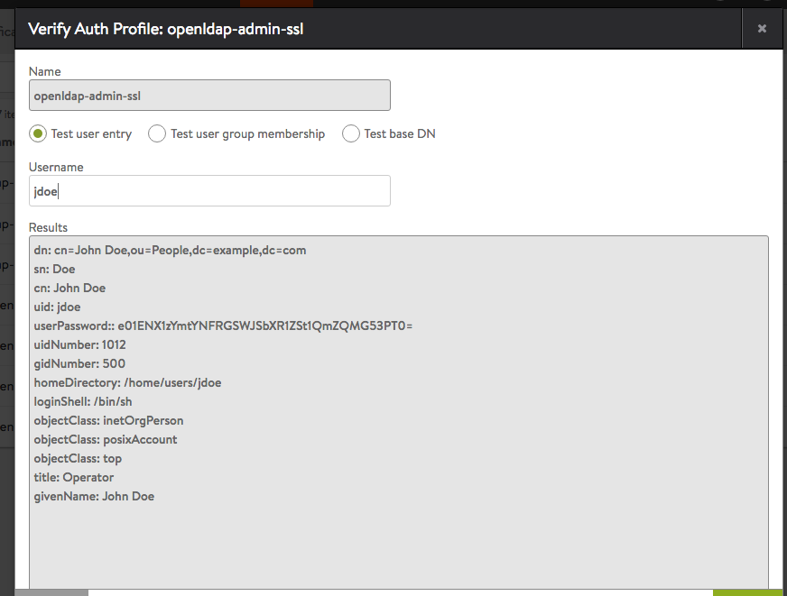</a>

LDAP server is configured with John Doe as member of the groups: Enterprise Admins and Service Operators

<a href="img/Screen-Shot-2016-08-06-at-1.32.28-AM.png">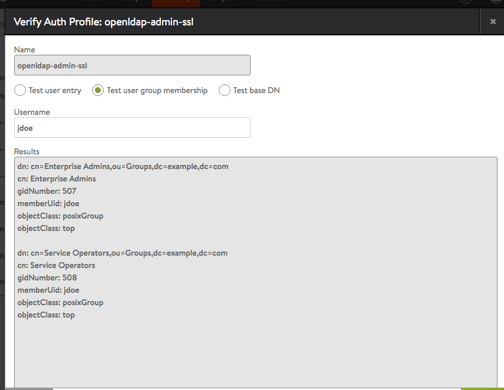</a>

After user John Doe logs in and all authorization rules are applied on the user session. Multiple role/tenant combinations are used to determine user privileges during user login. The user record shows the user successfully matched all 4 rules and role/tenant pairs were appropriately applied.

<a href="img/Screen-Shot-2016-08-06-at-1.34.27-AM.png">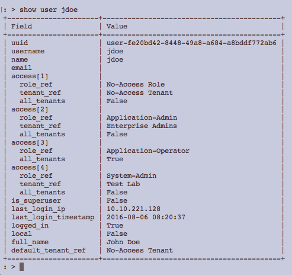</a>

### Multiple Authorizations Resulting in a Super User

In this example, login of user John Doe results in the user becoming super user

Mapping rules make a member of the group "Service Operators" a super user.

<a href="img/Screen-Shot-2016-08-06-at-11.21.42-AM.png">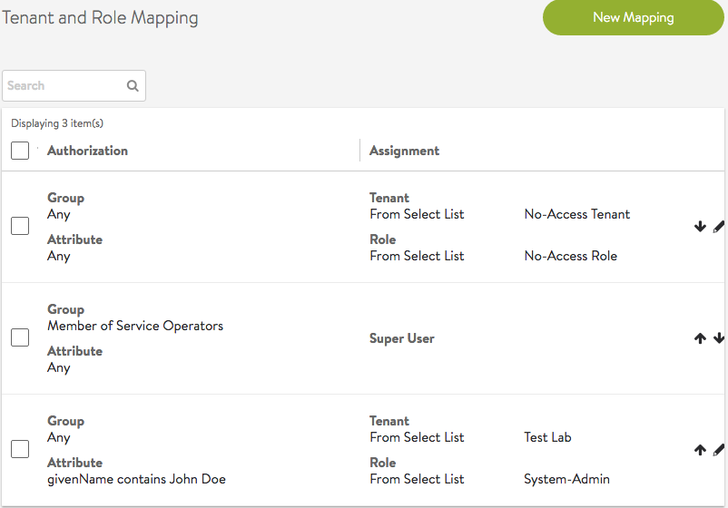</a>

Due to the super user access, user John Doe gets access to all tenants with every role.

<a href="img/Screen-Shot-2016-08-06-at-11.29.02-AM.png">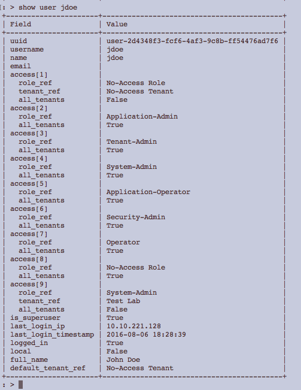</a>

### No Authorizations for a Single User

In this example, login of user John Doe results in the user not getting any roles or tenants.

Mapping rules are updated to keep user John Doe from having any privileges

<a href="img/Screen-Shot-2016-08-06-at-11.08.30-PM.png">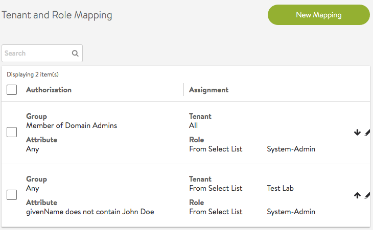</a>

when user John Doe logs in; the user interface reports no privileges to login.

<a href="img/Screen-Shot-2016-08-06-at-11.08.49-PM.png">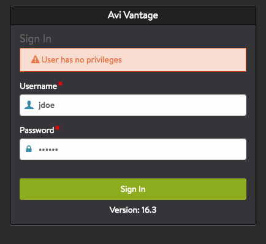</a>

user record does not have any access entries

<a href="img/Screen-Shot-2016-08-06-at-11.09.57-PM.png">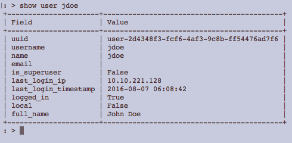</a>
