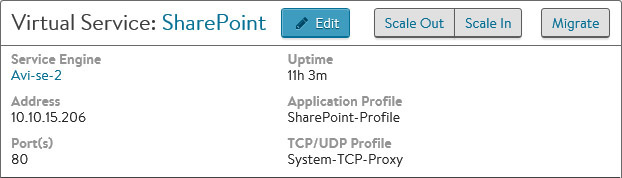
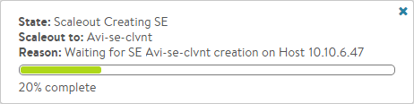
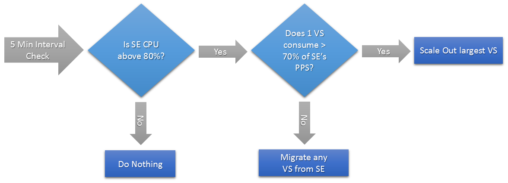

During the course of performing application delivery tasks, Avi Service Engines (SEs) may run into some form of resource exhaustion.  This may be due to CPU, memory, or packets per second.  To increase the capacity of a load-balanced virtual service, Avi Vantage needs to increase the amount of resources dedicated to the virtual service. The Avi Controller can migrate a virtual service to an unused SE, or scale out the virtual service across multiple SEs for even greater capacity.  This allows multiple active SEs to concurrently share the workload of a single virtual service.
> <strong>Note: Prior to Avi Vantage version 16.1, scaling of virtual services was manual in the UI and automatic only when configured through the CLI.</strong>
 

### Avi Vantage Data Plane Scaling Methods

Avi Vantage supports three techniques by which to scale data plane performance.
<ol> 
 <li>Vertical scaling of individual SE performance</li> 
 <li>Native horizontal scaling of SEs in a group</li> 
 <li>BGP-based horizontal scaling of SEs in a group</li> 
</ol> 

**Vertical scaling** is achieved by manually increasing the allocated resources for a virtual machine running the SE, which requires a reboot of the VM. Though supported, there remain practical limits to a single VM.  For instance, it does not allow an SE to consume more resources than the physical host server contains.

As its name implies, Avi Vantage's **native horizontal scaling** is orthogonal to vertical scaling. Indeed, both methods can be used in combination. Native scaling requires no changes to the first SE, but instead relies on distributing load to additional others. It is completely self-contained, meaning it does not require changes elsewhere within the network or applications in order to scale capacity. The rest of this article focuses on native scaling.

To scale to as many as 32 Service Engines, Avi Vantage supports **BGP-based horizontal scaling**. Relying also on RHI and ECMP, this method requires some manual intervention elsewhere in the network to scale the load balancing infrastructure. See <a href="/bgp-support-for-virtual-services/">BGP Support for Scaling Virtual Services</a> for details.

## How Native SE Scaling Works

### Scaling Out

During a normal steady state, all traffic may be handled by a single SE.  The MAC address of this SE will respond to any ARP requests.
<ol> 
 <li>As traffic increases beyond the capacity of a single SE, the Avi Controller can add one or more new SEs to the virtual service. These new SEs may be processing other virtual service traffic, or they may be newly created for this task.  Existing SEs can be added within a couple seconds, whereas instantiating a new SE VM may take up to several minutes, depending on the time necessary to copy the SE image to the VM’s host.</li> 
 <li>Once the new SEs are configured (both for networking and configuration sync), the first SE, known as the primary, will begin forwarding a percentage of inbound client traffic to the new SE. Packets will flow from the client to the MAC address of the primary SE, then be forwarded (at layer 2) to the MAC address of the new SE.  This secondary SE will terminate the TCP connection, process the connection and/or request, then load balance the connection/request to the chosen destination server.</li> 
 <li>The secondary SE will source NAT the traffic <em>from</em> its own IP address when load balancing the flow <em>to</em> the chosen server. Servers will respond back to the source IP of the connection (the SE), ensuring a symmetrical return path from the server to the SE that owns the connection.</li> 
 <li>For VMware, Docker, bare metal, Amazon Web Services, and OpenStack using Nuage environments, the secondary SE will forward packets directly back to the original client. For OpenStack with standard Neutron, the secondary SE will forward response packets back through the primary SE, which will forward the packets back to the original client.</li> 
</ol> 

### Scaling In

In this mode, Avi Vantage is load balancing the load balancers, which allows a native ability to grow or shrink capacity on the fly.

To scale traffic in, Avi Vantage reverses the process, allowing secondary SEs 30 seconds to bleed off active connections by default.  At the end of this period, the secondary terminates remaining connections.  Subsequent packets for these connections will now be handled by the primary SE, or if the virtual service was distributed across three or more SEs, the connection could hash to any of the remaining SEs.  This timeout can be changed using the following CLI command: **vs_scalein_tmeout** *seconds*

### Distribution

When scaled across multiple Service Engines, the percentage of load may not be entirely equal.  For instance, the primary SE must make a load balancing decision to determine which SE should handle a new connection, then forward the ingress packets.  For this reason, it will have a higher workload than the secondary SEs and may therefore own a smaller percentage of connections than secondary SEs.  The primary will automatically adjust the percentage of traffic across the eligible SEs based on available CPU.

## Real World Impact

### Scale Use Cases

A non-scaled virtual service offers the most optimal packet path from client to Avi Vantage to the server.  Scaling SEs may add an extra hop to some traffic (specifically traffic pushed to secondary SEs) for ingress packets. Scaling works well for the following use cases:

* Traffic that involves minimal ingress and greater egress traffic, such as client/server apps, HTTP or video streaming protocols. For instance, SEs may exist on hosts with single 10-Gbps NICs.  While scaled out, the virtual service can still deliver 30 Gbps of traffic to clients.
* Protocols or virtual service features that consume significant CPU resources, such as compression or SSL/TLS.
* Concurrent connection counts that exceed the memory of a single SE. Scaling does not work well for the following use case:
* Traffic that involves significant client uploads beyond the network or packet per second capacity of a single SE (or specifically the underlying virtual machine). Since all ingress packets traverse the primary SE, scaling may not be of much benefit.  For packet per second limitations, see documentation on the desired platform or hypervisor. 

### Impact on Existing Connections

Existing connections are not impacted by scaling out, as only new connections are eligible to be scaled to another SE.  When scaling in, connections on the secondary SE are given 30 seconds to finish, and are then terminated by the secondary SE.  These connections will be flagged in the virtual service's significant logs.  Subsequent packets for the connection or client are eligible to be re-load balanced by the primary SE.

### Secondary SE Failure

If a secondary SE fails, the primary will detect the failure quickly and forward subsequent packets to the remaining SEs handling the virtual service.  Depending on the high availability mode selected, a new SE may also be automatically added to the group to fill the gap in capacity.  Aside from the potential increase in connections, traffic to other SEs is not affected.

### Primary SE Failure

If the primary SE fails, a new primary will be automatically chosen among the secondary SEs.  Similar to a non-scaled failover event, the new primary will advertise a gratuitous ARP for the virtual service IP address. If the virtual service was using source IP persistence, the newly promoted primary will have a mirrored copy of the persistence table.  Other persistence methods such as cookies and secure HTTPS are maintained by the client; therefore no mirroring is necessary. For TCP and UDP connections that were previously delegated to the newly promoted primary SE, the connections continue as normal, although now there is no need for these packets to incur the extra hop from the primary to the secondary.

For connections that were owned by the failed primary or by other secondary SEs, the new primary will need to rebuild their mapping in its connection table.  As a new, non-SYN packet is received by the new primary, it will query the remaining SEs to see if they had been processing the connection.  If they had, the connection flow will be reestablished to the same SE.  If no SE announces it had been handling the flow, it is assumed the flow was owned by the failed primary.  The connection will be reset for TCP, or load balanced to a remaining SE for UDP.

### Relation to HA modes

Scaling is different than high availability, however, the two are heavily intertwined. A scaled-out virtual service will experience no more than a performance degradation if a single SE in the group fails. Legacy HA active/standby mode - a two-SE configuration - does not support scaling. Instead, service continuity depends on the existence of initialized standby virtual services on the surviving SE. These are capable of taking over with a single command.

Avi Vantage's default HA mode is elastic HA N+M mode, which starts each virtual service for the SE group in a non-scaled mode on a single SE.  In such a configuration, failure of an SE running *non-scaled* virtual services causes a brief service outage (of those virtual services only), during which the Controller places the affected virtual services on spare SE capacity. In contrast, a virtual service that has scaled to two or more SEs in an N+M group suffers no outage, but instead a potential performance reduction.

## Automated Versus Manual Scaling

### Migrate

In addition to scaling, a virtual service may also be migrated to a different SE.  For instance, multiple underutilized SEs may be consolidated into a single SE.  Or a single SE with two busy virtual services may have one virtual service migrated to its own SE.  If further capacity is required, the virtual service may still be scaled out to additional SEs. The migration process behaves similar to scaling.  A new SE is added to an existing virtual service as a secondary.  Shortly the Avi Controller will promote the secondary to become primary.  The new SE will now handle all new connections, forwarding any older connections to the now secondary SE.  After 30 seconds, the old SE will terminate remaining connections and be removed from the virtual service configuration.

### Manual Scaling

Manual scaling is the default mode.  Scale out is initiated from the Analytics page for the virtual service.  Mouse over the Quick Info popup (the virtual service name in the top left corner) to show options for Scale Out, Scale In, and Migrate.  Select the desired option to scale or migrate. If Avi Vantage is configured in full access mode, then scale out will begin.  This may take a couple of seconds if an existing SE has available resource capacity and can be added to the VS, or up to a couple minutes if a new SE must be instantiated. For read or no access modes, the Avi Controller is not able to install new SEs or change the networking settings of existing SEs.  Therefore, the administrator may be required to manually create new SEs and properly configure their network settings prior to initiating a scale out command.  If an eligible SE is not available when attempting to scale out, an error message will provide further info. Consider scaling out when the SE CPU exceeds 80% for any sustained amount of time, the SE memory exceeds 90%, or the packets per second reach the limit of the hypervisor for a virtual machine.

### Automated Scaling

The default for scaling is manual.  This may be changed on a per-SE-group basis to automatic scaling, which allows the Avi Controller to determine when to scale or migrate a virtual service.  By default, Avi Vantage may scale out or migrate a virtual service when the SE CPU exceeds an 80% average.  It will migrate or scale in a virtual service if the SE CPU is under 30%. The Controller inspects SE groups on a five-minute interval.  If the last 30 seconds of that 5-minute interval is above the maximum or below the minimum settings, the Controller may take an action to rebalance the virtual services across SEs. The Controller will only initiate or allow one pending change per five-minute period.  This could be a scale in, scale out, or virtual service migration.  Examples scenarios for automated scaling and migration:

* If a single virtual service exists on an SE, and that SE is above the 80% threshold, the virtual service will be scaled out.
* The ratio of consumption of SEs by virtual services is determined by comparing the PPS (packets per second) during the 5-minute interval. If the SE is above the 80% CPU threshold, and one virtual service is generating more than 70% of the PPS for the SE, this virtual service will be scaled out.  However, if the SE CPU is above the 80% mark, and no single virtual service is consuming more than 70% of the SE’s PPS, the Controller will elect to migrate a virtual service to another SE.  The virtual service that is consuming the most resources has a higher probability of being chosen to migrate.
* If two virtual services exist on an SE, and each are consuming 45% of the SE’s CPU, in other words neither is violating the 70% PPS rule, one virtual service will be migrated to a new SE. 

### Changing Scaling Options Using the CLI

Use the following commands to configure an SE group's scaling options using the CLI.

<pre br=""></pre> 
<pre class="command-line language-bash" data-user="root" data-host="localhost ~" data-output="1-100"><code>: &gt; configure serviceenginegroup Default-Group
    
     : serviceenginegroup&gt; auto_rebalance           (Enable auto rebalancing)
    
     : serviceenginegroup&gt; max_cpu_usage 80         (Set the high-water scale-out threshold)
    
     : serviceenginegroup&gt; min_cpu_usage 20         (Set the low-water scale-in threshold)
    
     : serviceenginegroup&gt; no auto_rebalance        (Disable auto rebalancing)
    
     : serviceenginegroup&gt; vs_scalein_timeout 600   (Time to wait for the scaled in SE to drain existing flows before marking the scalein done)
    
     : serviceenginegroup&gt; save                     (Save the configuration changes.)
</code></pre> 