The Avi DNS virtual service is a generic DNS infrastructure that implements the following functionality:

* <a href="#VirtualServiceDNS">Hosting GSLB service DNS entries</a>
* <a href="#VirtualServiceDNS">Virtual service DNS hosting (domain name to IP/IPAM)</a>
* <a href="#Hosting_static_DNS">Hosting static/manual DNS entries</a>
* <a href="#Proxy">DNS load balancing</a>

This article covers that functionality, typical deployment scenarios, features, and configuration. A reference is provided that covers DNS configuration via the UI.

### Functionality

### 1. Hosting GSLB Service DNS Entries

The Avi DNS virtual service can host GSLB service DNS entries, and automatically update its responses based on factors such as application service health, service load and proximity of clients to sites implementing the application service. Avi GSLB automatically populates these DNS entries. Details of Avi GSLB are available in these articles:

* <a href="/avi-gslb-overview/">Avi GSLB Overview</a>
* <a href="/gslb-architecture-and-object-model/">Avi GSLB Architecture and Object Model</a>
* <a href="/avi-gslb-site-configuration-and-operations/">Avi GSLB Site Configuration and Operations</a>
* <a href="/avi-gslb-service-and-health-monitors/">Avi GSLB Service Health Monitors</a>

### 2. Virtual Service IP Address DNS Hosting

Avi DNS can host the names and IP addresses of the virtual services configured in Avi Vantage itself (i.e., Avi is the DNS provider for the virtual services hosted on Avi Vantage).

Details of configuring this can be found in <a href="/service-discovery-using-ipam-and-dns-16-3/">Service Discovery Using IPAM and DNS (16.3+)</a>.

SRV records in a container ecosystem (e.g., Mesos, Kubernetes, others) can also be hosted on the DNS service. For more information, please refer to <a href="/service-discovery-for-mesos/">DNS-based Service Discovery for Mesos</a> and <a href="/avi-vantage-openshift-installation-guide/">Installing Avi Vantage in OpenShift/Kubernetes</a>.

### 3. Hosting Manual or Static DNS Entries

Avi DNS can host manual static DNS entries. For a given FQDN, the user can configure an A, SRV, or CNAME record to be returned.

### 4. DNS Load Balancing

In this scenario, Avi SEs proxy DNS requests to a back-end pool of DNS servers. A virtual service with a System-DNS (or similar) application profile is defined per usual. For it, a pool of back-end servers *must* be assigned, loaded with any one of many available DNS server software packages.

### Avi DNS as a Virtual Service

Avi DNS runs a virtual service with the application profile type of System-DNS and a network profile using per-packet load balancing.

Referring to the diagram below, a DNS service — shown in **green**— is hosted on the leftmost SE. The DNS VS responds to DNS queries if there is a matching entry. If a matching entry is not found and if pool members are configured, the DNS VS forwards the request to the back-end DNS pool servers (shown in **blue**).

Restriction: In release 16.3, once an SE-local DNS service is run/placed on an SE, no other virtual service placements on that SE — or its group — are permitted.

Similar to a standard VS, a DNS VS supports all <a href="/overview-of-vantage-high-availability/">data plane high availability modes</a> — elastic HA (active/active and M+N) and legacy HA.

Avi Vantage can be configured with more than one DNS virtual service.

<a href="img/Screen-Shot-2016-11-09-at-3.46.04-PM.png">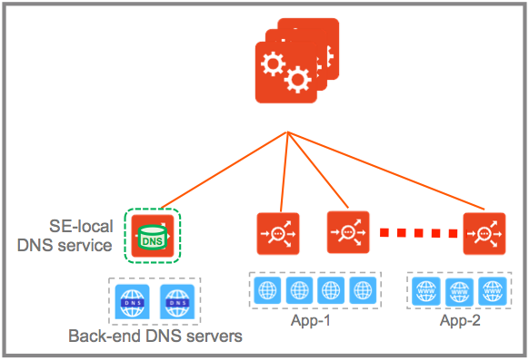</a><a href="img/DNS_VS.png">  </a>An Avi DNS virtual service can act as an authoritative DNS server for one or more subdomains (zones). As with any other Avi virtual services, analytics and client logs are supported.

Prior to the 16.3 release, Avi supported the addition of virtual service domain entries and service discovery entries on a DNS server hosted on the Avi Controller. This is now deprecated and will be unsupported in a future release, at which time existing Controller-resident entries will be migrated to SEs.

### Typical Avi DNS Deployment Scenarios

### 1. Avi DNS Service as Authoritative Name Server for a Subdomain (Zone)

In this scenario, the corporate name server delegates one or more subdomains (avi.acme.com and gslb.acme.com in the below-pictured case) to the Avi DNS service, which in turn acts as an authoritative DNS server for them. Typically, the corporate name server will have an NS record pointing to the Avi DNS service (10.100.10.50). Client queries for these subdomains are sent directly to Avi Vantage, whereas all DNS requests outside of acme.com are instead sent to the external ".com" name server.

<a href="img/Screen-Shot-2016-11-09-at-4.15.08-PM.png">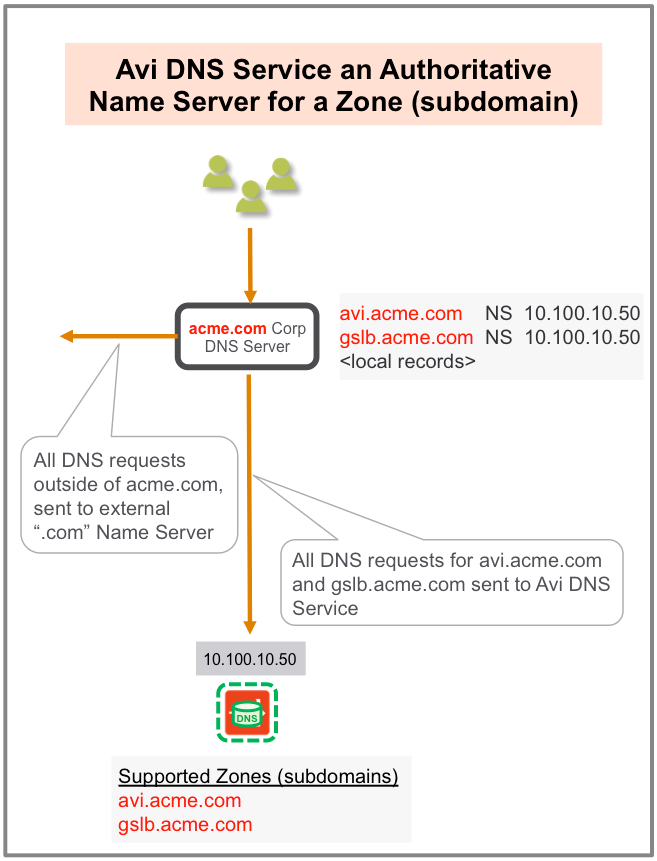</a>

 

### 2. Avi DNS Service as Primary Name Server for a Domain, with Pass-through to Corporate Name Server

In this scenario, Avi DNS is the first in line; it responds to any zones it has been configured to support. DNS queries that don't match Avi DNS records pass through (proxy) to corporate DNS servers via a virtual service pool created for that purpose. If members of that pool receive DNS requests outside the corporate domain (acme.com in this case), they send them to their external ".com" name server.

<a href="img/Screen-Shot-2016-11-09-at-4.17.20-PM.png">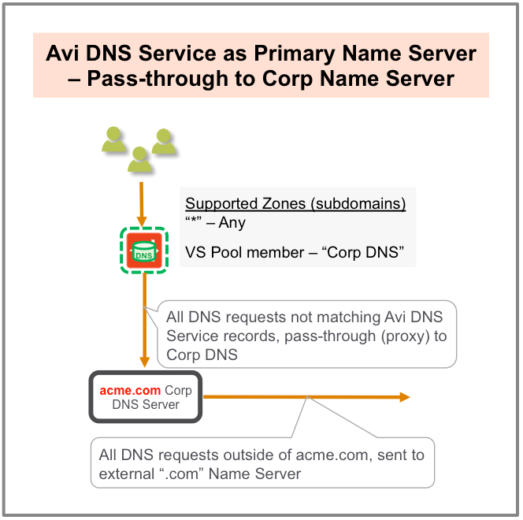</a>

### 3. Avi DNS Load Balancing

In this very basic, traditional scenario, the corporate DNS servers are pooled together and exposed by an Avi SE group as a single, scaled DNS service. Like any other VS, analytics and logs are available.

<a href="img/Screen-Shot-2016-11-09-at-4.22.20-PM.png">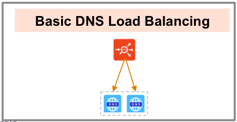</a>

### Features

### Visibility and Analytics

After navigating to the Applications-> Virtual Services, one can click on the name of a virtual service configured for DNS, DNS-Site-US-East in the screenshot immediately below.

<a href="img/Screen-Shot-2016-12-31-at-8.30.19-PM.png">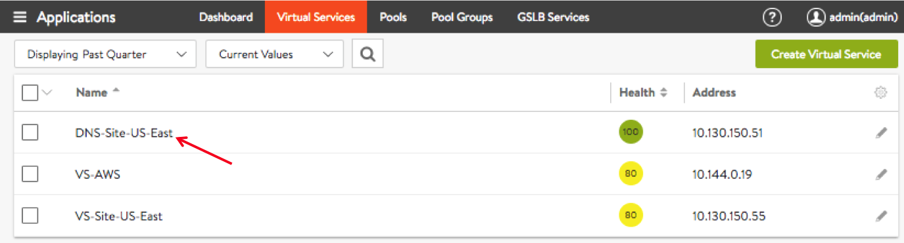</a>

Seven tabs (Analytics, Logs, Health, Security, Events, Alerts, and DNS Records) are revealed, as shown in the below figure.

Per usual, the Analytics tab of the DNS virtual service page offers metrics of interest (as seen in the red box of metrics tiles). 

<a href="img/Screen-Shot-2017-01-26-at-2.43.24-PM.png">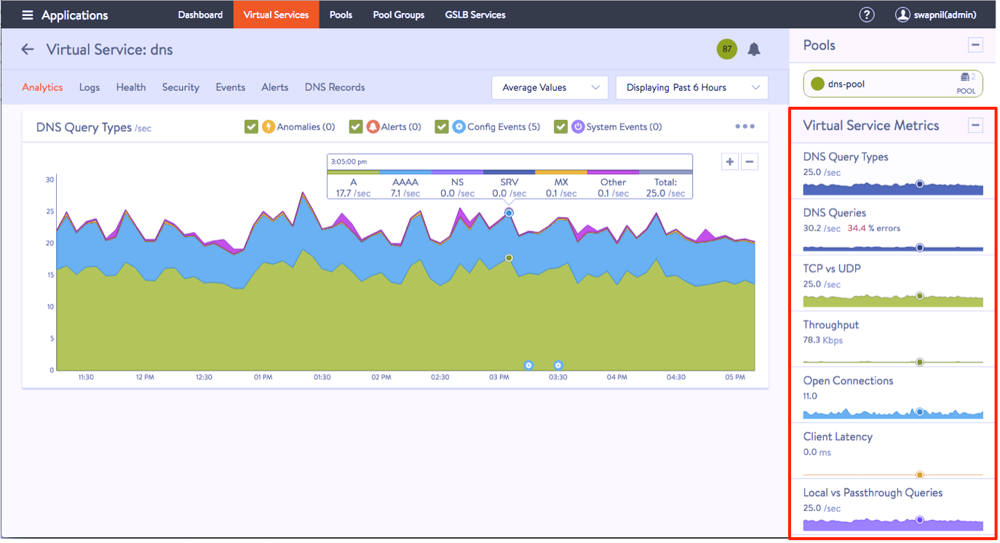</a>

The Logs tab (shown below) provides detailed information about DNS queries from clients, including FQDN, query-type, significant errors, responses (IP-addresses, CNAME, SRV, etc.).

<a href="img/Screen-Shot-2016-12-31-at-8.49.05-PM.png">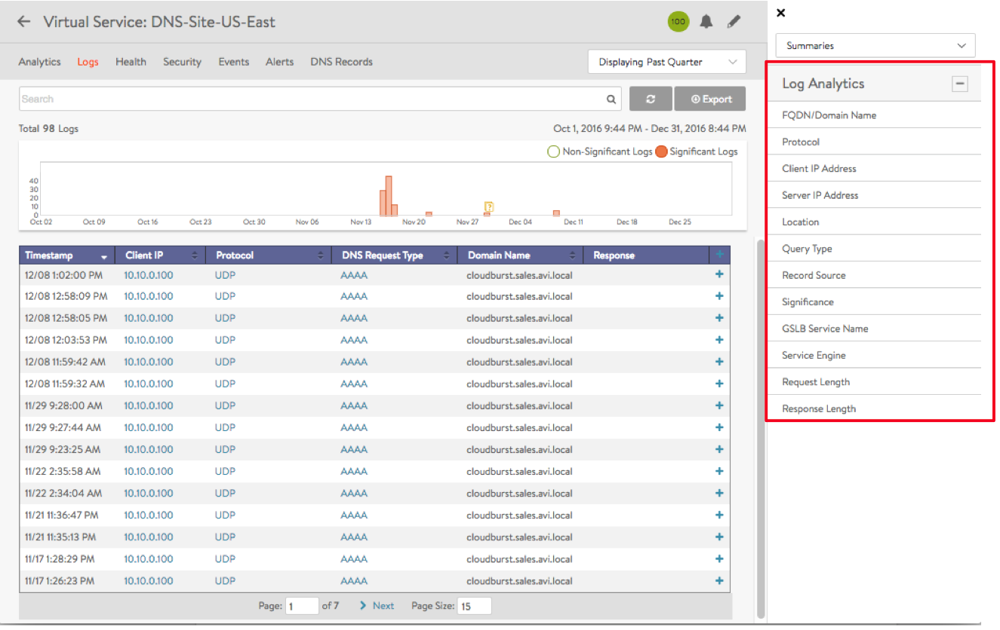</a>

### A Note on Log Settings

* Non-significant logs should be enabled with caution, since a large number of DNS queries typically hit a DNS service, and this would result in too many logs entries.
* Categorization of non-significant logs is also very important. If certain errors are typical in the deployment, these errors should be excluded from significant logs.
* Refer to the exclude DNS errors discussion found <a href="/architectural-overview/templates/profiles/analytics-profile/#exclude-dns-errors">here</a>.

Pop-ups appear by clicking one of 12 options in the Log Analytics selector (see red box above). Some examples follow.

<a href="img/1.-DNS-Logs-with-Top-FQDNs.png">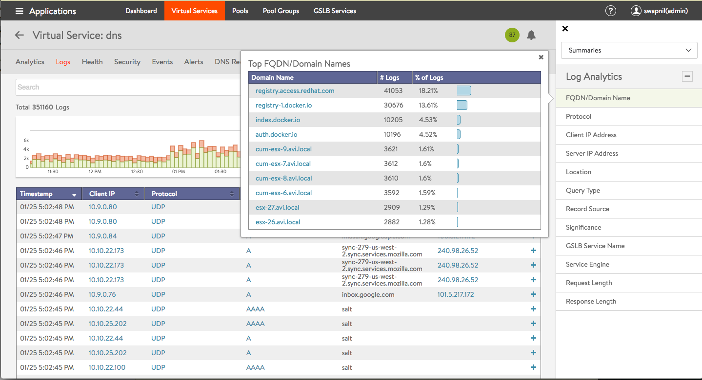</a>

 

<a href="img/2.-DNS-Logs-with-Top-IP-Address.png">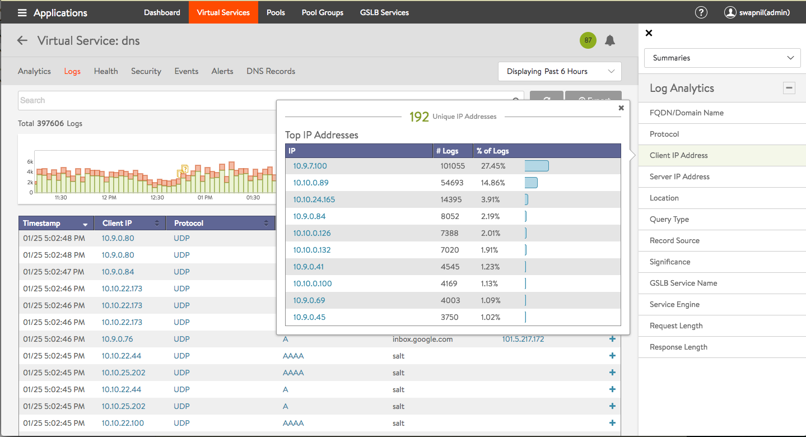</a>

 

<a href="img/3.-DNS-Logs-with-Top-Query-Types.png">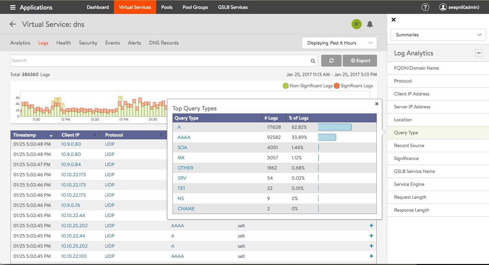</a>

 

### Notes

In the above,

* Detailed analytics is not available for TCP. This is planned for a future release.
* DNS requests can be filtered by sub-domain name. Support for additional filtering (e.g., request-type) is planned for a future release.
*  may occasionally appear when a metric tile is selected. This typically implies "Not Applicable." For example a GSLB service name may not be applicable for the DNS proxy or a static entry.

The DNS Records tab is unique to this kind of virtual service.

<a href="img/Screen-Shot-2016-12-31-at-9.40.34-PM.png">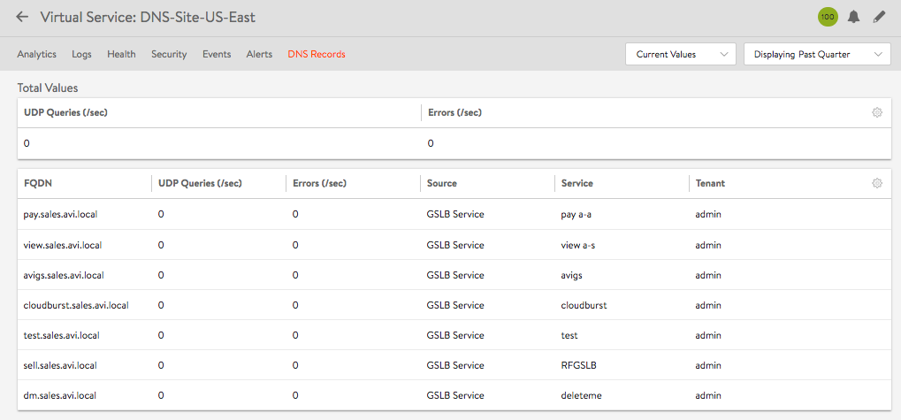</a>

### DNS Health Monitoring

DNS health monitors can be configured to monitor the health of DNS servers that are configured as DNS service pool members.

Refer to the <a href="/dns-health-monitor/">DNS Health Monitor</a> article for more details. 

### Additional Features

* Domain filtering drops requests for any domains that are not explicitly configured on the DNS service (the default setting is to allow all domains).
* The time-to-live (TTL) can be customized (default is 30 seconds).
* Network security policy can be based on client (source) IP and port.
* With a full TCP proxy, client spoofing is prevented for TCP DNS queries. SYN flood attacks are mitigated.
* One can opt to respond to failed DNS requests by returning a DNS error code or dropping the packets.

### DNS Configuration

Regardless of use case, DNS virtual service configuration begins with the Advanced Wizard. The operative field below is Application Profile, which needs to be set to System-DNS (or some alternative DNS-oriented profile the user defines).

<a href="img/Advanced-VS-wizard.settings.png">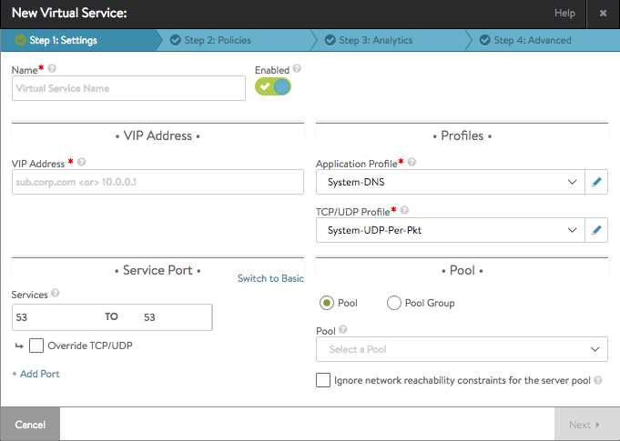</a>

Illustrated below is the application profile editor. Setting the **Type **field to** **DNS brings up basic and request rate limiter settings by which to customize the behavior of Avi DNS when other than default behavior is desired.

<a href="img/DNS-Application-Profile.png">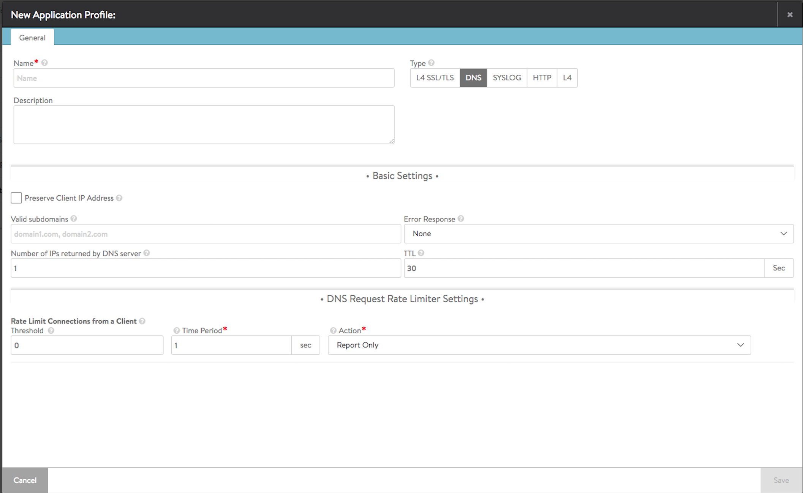</a>

Basic Settiings

* **Preserve Client IP Address **is off by default. Setting it causes the client's IP to be used for the connection to the back-end server pool, a behavior which is incompatible with connection multiplexing.
* **Valid subdomains **are those domains this DNS is prepared to resolve into IP addresses. These are configured with Ends-With semantics.
* **Error Response **is "None, i.e., off by default (no response is sent back and client request will be timed out). If set to "Error," then if the DNS service encounters an error when processing the query, it returns that error to the requesting client.
* **Number of IPs returned by DNS server **defaults to 1, but can be set as high as 20. If set to 0, this DNS will return all available IPs (A records) to the requesting client. On a per-GSLB-service, this general value may be overridden (see <a href="/avi-gslb-service-and-health-monitors/">Avi GSLB Service Health Monitors</a>).
* **TTL** is the time-to-live in seconds (1 to 86400) for records served by this DNS. On a per-GSLB-service, this general value may be overridden (see <a href="/avi-gslb-service-and-health-monitors/">Avi GSLB Service Health Monitors</a>).

DNS Request Rate Limiter Settings (Rate Limit Connections from a Client)

* **Threshold** is the maximum number (10 to 2500) of DNS requests any single client IP address may make during a specified contiguous span of time before rate limiting will begin.
* **Time Period **is the contiguous span of time, a moving time window (number of seconds, field value can range from 1 to 300) over which Avi Vantage looks for the threshold to be exceeded. Put another way, Avi will calculate and take a specified action if the inbound request rate is exceeded. That rate is the ratio max-number / time-span.
* **Action** is one of three to be taken when rate limiting must begin: <ol>
 <li>Only report that the threshold has been exceeded.</li>
 <li>Drop SYN packets to limit the inbound rate (only if this DNS VS is configured to listen to on TCP).</li>
 <li>Send TCP RST to limit the inbound rate (only if this DNS VS is configured to listen to on TCP).</li>
</ol>

With or without a back-end pool of DNS servers selected in the Advanced VS wizard, configuration proceeds as normal with options to define policies, analytics, and advanced settings. These are the typical ones would expect when configuring any virtual service.

Note: In the Advanced tab, one can identify the SE group on which the DNS VS will be placed. It is recommended that no other virtual services be placed on such a group.

<a href="img/Screen-Shot-2017-01-27-at-4.13.27-PM.png">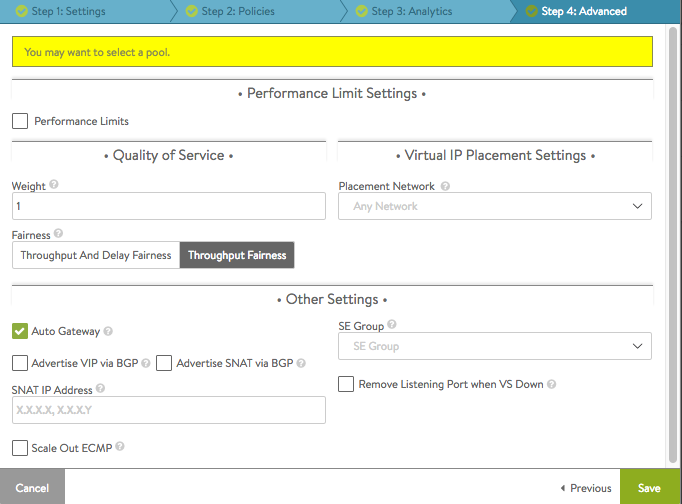</a>

### DNS for Avi-hosted Virtual Services

Avi-SE-hosted DNS virtual services translate the FQDNs of Avi-Vantage-hosted virtual services into IP addresses. No pool need be assigned; the translation is done completely within the SE VMs. Navigate to the Administration -> Settings -> DNS Service tab to choose from among the defined DNS virtual services. In the below screenshot, the user has chosen to select "Create Virtual Service," rather than select the pre-existing DNS-Site-US-East.

When no such DNS virtual services are explicitly defined, Avi Vantage hosts a small DNS server on the Avi Controller. [This option will be deprecated in a future release.]

<a href="img/Screen-Shot-2016-12-31-at-3.41.52-PM.png">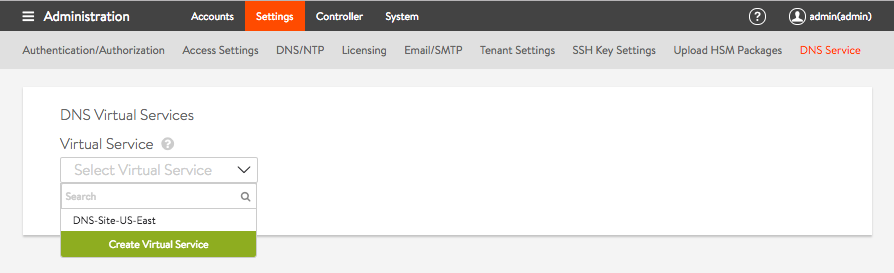</a>

For more information on configuration steps for DNS virtual services, please refer to the<a href="/avi-gslb-site-configuration-and-operations#configure-local-dns-vs"> configure local DNS virtual service on all active sites that host DNS</a> section of <a href="/avi-gslb-site-configuration-and-operations/">Avi GSLB Site Configuration and Operations</a>.

### DNS for GSLB

A DNS as defined above is suitable for GSLB as well. Note: A given DNS's participation in a GSLB configuration is not a property of the DNS virtual service object itself. Rather, it is a property of the Avi GSLB site object. As part of the GSLB site configuration, some pre-existing DNS service(s) is(are) designated to serve in the role. This is illustrated in the following GUI screenshots. See also <a href="/avi-gslb-site-configuration-and-operations/#configure-local-dns-vs">Avi GSLB Site Configuration and Operations</a>.

Step 1: Navigate to Infrastructure -> GSLB and click the Add New Site button in the Site Configuration tab.

<a href="img/Screen-Shot-2017-01-26-at-3.58.46-PM.png">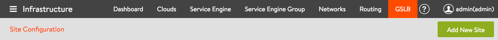</a>

Step 2: When the New GSLB Site editor appears, complete all fields. You *must* click the Active Member option to enable the Save and Set DNS Virtual Service button. Click on it.

<a href="img/GSLB-site-editor.png">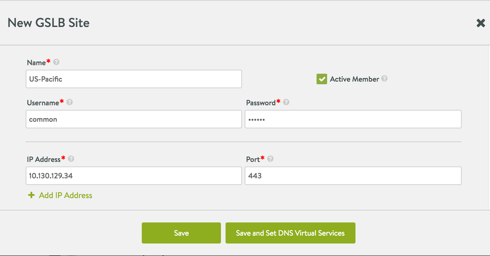</a>

 

Step 3: Select from one or more DNS virtual services in the pulldown and click Save to identify it as a participant in the GSLB configuration.

<a href="img/Screen-Shot-2017-01-26-at-4.59.50-PM.png">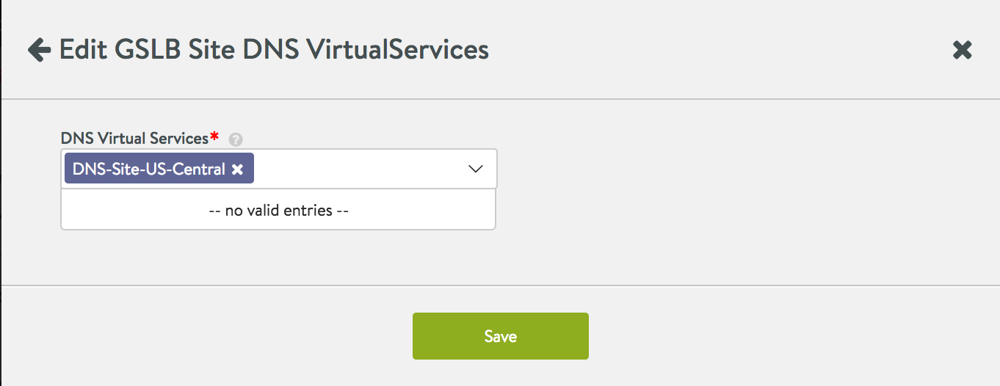</a>

This below screenshot illustrates the case where there are no DNS virtual services from which to choose.  An active GSLB site does not require a DNS, though it may be preferred, as described in the next section.

<a href="img/select-an-existing-DNS-for-the-GSLB-site.png">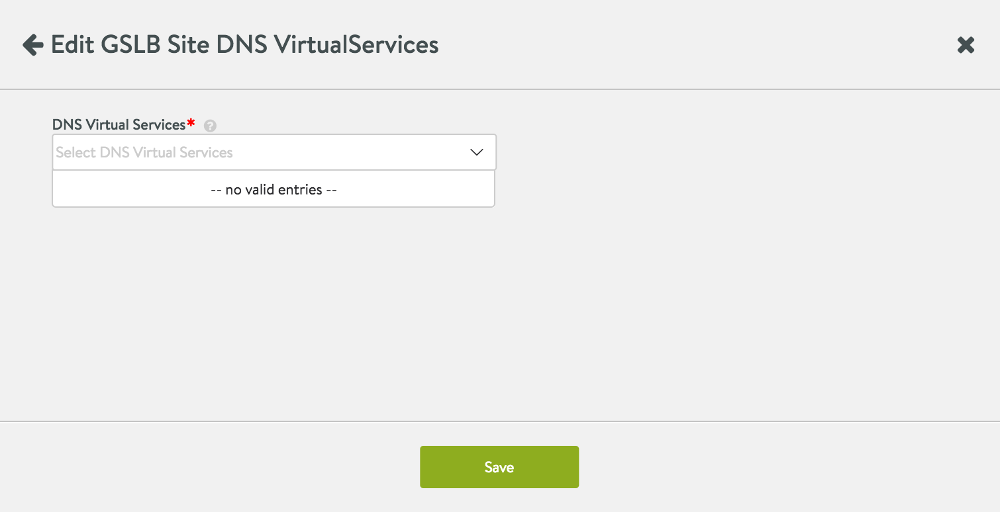</a>

### High Availability Recommendations

As with any other virtual service, the first step toward achieving HA is to configure DNS for GSLB on an SE group that is scalable to two or more SEs. In addition, to protect against whole-site failures, Avi recommends running DNS for GSLB in more than one location. This can be achieved two ways:
<ol>
 <li>Have <em>at least</em> two geographically separated active GSLB sites, and for <em>each</em> configure a DNS onto a scalable SE group.</li>
 <li>If only one active site is defined, for it define at least one geographically remote cloud (e.g., AWS). On that remote cloud, configure DNS for GSLB on a scalable SE group. Also define all application virtual services to support the mission-critical apps running on the origin location.</li>
</ol>

 

