Data- and control-plane GSLB service health monitors and their GUI and CLI configuration are covered in this article. Relevant <a href="/docs/latest/api-guide/gslbservice.html">GslbService</a> API object parameters are reviewed to aid in understanding GSLB service health monitoring.

### Review of the GSLB Service Object

Summary: A GSLB service is the representation of a global application; it front-ends instantiations of the application that are deployed at multiple sites. The corresponding <a href="/docs/latest/api-guide/gslbservice.html">GslbService</a> configuration object defines the FQDN of the application, the backing virtual services in various sites, and the priority/ratios governing selection of a particular virtual-service at any given time. This object also defines the monitoring methods by which unhealthy components can be identified so that best alternatives may be selected.

Details:

* As mentioned, end-user clients reference the global application via fully qualified domain names. Multiple **GslbService.domain_names** can be specified for aliasing purposes (e.g., www.foo.comand foo.com). It is the DNS' responsibility to resolve — and periodically *re*-resolve — an FQDN to an IP address so that requests are steered to the currently optimum service location.  
* **GslbPool**  
    * A <a href="/docs/latest/api-guide/gslbservice.html">GslbService</a> object will reference at least one and optionally more <a href="/docs/latest/api-guide/gslbservice.html#GslbPool">GslbPool</a> objects.
    * The GslbPool object lists the **GslbPool.members** (virtual services) that implement the global application's functionality. A single priority value (default = 10) is assigned to all the members of any given pool.
    * **GslbPool.priority** is the basis by which traffic is directed to the pool. Avi Vantage will select the pool with the highest priority, to the exclusion of other pools. However, when/if a pool is inaccessible, down, or at maximum capacity, a lower priority pool will be chosen instead.
    * Once a particular pool has been selected, a **GslbPool.algorithm** balances load across the pool's virtual services. In 16.3, two algorithms are available.  
        * The weighted round robin algorithm balances even-handedly across all members, but load can be skewed by the **GslbPoolMember.ratio** [default = 1, range is 1-20] values that optionally may be set for members. For example, if virtual services A, B, and C have ratios of 1, 2 and 3 respectively, virtual service A will receive one-sixth, B will get one-third, and C will get one-half the load.
        * Consistent hash is based on the client IP address (typically the LDNS IP address). A mask can be applied on the client IP address, if there are multiple LDNSes in a given network, in one site.
    * Pool members  
        * Members can be specified by their Avi virtual service name or an IP address. The latter option is used to specify standalone servers or VIPs defined by third-party load balancers. 
        * The member may also be specified using a DNS name, for example, to specify a DNS-based load balancer such as AWS ELB. In this case, health checks are performed against one of the IP addresses for the ELB FQDN, and a CNAME for the ELB FQDN is provided in the DNS response if this member is selected.
        * **GslbPoolMember.enabled** is a flag (True by default) that tells the DNS it may furnish the member's IP address in a DNS response. It should be set to False to temporarily remove a member from participating in the global application, for example, during a maintenance period. 
* **GslbService.TTL**  
    * If no TTL is specified for a particular GSLB service, its value defaults to the TTL specified in the DNS application profile. The default value is 30 seconds. The value may range from 1-86400 seconds and defaults to 30 seconds. Avi suggest caution when using very low values of TTL, since some LDNSs/operating systems will discard a very low TTL. 
* The**number of IP addresses** provided in the DNS response defaults to 1. Setting it to 0 causes the DNS to respond with all virtual service IP addresses for the selected pool.
* **GslbService.down_response** permits one to choose one of four standard responses to be sent when a DNS query is received for a GSLB service that is currently down.  
    * GSLB_SERVICE_DOWN_RESPONSE_NONE, the default option, simply drops the request. 
    * GSLB_SERVICE_DOWN_RESPONSE_FALLBACK_IP respond with a single preset fallback IP address, which typically would point to a server that’s serving a "sorry" page.
    * GSLB_SERVICE_DOWN_RESPONSE_ALL_RECORDS returns all IP addresses of all members of all pools
    * GSLB_SERVICE_DOWN_RESPONSE_EMPTY returns an empty DNS response, and can be used to make the client retry in certain cases.
* A set of **GslbHealthMonitor **references may be specified to enable data-plane health monitoring. These active monitors generate synthetic traffic from the DNS Service Engine to mark a virtual service (pool member) up or down, based on its response.
* **GslbService.controller_health_status_enabled** is an optional flag which defaults to True to turn on control-plane (Avi Controller-based) health status determination. If set to False, the DNS relies solely on data-plane health monitoring (via GslbHealthMonitor references). 

## GSLB Service Health Monitoring

There are two general categories of GSLB health monitoring: control-plane and data-plane health checks.

<a href="img/GSLB-Member-Healthchecks.png">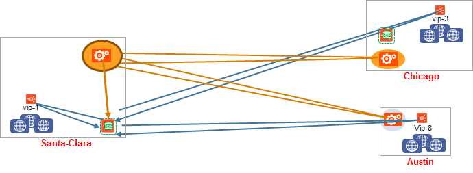</a>

### Control-Plane-Based GSLB Service Health Monitoring

Independent of Avi GSLB, every Avi Controller performs health checks to collect the health scores and performance metrics of virtual services under its control. If **GslbService.controller_health_status_enabled** is True, active sites will periodically query all the other Avi sites (both active and passive) to fetch their locally-collected health and load information. This gives good insight into all Avi virtual services that participate in global applications. Control-plane health monitoring does not apply to third-party load balancer VIPs or standalone servers. This is so because — by definition — there is no Controller to query in those cases.

To avoid cluttering the below figure with too many arrows, just the active Controller in DC1 is shown collecting health information from 3 other Controllers (dashed arrows). It then passes this coalesced health status to its local DNS (solid arrow). In reality, the active Controllers in DC2 and AWS would behave in like fashion, updating their respective local DNS virtual services with control-plane-based health status.

<a href="img/Control-plane-healthcheck.png">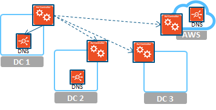</a>

### Data-Plane-Based GSLB Service Health Monitoring

At every active site, a Service Engine hosting a GSLB-enabled DNS VS can perform a variety of periodic health checks against all GSLB pool members (including those local to it). The below diagram shows the DNS in DC1 (the only active site) performing this function against virtual services VS-A1, VS-A2, VS-A3 and VS-A4.

As previously mentioned, the object used for this is called the <a style="font-weight: bold;" href="/docs/latest/api-guide/gslbhealthmonitor.html">GslbHealthMonitor</a>. Ping, TCP, UDP, DNS, and HTTP(S) health monitors are supported (as pictured in the Configuring Health Monitoring section below. Additionally, one can write and incorporate one's own monitor.

Please read the <a href="/overview-of-health-monitors/">Health Monitoring KB</a> for more information.

<a href="img/Data-plane-healthcheck.png">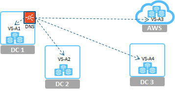</a>

### Three Options for GSLB Service Health Monitoring

* **Control-plane health checking only**: Define no active data-plane health monitors. Have all active Controllers coalesce health stats they collect locally with stats from remote Controllers responsible for GSLB pool members. Coalesced stats are then passed from each active Controller to its local DNS. This health-checking technique is only available for members implemented as Avi virtual services.
* **Data-plane health checking only**: Set GslbService.controller_health_status_enabled to False. Have each DNS virtual service perform health checks on all GSLB member virtual services.
* **Both control- and data-plane health checking:** Turn both options on. For a GS member to be marked as UP, both control and data health should report UP. If the control health check is failing due to a remote Controller being down/inaccessible, but data-plane health checking is still possible, then it alone will determine whether a GS member is marked UP or DOWN. 

### Health Checking Optimizations

### Set data-plane health monitor scope appropriately

GslbService.health_monitor_scope is an optional parameter that takes on one of two states. By default it is set to GSLB_SERVICE_HEALTH_MONITOR_**ALL_MEMBERS**, in which case DNS SEs actively probe pool members at both Avi and external sites. However, the parameter can be set to GSLB_SERVICE_HEALTH_MONITOR_**ONLY_NON_AVI_MEMBERS**, such that external member status is collected the only way possible, while the work of Avi member health checking is offloaded from DNS SEs to Avi Controllers local to the GSLB pool members.

### Limit the number of active sites

Configurations with a relatively large number of Avi sites have the potential to burden Controllers and the networks interconnecting them if a large fraction of the sites are configured to be active. For example, consider two deployments, each with 10 Avi sites. One has 5 active Controllers, the other just 2. Each regularly scheduled remote-site health check from an active Controller collecting health status from 9 remote sites. Compare the throughput consumed when 5 Controllers probe 9 sites each, versus when just 2 Controllers probe 9 sites. That's 45 remote-site collections per unit of time compared to just 18. The latter is considerably more throughput-efficient, while still delivering reasonable GSLB DNS redundancy for HA.

### Configuring Health Monitoring

The below specifications apply to the GUI examples shown in this section.

* The customer has multiple data centers.
* Two global applications spanning both are going to be deployed. Each will require health monitors to be configured.
* **view.sales.avi.local** will run in US-West and rely on US-Central as a disaster recovery site.
* **pay.sales.avi.local **will run at US-West as well as US-East to achieve both high availability and optimal user experience. 

**1. Configure a data-plane health monitor for both GSLB services. **Recall that this operation can only be performed by an authorized user logged into the GSLB leader Controller.

The Templates -> Profiles -> Global Health Monitor tab shows the five pre-existing system-standard monitors:

<a href="img/system-standard-GSLB-health-monitors-2.png">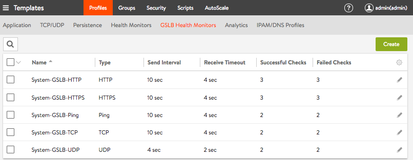  </a>When not satisfied with the default values for a monitor's parameters, one can change them. However, in the case of a system-standard monitor, the better practice is to define a brand *new* monitor by clicking **Create**. The defaults that apply will be populated into the editor window, and can then be modified as desired. Refer to the **New GSLB Health Monitor** editor window below.

The monitor name is arbitrary; the letters "tcp" merely help us recognize it for what it is. The Type parameter is what counts. Note the other values we've specified for some of the parameters. Parameters above the solid line are common to all monitor types.

<a href="img/our-GLSB-TCP-monitor.png">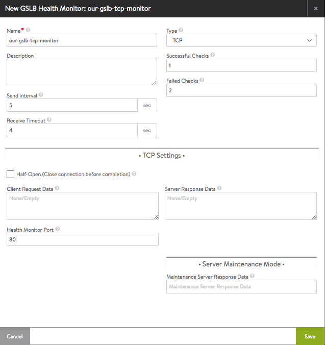  </a>

* **Successful Checks**: The number of consecutive successful health checks before a virtual service is marked UP
* **Failed Checks**: The number of consecutive failed health checks before a virtual service is marked DOWN
* **Send Interval**: The number of seconds between health checks to a given virtual service
* **Receive Timeout**: A valid response from the server is expected within this number of seconds. It must be less than the send interval. If server status is regularly flapping between UP and DOWN, consider increasing this value.
* **Health Monitor Port**: Regardless of what port underpinning virtual services use, this monitor will direct its health checks to port 80. A monitor port is mandatory for HTTP(S), TCP, UDP and external health monitors. 

Clicking Save in the new GSLB Health Monitor editor completes the custom-monitor creation.

****2. Configure the GSLB services. ****Yet again, this operation can only be performed by an authorized user logged into the GSLB leader Controller. The **New GSLB Service** wizard speeds the definition of either active/active or active-standby configurations, as first introduced in the <a href="/docs/16.3/avi-gslb-overview/">Avi GSLB Overview</a> article. Both are illustrated below.

* **Active/standby GSLB service for view.avi.com******By astutely picking **GslbPool.priority** values, one for each of our pools, it is possible to fashion an active/standby configuration. A pool with priority 12 will handle all traffic unless and until it fails, at which time a standby pool with priority 5 will automatically take over.   
****
    
    <ol> 
 <li>Navigate to Applications -&gt; GSLB Service, click <strong>Create </strong>and choose the Basic Setup option.</li> 
 <li>Naming the new GSLB service "view- a-s" reminds administrators that this is an active/standby GSLB service. The <strong>Application Name</strong> field, which is set to "view," is more important for application users. Since this is to be a TCP service, and data-plane health checking is desired, an appropriate active health monitor to choose is our-gslb-tcp-monitor," the health monitor created in step 1. The default value for H<strong>ealth Monitor Scope</strong> (All Members) is left alone for two reasons: (1) No external virtual services are planned, so "Only Non Avi Members" becomes irrelevant. (2) Un-clicking "All Members" would mean we set up a customer monitor for no reason. We might consider un-checking <strong>Controller Health Status</strong> option and rely only on the active monitor just enabled. <strong>From a health monitoring point of view,</strong> <strong>these fields are the most important ones in the scenario. </strong>Other fields, though likewise important, have nothing to do with health monitoring.In the <strong>Pool Member</strong> section, "Virtual Service" (the default) is appropriate, since in this example external virtual services (for which an IP address would be appropriate) are not desired.Of the various site clusters in the pulldown, "US-West" is picked. The<strong> Virtual Service</strong> pulldown reveals all existing Avi virtual services running under that Controller cluster. VS-Site-US-West is selected.The <strong>Priority</strong> field has no default value. Setting it to 12 will make this the active site simply because a lower value (5) is planned for the standby site's pool.Clicking <strong>Save</strong> completes this step.<a href="img/Screen-Shot-2016-12-30-at-5.23.36-PM.png">  </a><a href="img/Screen-Shot-2016-12-30-at-5.23.36-PM.png">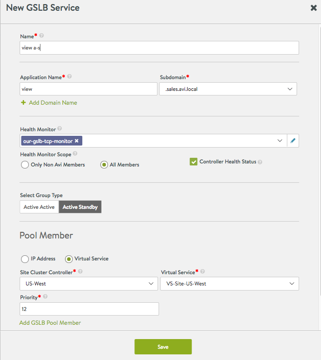</a></li> 
 <li>From Avi Vantage's point of view, the global service is ready to accept client requests, even though the standby half of it has yet to be created. This is reflected by the <strong>Enable State </strong>and<strong> Status</strong> values in the application list that appears, as shown below:<a href="img/Screen-Shot-2016-12-30-at-5.45.40-PM.png">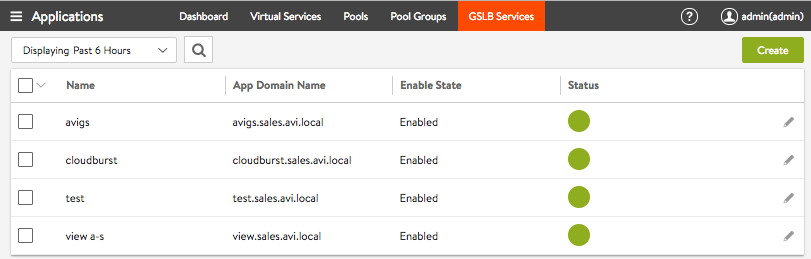  </a>Clicking the pencil icon in the rightmost column of the application's row shows the progress made so far (see below). Notice the default choices Avi Vantage has automatically made for the pool <strong>Name</strong> and its <strong>Algorithm</strong> (round robin, as opposed to consistent hash).<a href="img/Screen-Shot-2016-12-30-at-5.49.58-PM.png">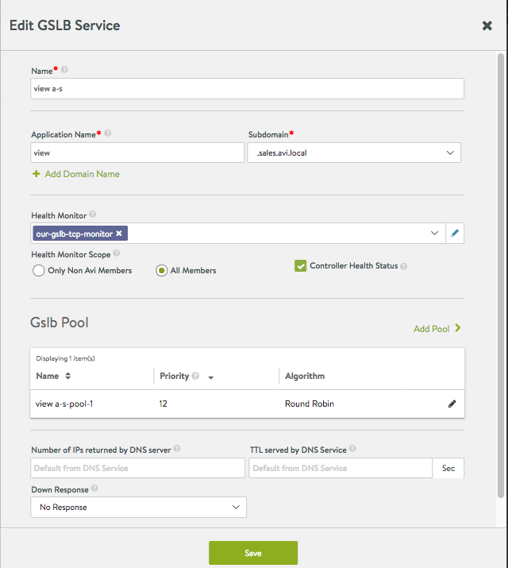  </a></li> 
 <li>Clicking <strong>Add Pool</strong> in the GSLB service editor enables addition of the standby pool. Continuing with Avi Vantage's pool-naming convention, "view a-s-pool-2" is chosen, with a priority of 5, and the default for the LB algorithm. Although "US-West" is once again offered in the<strong> Site Cluster Controller</strong> pulldown, "US-Central" makes more sense. At US-Central, "VS-Site-US-Central" is the chosen virtual service. The default <strong>Ratio</strong> (1) is a "don't care" value because no additional virtual services are planned for this pool. It would matter were <strong>Add GSLB Pool Member</strong> clicked and a second virtual service identified. Clicking Done ends this step.<a href="img/Screen-Shot-2016-12-30-at-6.08.11-PM.png">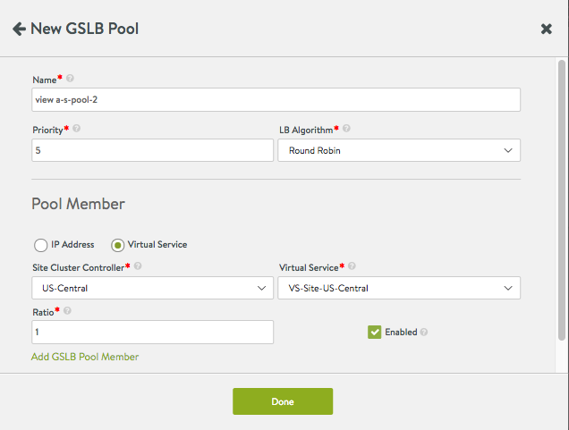  </a></li> 
 <li>The GSLB service editor screen that appears (see below) reveals the progress made so far. Notice that no GSLB-service-specific values for <strong>Number of IPs returned by DNS server </strong>or<strong> TTL served by DNS Service</strong> have been specified. The DNS service's values for these will therefore apply.<a href="img/Screen-Shot-2016-12-30-at-6.10.20-PM.png">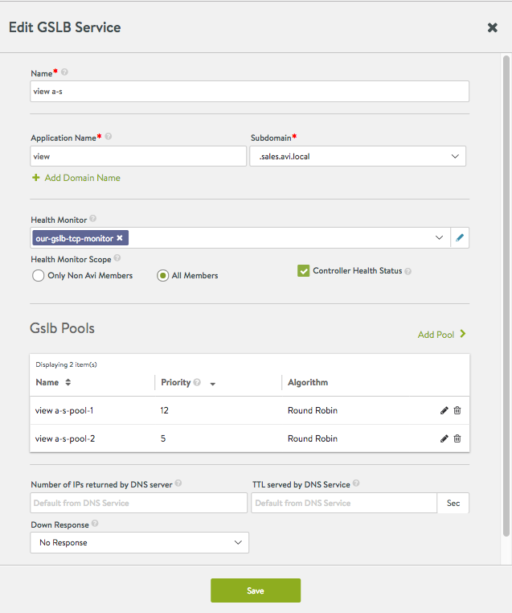  </a>Clicking <strong>Save</strong> completes this step. Our two-pool active/standby GSLB service has been created.</li> 
</ol> 
* ****Active/active GSLB service for pay.avi.com**** <ol> 
 <li>Navigate to Applications -&gt; GSLB Service, click <strong>Create </strong>and choose the Basic Setup option.</li> 
 <li>Name the new GSLB service "pay a-a," set <strong>Application Name</strong> to "pay," choose "our-gslb-tcp-monitor" from the <strong>Health Monitor </strong>pulldown, accept the default for <strong>Select Group Type</strong>, choose "US-West" for the first of the two sites, and "VS-Site-US-West" for the <strong>Virtual Service</strong> parameter. Click <strong>Save</strong> to complete this step.  <a href="img/Screen-Shot-2016-12-30-at-6.55.58-PM.png">  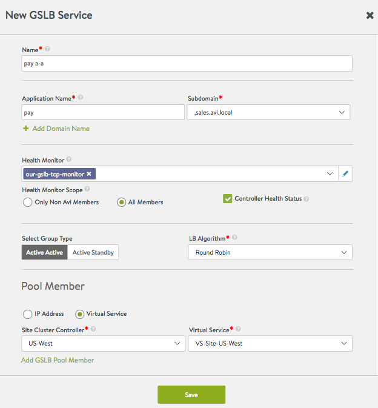  </a></li> 
 <li>The <strong>Applications</strong> list will initially show a red-circle-exclamation-point status<a href="img/Screen-Shot-2016-12-30-at-7.43.40-PM.png">,</a> but after some seconds, if all is well, it will turn solid green, indicating "pay a-a" is enabled and healthy.<a href="img/Screen-Shot-2016-12-30-at-7.25.03-PM.png">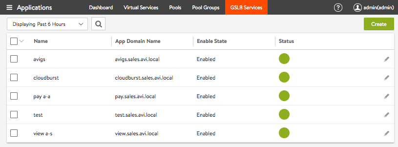  </a></li> 
 <li>Clicking on the pencil icon for "pay a-a" continues the process by returning us to the GSLB service editor:<a href="img/Screen-Shot-2016-12-30-at-7.46.49-PM.png">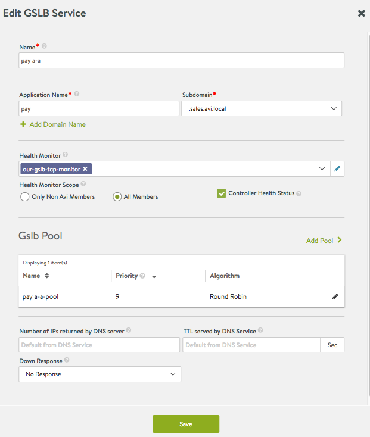  </a></li> 
 <li>At this point, we don't need a second pool. Instead we need to add more virtual services to the existing pool. ["Active/active" pertains to the virtual services <em>within</em> the pool.] Clicking the pencil icon in the <strong>Gslb Pool</strong> section of the above screen yields the below, so that we can add a second pool member, i.e., a second virtual service.  <a href="img/Screen-Shot-2016-12-30-at-7.30.34-PM.png">  </a><a href="img/Screen-Shot-2016-12-30-at-7.50.56-PM.png">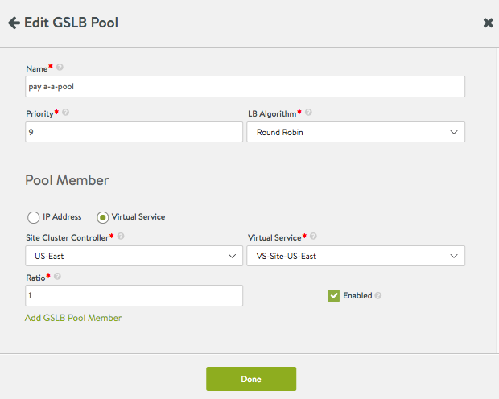  </a></li> 
 <li>Clicking <strong>Add GSLB Pool Member</strong> above opens up a second set of pool-member fields. The below shows them completed. The <strong>Site Cluster Controller</strong> is "US-East" and the desired virtual service is "VS-Site-US-East." Leaving the <strong>Ratio</strong> values at 1 suggests that neither virtual service will be weighted over the other.<a href="img/Screen-Shot-2016-12-30-at-7.54.50-PM.png">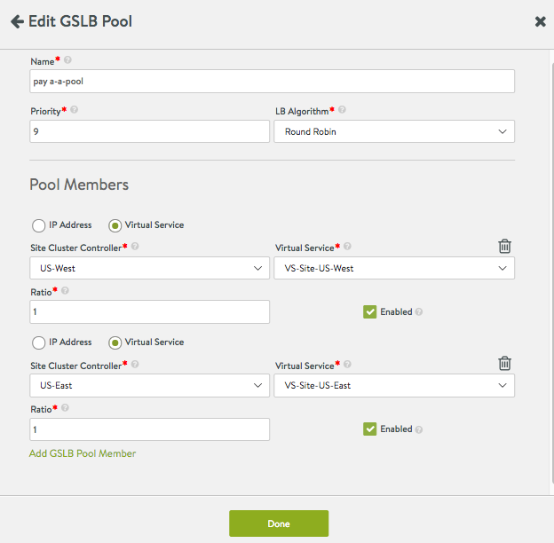  </a></li> 
 <li>Click <strong>Done</strong> above returns us to the GSLB service editor (as shown below). Clicking <strong>Save</strong> completes the process.<a href="img/Screen-Shot-2016-12-30-at-7.56.50-PM.png">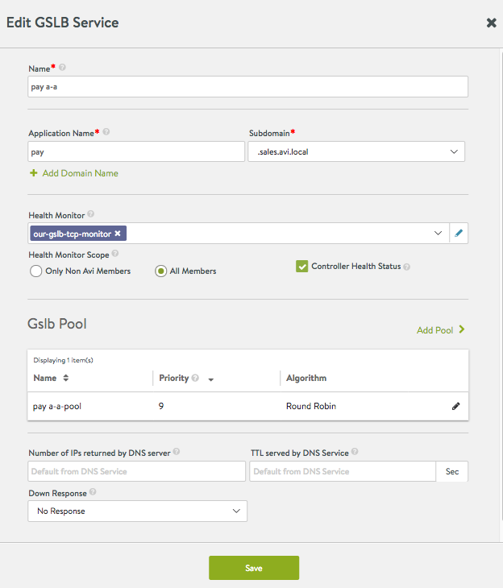  </a>Note that an "active/active" GSLB service nominally requires only one pool. A single-pool configuration will show a value in the <strong>Priority</strong> field, but it is inconsequential.  Virtual service selection within the single pool is instead a function of algorithm (round robin in this case), tempered by the ratios, if unequal.</li> 
</ol>  

### Adding a Standby Site to an Active/Active GSLB Service

Standby functionality can be added to the active/active "pay" application by adding a second pool with a *lower* priority. The below **Gslb Pools** section of the GSLB service editor shows a configuration that implements such an upgrade.

* The initial active pool = pay a-a-pool
* The added standby pool = pay a-a-pool-2 

As long as either VS-Site-US-West or VS-Site-US-East is up and not at maximum capacity, its higher priority steers all traffic toward "pay a-a-pool." Otherwise, Avi Vantage puts "pay a-a-pool-2" to work.

<a href="img/Screen-Shot-2016-12-30-at-8.12.19-PM.png">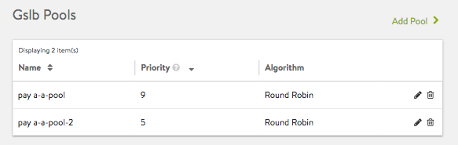</a>

## CLI Configuration

 

**1. Configure health monitor for GSLB services**

Only on the leader (10.10.25.10):

<pre><code class="language-lua">: &gt; configure gslbhealthmonitor global-http-hm
: gslbhealthmonitor&gt; type health_monitor_http
: gslbhealthmonitor&gt; monitor_port 80
: gslbhealthmonitor&gt; save</code></pre>  

 

**2. Configure routes to make sure that DNS Service has reachability to local virtual services**

The DNS Service Engine monitors the health of the GSLB service members. Add static routes (or default gateway) to make sure that the members are reachable. (See KB article for more details).

For example, on the leader:

<pre><code class="language-lua">: &gt; configure vrfcontext global
Updating an existing object. Currently, the object is:
+----------------+-------------------------------------------------+
| Field          | Value                                           |
+----------------+-------------------------------------------------+
| uuid           | vrfcontext-fde3b826-b19c-449c-8dec-ddeb119f2498 |
| name           | global                                          |
| system_default | True                                            |
| tenant_ref     | admin                                           |
| cloud_ref      | Default-Cloud                                   |
+----------------+-------------------------------------------------+
: vrfcontext&gt; static_routes

: vrfcontext:static_routes&gt; prefix 10.0.0.0/8 next_hop 10.90.12.1
: vrfcontext:static_routes&gt; save
: vrfcontext&gt; save

+------------------+-------------------------------------------------+
| Field            | Value                                           |
+------------------+-------------------------------------------------+
| uuid             | vrfcontext-fde3b826-b19c-449c-8dec-ddeb119f2498 |
| name             | global                                          |
| static_routes[1] |                                                 |
|   prefix         | 10.0.0.0/8                                      |
|   next_hop       | 10.90.12.1                                      |
|   route_id       | 1                                               |
| system_default   | True                                            |
| tenant_ref       | admin                                           |
| cloud_ref        | Default-Cloud                                   |
+------------------+-------------------------------------------------+
: &gt;</code></pre>  

 

On a follower (10.160.0.20):

 

**3. Configure GSLB Services**

<pre><code class="language-lua">: &gt; configure gslbservice view
: gslbservice&gt; domain_names view.avi.com
: gslbservice&gt; health_monitor_refs global-http-hm
: gslbservice&gt; num_dns_ip 1
: gslbservice&gt; groups
New object being created

: gslbservice:groups&gt; algorithm gslb_algorithm_round_robin
: gslbservice:groups&gt; name active-sc
: gslbservice:groups&gt; priority 10
: gslbservice:groups&gt; members
New object being created
: gslbservice:groups:members&gt; ip 10.90.12.100
: gslbservice:groups:members&gt; save
: gslbservice:groups&gt; save
: gslbservice&gt; groups

: gslbservice:groups:members&gt; ip 10.160.110.200
: gslbservice:groups:members&gt; save
: gslbservice:groups&gt; save
: gslbservice&gt; save

+----------------------------------+----------------------------------------------------+
| Field                            | Value                                              |
+----------------------------------+----------------------------------------------------+
| uuid                             | gslbservice-3f359566-f534-47d9-a735-10105fa53bfb |
| name                             | view                                               |
| domain_names[1]                  | view.avi.com                                       |
| groups[1]                        |                                                    |
|   name                           | active-sc                                          |
|   priority                       | 10                                                 |
|   algorithm                      | GSLB_ALGORITHM_ROUND_ROBIN                         |
|   members[1]                     |                                                    |
|     ip                           | 10.90.12.100                                       |
|     ratio                        | 1                                                  |
|     enabled                      | True                                               |
| groups[2]                        |                                                    |
|   name                           | standby-boston                                     |
|   priority                       | 7                                                  |
|   algorithm                      | GSLB_ALGORITHM_ROUND_ROBIN                         |
|   members[1]                     |                                                    |
|     ip                           | 10.160.110.200                                     |
|     ratio                        | 1                                                  |
|     enabled                      | True                                               |
| num_dns_ip                       | 1 count                                            |
| health_monitor_refs[1]           | global-http-hm                                     |
| site_persistence_type            | SITE_PERSISTENCE_NONE                              |
| site_persistence_profile_timeout | 5 mins                                             |
| tenant_ref                       | admin                                              |
+----------------------------------+----------------------------------------------------+</code></pre>  

 

**4. Configure pass-through server**

In case there’s an FQDN miss on a DNS virtual service, Avi can pass this request through (load-balancer) to one or more backup DNS servers. To enable this, configure a pool containing these servers, and attach this to the DNS virtual service.

If a domain filter is configured in the application filter of the VS, then the pass-through is performed only for FQDNs that fall within this subdomain. All other queries are dropped.

Unsupported queries are also forwarded to the pass-through server.

**5. Configure corporate/external DNS server to delegate sub-domain to the Avi DNS Service.**

Delegate avi.com to the Avi GSLB

To try this out in the lab, dnsmasq was installed on the clients, and the following entries added:

On client 1:

server=/avi.com/10.10.25.10

server=/avi.com/10.160.110.100

dig pay.avi.com ..

On client 2:

server=/avi.com/10.160.110.100

server=/avi.com/10.10.25.10

 

**6. Troubleshooting**

<pre><code class="language-lua">: &gt; show virtualservice colo-dns dnstable
Sub Domains Serviced:
avi.com
+----------------+-----+---------+-------------------------------------------------------------+---------+--------+
| FQDN           | TTL | Num-IPS | IP Addresses                                                | Service | Tenant |
+----------------+-----+---------+-------------------------------------------------------------+---------+--------+
| cloud7.avi.com | 60  | 1       | de:10.40.10.10, de:10.40.10.1, be:10.40.10.3, uk:10.40.10.2 | gs-4    | admin  |
| cloud8.avi.com | 60  | 1       | de:10.40.10.10, de:10.40.10.1, be:10.40.10.3, uk:10.40.10.2 | gs-4    | admin  |
...

: &gt; show virtualservice colo-dns gslbserviceruntime filter gs_uuid gslbservice-c3a4785b-a722-476b-906a-6869ed7e2cae

: &gt; show virtualservice colo-dns gslbserviceinternal filter gs_uuid gslbservice-c3a4785b-a722-476b-906a-6869ed7e2cae

: &gt; show virtualservice colo-dns gslbservicehmonstat filter gs_uuid gslbservice-c3a4785b-a722-476b-906a-6869ed7e2cae</code></pre>  

Connection logs provide information about the FQDN and the response IP addresses provided in the DNS query response.

