## Avi GSLB Sites

As mentioned in <a href="/docs/16.3/avi-gslb-architecture/">Avi GSLB Architecture</a>, GSLB sites fall into two broad categories — **Avi sites** and **external sites** (e.g., running third-party ADCs from vendors such as F5, Citrix, etc.). This article focuses on Avi sites.

Each Avi site is characterized as either **active** or a **passive**. Active sites synchronize the GSLB site configuration among themselves. They also query passive sites to obtain information about the health of those sites. Passive sites host local virtual services, but do not host any GSLB service configuration. Neither do passive sites monitor the health of other sites.

Active sites are further classified into two types — **GSLB leader **and **f****ollowers**. Exactly one of the active sites — the one from which the initial GSLB site configuration is performed, is statically designated as the GSLB leader. GSLB site configuration changes are permitted only on the leader. The only way to switch the leader would be through an override configuration of the leader from a follower site. This override can be invoked in the case of site failures/maintenance.

Centralized analytics are available from the GSLB leader site. Localized metrics and logs are available for the DNS services hosting the GSLB records.

In the above example, Santa Clara, Chicago, Austin and NY are active sites while Boston is a passive site. Among the active sites, Santa Clara performs the function of GSLB leader, redirecting DNS queries to the appropriate followers (Chicago, Austin and NY).

## Site Failure Handling

Two failure cases need to be considered:

* GSLB leader site fails
* A follower site fails 

<a href="img/site-failure-handling.png">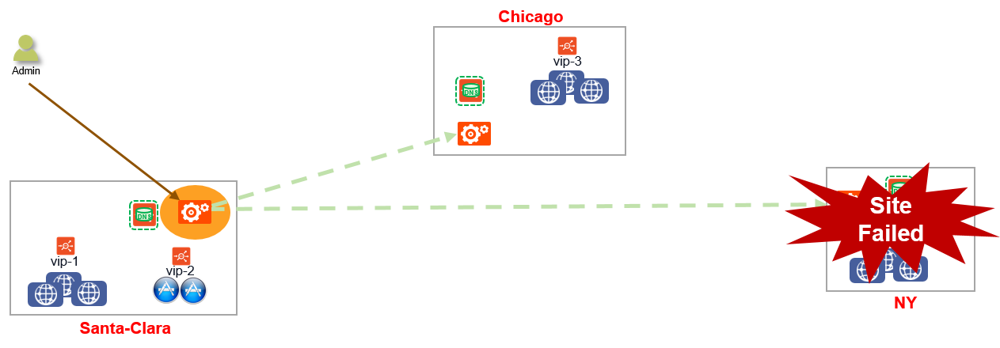</a>

 

In both cases, DNS services marks all GS members of the failed site as DOWN. In the above example, NY site has crashed while Santa Clara (GSLB Leader) and Chicago sites are still functioning.

If only the Avi Controller fails, the GS members are tagged depending upon the GS Health Monitors:

<table class="table table-hover table table-bordered table-hover">  
<tbody>    
<tr>   
<td><b>GS Member Status</b></td>
<td><b>GS Health Monitors</b></td>
</tr>
<tr>   
<td>DOWN</td>
<td>Control Plane HM</td>
</tr>
<tr>   
<td>UP</td>
<td>Data Plane HM or Control Plane HM or both</td>
</tr>
</tbody>
</table> 

In case of GSLB follower site failure, the GSLB configuration is synchronized with currently UP site. In case only the follower Controller fails, then the site’s DNS server will not receive GSLB configuration updates.

In case of GSLB leader site failure, no modification can be made to the GSLB configuration.

### Site Failure recovery

All active sites detect successful connection to a follower through control-plane healthmonitor updates. In case of contol plane healthmonitors, active sites query all the other sites to fetch health and load information of all virtual services which are behind GSLB services.

DNS services then updates the GS member status of the recovered sites as UP or DOWN based on the GS health monitors.

* Follower Site Recovery 

GSLB leader detects successful connectivity to follower and updates it with the updated GSLB configuration

* Leader Site Recovery 

Only an admin can resume updates to the GSLB configuration.

### Change the GSLB Leader

The GSLB leader may needed to change due to various reasons such as failure of the current leader or scheduled maintenance. However, there is no reelection process involved in selecting the new GSLB leader. That is, any follower site can take over as the new leader. To become the leader, the follower site must first log in into the leader-designate Controller and take over as leader. Then a “take-over” message is broadcast to all GSLB members. Now, configuration can successfully be done from the new leader. Even if the previous leader comes back, the “take-over”message forces the site to participate as a follower.

<a href="img/change-gslb-leader.png">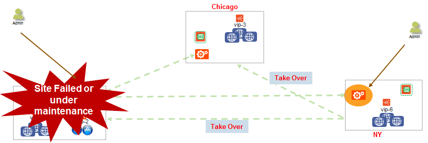</a>

### Network Partitioning

Network partitioning (aka the split brain scenario) occurs due to network failure which may be caused by failures or outages in the Internet or VPN infrastructure across the sites. In case of network failure, each site updates the GS member state based on control-plane and data-plane health monitors. Both parts of the network act as independent and exclusive subnetworks.

<a href="img/network-partitioning.png">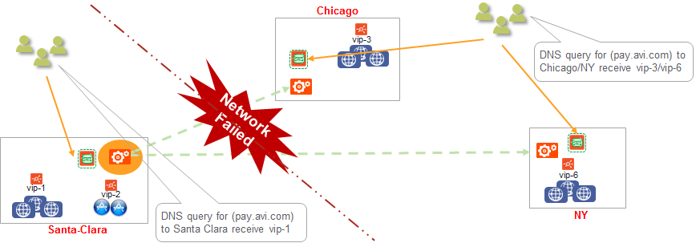</a>

Hence, each site responds to DNS queries with only members to which that site has connectivity. In the above example, DNS queries to Santa Clara receive vip-1, while DNS queries to Chicago or NY receive vip-3/vip-6.

Assuming a network-wide partition, clients from the West get the same response as clients from the East.

## Configuration of GSLB Sites

****1. Set up the individual Controller clusters****

Create two or more Controller clusters (two in this example), and run through the initial system configuration steps. In the example, the two Controllers are Santa Clara (10.10.25.10) and Boston (10.160.0.20). Each of the Controller clusters could be a 1-node or a 3-node cluster. For this beta, please restrict to two GSLB sites.

[The recommended practice is to set up an admin user account for GSLB configuration, for better audit trails. Create a user ‘gslb’ with admin roles in all the Controller clusters.]

****2. Configure local DNS virtual service on all active sites that host DNS.****

Configure a DNS virtual service on all the clusters where the DNS service needs to be hosted, bound to the g-dns se-group.

In 16.3, the DNS virtual services need to be exclusively allocated their own Service Engine group.

Configure a new Service Engine group to host the DNS virtual service (referred to as g-dns se-group), on **both **Controller clusters. This configuration is done from Infrastructure -> Cloud -> Service Engine Group<a href="img/configure-local-DNS-5.png">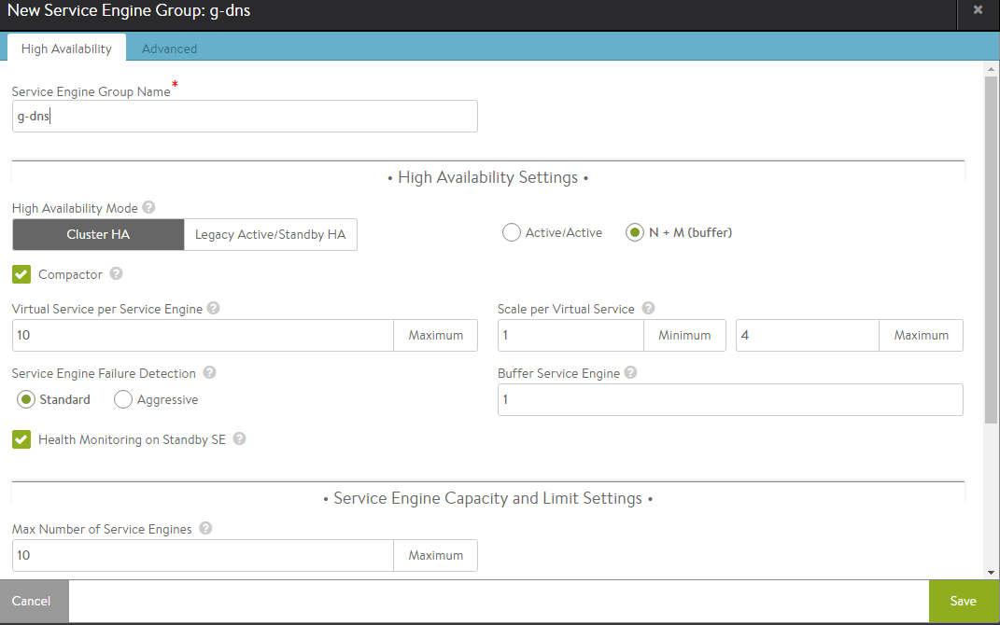</a>

In SantaClara (10.10.25.10):

Configure a DNS virtual service on all the clusters where the DNS service needs to be hosted, bound to the g-dns se-group:

Use Advanced setup:

<a href="img/advanced-configurations.png">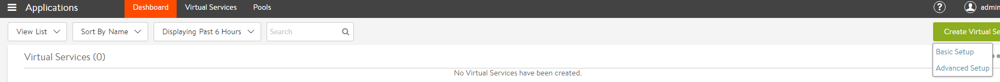</a>

 

Configure a DNS virtual-service.

<a href="img/advance-setup-steptwo.png">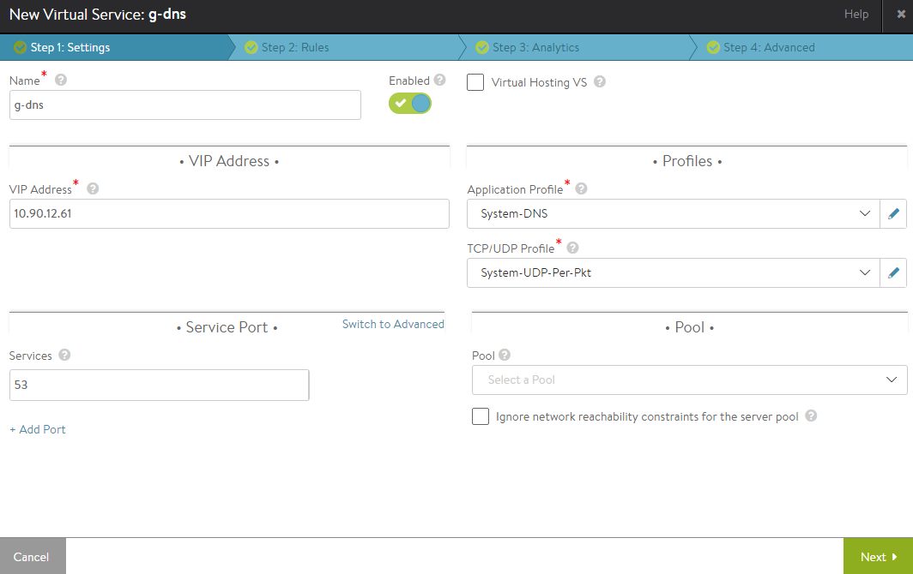</a>

 

<a href="img/configure-local-DNS_stepTwo.png">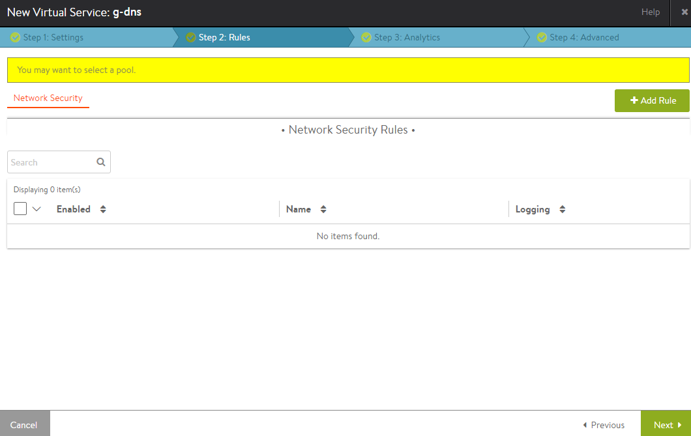</a>

 

<a href="img/configure-local-DNS_stepThree.png">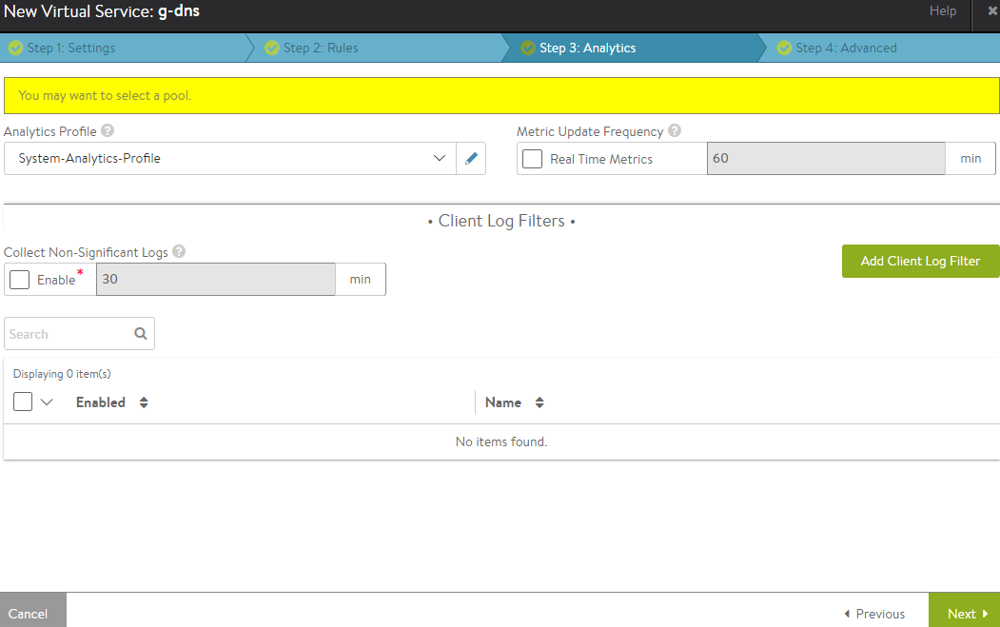</a>

 

<a href="img/configure-local-DNS_stepFour.png">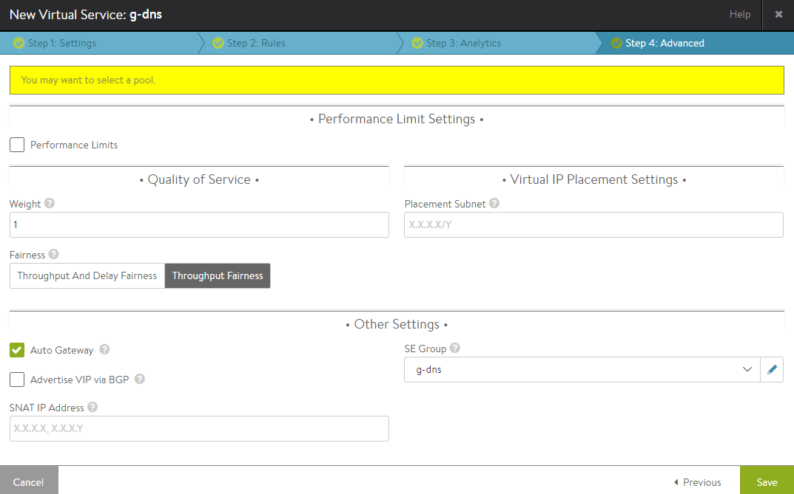</a>

 

On 10.160.0.20 (Boston):

Use Advanced setup:

Configure a DNS virtual-service.

<a href="img/configure-local-DNS_Boston.png">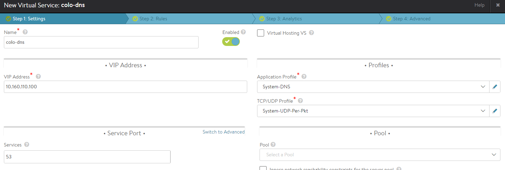</a>

 

Go through the next 3 tabs, and save the virtual service.

****3. Configure local application virtual services****

Create application virtual services normally. For example, create an HTTP virtual service vs-1 in Controller cluster 1, and virtual-service vs-2 in Controller cluster 2.

See <a href="/docs/16.3/docs/architectural-overview/applications/virtual-services/">Configuring Virtual Services</a> for more details: 

On 10.10.25.10 (Santa Clara):

<a href="img/localApplicationVS-1.png">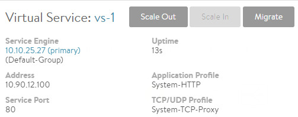</a>

On 10.160.0.20 (Boston):

<a href="img/localApplicationVS-2.png">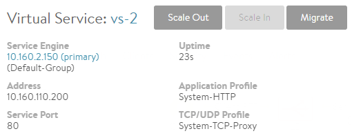</a>

 

****4. Designate GSLB leader Controller, and add site configuration****

Choose one of the Controller clusters as the leader, and perform GSLB configuration on this Controller. In the sample topology, the Santa Clara site (10.10.25.10) is chosen as the GSLB leader.
<ol> 
 <li>Go to Infrastructure -&gt; GSLB <a href="img/GSLB_one.png">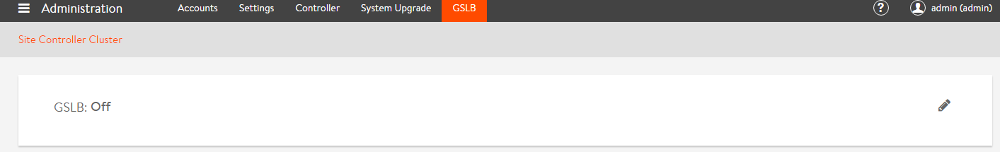</a></li> 
 <li>Edit and create the GSLB leader site<a href="img/GSLB_two.png">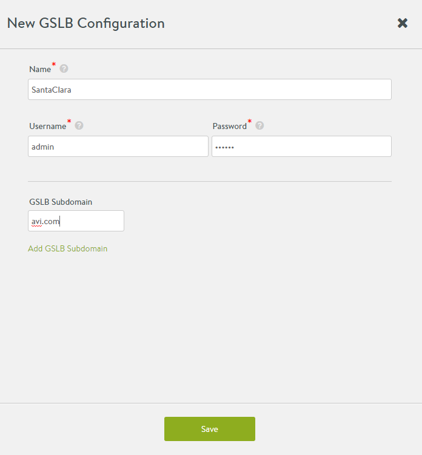</a>After successful configuration, the following screen appears:<a href="img/GSLB_three.png">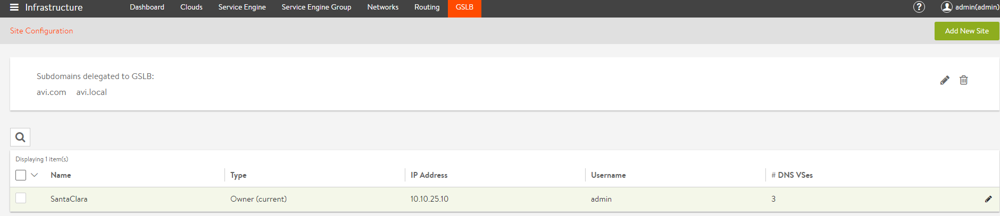</a></li> 
 <li>Add second site, by clicking on ‘Add New’</li> 
</ol> 

<a href="img/GSLB_four.png">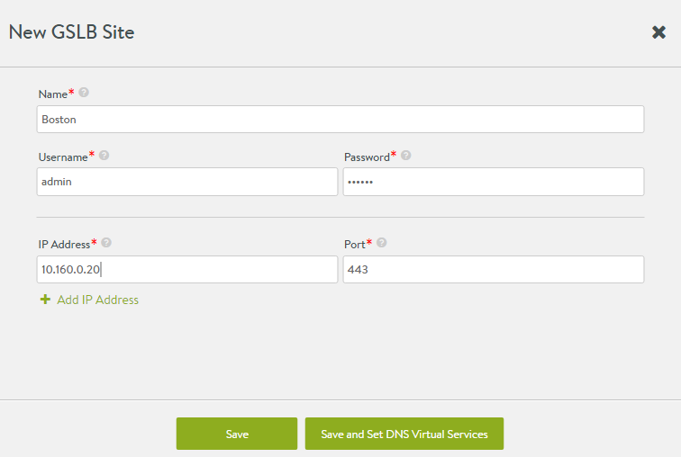</a>

 

Use the checkbox to indicate if the site is an active or a passive site.

For sites that do not have a DNS virtual service, press ‘Save’ to save the site configuration.

For sites that have a DNS virtual service, press ‘Save and Set DNS Virtual Services’:

 

<a href="img/Save-and-Set-DNS-Virtual-Services.png">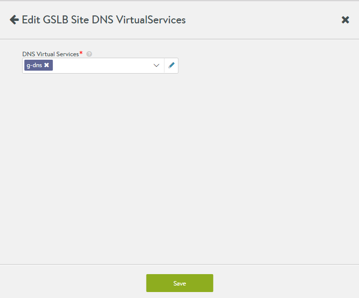</a>

 

<a href="img/Save-and-Set-DNS-Virtual-Services2.png">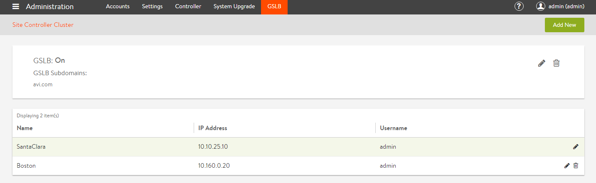</a>

 

At this point, the two sites are talking to each other, and configuration synchronization is enabled.

**Errors**

Errors in site configuration — ip-address, credentials, etc. show up when the site information is saved. 

Sample error screens:

Authentication failure

<a href="img/Authentication-failed.png">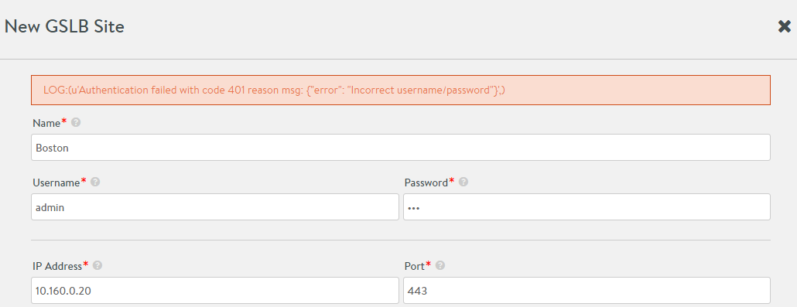</a>

 

Max Retry login failure:

<a href="img/MaxRetryError.png">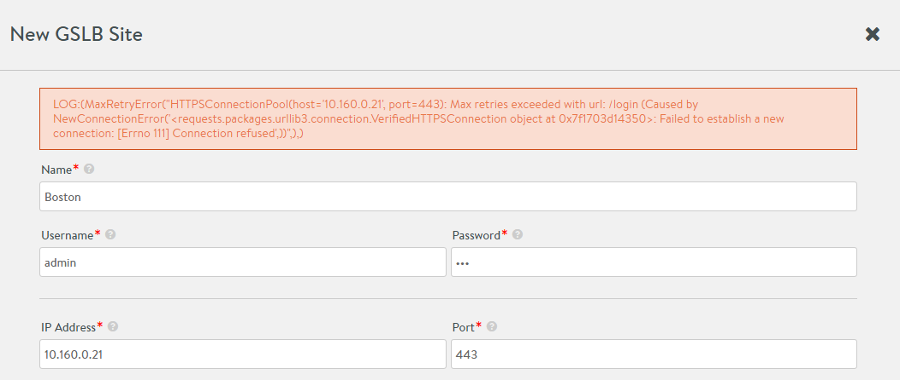</a>

 

HTTP 400 error:

<a href="img/http-error.png">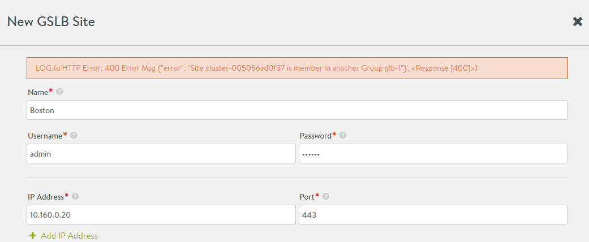</a>

 

**Validation**

In the secondary site (Boston), check the GSLB page, and make sure that the site configuration shows up.

<a href="https://10.160.0.20/#/authenticated/administration/gslb">https://10.160.0.20/#/authenticated/administration/gslb</a>

<a href="img/GSLB-validation.png">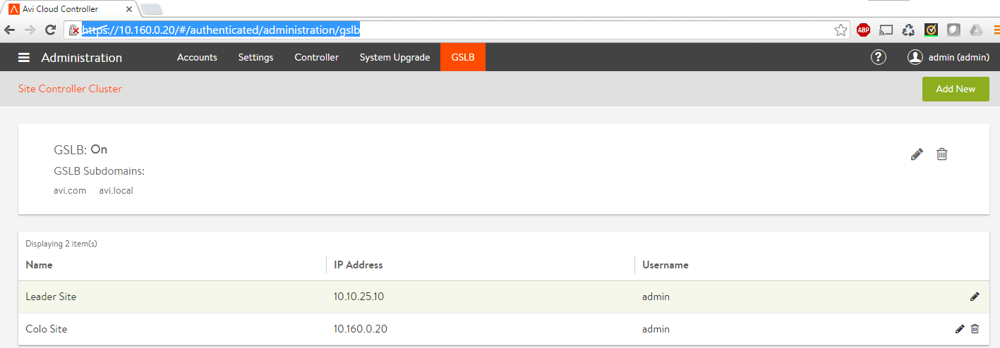</a>
<ol start="5"> 
 <li><b> Configure routes to make sure that the DNS virtual service has accessibility to local virtual services</b></li> 
</ol> 

The DNS Service Engine monitors the health of the GSLB service members. Add static routes (or default gateway) to make sure that the members are reachable.(See KB article for more details).

<a href="img/local-vs.png">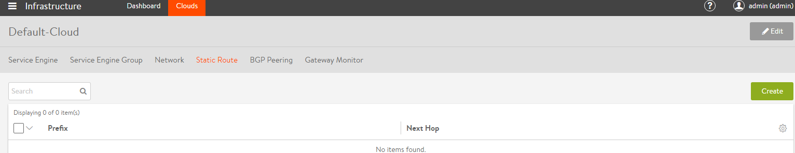</a>

For example, on 10.10.25.10 (Santa Clara):

<a href="img/Santa-Clara-static-route.png">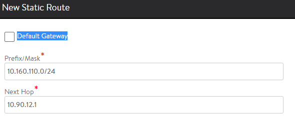</a>

On 10.160.0.20 (Boston):

<a href="img/Boston-settings.png">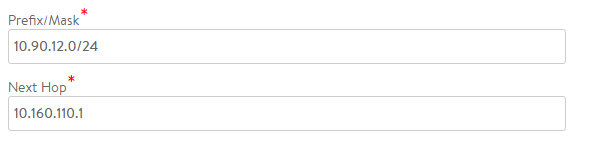</a>

 

# CLI-Based Configuration

 

****1. Set up the Controller clusters****

 

**Current limitations:**

- All member Controller clusters have to be set up completely, before starting any GSLB configuration. If GSLB configuration is made, and a new Controller is added, configuration is not [yet] synced to the new Controller.

****2. Designate GSLB leader Controller, and create global configuration****

 

Create GSLB global configuration:

Example: two Controller clusters (10.10.25.10 and 10.160.0.25)

10.10.25.10 is the designated GSLB Leader. So, create the configuration in the GSLB leader.

Find the cluster-ids of both Controller clusters.

On 10.10.25.10:

<pre><code class="language-lua">: &gt; show cluster

+---------------+----------------------------------------------+
| Field         | Value                                        |
+---------------+----------------------------------------------+
| uuid          | cluster-42301dd3-0529-ada4-ec02-69a2c593df6d |
: &gt; configure gslb glb
: gslb&gt; dns_configs
New object being created

: gslb:dns_configs&gt; domain_name avi.com
: gslb:dns_configs&gt;
: gslb&gt; site_controller_clusters
New object being created

: gslb:site_controller_clusters&gt; ip_addresses 10.10.25.10
: gslb:site_controller_clusters&gt; cluster_uuid cluster-42301dd3-0529-ada4-ec02-69a2c593df6d
: gslb:site_controller_clusters&gt; username admin
: gslb:site_controller_clusters&gt; password admin
: gslb:site_controller_clusters&gt; name SantaClara
: gslb:site_controller_cluster&gt; save
: gslb&gt; site_controller_clusters
New object being created

: gslb:site_controller_clusters&gt; ip_addresses 10.160.0.20
: gslb:site_controller_clusters&gt; cluster_uuid cluster-42215c91-6280-6016-31f6-7416a1f4c4ad
: gslb:site_controller_clusters&gt; username admin
: gslb:site_controller_clusters&gt; password admin
: gslb:site_controller_clusters&gt; name Boston
: gslb:site_controller_clusters&gt; save
: gslb&gt; save
+------------------------------+-----------------------------------------------+
| Field                        | Value                                         |
+------------------------------+-----------------------------------------------+
| uuid                         | gslb-cafe8f98-c411-47cd-96d2-1a6d4e3bad74 |
| name                         | glb                                           |
| dns_configs[1]               |                                               |
|   domain_name                | avi.com                                       |
| site_controller_clusters[1]  |                                               |
|   cluster_ref                | cluster-42301dd3-0529-ada4-ec02-69a2c593df6d  |
|   name                       | SantaClara                                    |
|   ip_addresses[1]            | 10.10.25.10                                   |
|   port                       | 443                                           |
|   username                   | admin                                         |
| site_controller_clusters[2]  |                                               |
|   cluster_ref                | cluster-42215c91-6280-6016-31f6-7416a1f4c4ad  |
|   name                       | Boston                                        |
|   ip_addresses[1]            | 10.160.0.20                                   |
|   port                       | 443                                           |
|   username                   | admin                                         |
| owner_controller_cluster_ref | cluster-42301dd3-0529-ada4-ec02-69a2c593df6d  |
| tenant_ref                   | admin                                         |
+------------------------------+-----------------------------------------------+
: &gt;</code></pre>  

Now, the synchronization is set up. 

**Validation**

Go to the secondary site, and try the show command. The UUIDs will match across GSLB leader and follower.

<pre><code class="language-lua">: &gt; show gslb
+------+-----------------------------------------------+
| Name | UUID                                          |
+------+-----------------------------------------------+
| glb  | gslb-cafe8f98-c411-47cd-96d2-1a6d4e3bad74 |
+------+-----------------------------------------------+</code></pre>    

****3. Configure local DNS virtual service****

 

Configure a new SE group to host the DNS virtual service (referred to as g-dns se-group), on both Controller clusters.

Configure a DNS virtual service on all the clusters where the DNS service is hosted, bound to the g-dns SE group:

* ****Configure domain names hosted by the DNS virtual service (optional)**** 

From the CLI, create an application profile that selects the domain names hosted by this virtual service (on all Controller clusters).

<pre><code class="language-lua">: &gt; configure applicationprofile dns
: applicationprofile&gt; type application_profile_type_dns
: applicationprofile&gt; dns_service_profile
: applicationprofile:dns_service_profile&gt; domain_names avi.com
: applicationprofile:dns_service_profile&gt; save
: applicationprofile&gt; save</code></pre>  

From the UI or CLI, create an application profile that selects the domain names hosted by this virtual service.

**4. Configure local application virtual services**

Create application virtual services normally. For example, create an HTTP virtual service vs-1 in Controller cluster 1, and virtual-service vs-2 in Controller cluster 2.

See <a href="/docs/16.3/configuration-guide/applications/virtual-services/">Configuring Virtual Services</a> for more details.

**5. Configure health monitor for GSLB Services**

Only on the GSLB leader (Santa Clara / 10.10.25.10):

<pre><code class="language-lua">: &gt; configure globalhealthmonitor global-http-hm
: globalhealthmonitor&gt; type health_monitor_http
: globalhealthmonitor&gt; monitor_port 80
: globalhealthmonitor&gt; save</code></pre>  **6. Configure routes to make sure that DNS virtual service has access to local virtual services** 

The DNS Service Engine monitors the health of the GSLB service members. Add static routes (or default gateway) to make sure that the members are reachable.

For example, on 10.10.25.10 (Santa Clara):

<pre><code class="language-lua">: &gt; configure vrfcontext global
Updating an existing object. Currently, the object is:

+----------------+-------------------------------------------------+
| Field          | Value                                           |
+----------------+-------------------------------------------------+
| uuid           | vrfcontext-fde3b826-b19c-449c-8dec-ddeb119f2498 |
| name           | global                                          |
| system_default | True                                            |
| tenant_ref     | admin                                           |
| cloud_ref      | Default-Cloud                                   |
+----------------+-------------------------------------------------+
: vrfcontext&gt; static_routes
: vrfcontext:static_routes&gt; prefix 10.0.0.0/8 next_hop 10.90.12.1
: vrfcontext:static_routes&gt; save
: vrfcontext&gt; save

+------------------+-------------------------------------------------+
| Field            | Value                                           |
+------------------+-------------------------------------------------+
| uuid             | vrfcontext-fde3b826-b19c-449c-8dec-ddeb119f2498 |
| name             | global                                          |
| static_routes[1] |                                                 |
|   prefix         | 10.0.0.0/8                                      |
|   next_hop       | 10.90.12.1                                      |
|   route_id       | 1                                               |
| system_default   | True                                            |
| tenant_ref       | admin                                           |
| cloud_ref        | Default-Cloud                                   |
+------------------+-------------------------------------------------+
: &gt;</code></pre>  On 10.160.0.20 (Boston): 

**7. Configure GSLB services**

<pre><code class="language-lua">: &gt; configure globalservice view
: globalservice&gt; domain_names view.avi.com
: globalservice&gt; health_monitor_refs global-http-hm
: globalservice&gt; num_dns_ip 1
: globalservice&gt; groups
New object being created

: globalservice:groups&gt; algorithm gslb_algorithm_round_robin
: globalservice:groups&gt; name active-sc
: globalservice:groups&gt; priority 10
: globalservice:groups&gt; members
New object being created

: globalservice:groups:members&gt; ip 10.90.12.100
: globalservice:groups:members&gt; save
: globalservice:groups&gt; save
: globalservice&gt; groups
: globalservice:groups:members&gt; ip 10.160.110.200
: globalservice:groups:members&gt; save
: globalservice:groups&gt; save
: globalservice&gt; save
+----------------------------------+----------------------------------------------------+
| Field                            | Value                                              |
+----------------------------------+----------------------------------------------------+
| uuid                             | globalservice-3f359566-f534-47d9-a735-10105fa53bfb |
| name                             | view                                               |
| domain_names[1]                  | view.avi.com                                       |
| groups[1]                        |                                                    |
|   name                           | active-sc                                          |
|   priority                       | 10                                                 |
|   algorithm                      | GSLB_ALGORITHM_ROUND_ROBIN                         |
|   members[1]                     |                                                    |
|     ip                           | 10.90.12.100                                       |
|     ratio                        | 1                                                  |
|     enabled                      | True                                               |
| groups[2]                        |                                                    |
|   name                           | standby-boston                                     |
|   priority                       | 7                                                  |
|   algorithm                      | GSLB_ALGORITHM_ROUND_ROBIN                         |
|   members[1]                     |                                                    |
|     ip                           | 10.160.110.200                                     |
|     ratio                        | 1                                                  |
|     enabled                      | True                                               |
| num_dns_ip                       | 1 count                                            |
| health_monitor_refs[1]           | global-http-hm                                     |
| site_persistence_type            | SITE_PERSISTENCE_NONE                              |
| site_persistence_profile_timeout | 5 mins                                             |
| tenant_ref                       | admin                                              |
+----------------------------------+----------------------------------------------------+</code></pre>  

**8. Configure pass-through server**

In case there’s an FQDN miss on a DNS virtual service, Avi can pass this request through (load-balance) to one or more backup DNS servers. To enable this, configure a pool containing these servers, and attach this to the DNS virtual service.

If a domain filter is configured in the application filter of the VS, then the pass-through is performed only for FSDNs that fall within this subdomain. All other queries are dropped.

Unsupported queries are also forwarded to the pass-through server.

* ****Configure Domain Names hosted by the DNS virtual service (optional)**** 

From the CLI, create an application profile that selects the domain names hosted by this virtual service (on all Controller clusters).

<pre><code class="language-lua">: &gt; configure applicationprofile dns
: applicationprofile&gt; type application_profile_type_dns
: applicationprofile&gt; dns_service_profile
: applicationprofile:dns_service_profile&gt; domain_names avi.com
: applicationprofile:dns_service_profile&gt; save
: applicationprofile&gt; save</code></pre>  

From the UI or CLI, create an application profile that selects the domain names hosted by this virtual service.

**9. Configure corporate/external DNS server to delegate subdomain to the Avi DNS service.**

Delegate avi.com to the Avi GSLB

To try this out in the lab, dnsmasq was installed on the clients, and the following entries added:

On client 1:

server=/avi.com/10.10.25.10

server=/avi.com/10.160.110.100

dig pay.avi.com ..

On client 2:

server=/avi.com/10.160.110.100

server=/avi.com/10.10.25.10

**10. Troubleshooting**

<pre><code class="language-lua">: &gt; show virtualservice colo-dns dnstable
Sub Domains Serviced:
avi.com
+----------------+-----+---------+-------------------------------------------------------------+---------+--------+
| FQDN           | TTL | Num-IPS | IP Addresses                                                | Service | Tenant |
+----------------+-----+---------+-------------------------------------------------------------+---------+--------+
| cloud7.avi.com | 60  | 1       | de:10.40.10.10, de:10.40.10.1, be:10.40.10.3, uk:10.40.10.2 | gs-4    | admin  |
| cloud8.avi.com | 60  | 1       | de:10.40.10.10, de:10.40.10.1, be:10.40.10.3, uk:10.40.10.2 | gs-4    | admin  |
...

: &gt; show virtualservice colo-dns globalserviceruntime filter gs_uuid globalservice-c3a4785b-a722-476b-906a-6869ed7e2cae
: &gt; show virtualservice colo-dns globalserviceinternal filter gs_uuid globalservice-c3a4785b-a722-476b-906a-6869ed7e2cae
: &gt; show virtualservice colo-dns globalservicehmonstat filter gs_uuid globalservice-c3a4785b-a722-476b-906a-6869ed7e2cae</code></pre>  

Connection logs provide information about the FQDN and the response IP addresses provided in the DNS query response.

 

 
