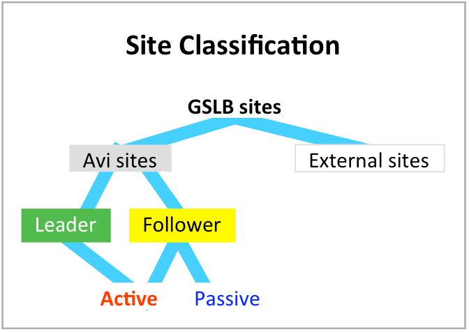
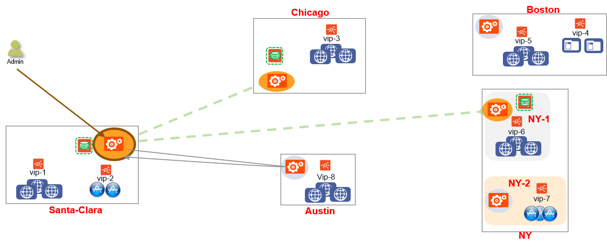

This article describes Avi GSLB GUI- and CLI-based configuration, as well as its ability to cope with various failure modes.

### Prerequisite Reading

* <a href="/avi-gslb-overview/">Avi GSLB Overview</a>
* <a href="/docs/16.4/gslb-architecture-and-object-model/">Avi GSLB Architecture and Object Model</a>

### Avi GSLB Sites

Let's begin by reviewing some some of the content <a href="/gslb-architecture-and-object-model/">Avi GSLB Architecture</a>.

GSLB sites fall into two broad categories — **Avi sites** and **external sites** (external sites run third-party ADCs from vendors such as F5 and Citrix or ADC-less sites hosting a solitary server). This article focuses on Avi sites.

Each Avi site is characterized as either **active** or a **passive**. Active sites synchronize the GSLB site configuration among themselves. They also query all sites to ascertain the health of those sites. Passive sites host local virtual services, but do not host any GSLB service configuration. Neither do passive sites monitor the health of other sites.

Active sites are further classified into two types — **GSLB leader **and **f****ollowers**. Exactly one of the active sites — the one from which the initial GSLB site configuration is performed, is the designated GSLB leader. GSLB site configuration changes are permitted only on the leader. The only way to switch the leadership role to a follower is by overriding the configuration of the leader from a follower site. This override can be invoked in the case of site failures or for maintenance.

Centralized analytics are only available from the GSLB leader site. Localized metrics and logs are available for the DNS services hosting the GSLB records.

In the above example, Santa Clara, Chicago, and NY-1 are active sites, as indicated by the orange oval around the Controller icons. Boston, Austin, and NY-2 are passive sites, as the grey ovals depict. Santa Clara is the GSLB leader; all others are followers.

### Failure Scenarios

Avi Vantage's behavior after a failure in a GSLB deployment will vary depending on whether the failure is 
<ol> 
 <li>At a leader site or one of the followers, and</li> 
 <li>Of the entire site or just the Avi Controller.</li> 
</ol> 

### Follower Site Failures

### Full-Site Failure

A full-site failure occurs at the NY follower site, as depicted below.

 
<ol> 
 <li>The leader (in Santa Clara) and Chicago Controllers are active sites, and therefore detect the failure.</li>
 <li>Administrative changes to the GSLB configuration continue to be possible on the leader, but they will not make it to the NY site. Central analytics continue to be accessible, albeit without any contribution from NY.</li> 
 <li>Both control-plane and data-plane health monitors will mark NY's GS members DOWN. [Read more about control- and data-plane health in <a href="/avi-gslb-service-and-health-monitors/">Avi GSLB Service and Health Monitors</a>.)</li>
 <li>DNS service for the GSLB configuration remains operational at the two surviving sites.</li>
 <li>Global application service will continue on the two surviving sites.</li> 
</ol> 

### Partial-site Failure

If only the Avi Controller at the NY site fails, Avi Vantage's SEs continue to serve applications in "headless" mode.
<ol>
 <li>The leader and Chicago Controllers detect the failure via their control-plane monitors. Central analytics continue to be accessible, albeit without any contribution from NY.</li> 
 <li>Any administrative changes made on the leader will not make it to the NY site.</li> 
 <li>Data-plane health monitors running in Santa Clara and Chicago will continue to perceive NY's members as UP.</li> 
 <li>DNS service for the GSLB configuration remains operational at all three sites.</li>
 <li>Global application service will continue on all three sites.</li>
</ol> 

### Follower Site Recovery

<ol> 
 <li>The leader Controller detects connectivity to the follower Controller at NY. The latest configuration will be pushed to it.</li> 
 <li>Other active sites will likewise detect successful connectivity to the NY follower Controller as a result of their control-plane health monitors.</li> 
 <li>If the data-plane never went down, no more need be done.</li> 
 <li>If data-plane monitors for NY's GS members had been configured and previously marked NY's GS members as DOWN, NY's members will be marked UP and traffic to them will resume only after those data-plane monitors once again perceive good health.</li> 
</ol> 

### Leader Site Failures

### Full-Site Failure

A full-site failure occurs at the Santa Clara leader site, as depicted below .

<ol> 
 <li>As they are active sites, both Chicago and NY detect the failure.</li> 
 <li>No administrative changes to the GSLB configuration can be made. There is no access to central analytics.</li> 
 <li>Both control-plane and data-plane health monitors will mark Santa Clara's GS members DOWN.</li> 
 <li>DNS service for the GSLB configuration remains operational at the two surviving sites.</li>
 <li>Global application service will continue on the two surviving sites.</li>
</ol> 

### Partial-Site Failure

If only the Avi Controller at the Santa Clara site fails, Avi Vantage's SEs continue to serve applications in "headless" mode.
<ol>
 <li>As they are active sites, both Chicago and NY detect the Controller failure via their control-plane health monitors.</li> 
 <li>No administrative changes to the GSLB configuration can be made. There is no access to central analytics.</li> 
 <li>Data-plane health monitors running in Chicago and NY will continue to perceive Santa Clara's members as UP.</li> 
 <li>DNS service for the GSLB configuration remains operational at all three sites.</li>
 <li>Global application service will continue on all three sites.</li>
</ol> 

### Leader Site Change

In neither of the above leader-site failure scenarios is a new leader designated; there is no automatic re-election process involved. Instead, an optional and manual operation can be performed at any active follower site, either to restore the ability to lead, or for the sake of site maintenance. Both Chicago and NY qualify as potential leaders. From either the steps would be:
<ol> 
 <li>A GSLB administrator logs into the follower Controller and commands it to become the new leader. Until it becomes the leader it is the so-called "leader-designate."</li>
 <li>A take-over message is propagated to all other Avi sites, apprising them of the change in command.</li> 
 <li>Should the prior leader (Santa Clara) come back up, it assumes the role of a follower as a result of the take-over message that was queued for transmission during its downtime.</li>
</ol> 

 

### Network Partitioning

Network partitioning (a kind of "split brain") occurs due to failures or outages in the Internet or VPN infrastructure between the sites. In case of network failure, each site updates the GS member state based on control-plane and data-plane health monitors. Both parts of the network act as independent and exclusive subnetworks.

Hence, each site responds to DNS queries using only the members to which it has connectivity. In the above example, DNS queries to Santa Clara would be resolved to steer clients to vip-1, while DNS queries to Chicago or NY would steer clients to either vip-3 or vip-6.

Santa Clara remains the leader during the network outage, notwithstanding its inaccessibility to access the other two Avi sites. No new leader is automatically elected on the other network partition.

### Configuration of GSLB Sites

A given Avi Controller participates in GSLB deployment or not. If not, the first time it is approached to turn on GSLB, it assumes a leadership role for GSLB functionality. Multiple GSLB configurations on a given Controller cluster is not supported.

****1. Set up the individual Avi Controller clusters****

Create two or more Controller clusters (two in this example), and run through the initial system configuration steps. In the below scenario, the two Controllers will be Santa Clara (10.10.25.10) and Boston (10.160.0.20). Each of the Controller clusters could be a 1-node (test & development) or a 3-node (production) cluster. 

Note: For better audit trails, the recommended practice is to set up an admin user account for GSLB configuration. Create a user named ‘gslb’ and assign it admin roles in all the Controller clusters.

****2. Configure a local DNS virtual service on all active sites that host DNS****

Configure a local DNS virtual service on all the clusters where the DNS service needs to be hosted, bound to the the local g-dns SE group.

As a best practice, a DNS for GSLB should exclusively allocated its own Service Engine group. That is, place no other virtual services (DNS or other application types) on it.

For each Controller cluster, configure a Service Engine group to host the DNS virtual service (named g-dns in this example). This configuration is done from Infrastructure -> Cloud -> Service Engine Group.

Notes:

* The virtual service and SE group names need not be identical across all GSLB sites. That said, you may find it helpful to embrace a naming convention that is descriptive of the relationship these entities have with each other. 
* There is no attribute associated with a DNS virtual service object to define it as a "GSLB" DNS. Therefore, if you wish to readily distinguish such a DNS from one that is not part of any GSLB service definition, consider a naming convention that suggests your intention. In the below screenshot, the "g" in "g-dns" suggest GSLB is the intended purpose of the entity.Note: In the below screenshot, the default of 10 virtual services per SE has been left intact. Setting it to 1 would serve to enforce the best practice mentioned above.<a href="img/configure-local-DNS-5.png">  </a>

In Santa Clara (10.10.25.10):

Configure a DNS virtual service on all the clusters where the DNS service needs to be hosted, bound to the g-dns se-group:

Use Advanced setup:

Configure a DNS virtual service. Be sure to select an application profile of System-DNS. Accept the default for the TCP/UDP Profile field (System-UDP-Per-Pkt). No pool is required; the DNS service will run within the SE's virtual machine.

Network security rules may be established for this DNS VS, but not required.

Click Next to proceed to Step 3.

Accept the defaults for Analytics or change them in the below-depicted Step 3 of the wizard.

 

Click Next to proceed to Step 4.

Be sure to identify the SE group you've created to host this DNS virtual service.

 

Click Save to complete the process of defining the DNS virtual service for the Santa Clara site.

On 10.160.0.20 (Boston):

Use Advanced setup:

Configure a DNS virtual service.

 

Go through the next 3 tabs (Rules, Analytics, Advanced), and save the DNS virtual service for Boston.

****3. Configure local application virtual services****

Create application virtual services normally. For example, create an HTTP virtual service vs-1 in Controller cluster 1, and virtual-service vs-2 in Controller cluster 2.

See <a href="/architectural-overview/applications/virtual-services/">Configuring Virtual Services</a> for more details: 

On 10.10.25.10 (Santa Clara):

On 10.160.0.20 (Boston):

 

****4. Designate the GSLB leader Controller, and add site configuration****

Choose one of the Controller clusters as the leader, and perform the GSLB configuration on it. In the sample topology, the Santa Clara site (10.10.25.10) is chosen as the GSLB leader.
<ol> 
 <li>Go to Infrastructure -&gt; GSLB  </li>
 <li>Edit and create the GSLB leader site. Note how Avi Vantage correctly assumes that when GSLB is first enabled, the Controller will become an active member. In particular, the <em>leader</em> member.    <a href="img/GSLB_two.png">  </a>After successful configuration, the following screen appears. In the Type column, "Owner" should be interpreted as "Leader."</li>
 <li>Add the second site by clicking ‘Add New’</li> 
</ol> 

 

Use the checkbox to indicate if the site is an active or a passive site.

For sites that do not have a DNS virtual service, press ‘Save’ to save the site configuration.

For sites that have a DNS virtual service, press ‘Save and Set DNS Virtual Services’:

 

 

At this point, the two sites are talking to each other, and configuration synchronization is enabled.

### Site Configuration Errors

Errors in site configuration — having to do with IP address, credentials, and the like — show up when the site information is saved. Some sample error screens follow.

### Authentication Failure

Remember, the username and password for the admin of Boston may be unique to that site, or the same credentials used at all Avi GSLB sites — it's up to the user.

 

### Max Retry Login Failure

Appropriately authenticated individuals log into a leader to perform GSLB-related functions, such as to read a GSLB configuration or to make changes to it. In addition, behind the scenes, a leader GSLB site will robotically log into a follower GSLB site to pass on configuration changes that can only be initiated from the leader. In both cases, a login attempt "lockout" rule may be in force, whereby a certain number of failures results in locking out the administrative account for some specified number of minutes (default = 30 minutes).

 

### HTTP 400 Error

There are several contexts in which a "400" error may occur in the GSLB context. This particular example illustrates an understandable restriction: An Avi site can participate exactly in one GSLB configuration. Invitations to join a second are rejected.

 

### Validating the GSLB Configuration

In the secondary site (Boston), check the GSLB page, and make sure that the site configuration shows up.

<a href="https://10.160.0.20/#/authenticated/administration/gslb">https://10.160.0.20/#/authenticated/administration/gslb  </a>

### Enable DNS SE Network Access to All Virtual Services Being Health-Checked

The DNS Service Engine monitors the health of the GSLB service members (application virtual services). Add static routes (or default gateway) to ensure the members are reachable.

For example, on 10.10.25.10 (Santa Clara):

On 10.160.0.20 (Boston):

### CLI-Based Configuration

****1. Set up the Controller clusters****

**Current limitations:**

All member Controller clusters have to be set up completely, before starting any GSLB configuration. If GSLB configuration is made, and a new Controller is added, the configuration is not [yet] synced to the new Controller.

****2. Designate GSLB leader Controller, and create global configuration****

Create GSLB global configuration:

Example: two Controller clusters (10.10.25.10 and 10.160.0.25)

10.10.25.10 is the designated GSLB leader. So, create the configuration in the GSLB leader.

Find the cluster UUIDs of both Controller clusters.

On 10.10.25.10:

<pre><code class="language-lua">: &gt; show cluster

+---------------+----------------------------------------------+
| Field         | Value                                        |
+---------------+----------------------------------------------+
| uuid          | cluster-42301dd3-0529-ada4-ec02-69a2c593df6d |
: &gt; configure gslb glb
: gslb&gt; dns_configs
New object being created

: gslb:dns_configs&gt; domain_name avi.com
: gslb:dns_configs&gt;
: gslb&gt; site_controller_clusters
New object being created

: gslb:site_controller_clusters&gt; ip_addresses 10.10.25.10
: gslb:site_controller_clusters&gt; cluster_uuid cluster-42301dd3-0529-ada4-ec02-69a2c593df6d
: gslb:site_controller_clusters&gt; username admin
: gslb:site_controller_clusters&gt; password admin
: gslb:site_controller_clusters&gt; name SantaClara
: gslb:site_controller_cluster&gt; save
: gslb&gt; site_controller_clusters
New object being created

: gslb:site_controller_clusters&gt; ip_addresses 10.160.0.20
: gslb:site_controller_clusters&gt; cluster_uuid cluster-42215c91-6280-6016-31f6-7416a1f4c4ad
: gslb:site_controller_clusters&gt; username admin
: gslb:site_controller_clusters&gt; password admin
: gslb:site_controller_clusters&gt; name Boston
: gslb:site_controller_clusters&gt; save
: gslb&gt; save
+------------------------------+-----------------------------------------------+
| Field                        | Value                                         |
+------------------------------+-----------------------------------------------+
| uuid                         | gslb-cafe8f98-c411-47cd-96d2-1a6d4e3bad74 |
| name                         | glb                                           |
| dns_configs[1]               |                                               |
|   domain_name                | avi.com                                       |
| site_controller_clusters[1]  |                                               |
|   cluster_ref                | cluster-42301dd3-0529-ada4-ec02-69a2c593df6d  |
|   name                       | SantaClara                                    |
|   ip_addresses[1]            | 10.10.25.10                                   |
|   port                       | 443                                           |
|   username                   | admin                                         |
| site_controller_clusters[2]  |                                               |
|   cluster_ref                | cluster-42215c91-6280-6016-31f6-7416a1f4c4ad  |
|   name                       | Boston                                        |
|   ip_addresses[1]            | 10.160.0.20                                   |
|   port                       | 443                                           |
|   username                   | admin                                         |
| owner_controller_cluster_ref | cluster-42301dd3-0529-ada4-ec02-69a2c593df6d  |
| tenant_ref                   | admin                                         |
+------------------------------+-----------------------------------------------+
: &gt;</code></pre>  

Now, the synchronization is set up. 

**Validation**

Go to the secondary site, and try the show command. The UUIDs will match across GSLB leader and follower.

<pre><code class="language-lua">: &gt; show gslb
+------+-----------------------------------------------+
| Name | UUID                                          |
+------+-----------------------------------------------+
| glb  | gslb-cafe8f98-c411-47cd-96d2-1a6d4e3bad74 |
+------+-----------------------------------------------+</code></pre>    

****3. Configure local DNS virtual service****

 

Configure a new SE group to host the DNS virtual service (referred to as g-dns se-group), on both Controller clusters.

Configure a DNS virtual service on all the clusters where the DNS service is hosted, bound to the g-dns SE group:

* ****Configure domain names hosted by the DNS virtual service (optional)**** 

From the CLI, create an application profile that selects the domain names hosted by this virtual service (on all Controller clusters).

<pre><code class="language-lua">: &gt; configure applicationprofile dns
: applicationprofile&gt; type application_profile_type_dns
: applicationprofile&gt; dns_service_profile
: applicationprofile:dns_service_profile&gt; domain_names avi.com
: applicationprofile:dns_service_profile&gt; save
: applicationprofile&gt; save</code></pre>  

From the UI or CLI, create an application profile that selects the domain names hosted by this virtual service.

**4. Configure local application virtual services**

Create application virtual services normally. For example, create an HTTP virtual service vs-1 in Controller cluster 1, and virtual-service vs-2 in Controller cluster 2.

See <a href="/docs/configuration-guide/applications/virtual-services/">Configuring Virtual Services</a> for more details.

**5. Configure health monitor for GSLB Services**

Only on the GSLB leader (Santa Clara / 10.10.25.10):

<pre><code class="language-lua">: &gt; configure globalhealthmonitor global-http-hm
: globalhealthmonitor&gt; type health_monitor_http
: globalhealthmonitor&gt; monitor_port 80
: globalhealthmonitor&gt; save</code></pre>  **6. Configure routes to ensure that DNS virtual service has access to local virtual services**

The DNS Service Engine monitors the health of the GSLB service members. Add static routes (or default gateway) to make sure that the members are reachable.

For example, on 10.10.25.10 (Santa Clara):

<pre><code class="language-lua">: &gt; configure vrfcontext global
Updating an existing object. Currently, the object is:

+----------------+-------------------------------------------------+
| Field          | Value                                           |
+----------------+-------------------------------------------------+
| uuid           | vrfcontext-fde3b826-b19c-449c-8dec-ddeb119f2498 |
| name           | global                                          |
| system_default | True                                            |
| tenant_ref     | admin                                           |
| cloud_ref      | Default-Cloud                                   |
+----------------+-------------------------------------------------+
: vrfcontext&gt; static_routes
: vrfcontext:static_routes&gt; prefix 10.0.0.0/8 next_hop 10.90.12.1
: vrfcontext:static_routes&gt; save
: vrfcontext&gt; save

+------------------+-------------------------------------------------+
| Field            | Value                                           |
+------------------+-------------------------------------------------+
| uuid             | vrfcontext-fde3b826-b19c-449c-8dec-ddeb119f2498 |
| name             | global                                          |
| static_routes[1] |                                                 |
|   prefix         | 10.0.0.0/8                                      |
|   next_hop       | 10.90.12.1                                      |
|   route_id       | 1                                               |
| system_default   | True                                            |
| tenant_ref       | admin                                           |
| cloud_ref        | Default-Cloud                                   |
+------------------+-------------------------------------------------+
: &gt;</code></pre>  On 10.160.0.20 (Boston): 

**7. Configure GSLB services**

<pre><code class="language-lua">: &gt; configure globalservice view
: globalservice&gt; domain_names view.avi.com
: globalservice&gt; health_monitor_refs global-http-hm
: globalservice&gt; num_dns_ip 1
: globalservice&gt; groups
New object being created

: globalservice:groups&gt; algorithm gslb_algorithm_round_robin
: globalservice:groups&gt; name active-sc
: globalservice:groups&gt; priority 10
: globalservice:groups&gt; members
New object being created

: globalservice:groups:members&gt; ip 10.90.12.100
: globalservice:groups:members&gt; save
: globalservice:groups&gt; save
: globalservice&gt; groups
: globalservice:groups:members&gt; ip 10.160.110.200
: globalservice:groups:members&gt; save
: globalservice:groups&gt; save
: globalservice&gt; save
+----------------------------------+----------------------------------------------------+
| Field                            | Value                                              |
+----------------------------------+----------------------------------------------------+
| uuid                             | globalservice-3f359566-f534-47d9-a735-10105fa53bfb |
| name                             | view                                               |
| domain_names[1]                  | view.avi.com                                       |
| groups[1]                        |                                                    |
|   name                           | active-sc                                          |
|   priority                       | 10                                                 |
|   algorithm                      | GSLB_ALGORITHM_ROUND_ROBIN                         |
|   members[1]                     |                                                    |
|     ip                           | 10.90.12.100                                       |
|     ratio                        | 1                                                  |
|     enabled                      | True                                               |
| groups[2]                        |                                                    |
|   name                           | standby-boston                                     |
|   priority                       | 7                                                  |
|   algorithm                      | GSLB_ALGORITHM_ROUND_ROBIN                         |
|   members[1]                     |                                                    |
|     ip                           | 10.160.110.200                                     |
|     ratio                        | 1                                                  |
|     enabled                      | True                                               |
| num_dns_ip                       | 1 count                                            |
| health_monitor_refs[1]           | global-http-hm                                     |
| site_persistence_type            | SITE_PERSISTENCE_NONE                              |
| site_persistence_profile_timeout | 5 mins                                             |
| tenant_ref                       | admin                                              |
+----------------------------------+----------------------------------------------------+</code></pre>  

**8. Configure pass-through server**

In case there’s an FQDN miss on a DNS virtual service, Avi can pass this request through (load-balance) to one or more backup DNS servers. To enable this, configure a pool containing these servers, and attach this to the DNS virtual service.

If a domain filter is configured in the application filter of the VS, then the pass-through is performed only for FQDNs that fall within this subdomain. All other queries are dropped.

Unsupported queries are also forwarded to the pass-through server.

* ****Configure Domain Names hosted by the DNS virtual service (optional)**** 

From the CLI, create an application profile that selects the domain names hosted by this virtual service (on all Controller clusters).

<pre><code class="language-lua">: &gt; configure applicationprofile dns
: applicationprofile&gt; type application_profile_type_dns
: applicationprofile&gt; dns_service_profile
: applicationprofile:dns_service_profile&gt; domain_names avi.com
: applicationprofile:dns_service_profile&gt; save
: applicationprofile&gt; save</code></pre>  

From the UI or CLI, create an application profile that selects the domain names hosted by this virtual service.

**9. Configure corporate/external DNS server to delegate subdomain to the Avi DNS service.**

Delegate avi.com to the Avi GSLB

To try this out in the lab, <code>dnsmasq</code> was installed on the clients, and the following entries added:

On client 1:

server=/avi.com/10.10.25.10

server=/avi.com/10.160.110.100

dig pay.avi.com ..

On client 2:

server=/avi.com/10.160.110.100

server=/avi.com/10.10.25.10

<code></code>
**10. Troubleshooting**

<pre><code class="language-lua">: &gt; show virtualservice colo-dns dnstable
Sub Domains Serviced:
avi.com
+----------------+-----+---------+-------------------------------------------------------------+---------+--------+
| FQDN           | TTL | Num-IPS | IP Addresses                                                | Service | Tenant |
+----------------+-----+---------+-------------------------------------------------------------+---------+--------+
| cloud7.avi.com | 60  | 1       | de:10.40.10.10, de:10.40.10.1, be:10.40.10.3, uk:10.40.10.2 | gs-4    | admin  |
| cloud8.avi.com | 60  | 1       | de:10.40.10.10, de:10.40.10.1, be:10.40.10.3, uk:10.40.10.2 | gs-4    | admin  |
...

: &gt; show virtualservice colo-dns globalserviceruntime filter gs_uuid globalservice-c3a4785b-a722-476b-906a-6869ed7e2cae
: &gt; show virtualservice colo-dns globalserviceinternal filter gs_uuid globalservice-c3a4785b-a722-476b-906a-6869ed7e2cae
: &gt; show virtualservice colo-dns globalservicehmonstat filter gs_uuid globalservice-c3a4785b-a722-476b-906a-6869ed7e2cae</code></pre>  

Connection logs provide information about the FQDN and the response IP addresses provided in the DNS query response.

### Recommended Reading

* <a href="/avi-gslb-service-and-health-monitors/">Avi GSLB Service and Health Monitoring</a>
* <a href="/avi-dns-architecture/">Avi DNS Architecture and Features</a>