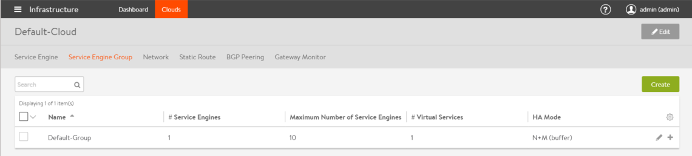
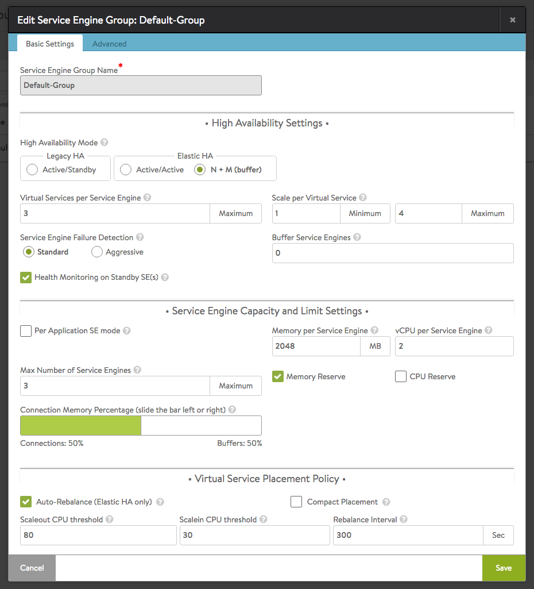
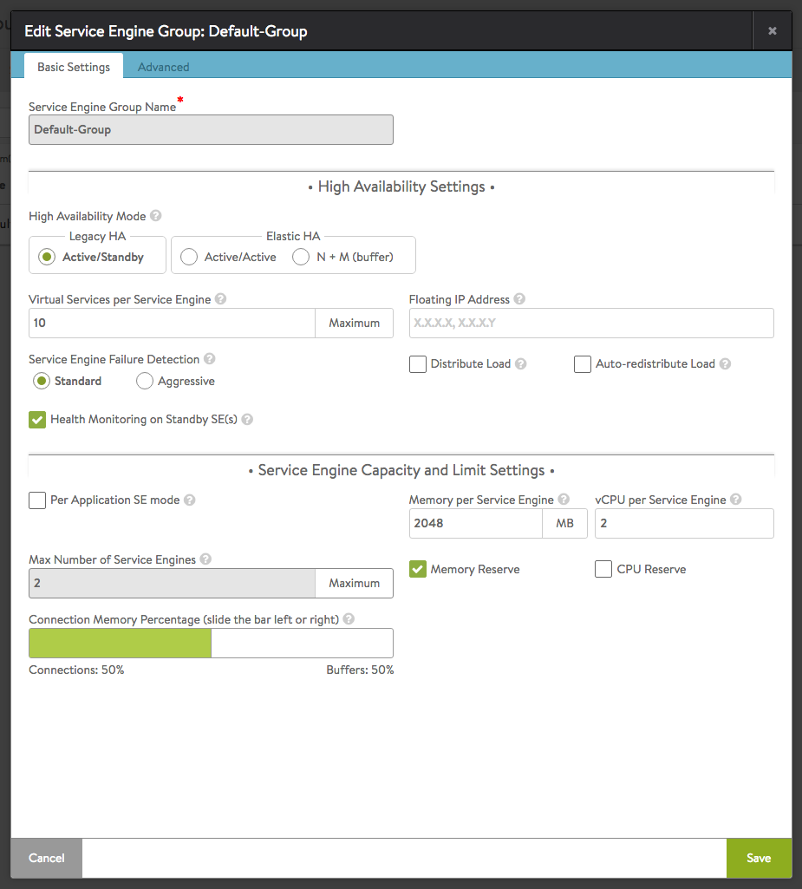
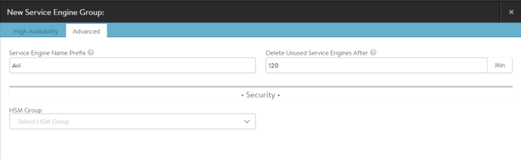

An Avi Service Engine (SE) group is a collection of one or more SEs that may share properties, such as network access and failover. An SE cannot scale out across or fail over to an SE which is in a different SE group, even if both SEs share the same physical host or network properties. Different applications can thus receive guaranteed data plane isolation when deployed on different SE groups.

Virtual services created in a new Vantage deployment will be assigned to the Default-Group SE group. To deploy virtual services to a different SE group:
<ol> 
 <li>Create a new SE group.</li> 
 <li>Move or create the new virtual service in the new group using the Advanced tab of the Edit Virtual Service page.</li> 
</ol> 

When creating a new SE group in write access mode, no new SEs will be created until a virtual service is deployed to the SE group. In read access mode or no access mode deployments, the new SEs must be manually created. They will attempt to connect back to the Controller after they have booted up, at which point they will be added to the Default SE group. SEs in read access mode and no access mode deployments can be migrated to a new SE group, provided all virtual services deployed on the SE are disabled.

SEs in write access mode deployments cannot be migrated to new SE groups. Instead, the old SE is deleted and a new SE is created. This process is automatic if the virtual services are migrated.

## Service Engine Groups Page

The Service Engine Groups page lists the configured SE groups.

The table on this page contains the following information for each SE group:

* **Name:** Lists the name of each SE group.
* **/# Service Engines:** Shows the number of SEs assigned to the SE group. Clicking the row on the table will show an expanded view with the names of SEs.
* **Maximum Number of Service Engines:** Maximum number of SEs the group can contain.
* **/# Virtual Services:** Shows the number of virtual services assigned to the SE group. Clicking the row on the table will show an expanded view with the names of virtual services.
* **HA Mode:** High availability mode configured for the group. &gt; Note: Clicking on the row of an SE will expand the row to show the names of SEs and virtual services configured.
 

**Note:** Only unused SE groups may deleted. If the SE group is in use by a virtual service, a popup will warn that dependent virtual services must first be deleted or migrated to other SE groups via the Virtual Service &gt; Edit &gt; Advanced properties tab. A tenant must always have a minimum of one configured SE group. The default SE group may be modified, but not deleted.

## Create a Service Engine Group

To create or edit an SE group:
<ol> 
 <li>Select Infrastructure &gt; Clouds and click on the cloud name (for example, Default-Cloud).</li> 
 <li>Select Service Engine Group to open the Service Engine Groups page, which lists the SE groups currently configured in Vantage.</li> 
 <li>Click New Service Engine Group or click on an SE group name in the table.</li> 
</ol> 

The create and edit popups for SE groups have identical properties. This popup includes the following tabs:

* High Availability
* Advanced 

### High Availability Settings for SE Group

The High Availability tab contains the HA option settings for the SE group.

The HA options for Avi SEs are described below. See the following for more information and deployment examples:

* <a href="/docs/16.3/elastic-ha-for-avi-service-engines/">Elastic HA</a>
* <a href="/docs/16.3/legacy-ha-for-avi-service-engines/">Legacy HA</a> 

### Elastic HA Options

* **High Availability Mode:**  
    * Elastic HA Active/Active
    * Elastic HA N + M
* **Compact Placement:** When enabled, new virtual services are placed on existing SEs with other virtual services. Disabling this option places each new virtual service in its own SE until the maximum number of SEs for the SE group is reached. At that point, a new virtual service will be placed on the SE with the least number of virtual services. When this option set, Vantage will attempt to conservatively create new SEs.
* **Virtual Services per Service Engine:** Controls the maximum number of virtual services that may be deployed on a single SE. Another SE must be created or used if this maximum is reached. If Vantage reaches the maximum number of SEs, then no more virtual services can be deployed within the SE group.
* **Scale per Virtual Service - Minimum:** The virtual service may be scaled across multiple SEs, which both increases potential capacity and ensures recovery from any failure while minimizing impact. Setting the minimum above 1 ensures that every virtual service starts out scaled across multiple SEs regardless of capacity requirements.
* **Scale per Virtual Service - Maximum:** Sets the maximum number of SEs across which a virtual service may be scaled.
* **Service Engine Failure Detection:** Sets the maximum amount of time a primary SE can remain silent before the SE is declared dead by the Avi Controller.    
    * **Standard:** Primary SE can remain silent (stop sending heartbeats) for a maximum of 9 seconds before being declared dead.
    * **Aggressive: **Primary SE can remain silent (stop sending heartbeats) for a maximum of 1.5 seconds before being declared dead.
    * **Buffer Service Engines:** This option sets the value of M for elastic HA N+M mode. Compact placement should be left in its default state for N+M, which is OFF. Vantage will maintain spare capacity in the SE group to be used to replace any failed SE.
    * **Health Monitoring on Standby SE:** Enables the standby SE in a legacy HA configuration to send health checks to back-end servers.

### Legacy HA Options

* **High Availability Mode:**  
    * Legacy Active/Standby HA
* **Virtual Service per Service Engine:** Same as elastic HA. (See above.)
* **Floating IP Address: **Optionally, a floating IP address can be assigned to an SE group configured for legacy HA. It is applicable when the SE interfaces are not in the same subnet as the VIP or source NAT (SNAT) IP addresses that will use the SE group.
* **Distribute Load:** By default, Vantage concentrates all virtual services on one of the two SEs in a legacy HA group. Select the distribute load option to manually make virtual services you identify active on each SE in the pair. Any given VS active on one SE is made to stand by on the other. When an failure occurs, the affected virtual services immediately transition to the other SE. Note: Selection of this option causes a second Floating IP Address field to appear.
* **Auto-distribute Load**: By default, virtual services that have failed over to the surviving SE will *not* be migrated back to the SE that replaces the failed one. Rather, load will remain concentrated on the failover SE. Turn the Auto-redistribute Load option ON to make fail-back automatic.
* **Health Monitoring on Standby SE:** Enables health monitoring of back-end servers by the standby SE in a legacy HA (active/standby) configuration. This option applies only to SE groups configured for legacy HA. The option is not applicable to elastic HA. 

### Service Engine Capacity and Limit Settings

* **Max Number of Service Engines:** Defines the maximum number of SEs that may be created within the SE group. This number, combined with the virtual services per SE setting, dictates the maximum number of virtual services that can be created within an SE group. If this limit is reached, it is possible new virtual services may not be able to be deployed and will show a gray, undeployed status. This setting can be useful for limiting Vantage from consuming too many virtual machines.
* **Per Application:** Limits per-SE placement of virtual services to a maximum of 2 virtual services per SE.Note: This option affects how vCPUS are counted for <a href="/docs/16.3/terms-of-avi-vantage-license">licensing</a> purposes.
* **Connection Memory Percentage:** Adjusts the relative allocation of memory resources for connections versus buffer space. 

### Virtual Service Placement Policy

This section of the SE editor appears only when one of the elastic HA modes is chosen.

* **Auto-Rebalance:** If this option is selected, virtual services will be automatically migrated when the load on the group’s SEs falls below a stipulated minimum threshold or goes above a maximum threshold. A rebalancing interval may be chosen with a resolution of one second. Otherwise, an alert is generated instead of automatically performing migrations. This option is relevant only to the two elastic HA modes.
* **Compact Placement: **When enabled, new virtual services are placed on existing SEs with other virtual services. Disabling this option places each new virtual service in its own SE until the maximum number of SEs for the SE group is reached. At this point, a new virtual service will be placed on the SE with the lowest number of virtual services. When this option set, Vantage will attempt to conservatively create new SEs. 

 

## Advanced Settings for SE Group

The Advanced tab in the Edit Service Engine Group popup allows configuration of optional functionality for SE groups. This tab appears only when Avi Vantage is deployed in write access mode deployments.

Note: This tab appears only when Vantage is deployed in write access mode.

* **Service Engine Name Prefix:** Enter the prefix to use when naming the SEs within the SE group. This name will be seen both within Vantage, and as the name of the virtual machine within the virtualization orchestrator.
* **Delete Unused Service Engines After:** Enter the number of minutes to wait before the Controller deletes an unused SE. Traffic patterns can change quickly, and a virtual service may therefore need to scale across additional SEs with little notice. Setting this field to a high value ensures that Vantage keeps unused SEs around in case of a sudden spike in traffic. A shorter value means the Controller may need to recreate a new SE to handle a burst of traffic, which may take a couple of minutes. This option is only applicable in write access mode 

### Security

This section of the Advanced tab has the following option:

* **HSM Group:** Applies a template of hardware security module (HSM) settings to the SE group. For more information about HSM support:  
    * <a href="/docs/16.3/thales-nshield-integration-2">Thales nShield Integration</a>
    * <a href="/docs/16.3/avi-vantage-integration-with-safenet-network-hsm/">Avi Vantage Integration with SafeNet Network HSM</a> 